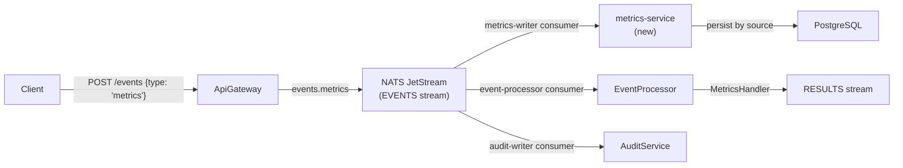

# Add metrics event type and metrics-service

## Architecture

The new metrics flow slots into the existing event-driven architecture:




Events with `type: "metrics"` flow through the normal `EVENTS` stream. A new dedicated NATS consumer (`metrics-writer`) delivers them to the `metrics-service`, which inspects `payload.source` to categorize and persist metrics into a `metrics` table in PostgreSQL.

## 1. Shared package (`packages/shared`)

`**[packages/shared/src/constants.ts](packages/shared/src/constants.ts)**` -- Add:

```typescript
export const METRICS_CONSUMER_NAME = 'metrics-writer';
```

`**[packages/shared/src/interfaces.ts](packages/shared/src/interfaces.ts)**` -- Add a typed metrics payload interface:

```typescript
export interface MetricsPayload {
  source: string;
  name: string;
  value: number;
  tags?: Record<string, string>;
  timestamp?: number;
}
```

`**[packages/shared/src/index.ts](packages/shared/src/index.ts)**` -- Re-export the new constant and interface.

## 2. New `metrics-service` (modeled on audit-service)

Create `services/metrics-service/` with the same structure as audit-service:

```
services/metrics-service/
├── Dockerfile
├── package.json
├── tsconfig.json
└── src/
    ├── main.ts
    ├── app.module.ts
    ├── providers/
    │   ├── nats.provider.ts      # EVENTS stream, metrics-writer consumer, filter: events.metrics
    │   └── postgres.provider.ts  # Same pattern as audit-service
    └── modules/
        ├── metrics/
        │   ├── metrics.module.ts
        │   ├── metrics.service.ts    # NATS consumer + Postgres persistence
        │   └── metrics.controller.ts # Query API: GET /metrics, GET /metrics/:id
        └── health/
            ├── health.module.ts
            └── health.controller.ts
```

Key design decisions:

- **NATS consumer**: `metrics-writer` on `EVENTS` stream with `filter_subject: "events.metrics"` (only receives metrics events, unlike audit-writer which gets all events)
- **PostgreSQL table**: `metrics` with columns `id`, `source`, `name`, `value`, `tags` (JSONB), `metadata` (JSONB), `created_at`. Indexed on `source` and `(source, created_at DESC)` for efficient queries by source.
- **Idempotent writes**: `ON CONFLICT (id) DO NOTHING` (same pattern as audit-service)
- **Source-based routing**: `payload.source` stored as a first-class indexed column, enabling fast lookups per source

### Database schema

```sql
CREATE TABLE IF NOT EXISTS metrics (
  id          TEXT        PRIMARY KEY,
  source      TEXT        NOT NULL,
  name        TEXT        NOT NULL,
  value       DOUBLE PRECISION NOT NULL DEFAULT 0,
  tags        JSONB       NOT NULL DEFAULT '{}',
  metadata    JSONB       NOT NULL DEFAULT '{}',
  created_at  TIMESTAMPTZ NOT NULL DEFAULT NOW()
);
CREATE INDEX IF NOT EXISTS idx_metrics_source ON metrics (source);
CREATE INDEX IF NOT EXISTS idx_metrics_name ON metrics (name);
CREATE INDEX IF NOT EXISTS idx_metrics_source_created ON metrics (source, created_at DESC);
CREATE INDEX IF NOT EXISTS idx_metrics_created_at ON metrics (created_at DESC);
```

### Query API

- `GET /metrics?source=X&name=Y&from=T1&to=T2&limit=N&offset=M` -- query metrics filtered by source, name, and time range
- `GET /metrics/:id` -- get a single metric by ID

## 3. Event-processor handler

`**[services/event-processor/src/handlers/](services/event-processor/src/handlers/)**` -- Add `metrics.handler.ts`:

```typescript
@Injectable()
@EventType('metrics')
export class MetricsHandler implements EventHandler {
  readonly eventType = 'metrics';
  async handle(_eventId: string, _payload: unknown): Promise<EventResult> {
    return { processed: true };
  }
}
```

Register it in `[services/event-processor/src/modules/processor/processor.module.ts](services/event-processor/src/modules/processor/processor.module.ts)` and export from `[services/event-processor/src/handlers/index.ts](services/event-processor/src/handlers/index.ts)`.

## 4. Infrastructure and deployment

`**[knative/services/metrics-service.yaml](knative/services/metrics-service.yaml)**` -- New Knative Service definition (same pattern as audit-service: NATS + Postgres env vars, min-scale 1, max-scale 5, target concurrency 50).

`**[knative/services/kustomization.yaml](knative/services/kustomization.yaml)**` -- Add `metrics-service.yaml` to resources.

`**[infrastructure/base/postgres/configmap.yaml](infrastructure/base/postgres/configmap.yaml)**` -- Add `metrics` table creation to `init.sql`.

`**[bootstrap.sh](bootstrap.sh)**` -- Add `metrics-service` to the `build_images` loop.