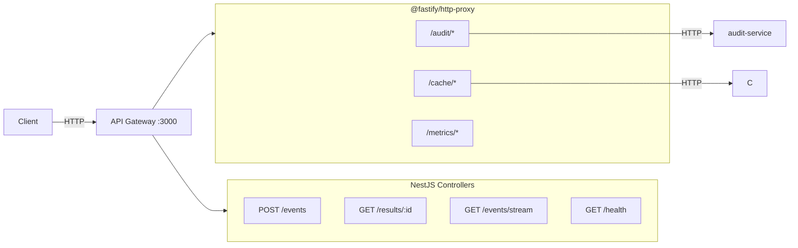

# API Gateway HTTP Request/Response with Service Registry

## Current State

The API Gateway currently handles:

- **Event publishing** via NATS (`POST /events`, `GET /results/:id`, `GET /events/stream`)
- **Audit proxy** via a dedicated `AuditProxyService` using `fetch` (hardcoded to audit-service)
- **Health checks** using a hardcoded `SERVICE_URLS` Map in [health.controller.ts](services/api-gateway/src/modules/health/health.controller.ts)

There is no centralized service registry and no generic HTTP proxying.

## Goal

Create a **ServiceRegistry** that knows about all downstream services and use `@fastify/http-proxy` to forward HTTP requests by path prefix to the corresponding service.

