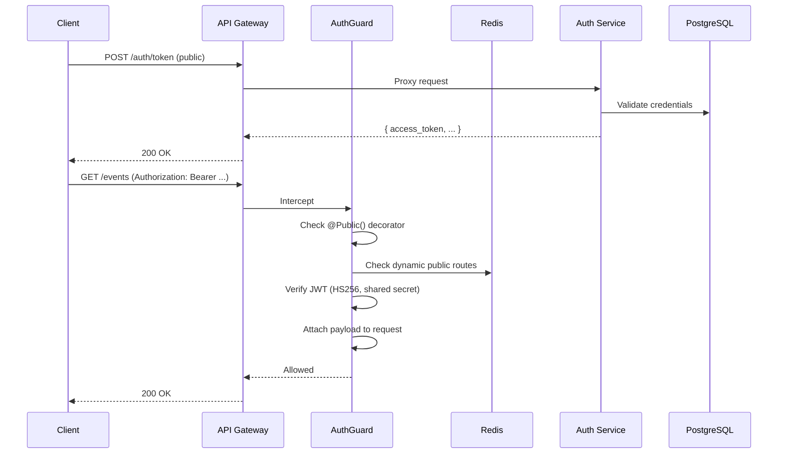
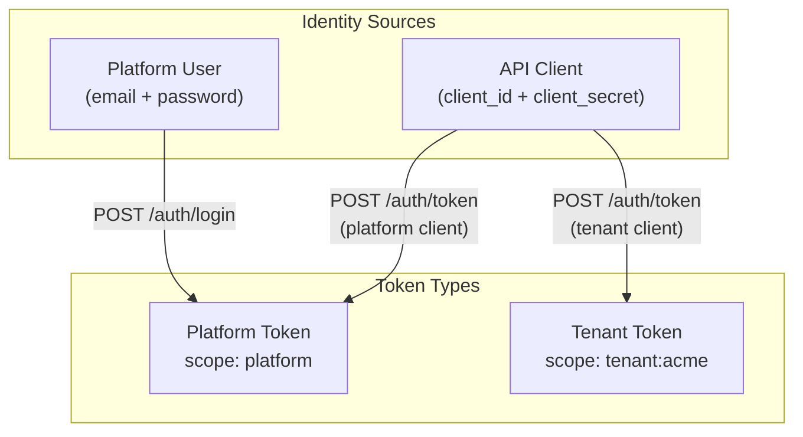
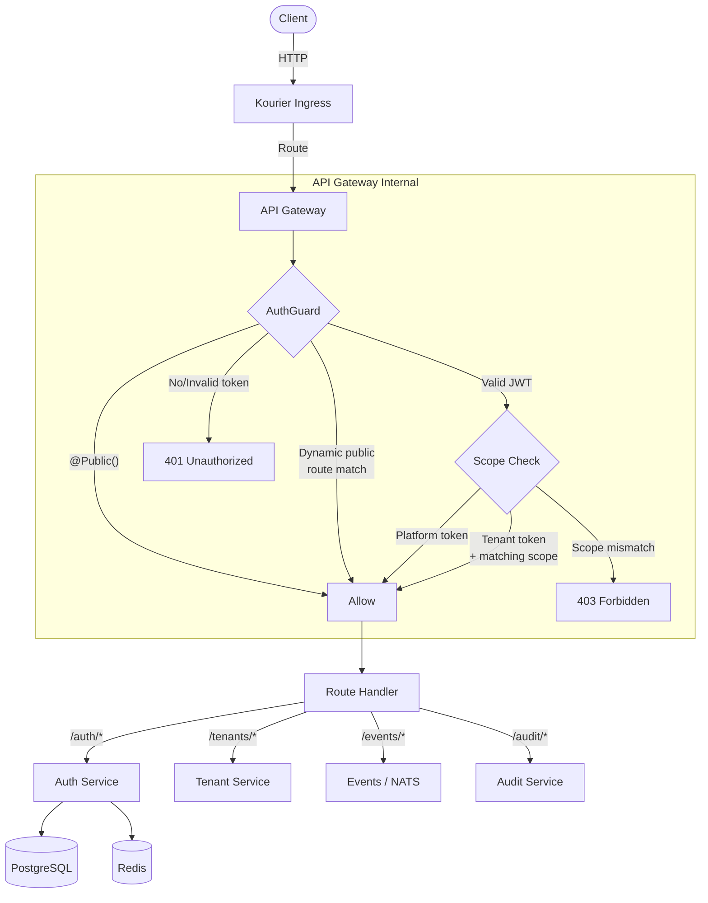

# Authentication Service and Gateway Auth Guard

## Architecture Overview




## Token Scope Model




- **Platform tokens** grant access to platform management routes (tenant CRUD, audit, metrics, etc.)
- **Tenant tokens** grant access only to operations scoped to that specific tenant
- Both user credentials (human login) and client credentials (machine-to-machine) can produce tokens
- JWT signed with HS256 using a shared secret from a K8s Secret (`auth-secret`)

## 1. New Service: `auth-service`

New microservice at [services/auth-service/](services/auth-service/) following the exact same structure as existing services (NestJS 11 + Fastify + Bun).

### Database Schema (added to [infrastructure/base/postgres/configmap.yaml](infrastructure/base/postgres/configmap.yaml) `init.sql`)

```sql
CREATE TABLE platform_users (
  id            TEXT        PRIMARY KEY,
  email         TEXT        UNIQUE NOT NULL,
  password_hash TEXT        NOT NULL,
  role          TEXT        NOT NULL DEFAULT 'operator',
  is_active     BOOLEAN     NOT NULL DEFAULT true,
  created_at    TIMESTAMPTZ NOT NULL DEFAULT NOW(),
  updated_at    TIMESTAMPTZ NOT NULL DEFAULT NOW()
);

CREATE TABLE api_clients (
  id                 TEXT        PRIMARY KEY,
  client_id          TEXT        UNIQUE NOT NULL,
  client_secret_hash TEXT        NOT NULL,
  name               TEXT        NOT NULL,
  scope              TEXT        NOT NULL, -- 'platform' or 'tenant:{name}'
  is_active          BOOLEAN     NOT NULL DEFAULT true,
  created_at         TIMESTAMPTZ NOT NULL DEFAULT NOW(),
  updated_at         TIMESTAMPTZ NOT NULL DEFAULT NOW()
);

CREATE TABLE public_routes (
  id            TEXT        PRIMARY KEY,
  method        TEXT        NOT NULL, -- 'GET', 'POST', '*'
  path_pattern  TEXT        NOT NULL, -- '/events', '/tenants/:name'
  scope         TEXT        NOT NULL, -- 'platform' or 'tenant:{name}'
  environment   TEXT        NOT NULL,
  created_at    TIMESTAMPTZ NOT NULL DEFAULT NOW()
);
```

### Service Module Structure

```
services/auth-service/src/
  main.ts
  app.module.ts
  providers/
    providers.module.ts
    postgres.provider.ts
    redis.provider.ts
  modules/
    token/
      token.module.ts
      token.controller.ts     -- POST /auth/token, POST /auth/login, POST /auth/refresh
      token.service.ts         -- Credential validation, JWT signing/verification
      token.dto.ts
    users/
      users.module.ts
      users.controller.ts     -- CRUD for platform users (admin-only)
      users.service.ts
      user.dto.ts
    clients/
      clients.module.ts
      clients.controller.ts   -- CRUD for API clients (admin-only)
      clients.service.ts
      client.dto.ts
    public-routes/
      public-routes.module.ts
      public-routes.controller.ts  -- CRUD + sync to Redis
      public-routes.service.ts
      public-route.dto.ts
    health/
      health.module.ts
      health.controller.ts
```

### Key Dependencies

- `jose` for JWT signing/verification (fast, no native deps, standards-compliant)
- `postgres` for database access (consistent with audit-service pattern)
- `ioredis` for Redis cache writes
- Password hashing via `Bun.password` (argon2id, built-in, high performance)

### Endpoints


| Method | Path                      | Description                   | Auth           |
| ------ | ------------------------- | ----------------------------- | -------------- |
| POST   | `/auth/token`             | Client credentials grant      | None           |
| POST   | `/auth/login`             | User login (email + password) | None           |
| POST   | `/auth/refresh`           | Refresh access token          | Refresh token  |
| GET    | `/auth/public-routes`     | List public routes for env    | Platform       |
| POST   | `/auth/public-routes`     | Create public route           | Platform admin |
| DELETE | `/auth/public-routes/:id` | Remove public route           | Platform admin |
| POST   | `/auth/users`             | Create platform user          | Platform admin |
| GET    | `/auth/users`             | List platform users           | Platform admin |
| POST   | `/auth/clients`           | Create API client             | Platform admin |
| GET    | `/auth/clients`           | List API clients              | Platform admin |
| DELETE | `/auth/clients/:id`       | Revoke API client             | Platform admin |


### Admin Seed

On startup, if no admin user exists, create one from `ADMIN_EMAIL` and `ADMIN_PASSWORD` env vars. This bootstraps the first platform admin.

### Public Routes Redis Cache

- Auth-service writes to Redis key `public_routes:{env}` as a JSON-serialized array on every CRUD mutation
- Pattern: `[{"method":"GET","path":"/health","scope":"platform"},{"method":"*","path":"/events","scope":"tenant:acme"}]`
- Gateway reads this key and caches it in-memory with a short TTL (30s) to avoid constant Redis lookups

## 2. API Gateway Changes

### New Files in [services/api-gateway/src/](services/api-gateway/src/)

- `guards/auth.guard.ts` -- Global NestJS guard
- `decorators/public.decorator.ts` -- `@Public()` decorator for statically public routes
- `decorators/scopes.decorator.ts` -- `@Scopes('platform')` / `@Scopes('tenant')` decorator
- `modules/auth/auth.module.ts` -- Auth module (proxy + guard providers)
- `modules/auth/auth-proxy.service.ts` -- HTTP proxy to auth-service
- `modules/auth/auth.controller.ts` -- Exposes `/auth/token`, `/auth/login` etc.
- `modules/auth/jwt.service.ts` -- JWT verification using shared secret
- `modules/auth/public-routes-cache.service.ts` -- Fetches and caches public routes from Redis

### AuthGuard Logic (global, applied to all routes)

```
1. Check if route has @Public() metadata -> ALLOW
2. Load dynamic public routes from cache (Redis key public_routes:{env})
3. Match request method + path against dynamic public routes (platform-wide for env, then tenant-scoped)
4. If matched -> ALLOW
5. Extract Bearer token from Authorization header
6. Verify JWT signature and expiration using jose
7. Check scope: platform tokens pass everywhere; tenant tokens are restricted
8. Attach decoded payload to request via custom decorator
9. If @Scopes() decorator present, verify token scope matches
```

### Static Public Routes (via decorator)

These endpoints are always public regardless of configuration:

- `POST /auth/token`
- `POST /auth/login`
- `POST /auth/refresh`
- `GET /health`

### Modified Files

- [services/api-gateway/src/app.module.ts](services/api-gateway/src/app.module.ts) -- Import `AuthModule`, register global guard via `APP_GUARD`
- [services/api-gateway/package.json](services/api-gateway/package.json) -- Add `jose` dependency

## 3. Shared Package Changes

Add to [packages/shared/src/](packages/shared/src/):

- `auth.interfaces.ts` -- `JwtPayload`, `TokenResponse`, `TokenScope` types
- `auth.constants.ts` -- `ACCESS_TOKEN_TTL`, `REFRESH_TOKEN_TTL`, `PUBLIC_ROUTES_CACHE_KEY_PREFIX`, `AUTH_CACHE_TTL`
- Update [packages/shared/src/index.ts](packages/shared/src/index.ts) to re-export new modules

### JwtPayload Interface

```typescript
interface JwtPayload {
  sub: string;
  type: 'user' | 'client';
  scope: string;        // 'platform' | 'tenant:{name}'
  role?: string;        // 'admin' | 'operator' (users only)
  env: string;
  iat: number;
  exp: number;
}
```

## 4. Infrastructure Changes

### New K8s Secret -- `knative/services/base/auth-secret.yaml`

```yaml
apiVersion: v1
kind: Secret
metadata:
  name: auth-secret
type: Opaque
stringData:
  JWT_SECRET: "..." # HS256 shared secret (256-bit)
  ADMIN_EMAIL: "admin@yoizen.io"
  ADMIN_PASSWORD: "..." # Initial admin password
```

### New Knative Service -- `knative/services/base/auth-service.yaml`

Same pattern as other services (1-3 replicas, concurrency target 50, port 3000). Needs `postgres-credentials`, `auth-secret`, `REDIS_HOST`, `REDIS_PORT`, `PLATFORM_ENVIRONMENT`.

### Update Base Kustomization -- [knative/services/base/kustomization.yaml](knative/services/base/kustomization.yaml)

Add `auth-secret.yaml` and `auth-service.yaml` to resources.

### Update Env Patches (all 4 envs)

Each env overlay ([knative/services/overlays/local/dev/env-patches.yaml](knative/services/overlays/local/dev/env-patches.yaml), qa, staging, production):

- Add auth-service Knative Service patch with env-specific `POSTGRES_HOST`, `REDIS_HOST`, `NATS_URL`, `PLATFORM_ENVIRONMENT`
- Update api-gateway patch to add `AUTH_SERVICE_URL` and `JWT_SECRET` (from auth-secret)

### Update PostgreSQL init.sql -- [infrastructure/base/postgres/configmap.yaml](infrastructure/base/postgres/configmap.yaml)

Add `platform_users`, `api_clients`, `public_routes` tables and indexes.

## 5. Request Flow Diagram




