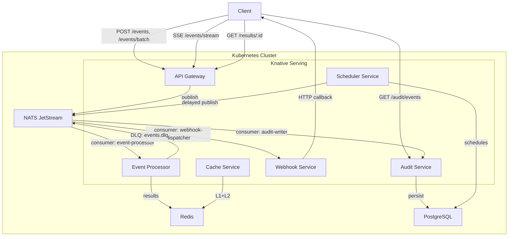

# Event Platform Feature Expansion

## Architecture After All Features




---

## Phase 1: Handler Registry and Input Validation

The foundational change. Replaces the hardcoded switch in [processor.service.ts](services/event-processor/src/modules/processor/processor.service.ts) with a pluggable handler pattern.

### 1a. Handler Interface and Registry

Create `services/event-processor/src/handlers/`:

- `event-handler.interface.ts` -- defines the contract:

```typescript
  export interface EventHandler {
    readonly eventType: string;
    handle(eventId: string, payload: unknown): Promise<EventResult>;
  }
  export interface EventResult {
    processed: boolean;
    data?: unknown;
  }
  

```

- `handler-registry.ts` -- a `Map<string, EventHandler>` injectable that auto-discovers handlers via NestJS custom decorator + `DiscoveryService`. Handlers register themselves by decorating with `@EventType('created')`.
- `default.handler.ts` -- fallback handler for unregistered types (replaces the current `default` branch).
- Move current `created`/`updated`/`deleted` logic into individual handler files.

Refactor `ProcessorService.processEvent()` to:

```typescript
const handler = this.registry.get(type) ?? this.defaultHandler;
const result = await handler.handle(eventId, payload);
```

### 1b. Input Validation on API Gateway

- Add `class-validator` + `class-transformer` to [api-gateway](services/api-gateway/).
- Replace the `interface EventDto` in [events.controller.ts](services/api-gateway/src/modules/events/events.controller.ts) with a validated class:

```typescript
  class EventDto {
    @IsString() @IsNotEmpty() @MaxLength(128) type: string;
    @IsObject() payload: Record<string, unknown>;
  }
  

```

- Register `ValidationPipe` globally in [main.ts](services/event-processor/src/main.ts).
- Add a `POST /event-types` endpoint (or config-based) for registering valid event type names and their payload JSON schemas (optional strictness -- can start with just type name allowlisting).

### 1c. Shared Types Package

Create `packages/shared/` with:

- Event envelope interfaces (`EventEnvelope`, `EventResult`, `EventMetadata`)
- Common constants (subject prefixes, stream names, key prefixes)
- Used by all services via workspace reference to avoid type drift.

---

## Phase 2: Persistent Event Store and Audit Log

### 2a. PostgreSQL Infrastructure

- Add `infrastructure/base/postgres/` with:
  - `statefulset.yaml` (single-replica for dev, HA overlay for prod)
  - `service.yaml`, `configmap.yaml`, `secret.yaml` (credentials)
  - PVC: 10Gi
- Add overlay patches in `infrastructure/overlays/local/patches/postgres-resources.yaml`.
- Update [bootstrap.sh](bootstrap.sh) to deploy Postgres and wait for readiness.

### 2b. Audit Service (new Knative Service)

Create `services/audit-service/`:

- NestJS + Fastify + Bun (same stack as existing services).
- Own NATS durable consumer: `audit-writer` on stream `EVENTS` (subjects `events.>`). This gives independent consumption from event-processor.
- On each message: INSERT into `events` table (columns: `id`, `type`, `payload JSONB`, `metadata JSONB`, `created_at`, `subject`).
- Expose query API:
  - `GET /audit/events?type=...&from=...&to=...&limit=...` -- paginated query
  - `GET /audit/events/:id` -- single event lookup
- Use a raw SQL driver (e.g., `postgres` or `pg` package) for minimal overhead -- no ORM needed for append-only writes + simple reads.

### 2c. NATS JetStream Retention

- Update stream config in [nats.provider.ts](services/event-processor/src/providers/nats.provider.ts) to set `retention: RetentionPolicy.Limits`, `max_age: 7 * 24 * 60 * 60 * 1e9` (7 days in nanoseconds), and `max_bytes` to a sensible limit.
- This enables replay for new consumers without hitting Postgres.

### 2d. Knative + Kustomize

- Add `knative/services/audit-service.yaml` (same pattern as existing services).
- Update `knative/services/kustomization.yaml` to include it.

---

## Phase 3: Event Enrichment Pipeline

Add a middleware-style pipeline in the event-processor that runs **before** the handler.

### 3a. Enrichment Chain

Create `services/event-processor/src/pipeline/`:

- `pipeline-stage.interface.ts`:

```typescript
  export interface PipelineStage {
    readonly order: number;
    process(envelope: EventEnvelope): Promise<EventEnvelope>;
  }
  

```

- `validation.stage.ts` -- validates payload against registered JSON schema for the event type (uses `ajv`, already in node_modules).
- `enrichment.stage.ts` -- attaches metadata: `receivedAt`, `correlationId` (from NATS headers or generated), `source` subject.
- `transform.stage.ts` -- normalizes payload shape (e.g., trims strings, coerces types). Starts as pass-through; users plug in custom transformers.

### 3b. Integration with ProcessorService

Refactor `runConsumer()` in [processor.service.ts](services/event-processor/src/modules/processor/processor.service.ts):

1. Deserialize message into `EventEnvelope`.
2. Run through sorted pipeline stages.
3. Pass enriched envelope to handler registry.
4. Store enriched result (with metadata) in Redis.

---

## Phase 4: Webhook / Callback Support

### 4a. Webhook Registration (API Gateway)

Extend [events.controller.ts](services/api-gateway/src/modules/events/events.controller.ts):

- `EventDto` gets optional `callbackUrl?: string`.
- If present, store `callback:<eventId> -> callbackUrl` in Redis with same TTL as pending.
- The callback URL is also embedded in the NATS message envelope.

### 4b. Webhook Service (new Knative Service)

Create `services/webhook-service/`:

- Own NATS durable consumer: `webhook-dispatcher` on a **separate subject** `events.results.>`.
- After event-processor writes a result to Redis, it also publishes a completion message to `events.results.<type>` containing `{ eventId, result, callbackUrl }`.
- Webhook service receives completion, POSTs result to `callbackUrl`.
- Retry with exponential backoff (3 attempts, 1s/5s/30s delays). On final failure, publish to `events.webhook-dlq`.

### 4c. SSE Endpoint (API Gateway)

Add `GET /events/stream?types=created,updated` to the API Gateway:

- Uses Fastify's SSE support (raw `reply.raw` writable stream).
- Subscribes to NATS subjects matching the requested types.
- Pushes events to the client as SSE frames.
- Closes on client disconnect.

---

## Phase 5: Multi-Consumer Fan-Out

### 5a. Consumer Group Architecture

The audit-service and webhook-service from Phases 2 and 4 already demonstrate fan-out (independent durable consumers on the same stream). Formalize this:

- Document the consumer naming convention: `<service-name>` as durable name.
- Each new service that needs events creates its own consumer in its own `nats.provider.ts`.
- The NATS stream `EVENTS` stays as single source of truth; consumers are independent.

### 5b. Subject-Based Routing

- Producers already publish to `events.<type>`. Consumers can filter by subscribing to specific subjects:
  - `events.created` -- only created events
  - `events.>` -- all events
- Add consumer filter subjects in each service's NATS provider config so services only receive the events they care about.

---

## Phase 6: Batch / Bulk Event Ingestion

### 6a. Batch Endpoint

Add to [events.controller.ts](services/api-gateway/src/modules/events/events.controller.ts):

- `POST /events/batch` accepting `{ events: EventDto[] }` with a max batch size (e.g., 100).
- Validate all events upfront; reject entire batch on validation failure.

### 6b. Batch Publishing

In [events.service.ts](services/api-gateway/src/modules/events/events.service.ts):

- Use a single loop publishing all messages to NATS (JetStream does not have a native batch publish, but you can pipeline `Promise.all` over individual publishes for concurrency).
- Pipeline Redis `setex` calls using `redis.pipeline()` for all pending keys.
- Return array of `{ id, status }` for each event.

---

## Phase 7: Event Scheduling / Delayed Events

### 7a. Scheduler Service (new Knative Service)

Create `services/scheduler-service/`:

- Postgres table: `scheduled_events (id, event_type, payload JSONB, execute_at TIMESTAMPTZ, status, created_at)`.
- Polling loop: every 1s, query `WHERE execute_at <= NOW() AND status = 'pending' ORDER BY execute_at LIMIT 100 FOR UPDATE SKIP LOCKED`.
- For each due event: publish to NATS `events.<type>`, update status to `'dispatched'`.

### 7b. Scheduling API (API Gateway)

Add to the API Gateway:

- `POST /events/schedule` with body `{ type, payload, executeAt }` (ISO 8601 timestamp) or `{ type, payload, delayMs }`.
- Gateway writes directly to Postgres `scheduled_events` table (or calls scheduler-service via HTTP).
- Returns `{ scheduleId, executeAt, status: 'scheduled' }`.

### 7c. Recurring Events (future extension)

- Add `cron` column to `scheduled_events`. After dispatch, if cron is set, compute next execution and insert a new row.
- Out of scope for initial implementation -- note it as a follow-up.

---

## Phase 8: Tests and E2E Updates

- Update existing [flow.e2e.spec.ts](tests/e2e/flow.e2e.spec.ts) to cover:
  - Batch ingestion endpoint
  - Webhook callback delivery (spin up a temp HTTP server in the test)
  - Audit log query after event processing
  - Scheduled event execution
- Add unit tests for handler registry, pipeline stages, and each handler.
- Add integration tests for each new service (audit-service, webhook-service, scheduler-service).

---

## New files summary


| Path                                      | Purpose                                        |
| ----------------------------------------- | ---------------------------------------------- |
| `packages/shared/`                        | Shared types, constants, event envelope        |
| `services/event-processor/src/handlers/`  | Handler interface, registry, per-type handlers |
| `services/event-processor/src/pipeline/`  | Enrichment pipeline stages                     |
| `services/audit-service/`                 | Full new service (Knative)                     |
| `services/webhook-service/`               | Full new service (Knative)                     |
| `services/scheduler-service/`             | Full new service (Knative)                     |
| `infrastructure/base/postgres/`           | Postgres K8s manifests                         |
| `knative/services/audit-service.yaml`     | Knative Service def                            |
| `knative/services/webhook-service.yaml`   | Knative Service def                            |
| `knative/services/scheduler-service.yaml` | Knative Service def                            |


## Modified files summary


| Path                                                                  | Change                                          |
| --------------------------------------------------------------------- | ----------------------------------------------- |
| `services/event-processor/src/modules/processor/processor.service.ts` | Replace switch with handler registry + pipeline |
| `services/event-processor/src/providers/nats.provider.ts`             | Add retention policy, max_age, max_deliver      |
| `services/api-gateway/src/modules/events/events.controller.ts`        | Add validation, batch endpoint, SSE, schedule   |
| `services/api-gateway/src/modules/events/events.service.ts`           | Add batch publish, callback storage             |
| `infrastructure/overlays/local/kustomization.yaml`                    | Include Postgres                                |
| `knative/services/kustomization.yaml`                                 | Include new services                            |
| `bootstrap.sh`                                                        | Build + deploy new services, wait for Postgres  |
| `tests/e2e/flow.e2e.spec.ts`                                          | Cover new features                              |


