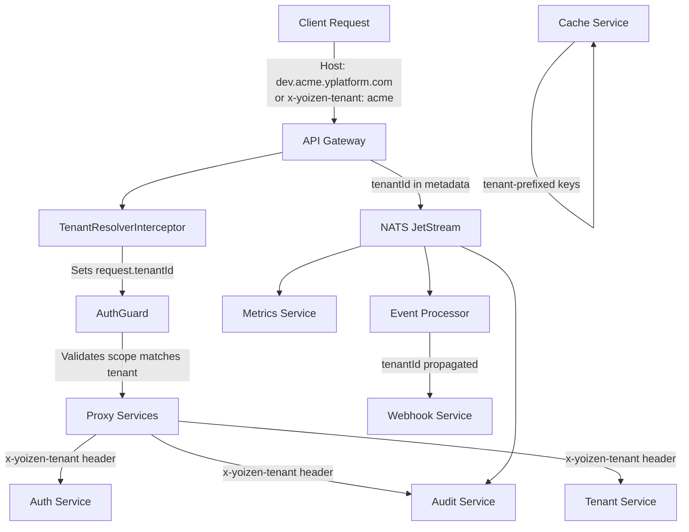

# Full Multitenancy Support

## Architecture Overview

Every request must carry a tenant context. The API gateway resolves the tenant from the hostname (`<env>.<tenant>.yplatform.com`) or the `x-yoizen-tenant` request header, validates it against the JWT scope, and propagates it as the `x-yoizen-tenant` header to all downstream services and as metadata in NATS messages.




### Isolation Model

- **Database-per-tenant**: Audit and metrics services use separate PostgreSQL databases per tenant (e.g. `tenant_acme_dev`)
- **Auth service**: Remains on the platform database (shared) -- auth data is configuration/admin data, not tenant operational data. Queries are already scoped by `scope` column
- **Redis**: Keys prefixed with tenant namespace (`{tenant}:result:...`, `{tenant}:pending:...`)
- **NATS**: Tenant carried in `EventMetadata.tenantId` field

### Tenant Context Requirement

Every request requires a tenant context, including platform-scoped tokens. The only exceptions are health endpoints and tenant management endpoints (creating/listing tenants is inherently cross-tenant).

---

## 1. Shared Package (`@yoizen/shared`)

File: [packages/shared/src/constants.ts](packages/shared/src/constants.ts)

- Add `TENANT_HEADER = 'x-yoizen-tenant'`
- Add `TENANT_DB_PREFIX = 'tenant_'` (database naming: `tenant_{name}_{env}`)

File: [packages/shared/src/interfaces.ts](packages/shared/src/interfaces.ts)

- Add `tenantId?: string` to `EventMetadata`

File: [packages/shared/src/auth.interfaces.ts](packages/shared/src/auth.interfaces.ts)

- Add `tenantId` to `JwtPayload` as optional (gateway resolves, not all JWTs embed it)

File: [packages/shared/src/index.ts](packages/shared/src/index.ts)

- Export new constants

---

## 2. API Gateway -- Tenant Resolution

Create a new NestJS interceptor that runs before routing. It resolves the tenant and attaches it to the request.

### New file: `services/api-gateway/src/interceptors/tenant-resolver.interceptor.ts`

```typescript
@Injectable()
export class TenantResolverInterceptor implements NestInterceptor {
  intercept(context: ExecutionContext, next: CallHandler): Observable<any> {
    const request = context.switchToHttp().getRequest();
    const tenantId = this.resolveTenant(request);
    request.tenantId = tenantId;
    request.headers[TENANT_HEADER] = tenantId;
    return next.handle();
  }

  private resolveTenant(request: FastifyRequest): string {
    // 1. Try hostname: <env>.<tenant>.yplatform.com
    const host = request.headers.host ?? '';
    const match = host.match(/^[^.]+\.([^.]+)\.yplatform\.com$/);
    if (match) return match[1];

    // 2. Fall back to x-yoizen-tenant header
    const header = request.headers[TENANT_HEADER];
    if (header) return header;

    throw new BadRequestException('Tenant context required');
  }
}
```

### Modifications to `AuthGuard` ([services/api-gateway/src/guards/auth.guard.ts](services/api-gateway/src/guards/auth.guard.ts))

- After JWT verification, validate that the tenant from JWT scope (`tenant:<name>`) matches `request.tenantId`
- Platform tokens must still have a tenant context on the request (from hostname/header)
- Public/health routes are exempt from tenant requirement

### Register interceptor globally in [services/api-gateway/src/app.module.ts](services/api-gateway/src/app.module.ts)

- Add `APP_INTERCEPTOR` provider for `TenantResolverInterceptor`
- Interceptor runs before guards in NestJS lifecycle -- actually, interceptors run *after* guards. We need a **middleware** or a **Fastify hook** instead for earliest resolution. Use a **NestJS middleware** applied globally:

```typescript
// services/api-gateway/src/middleware/tenant-resolver.middleware.ts
@Injectable()
export class TenantResolverMiddleware implements NestMiddleware {
  use(req: FastifyRequest, res: FastifyReply, next: () => void): void {
    const tenantId = this.resolveTenant(req);
    (req as any).tenantId = tenantId;
    req.headers[TENANT_HEADER] = tenantId;
    next();
  }
}
```

Register via `configure()` in `AppModule` with `.forRoutes('*')`, excluding `/health`.

### New decorator: `services/api-gateway/src/decorators/skip-tenant.decorator.ts`

- `@SkipTenant()` decorator to exempt routes from tenant requirement (health, tenant CRUD endpoints)

---

## 3. API Gateway -- Tenant Propagation

### Proxy services

All proxy services must forward the `x-yoizen-tenant` header to downstream services.

- [services/api-gateway/src/modules/auth/auth-proxy.service.ts](services/api-gateway/src/modules/auth/auth-proxy.service.ts): Accept and forward `x-yoizen-tenant`
- [services/api-gateway/src/modules/audit/audit.service.ts](services/api-gateway/src/modules/audit/audit.service.ts): Forward `x-yoizen-tenant` on all fetch calls
- [services/api-gateway/src/modules/tenants/tenant-proxy.service.ts](services/api-gateway/src/modules/tenants/tenant-proxy.service.ts): Forward `x-yoizen-tenant`

### Events service ([services/api-gateway/src/modules/events/events.service.ts](services/api-gateway/src/modules/events/events.service.ts))

- `publish()` must accept `tenantId` parameter
- Include `tenantId` in `EventMetadata`
- Prefix Redis keys: `{tenantId}:pending:{id}`, `{tenantId}:callback:{id}`
- Set `x-yoizen-tenant` as NATS message header

### Events controller ([services/api-gateway/src/modules/events/events.controller.ts](services/api-gateway/src/modules/events/events.controller.ts))

- Extract `tenantId` from request and pass to `EventsService.publish()`
- SSE streams filtered by tenant (subscribe to tenant-specific subjects or filter in handler)

---

## 4. Tenant Service -- Database Provisioning

Currently tenant-service only manages K8s namespaces. Extend it to also provision PostgreSQL databases.

### New provider: `services/tenant-service/src/providers/postgres.provider.ts`

- Admin connection to PostgreSQL for `CREATE DATABASE` / `DROP DATABASE`
- Add `POSTGRES_HOST`, `POSTGRES_PORT`, `POSTGRES_USER`, `POSTGRES_PASSWORD` env vars to tenant-service

### Extend [services/tenant-service/src/modules/tenants/tenants.service.ts](services/tenant-service/src/modules/tenants/tenants.service.ts)

- On `createTenant(name, env)`:
  1. Create K8s namespace `{name}-{env}-ns` (existing)
  2. Create PostgreSQL database `tenant_{name}_{env}`
  3. Run schema initialization (create tables: `events`, `metrics`)
- On `deleteTenant(name, env)`:
  1. Delete K8s namespace (existing)
  2. Drop PostgreSQL database `tenant_{name}_{env}`

### Env patches

Update [knative/services/overlays/local/dev/env-patches.yaml](knative/services/overlays/local/dev/env-patches.yaml) (and other envs) to add PostgreSQL env vars for tenant-service.

---

## 5. Shared `TenantConnectionManager`

Since both audit-service and metrics-service need dynamic per-tenant DB connections, create a reusable pattern. Could live in `@yoizen/shared` or be duplicated per service (since `@yoizen/shared` currently only has types/constants, not NestJS modules).

Create in each service (audit-service, metrics-service):

```typescript
// services/{service}/src/providers/tenant-connection-manager.ts
@Injectable()
export class TenantConnectionManager implements OnModuleDestroy {
  private readonly pools = new Map<string, Sql>();

  getConnection(tenantId: string): Sql {
    let pool = this.pools.get(tenantId);
    if (pool) return pool;

    const env = process.env.PLATFORM_ENVIRONMENT ?? 'dev';
    pool = postgres({
      host: process.env.POSTGRES_HOST ?? 'localhost',
      port: parseInt(process.env.POSTGRES_PORT ?? '5432'),
      database: `tenant_${tenantId}_${env}`,
      username: process.env.POSTGRES_USER ?? 'postgres',
      password: process.env.POSTGRES_PASSWORD ?? 'postgres',
      max: 10,
      idle_timeout: 30,
    });
    this.pools.set(tenantId, pool);
    return pool;
  }

  async onModuleDestroy(): Promise<void> {
    const closeTasks: Promise<void>[] = [];
    for (const pool of this.pools.values()) {
      closeTasks.push(pool.end());
    }
    await Promise.all(closeTasks);
  }
}
```

---

## 6. Audit Service -- Database-per-Tenant

### File: [services/audit-service/src/modules/audit/audit.service.ts](services/audit-service/src/modules/audit/audit.service.ts)

**NATS consumer changes**:

- Extract `tenantId` from `EventEnvelope.metadata.tenantId`
- Use `TenantConnectionManager.getConnection(tenantId)` instead of fixed `this.sql`
- Run `ensureTable()` lazily per tenant on first connection
- Cache which tenants have been initialized in a `Set<string>`

**Query API changes**:

- Extract tenant from `x-yoizen-tenant` header (via controller)
- Use `TenantConnectionManager.getConnection(tenantId)` for queries
- Controller must pass `tenantId` to service methods

### File: [services/audit-service/src/modules/audit/audit.controller.ts](services/audit-service/src/modules/audit/audit.controller.ts)

- Add `@Headers(TENANT_HEADER) tenantId: string` to all endpoints
- Pass `tenantId` to service methods
- Validate tenant is present (throw 400 if missing)

---

## 7. Metrics Service -- Database-per-Tenant

Same pattern as audit-service.

### File: [services/metrics-service/src/modules/metrics/metrics.service.ts](services/metrics-service/src/modules/metrics/metrics.service.ts)

- Replace fixed `this.sql` with `TenantConnectionManager.getConnection(tenantId)`
- Extract `tenantId` from `EventEnvelope.metadata.tenantId` in NATS consumer
- Lazy `ensureTable()` per tenant

### File: [services/metrics-service/src/modules/metrics/metrics.controller.ts](services/metrics-service/src/modules/metrics/metrics.controller.ts)

- Add `@Headers(TENANT_HEADER) tenantId: string` to all endpoints

---

## 8. Event Processor -- Tenant Propagation

### File: [services/event-processor/src/pipeline/pipeline-stage.interface.ts](services/event-processor/src/pipeline/pipeline-stage.interface.ts)

- Add `tenantId?: string` to `PipelineContext`

### File: [services/event-processor/src/modules/processor/processor.service.ts](services/event-processor/src/modules/processor/processor.service.ts)

- Extract `tenantId` from `envelope.metadata?.tenantId`
- Set it in `PipelineContext`
- Prefix Redis result key: `{tenantId}:result:{eventId}`
- Include `tenantId` in `CompletionEvent` metadata (via `ProcessedEvent.metadata`)
- Publish `tenantId` as NATS header on results

---

## 9. Cache Service -- Tenant Key Isolation

### File: [services/cache-service/src/modules/cache/cache.controller.ts](services/cache-service/src/modules/cache/cache.controller.ts)

- Accept `x-yoizen-tenant` header
- Prefix all key operations with `{tenantId}:` before passing to service
- This keeps the cache service simple -- it just operates on keys, and the tenant prefix provides isolation

---

## 10. Webhook Service -- Tenant Context

### File: [services/webhook-service/src/modules/webhook/webhook.service.ts](services/webhook-service/src/modules/webhook/webhook.service.ts)

- Extract `tenantId` from `CompletionEvent.result.metadata.tenantId`
- Include `x-yoizen-tenant` header in webhook callback HTTP requests
- Include `tenantId` in DLQ messages

---

## 11. Auth Service -- Tenant Header Support

### File: [services/auth-service/src/modules/public-routes/public-routes.service.ts](services/auth-service/src/modules/public-routes/public-routes.service.ts)

- Accept `tenantId` parameter for scoping Redis cache keys: `public_routes:{env}:{tenantId}`
- Filter public route queries by tenant scope

### File: [services/auth-service/src/modules/clients/clients.service.ts](services/auth-service/src/modules/clients/clients.service.ts)

- Accept `tenantId` for filtering client queries (WHERE scope = 'tenant:{tenantId}')

### General: All controllers in auth-service should read `x-yoizen-tenant` from headers and pass to service methods.

---

## 12. Infrastructure Updates

### PostgreSQL configmap ([infrastructure/base/postgres/configmap.yaml](infrastructure/base/postgres/configmap.yaml))

- Update `init.sql` to add `tenant_id` index on `events` and `metrics` tables (useful as a fallback; primary isolation is via separate DBs)

### Knative env patches

Add `POSTGRES_`* env vars to tenant-service in:

- [knative/services/overlays/local/dev/env-patches.yaml](knative/services/overlays/local/dev/env-patches.yaml) (and qa, staging, production)
- Add `PLATFORM_ENVIRONMENT` to audit-service and metrics-service if not already present

### Auth secret

No changes needed -- JWT validation stays the same.

---

## Key Design Decisions

- **Hostname pattern**: `<env>.<tenant>.yplatform.com` -- the first subdomain segment is the environment, the second is the tenant name
- **Header fallback**: `x-yoizen-tenant` header is the fallback when hostname-based resolution is not available (e.g. internal service-to-service calls)
- **Tenant validation**: For authenticated requests, if JWT scope is `tenant:<name>`, the resolved tenant must match `<name>`. Platform-scoped tokens can operate on any tenant but must still specify one
- **Health endpoints exempt**: `/health` endpoints are exempt from tenant requirement
- **Tenant management exempt**: Tenant CRUD endpoints (`/tenants/`*) are exempt from tenant requirement since they are inherently cross-tenant operations
- **DB naming**: `tenant_{name}_{env}` (e.g. `tenant_acme_dev`)
- **Connection pooling**: Lazy pool creation per tenant, max 10 connections per pool, 30s idle timeout
- **Redis key namespacing**: `{tenantId}:{originalKey}` pattern across all services

