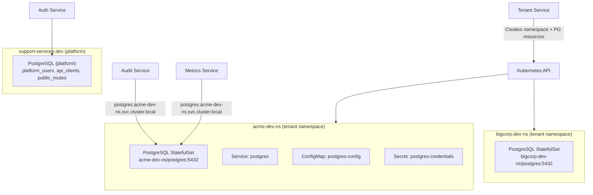

# Instance-per-Tenant PostgreSQL

## Current State

The current implementation creates a separate **database** on the shared PostgreSQL instance (`postgres.support-services-{env}`) for each tenant. This plan replaces that with a fully separate **PostgreSQL instance** (StatefulSet + Service) per tenant, deployed into the tenant's own K8s namespace (`{tenant}-{env}-ns`).

## Architecture




Each tenant's PostgreSQL is reachable at `postgres.{tenant}-{env}-ns.svc.cluster.local:5432`.

---

## Changes Required

### 1. Tenant Service -- Replace `PostgresAdminService` with K8s Resource Provisioning

**File: [services/tenant-service/src/providers/postgres.provider.ts](services/tenant-service/src/providers/postgres.provider.ts)**

Replace the current `PostgresAdminService` (which does `CREATE DATABASE` on the shared instance) with a `TenantPostgresProvisioner` that uses the K8s API to create:

- **Secret** `postgres-credentials` in the tenant namespace (with generated credentials)
- **ConfigMap** `postgres-config` (reuse the same `postgresql.conf` and tenant-specific `init.sql` with only `events` + `metrics` tables)
- **StatefulSet** `postgres` (1 replica, `postgres:17-alpine`, same pattern as the platform StatefulSet but with smaller resources)
- **Service** `postgres` (ClusterIP) + `postgres-headless` (headless)

On delete, tear down all these resources (the namespace deletion will handle it automatically, but explicit cleanup is cleaner).

The provisioner needs the K8s `AppsV1Api` (for StatefulSet) in addition to `CoreV1Api` (for Secret, ConfigMap, Service). The existing `KubernetesModule` only provides `CoreV1Api`.

**File: [services/tenant-service/src/providers/kubernetes.provider.ts](services/tenant-service/src/providers/kubernetes.provider.ts)**

- Add a second provider for `AppsV1Api`
- Export both `K8S_CORE_API` and a new `K8S_APPS_API`

**File: [services/tenant-service/src/modules/tenants/tenants.service.ts](services/tenant-service/src/modules/tenants/tenants.service.ts)**

- Replace `PostgresAdminService` injection with the new `TenantPostgresProvisioner`
- On `createTenant`: after namespace creation, call provisioner to deploy PG resources into the namespace, then wait for readiness
- On `deleteTenant`: namespace deletion cascades all resources automatically, so no explicit PG teardown needed
- Update `TenantDetail` interface: replace `database: string` with `postgresHost: string` (the K8s DNS hostname)

### 2. RBAC -- Expand Tenant Service Permissions

**File: [knative/services/rbac/cluster-role.yaml](knative/services/rbac/cluster-role.yaml)**

The current `tenant-namespace-manager` ClusterRole only allows namespace operations. Expand it to also permit creating StatefulSets, Services, ConfigMaps, Secrets, and PVCs in tenant namespaces:

```yaml
rules:
  - apiGroups: [""]
    resources: ["namespaces"]
    verbs: ["create", "get", "list", "delete"]
  - apiGroups: [""]
    resources: ["services", "configmaps", "secrets", "persistentvolumeclaims"]
    verbs: ["create", "get", "list", "delete"]
  - apiGroups: ["apps"]
    resources: ["statefulsets"]
    verbs: ["create", "get", "list", "delete", "watch"]
```

### 3. TenantConnectionManager -- Connect to Tenant's PostgreSQL Instance

**Files:**

- [services/audit-service/src/providers/tenant-connection-manager.ts](services/audit-service/src/providers/tenant-connection-manager.ts)
- [services/metrics-service/src/providers/tenant-connection-manager.ts](services/metrics-service/src/providers/tenant-connection-manager.ts)

Currently these connect to `POSTGRES_HOST` with a different database name per tenant. Change to connect to a different **host** per tenant:

- Host: `postgres.{tenantId}-{env}-ns.svc.cluster.local`
- Database: `yoizen` (same default database name for all tenant instances)
- Credentials: same user/password (from `postgres-credentials` secret, using the platform-level env vars, or a fixed convention)

The key change in `getConnection()`:

```typescript
// Before: different database on same host
const database = `${TENANT_DB_PREFIX}${tenantId}_${this.env}`;
pool = postgres({ host: this.host, database, ... });

// After: different host, same database
const host = `postgres.${tenantId}-${this.env}-ns.svc.cluster.local`;
pool = postgres({ host, database: 'yoizen', ... });
```

### 4. Remove `TENANT_DB_PREFIX` Constant

**File: [packages/shared/src/constants.ts](packages/shared/src/constants.ts)**

- Remove `TENANT_DB_PREFIX` (no longer needed -- each tenant has its own instance with a standard `yoizen` database)

**File: [packages/shared/src/index.ts](packages/shared/src/index.ts)**

- Remove `TENANT_DB_PREFIX` export

### 5. Tenant Service -- Remove `postgres` Dependency from package.json

**File: [services/tenant-service/package.json](services/tenant-service/package.json)**

- Remove the `postgres` npm dependency. The tenant-service no longer connects to PostgreSQL directly -- it only creates K8s resources via the K8s API.

### 6. Knative Env Patches -- Remove Tenant Service POSTGRES vars

**Files:**

- [knative/services/overlays/local/dev/env-patches.yaml](knative/services/overlays/local/dev/env-patches.yaml) (and qa, staging, production)
- Remove `POSTGRES_HOST`, `POSTGRES_PORT`, `POSTGRES_USER`, `POSTGRES_PASSWORD` from the tenant-service section (it no longer needs direct PostgreSQL access)

---

## What Does NOT Change

- **API Gateway** -- tenant resolution, header propagation, Redis key prefixing: unchanged
- **Auth Service** -- remains on the platform PostgreSQL instance: unchanged
- **Event Processor, Webhook Service, Cache Service** -- unchanged
- **Audit/Metrics service code** (`audit.service.ts`, `metrics.service.ts`) -- unchanged (they call `tenantConnections.getConnection(tenantId)` which is an implementation detail of the connection manager)
- **NATS event pipeline** -- tenant propagation in metadata: unchanged
- **Redis key namespacing** -- unchanged

---

## Tenant PostgreSQL Resource Specs (for local/dev)

Each tenant instance is lightweight:

- **CPU**: 50m request / 250m limit
- **Memory**: 64Mi request / 128Mi limit
- **Storage**: 1Gi PVC
- **max_connections**: 50

This keeps resource usage manageable when running multiple tenants locally.