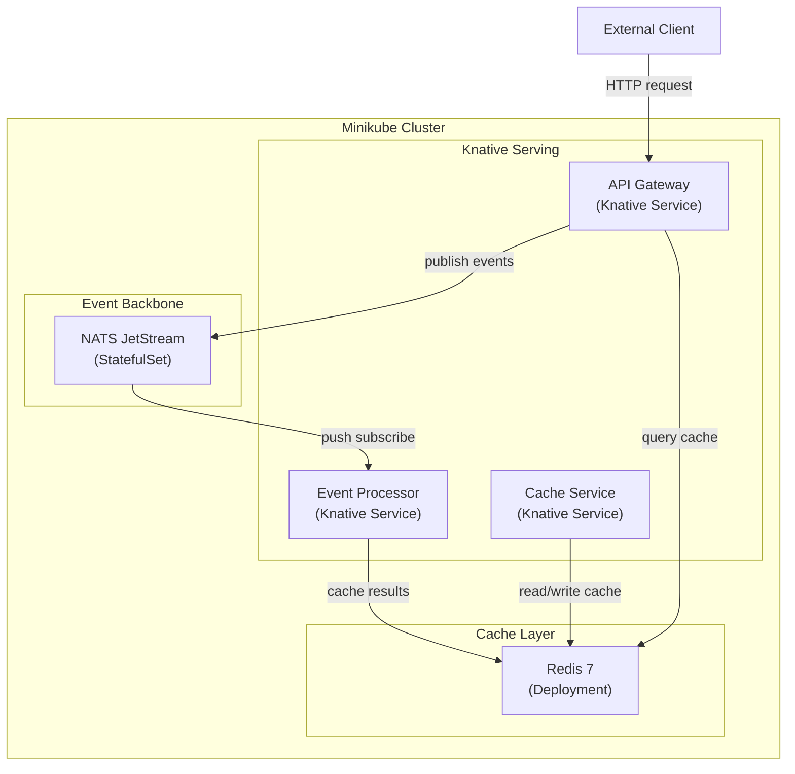
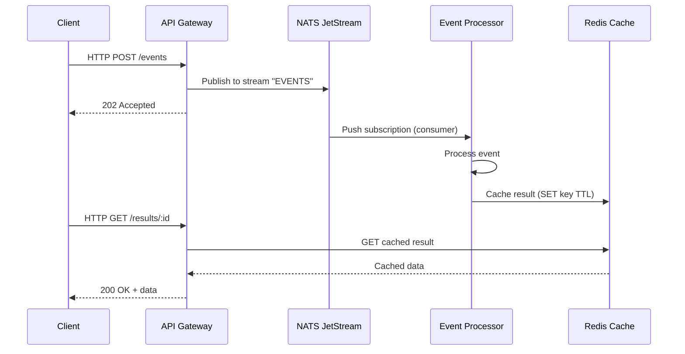

# Arquitectura Event-Driven sobre Kubernetes (Minikube)

## Estructura de directorios propuesta

```
Arch/
├── bootstrap.sh                    # Script para levantar minikube + instalar dependencias
├── README.md                       # Documentacion de la arquitectura
├── infrastructure/
│   ├── base/                       # Kustomize base
│   │   ├── kustomization.yaml
│   │   ├── namespace.yaml          # Namespace: yoizen-arch
│   │   ├── nats/
│   │   │   ├── kustomization.yaml
│   │   │   ├── statefulset.yaml    # NATS JetStream (3 replicas en prod, 1 local)
│   │   │   ├── service.yaml
│   │   │   └── configmap.yaml      # nats.conf con JetStream habilitado
│   │   └── redis/
│   │       ├── kustomization.yaml
│   │       ├── deployment.yaml     # Redis 7 single instance
│   │       ├── service.yaml
│   │       └── configmap.yaml      # redis.conf optimizado
│   └── overlays/
│       └── local/
│           ├── kustomization.yaml  # Patches para minikube (1 replica NATS, recursos reducidos)
│           └── patches/
│               ├── nats-resources.yaml
│               └── redis-resources.yaml
├── knative/
│   ├── serving/
│   │   ├── kustomization.yaml
│   │   └── config-autoscaler.yaml  # Configuracion de autoscaling (scale-to-zero, targets)
│   └── services/
│       ├── kustomization.yaml
│       ├── api-gateway.yaml        # Knative Service: API Gateway (punto de entrada)
│       ├── event-processor.yaml    # Knative Service: procesa eventos de NATS
│       └── cache-service.yaml      # Knative Service: servicio con Redis caching
└── services/                       # Codigo fuente de servicios de ejemplo
    ├── api-gateway/
    │   ├── Dockerfile
    │   ├── package.json
    │   └── src/
    │       ├── main.ts
    │       └── app.module.ts       # NestJS, publica a NATS, consulta Redis
    ├── event-processor/
    │   ├── Dockerfile
    │   ├── package.json
    │   └── src/
    │       ├── main.ts
    │       └── app.module.ts       # NestJS, suscribe a NATS streams
    └── cache-service/
        ├── Dockerfile
        ├── package.json
        └── src/
            ├── main.ts
            └── app.module.ts       # NestJS, CRUD con Redis caching layer
```

## Diagrama de arquitectura




## Flujo de eventos




## Componentes clave

### 1. Bootstrap Script (`bootstrap.sh`)

- Verifica/arranca minikube con perfil `yoizen-arch` (CPUs: 4, RAM: 8GB)
- Habilita addons: `metrics-server`, `ingress`
- Instala Knative Serving CRDs + core components via `kubectl apply`
- Instala Kourier como networking layer (mas liviano que Istio para local)
- Aplica Kustomize overlay local para NATS + Redis
- Aplica Knative Services
- Configura DNS con `sslip.io` para acceso local

### 2. NATS JetStream

- **StatefulSet** con persistent volume para durabilidad
- JetStream habilitado con store directory configurado
- Streams pre-configurados: `EVENTS` (subject: `events.>`)
- Consumers: push-based para Event Processor
- En local: 1 replica, en prod: 3 replicas (cluster mode)

### 3. Redis

- Redis 7 Alpine, single instance para local
- ConfigMap con `maxmemory-policy allkeys-lru` para comportamiento de cache
- Sin persistencia (cache puro) - `save ""` y `appendonly no`

### 4. Knative Serving Configuration

- Scale-to-zero habilitado con grace period de 30s
- Concurrency target: 100 por pod
- Min scale: 0 (salvo API Gateway que tendra min-scale: 1)
- Kourier como ingress (ligero vs Istio)

### 5. Servicios NestJS/Bun

- Cada servicio usa `oven/bun:1.3-alpine` como base image (consistente con `metrics-harvest`)
- `nats` npm package para conectarse a NATS JetStream
- `ioredis` para conexion a Redis (mejor rendimiento que `redis` package)
- Health checks en `/health` para Knative readiness/liveness probes

## Decisiones de diseno

- **Kourier vs Istio**: Kourier consume ~10x menos recursos, ideal para minikube
- **NATS standalone vs Knative Eventing broker**: NATS JetStream directo da mas control sobre streams/consumers, mejor rendimiento, y evita la capa de abstraccion de Knative Eventing que agrega latencia
- **ioredis vs redis package**: ioredis tiene mejor soporte de pipelining, cluster mode, y mejor rendimiento en benchmarks
- **Kustomize vs Helm**: Kustomize es nativo de kubectl, sin dependencias externas, mas simple para este caso de uso
- **StatefulSet para NATS**: Garantiza identidad de pod estable y PVCs para JetStream store

