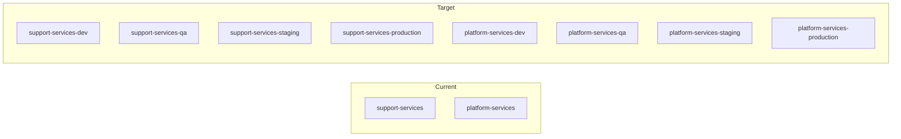

# Multi-Environment Kustomize Restructuring

## Current vs Target State




Each environment gets a fully isolated stack: its own NATS, Redis, Postgres, and its own set of Knative platform services wired to that environment's infrastructure.

---

## Strategy

Use Kustomize's `namespace` transformer: the **base** defines all resources without hardcoded namespaces, and per-environment overlays set the target namespace. This avoids duplicating resource definitions.

---

## 1. Infrastructure: strip hardcoded namespaces from base

Remove `namespace: support-services` from every resource in `infrastructure/base/`. Kustomize's `namespace:` field in each overlay will inject the correct namespace.

**Files to modify** (remove `namespace:` lines):

- [infrastructure/base/nats/statefulset.yaml](infrastructure/base/nats/statefulset.yaml)
- [infrastructure/base/nats/service.yaml](infrastructure/base/nats/service.yaml) (2 documents)
- [infrastructure/base/nats/configmap.yaml](infrastructure/base/nats/configmap.yaml)
- [infrastructure/base/redis/deployment.yaml](infrastructure/base/redis/deployment.yaml)
- [infrastructure/base/redis/service.yaml](infrastructure/base/redis/service.yaml)
- [infrastructure/base/redis/configmap.yaml](infrastructure/base/redis/configmap.yaml)
- [infrastructure/base/postgres/statefulset.yaml](infrastructure/base/postgres/statefulset.yaml)
- [infrastructure/base/postgres/service.yaml](infrastructure/base/postgres/service.yaml) (2 documents)
- [infrastructure/base/postgres/configmap.yaml](infrastructure/base/postgres/configmap.yaml)
- [infrastructure/base/postgres/secret.yaml](infrastructure/base/postgres/secret.yaml)

**[infrastructure/base/kustomization.yaml](infrastructure/base/kustomization.yaml)** -- Remove the `namespace.yaml` reference (namespaces move to overlays):

```yaml
resources:
  - nats
  - redis
  - postgres
```

**Delete** [infrastructure/base/namespace.yaml](infrastructure/base/namespace.yaml) -- replaced by per-overlay namespace manifests.

---

## 2. Infrastructure: per-environment overlays

New directory structure under `infrastructure/overlays/local/`:

```
infrastructure/overlays/local/
  kustomization.yaml          # orchestrates all 4 envs + namespaces
  namespaces.yaml             # all 8 namespace definitions
  patches/
    nats-resources.yaml       # (existing, but namespace: removed)
    redis-resources.yaml      # (existing, but namespace: removed)
    postgres-resources.yaml   # (existing, but namespace: removed)
  dev/
    kustomization.yaml
  qa/
    kustomization.yaml
  staging/
    kustomization.yaml
  production/
    kustomization.yaml
```

`**namespaces.yaml**` -- 8 namespaces with environment labels:

```yaml
apiVersion: v1
kind: Namespace
metadata:
  name: support-services-dev
  labels:
    app.kubernetes.io/part-of: yoizen-arch
    yoizen.io/environment: dev
---
# ... (support-services-qa, staging, production)
# ... (platform-services-dev, qa, staging, production)
```

**Each per-env kustomization** (e.g. `dev/kustomization.yaml`):

```yaml
apiVersion: kustomize.config.k8s.io/v1beta1
kind: Kustomization
namespace: support-services-dev
resources:
  - ../../../base
patches:
  - path: ../patches/nats-resources.yaml
  - path: ../patches/redis-resources.yaml
  - path: ../patches/postgres-resources.yaml
```

Kustomize's `namespace:` field applies `support-services-dev` to ALL resources (NATS, Redis, Postgres). The shared patches work across environments because they match by kind+name only (no namespace in patches).

**Top-level `kustomization.yaml`**:

```yaml
apiVersion: kustomize.config.k8s.io/v1beta1
kind: Kustomization
resources:
  - namespaces.yaml
  - dev
  - qa
  - staging
  - production
```

**Modify existing patches** -- Remove `namespace: support-services` from:

- `patches/nats-resources.yaml`
- `patches/redis-resources.yaml`
- `patches/postgres-resources.yaml`

---

## 3. Knative services: restructure to base + overlays

Move all service YAMLs into a `base/` subdirectory, strip hardcoded namespaces, and separate environment-dependent env vars into per-environment overlays.

New structure:

```
knative/services/
  base/
    kustomization.yaml
    api-gateway.yaml
    event-processor.yaml
    cache-service.yaml
    audit-service.yaml
    webhook-service.yaml
    metrics-service.yaml
    tenant-service.yaml
    tenant-service-sa.yaml       # ServiceAccount only
    postgres-credentials.yaml
  rbac/
    kustomization.yaml
    cluster-role.yaml            # ClusterRole (shared)
    cluster-role-bindings.yaml   # 4 ClusterRoleBindings, one per env SA
  overlays/
    local/
      kustomization.yaml         # orchestrates rbac + 4 envs
      dev/
        kustomization.yaml       # namespace: platform-services-dev
        env-patches.yaml         # patches env vars -> support-services-dev
      qa/
        kustomization.yaml
        env-patches.yaml
      staging/
        kustomization.yaml
        env-patches.yaml
      production/
        kustomization.yaml
        env-patches.yaml
```

**Base service YAMLs** -- Strip `namespace:` from all. Remove environment-specific env vars (NATS_URL, REDIS_HOST, POSTGRES_HOST, AUDIT_SERVICE_URL, TENANT_SERVICE_URL) from services that reference infrastructure. Keep non-environment env vars like `NODE_EXTRA_CA_CERTS`. Add explicit `name: user-container` to each Knative container so strategic merge patches can target them.

`**postgres-credentials.yaml`** and `**tenant-service-sa.yaml`** -- In base without namespace, the overlay's namespace transformer places them correctly.

**RBAC split**:

- `cluster-role.yaml`: The `tenant-namespace-manager` ClusterRole (unchanged, cluster-scoped)
- `cluster-role-bindings.yaml`: 4 ClusterRoleBindings referencing SAs in each `platform-services-{env}` namespace

**Per-env overlay** (e.g. `dev/kustomization.yaml`):

```yaml
apiVersion: kustomize.config.k8s.io/v1beta1
kind: Kustomization
namespace: platform-services-dev
resources:
  - ../../../base
patches:
  - path: env-patches.yaml
```

**Per-env `env-patches.yaml`** -- Strategic merge patches that add env vars to each service container. Example for dev:

```yaml
apiVersion: serving.knative.dev/v1
kind: Service
metadata:
  name: api-gateway
spec:
  template:
    spec:
      containers:
        - name: user-container
          env:
            - name: NATS_URL
              value: "nats://nats.support-services-dev.svc.cluster.local:4222"
            - name: REDIS_HOST
              value: "redis.support-services-dev.svc.cluster.local"
            - name: REDIS_PORT
              value: "6379"
            - name: AUDIT_SERVICE_URL
              value: "http://audit-service.platform-services-dev.svc.cluster.local"
            - name: TENANT_SERVICE_URL
              value: "http://tenant-service.platform-services-dev.svc.cluster.local"
---
apiVersion: serving.knative.dev/v1
kind: Service
metadata:
  name: event-processor
spec:
  template:
    spec:
      containers:
        - name: user-container
          env:
            - name: NATS_URL
              value: "nats://nats.support-services-dev.svc.cluster.local:4222"
            - name: REDIS_HOST
              value: "redis.support-services-dev.svc.cluster.local"
            - name: REDIS_PORT
              value: "6379"
# ... (same pattern for audit-service, cache-service, webhook-service, metrics-service)
```

For qa/staging/production, the only difference is the namespace suffix in URLs.

---

## 4. Bootstrap script updates

**[bootstrap.sh](bootstrap.sh)**:

- `apply_infrastructure()`: now applies `infrastructure/overlays/local` which deploys all 4 environments. Wait loops need to target each `support-services-{env}` namespace.
- `apply_knative_config()`: apply `knative/services/overlays/local` which deploys to all 4 `platform-services-{env}` namespaces.
- `print_summary()`: list all 8 namespaces.

---

## 5. ARCHITECTURE.md

Update namespace diagrams, deployment topology, and environment descriptions to reflect the 4-environment layout.

---

## Resource Considerations

Deploying 4 full environments locally means 4x NATS + 4x Redis + 4x Postgres. The local overlay patches keep resources small, but the minikube cluster may need more memory. Consider increasing from 8GB to 12-16GB in bootstrap.sh, or document that users can deploy a single environment for lighter local development:

```bash
kubectl apply -k infrastructure/overlays/local/dev
kubectl apply -k knative/services/overlays/local/dev
```

