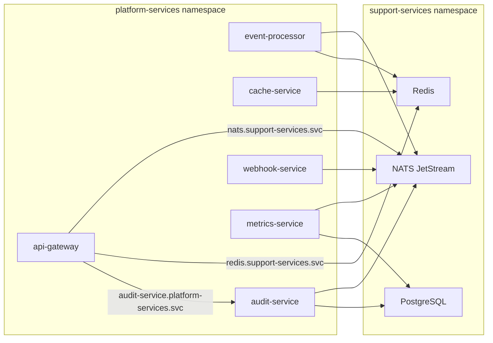

# Namespace Migration: yoizen-arch -> platform-services + support-services

## Current State

Everything lives in a single `yoizen-arch` namespace. After migration:

- `**platform-services**`: api-gateway, event-processor, cache-service, audit-service, webhook-service, metrics-service
- `**support-services**`: NATS, Redis, PostgreSQL




---

## 1. Replace namespace definition

**File**: [infrastructure/base/namespace.yaml](infrastructure/base/namespace.yaml)

Replace the single `yoizen-arch` Namespace with two Namespace documents:

```yaml
apiVersion: v1
kind: Namespace
metadata:
  name: support-services
  labels:
    app.kubernetes.io/part-of: yoizen-arch
---
apiVersion: v1
kind: Namespace
metadata:
  name: platform-services
  labels:
    app.kubernetes.io/part-of: yoizen-arch
```

Both namespaces are created by the infrastructure kustomization (applied first via `bootstrap.sh`).

---

## 2. Update all infrastructure resources to `support-services`

Change `namespace: yoizen-arch` to `namespace: support-services` in every file under `infrastructure/`:

- [infrastructure/base/nats/configmap.yaml](infrastructure/base/nats/configmap.yaml)
- [infrastructure/base/nats/statefulset.yaml](infrastructure/base/nats/statefulset.yaml)
- [infrastructure/base/nats/service.yaml](infrastructure/base/nats/service.yaml) (2 occurrences)
- [infrastructure/base/redis/configmap.yaml](infrastructure/base/redis/configmap.yaml)
- [infrastructure/base/redis/deployment.yaml](infrastructure/base/redis/deployment.yaml)
- [infrastructure/base/redis/service.yaml](infrastructure/base/redis/service.yaml)
- [infrastructure/base/postgres/configmap.yaml](infrastructure/base/postgres/configmap.yaml)
- [infrastructure/base/postgres/statefulset.yaml](infrastructure/base/postgres/statefulset.yaml)
- [infrastructure/base/postgres/service.yaml](infrastructure/base/postgres/service.yaml) (2 occurrences)
- [infrastructure/base/postgres/secret.yaml](infrastructure/base/postgres/secret.yaml)
- [infrastructure/overlays/local/patches/nats-resources.yaml](infrastructure/overlays/local/patches/nats-resources.yaml)
- [infrastructure/overlays/local/patches/redis-resources.yaml](infrastructure/overlays/local/patches/redis-resources.yaml)
- [infrastructure/overlays/local/patches/postgres-resources.yaml](infrastructure/overlays/local/patches/postgres-resources.yaml)

---

## 3. Update all Knative services to `platform-services`

For each file in `knative/services/`:

**a) Change namespace in metadata** from `yoizen-arch` to `platform-services`:

- [knative/services/api-gateway.yaml](knative/services/api-gateway.yaml)
- [knative/services/event-processor.yaml](knative/services/event-processor.yaml)
- [knative/services/cache-service.yaml](knative/services/cache-service.yaml)
- [knative/services/audit-service.yaml](knative/services/audit-service.yaml)
- [knative/services/webhook-service.yaml](knative/services/webhook-service.yaml)
- [knative/services/metrics-service.yaml](knative/services/metrics-service.yaml)

**b) Update cross-namespace DNS env vars** -- infrastructure now in `support-services`:

- `NATS_URL`: `nats://nats.support-services.svc.cluster.local:4222`
- `REDIS_HOST`: `redis.support-services.svc.cluster.local`
- `POSTGRES_HOST`: `postgres.support-services.svc.cluster.local`

**c) Update service-to-service reference** in api-gateway:

- `AUDIT_SERVICE_URL`: `http://audit-service.platform-services.svc.cluster.local`

---

## 4. Duplicate Postgres Secret into `platform-services`

`audit-service` and `metrics-service` reference `postgres-credentials` via `secretKeyRef`. Since secrets are namespace-scoped, create a copy.

**New file**: `knative/services/postgres-credentials.yaml`

```yaml
apiVersion: v1
kind: Secret
metadata:
  name: postgres-credentials
  namespace: platform-services
  labels:
    app.kubernetes.io/name: postgres
    app.kubernetes.io/component: database
type: Opaque
stringData:
  POSTGRES_DB: yoizen
  POSTGRES_USER: yoizen
  POSTGRES_PASSWORD: yoizen-dev-password
```

Add this resource to [knative/services/kustomization.yaml](knative/services/kustomization.yaml):

```yaml
resources:
  - postgres-credentials.yaml
  - api-gateway.yaml
  # ... etc
```

---

## 5. Update `bootstrap.sh`

**File**: [bootstrap.sh](bootstrap.sh)

- Replace `NAMESPACE="yoizen-arch"` with two variables:

```bash
  NAMESPACE_PLATFORM="platform-services"
  NAMESPACE_SUPPORT="support-services"
  

```

- In `apply_infrastructure()`: change `kubectl rollout status` `--namespace` to `$NAMESPACE_SUPPORT`
- In `print_summary()`: update printed namespace info and `kubectl` example commands to reference both namespaces

---

## 6. Update README.md

Update any `yoizen-arch` namespace references in [README.md](README.md) to reflect the new two-namespace layout.