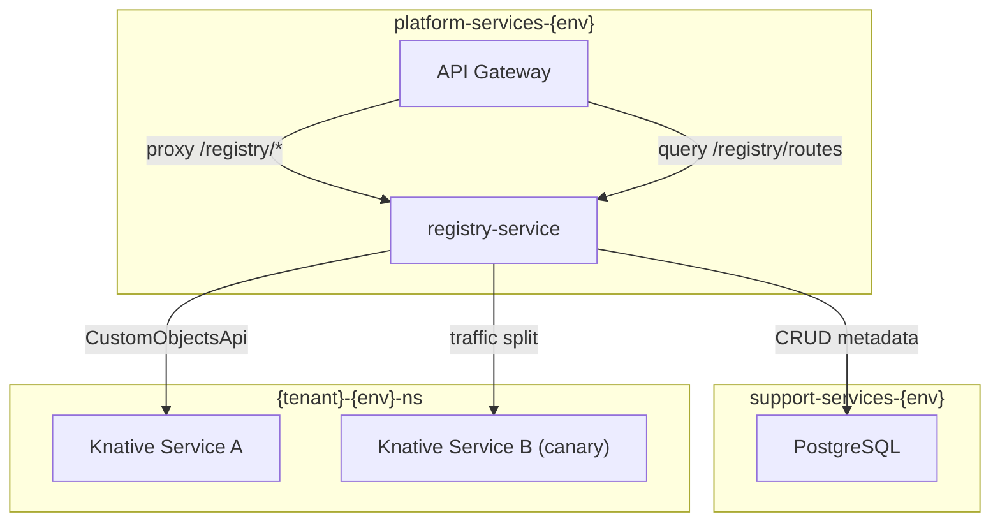

# Registry Service Implementation Plan

## Architecture

The `registry-service` is a platform-level service deployed in `platform-services-{env}` that manages tenant-level Knative Service CRDs. It uses the Kubernetes CustomObjectsApi to create, update, and delete Knative Services in tenant namespaces (`{tenant}-{env}-ns`), and stores registry metadata in the platform PostgreSQL.

## Database Schema (Platform PostgreSQL)

Three tables added to `infrastructure/base/postgres/configmap.yaml` init.sql:

- **registered_services** - Service definitions (tenant_id, name, image, port, scaling config, env_vars, status, knative_name, namespace)
- **service_routes** - Gateway route mappings (service_id, path_prefix, methods, is_public, strip_prefix)
- **canary_deployments** - Active canary state (service_id, stable_revision, canary_revision, canary_percent, status)

The service also runs `ensureSchema()` at startup for resilience.

## REST API

### Services (`/services`)

| Method | Path                      | Description                                                  |
| ------ | ------------------------- | ------------------------------------------------------------ |
| POST   | `/services`               | Register + deploy a new tenant Knative Service               |
| GET    | `/services`               | List registered services for the tenant                      |
| GET    | `/services/:id`           | Get service detail (includes live Knative status, revisions) |
| PATCH  | `/services/:id`           | Update config (image, scaling, env_vars) and redeploy        |
| DELETE | `/services/:id`           | Delete Knative Service + DB records                          |
| GET    | `/services/:id/revisions` | List Knative revisions for the service                       |

### Canary (`/services/:id/canary`)

| Method | Path                            | Description                                          |
| ------ | ------------------------------- | ---------------------------------------------------- |
| POST   | `/services/:id/canary`          | Start canary: deploy new revision at given traffic % |
| PATCH  | `/services/:id/canary`          | Adjust canary traffic percentage                     |
| POST   | `/services/:id/canary/promote`  | Promote canary to 100% stable                        |
| POST   | `/services/:id/canary/rollback` | Rollback: send 100% to stable revision               |
| GET    | `/services/:id/canary`          | Get current canary status                            |

### Routes (`/services/:id/routes` + `/routes`)

| Method | Path                            | Description                                                     |
| ------ | ------------------------------- | --------------------------------------------------------------- |
| POST   | `/services/:id/routes`          | Register a gateway route for the service                        |
| GET    | `/services/:id/routes`          | List routes for a service                                       |
| DELETE | `/services/:id/routes/:routeId` | Remove a route                                                  |
| GET    | `/routes`                       | Discovery endpoint: all active routes (for gateway consumption) |

## Knative Integration

Uses `@kubernetes/client-node` CustomObjectsApi to manage CRDs:

- **Group**: `serving.knative.dev`, **Version**: `v1`, **Plural**: `services`
- Knative Services are created in tenant namespaces (`{tenant}-{env}-ns`)
- Canary uses `spec.traffic` with `tag: "stable"` and `tag: "canary"` + `percent` fields
- Revisions are queried via the `revisions` plural on the same API group

## Files to Create

### Service Source ([services/registry-service/](services/registry-service/))

Following the exact patterns from [services/tenant-service/](services/tenant-service/):

- `package.json` - deps: `@kubernetes/client-node`, `@nestjs/`*, `@yoizen/shared`, `postgres`, `class-validator`, `class-transformer`, `reflect-metadata`, `rxjs`
- `tsconfig.json` - identical to tenant-service
- `Dockerfile` - multi-stage Bun build with `packages/shared` copy
- `src/main.ts` - Fastify adapter + ValidationPipe
- `src/app.module.ts` - imports KubernetesModule, PostgresModule, ServicesModule, CanaryModule, RoutesModule, HealthModule
- `src/providers/kubernetes.provider.ts` - `K8S_CORE_API` (CoreV1Api) + `K8S_CUSTOM_OBJECTS_API` (CustomObjectsApi), @Global
- `src/providers/postgres.provider.ts` - `POSTGRES_SQL` using `postgres` package, @Global, `ensureSchema()` with CREATE TABLE IF NOT EXISTS
- `src/modules/services/` - controller, service, dto, module for registration and deployment
- `src/modules/canary/` - controller, service, dto, module for canary management
- `src/modules/routes/` - controller, service, dto, module for route management
- `src/modules/health/` - health controller (checks K8s + PostgreSQL connectivity)

### Knative Deployment

- [knative/services/base/registry-service.yaml](knative/services/base/registry-service.yaml) - Knative Service (image `dev.local/registry-service:local`, min 1, max 3, concurrency 50, serviceAccountName `registry-service`, port 3000)
- [knative/services/base/registry-service-sa.yaml](knative/services/base/registry-service-sa.yaml) - ServiceAccount

### Files to Modify

- [knative/services/base/kustomization.yaml](knative/services/base/kustomization.yaml) - add `registry-service.yaml` and `registry-service-sa.yaml`
- [knative/services/rbac/cluster-role.yaml](knative/services/rbac/cluster-role.yaml) - add `registry-service-manager` ClusterRole with permissions for: `serving.knative.dev` services/revisions (CRUD), core namespaces (get/list), core services (get/list)
- [knative/services/rbac/cluster-role-bindings.yaml](knative/services/rbac/cluster-role-bindings.yaml) - add 4 ClusterRoleBindings (dev/qa/staging/production)
- [knative/services/overlays/local/dev/env-patches.yaml](knative/services/overlays/local/dev/env-patches.yaml) - add registry-service env patch (POSTGRES_HOST, POSTGRES_USER, POSTGRES_PASSWORD, POSTGRES_DB, POSTGRES_PORT, PLATFORM_ENVIRONMENT, NODE_EXTRA_CA_CERTS, TENANT_SERVICE_URL)
- Same for qa, staging, production env-patches
- [infrastructure/base/postgres/configmap.yaml](infrastructure/base/postgres/configmap.yaml) - add `registered_services`, `service_routes`, `canary_deployments` tables to init.sql
- [bootstrap.sh](bootstrap.sh) - add `registry-service` to the image build loop (line 227)
- [services/api-gateway/src/app.module.ts](services/api-gateway/src/app.module.ts) - import RegistryModule
- [services/api-gateway/src/modules/health/health.controller.ts](services/api-gateway/src/modules/health/health.controller.ts) - add registry-service to SERVICE_URLS Map

### API Gateway Proxy (new files)

- `services/api-gateway/src/modules/registry/registry.module.ts`
- `services/api-gateway/src/modules/registry/registry.controller.ts` - proxy routes: `POST/GET /registry/services`, `GET/PATCH/DELETE /registry/services/:id`, `GET /registry/services/:id/revisions`, canary routes under `/registry/services/:id/canary/`*, route management under `/registry/services/:id/routes` + `GET /registry/routes`
- `services/api-gateway/src/modules/registry/registry-proxy.service.ts` - HTTP fetch proxy to registry-service (follows [services/api-gateway/src/modules/tenants/tenant-proxy.service.ts](services/api-gateway/src/modules/tenants/tenant-proxy.service.ts) pattern)

### Shared Package

- [packages/shared/src/constants.ts](packages/shared/src/constants.ts) - add `REGISTRY_KNATIVE_GROUP`, `REGISTRY_KNATIVE_VERSION`, `REGISTRY_KNATIVE_PLURAL` constants
- [packages/shared/src/index.ts](packages/shared/src/index.ts) - re-export new constants

## Key Implementation Details

- **Knative Service naming**: `{serviceName}-{tenantId}` to avoid collisions across tenants
- **Namespace resolution**: Uses `{tenantId}-{env}-ns` pattern (same as tenant-service)
- **Canary tags**: Knative `spec.traffic[].tag` creates tagged URLs (`canary-{name}.{ns}.{domain}`, `stable-{name}.{ns}.{domain}`)
- **Route discovery**: `GET /routes` returns all active routes grouped by tenant, used by API gateway for dynamic routing
- **PostgreSQL**: Uses `postgres` (postgres.js) package connected to platform PostgreSQL in `support-services-{env}`
- **Security**: Non-root container (1001:1001), drop all capabilities, seccomp RuntimeDefault
- **Performance**: `Map`-based caching for frequently queried routes, indexed DB queries on tenant_id

