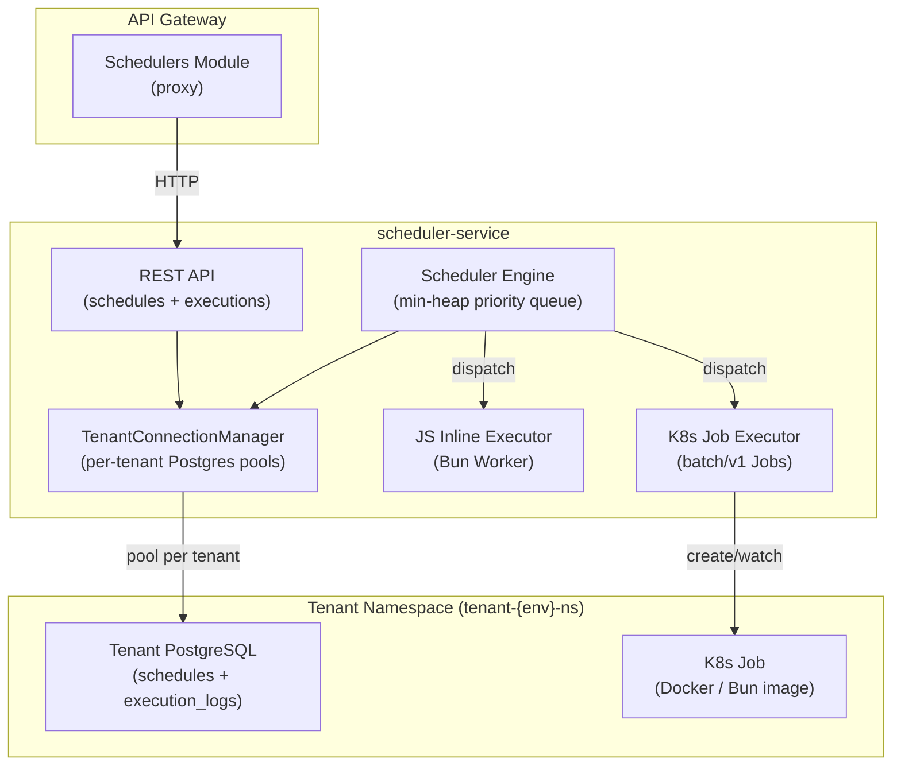

# Scheduler Service

## Architecture Overview




## Data Model (per-tenant PostgreSQL)

`**schedules` table** -- stores schedule definitions:

```sql
CREATE TABLE schedules (
  id           UUID PRIMARY KEY DEFAULT gen_random_uuid(),
  name         TEXT NOT NULL,
  description  TEXT DEFAULT '',
  type         TEXT NOT NULL CHECK (type IN ('cron', 'interval', 'one-time')),
  expression   TEXT NOT NULL,
  exec_mode    TEXT NOT NULL CHECK (exec_mode IN ('js-inline', 'js-k8s', 'docker')),
  config       JSONB NOT NULL DEFAULT '{}',
  enabled      BOOLEAN NOT NULL DEFAULT true,
  next_run_at  TIMESTAMPTZ,
  last_run_at  TIMESTAMPTZ,
  created_at   TIMESTAMPTZ NOT NULL DEFAULT NOW(),
  updated_at   TIMESTAMPTZ NOT NULL DEFAULT NOW()
);
```

- `type`: `cron` (cron expression), `interval` (ms), `one-time` (ISO timestamp)
- `exec_mode`: `js-inline` (in-process worker), `js-k8s` (K8s Job with Bun image), `docker` (K8s Job with provided image)
- `config` JSONB holds: `{ script?, image?, env?, timeout?, resources? }`

`**execution_logs` table** -- stores execution results:

```sql
CREATE TABLE execution_logs (
  id           UUID PRIMARY KEY DEFAULT gen_random_uuid(),
  schedule_id  UUID NOT NULL REFERENCES schedules(id) ON DELETE CASCADE,
  status       TEXT NOT NULL CHECK (status IN ('pending','running','completed','failed','timeout')),
  started_at   TIMESTAMPTZ NOT NULL DEFAULT NOW(),
  completed_at TIMESTAMPTZ,
  duration_ms  INTEGER,
  output       TEXT DEFAULT '',
  error        TEXT DEFAULT '',
  metadata     JSONB NOT NULL DEFAULT '{}',
  created_at   TIMESTAMPTZ NOT NULL DEFAULT NOW()
);
```

Indexes on `schedule_id`, `status`, and `created_at DESC` for fast log queries.

## Service Structure

```
services/scheduler-service/
  src/
    main.ts
    app.module.ts
    providers/
      tenant-connection-manager.ts   -- Map-based pool cache (same pattern as audit-service)
      kubernetes.provider.ts         -- BatchV1Api + CoreV1Api injection
    modules/
      health/
        health.module.ts
        health.controller.ts
      schedules/
        schedules.module.ts
        schedules.controller.ts      -- CRUD + manual trigger
        schedules.service.ts         -- business logic + table init
        schedule.dto.ts              -- CreateScheduleDto, UpdateScheduleDto
      executions/
        executions.module.ts
        executions.controller.ts     -- query logs
        executions.service.ts
    engine/
      engine.module.ts
      engine.service.ts              -- timer loop + priority queue dispatch
      schedule-queue.ts              -- min-heap keyed by next_run_at (O(log n) insert/pop)
    executors/
      executors.module.ts
      executor.interface.ts
      js-inline.executor.ts          -- Bun Worker with timeout + stdout capture
      k8s-job.executor.ts            -- creates K8s Job, watches completion, fetches pod logs
  package.json
  tsconfig.json
  Dockerfile
```

## REST API Endpoints

**Schedules** (prefix: `/schedules`):

- `POST /schedules` -- create a schedule (tenant from `x-yoizen-tenant` header)
- `GET /schedules` -- list tenant schedules (with `?enabled=`, `?type=` filters, pagination)
- `GET /schedules/:id` -- get schedule detail
- `PATCH /schedules/:id` -- update schedule (recalculates `next_run_at`)
- `DELETE /schedules/:id` -- delete schedule + cascaded logs
- `POST /schedules/:id/trigger` -- manually trigger an immediate execution

**Executions** (prefix: `/executions`):

- `GET /schedules/:id/executions` -- list executions for a specific schedule (pagination)
- `GET /executions` -- list all executions for the tenant (pagination, `?status=` filter)
- `GET /executions/:id` -- get execution detail with full output/logs

## Scheduler Engine Design

The engine uses a **min-heap priority queue** keyed by `next_run_at` for O(log n) schedule dispatch instead of polling all tenants on every tick:

1. **Startup**: calls tenant-service (`GET /tenants`) to discover all tenants, then queries each tenant's `schedules` table for enabled schedules, populating the heap.
2. **Tick loop** (every 5s via `setInterval`): pops all items from the heap where `next_run_at <= now`, dispatches them to the appropriate executor.
3. **After execution**: computes the next `next_run_at` (cron-next, now+interval, or disables one-time) and re-inserts into the heap.
4. **API mutations**: when a schedule is created/updated/deleted via the REST API, the engine's in-memory heap is updated immediately.
5. **Concurrency**: uses `SELECT ... FOR UPDATE SKIP LOCKED` when claiming a schedule, so multiple replicas don't double-execute.

## Executors

**JS Inline Executor** (`js-inline`):

- Spawns a Bun `Worker` with the tenant's script
- Enforces a configurable timeout (default 30s)
- Captures stdout/stderr via message passing
- Returns output + exit status to the execution log

**K8s Job Executor** (`js-k8s` and `docker`):

- For `js-k8s`: creates a ConfigMap with the script, then a Job using `oven/bun:1.3-alpine` that mounts and runs it
- For `docker`: creates a Job using the tenant-provided image URI directly
- Jobs run in the tenant's namespace (`{tenantId}-{env}-ns`)
- Watches Job status via K8s API (poll or watch)
- On completion/failure, fetches pod logs via `CoreV1Api.readNamespacedPodLog`
- Cleans up ConfigMap + Job after log collection
- Enforces `activeDeadlineSeconds` for timeout

## Kubernetes / Knative Changes

**New files**:

- [knative/services/base/scheduler-service.yaml](knative/services/base/scheduler-service.yaml) -- Knative Service definition (same pattern as audit-service, with `PLATFORM_ENVIRONMENT`, `POSTGRES_USER`, `POSTGRES_PASSWORD`, `TENANT_SERVICE_URL`, `NODE_EXTRA_CA_CERTS`)
- [knative/services/base/scheduler-service-sa.yaml](knative/services/base/scheduler-service-sa.yaml) -- ServiceAccount

**Modified files**:

- [knative/services/base/kustomization.yaml](knative/services/base/kustomization.yaml) -- add scheduler-service.yaml + scheduler-service-sa.yaml
- [knative/services/rbac/cluster-role.yaml](knative/services/rbac/cluster-role.yaml) -- add `scheduler-job-manager` ClusterRole with: `batch/jobs` (create, get, list, delete, watch), `core/pods` (get, list), `core/pods/log` (get), `core/configmaps` (create, get, delete)
- [knative/services/rbac/cluster-role-bindings.yaml](knative/services/rbac/cluster-role-bindings.yaml) -- add bindings for `scheduler-service` SA per environment
- All 4 `env-patches.yaml` files -- add `SCHEDULER_SERVICE_URL` to the api-gateway patch

## API Gateway Integration

Add a new proxy module in [services/api-gateway/src/modules/](services/api-gateway/src/modules/):

- `schedulers/schedulers.module.ts`
- `schedulers/schedulers.controller.ts` -- forwards `x-yoizen-tenant` header, proxies all `/schedulers/`** routes to `SCHEDULER_SERVICE_URL`

Update [services/api-gateway/src/app.module.ts](services/api-gateway/src/app.module.ts) to import `SchedulersModule`.

## Dependencies

`package.json` for scheduler-service:

- `@nestjs/common`, `@nestjs/core`, `@nestjs/platform-fastify` (^11)
- `@kubernetes/client-node` (K8s Jobs API)
- `@yoizen/shared` (file:../../packages/shared)
- `postgres` (^3.4.5)
- `class-validator`, `class-transformer`
- `cron-parser` (for computing next cron run)
- `reflect-metadata`, `rxjs`

