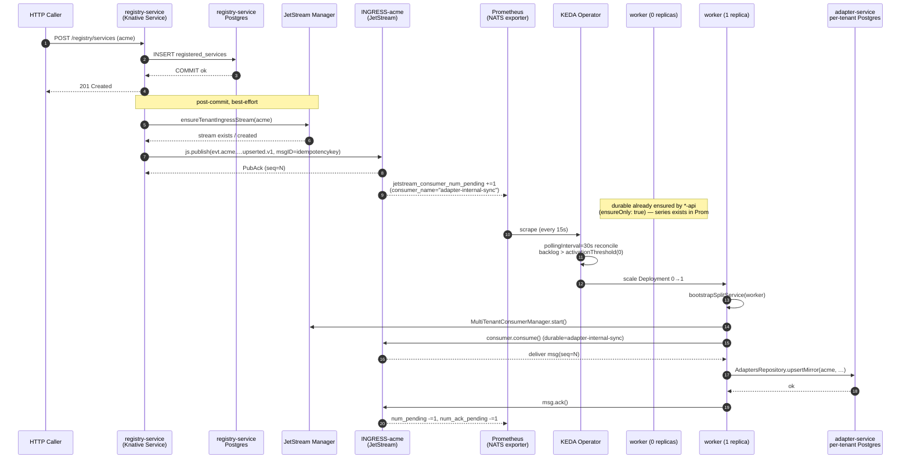
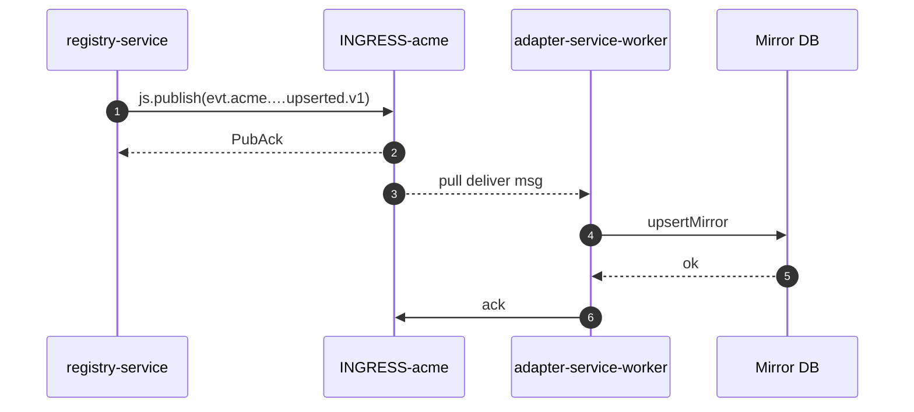
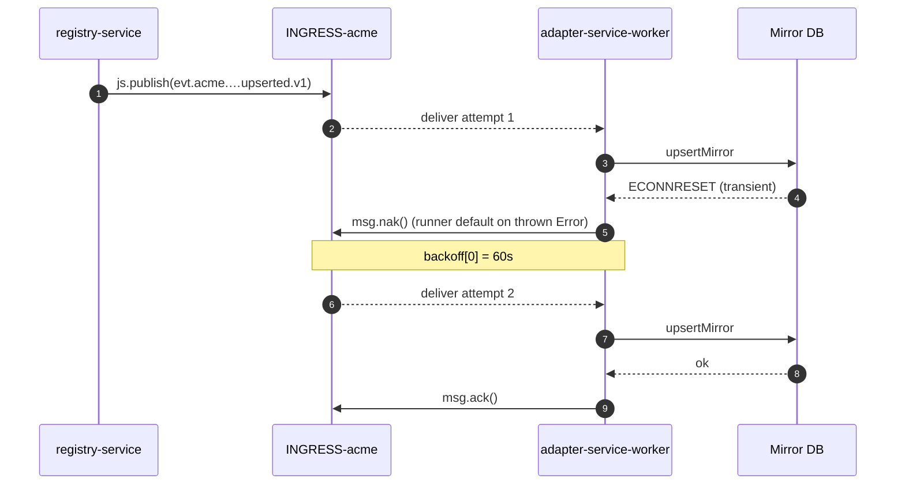
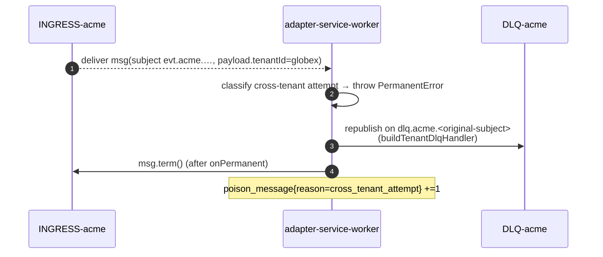

# Design: Make adapter-service internal-sync durable and scale-to-zero–safe

## Technical Approach

Replace the Core-NATS hop between `registry-service` and `adapter-service`
with a JetStream pull-consumer pipeline that reuses the canonical
multi-tenant primitives already shipped in this monorepo:

1. **Publisher** — `registry-service` switches `service.{upserted,deleted}.v1`
   emission from Core `nc.publish` to JetStream `js.publish`, after
   ensuring the per-tenant `INGRESS-<TENANT>` stream exists. Publish runs
   as a post-commit side-effect of the originating HTTP request (best-effort
   relative to the API). Implements `REQ-RSE-001`/`-002`/`-003`/`-004`/`-005`.
2. **Consumer** — `adapter-service` swaps the Core `nc.subscribe` queue
   group for a `MultiTenantConsumerManager` that binds a durable named
   `adapter-internal-sync` on every `INGRESS-<TENANT>` stream, with
   subject filter `evt.<tenant>.registry-service.platform.service.system.*.v1`.
   The handler keeps the existing `handleUpserted` / `handleDeleted` paths
   verbatim — `AdaptersRepository.upsertMirror` and
   `deleteMirrorByServiceName` are already idempotent, so at-least-once
   semantics are safe (`REQ-ASIS-001`/`-002`/`-003`/`-005`/`-006`).
3. **Topology** — `adapter-service` is split into `adapter-service-api`
   (Knative Service, HTTP CRUD) and `adapter-service-worker` (`apps/v1.Deployment`
   running consumers). Both share the same image; role is selected at boot
   via `SERVICE_MODE` (`REQ-AST-001` … `REQ-AST-007`). This is mandatory
   because **KEDA cannot scale Knative Services** (no `/scale` subresource —
   `infrastructure/base/keda/README.md:67-93`).
4. **Autoscaling** — a single KEDA `ScaledObject` targets the worker
   Deployment, with a Prometheus trigger summing
   `jetstream_consumer_num_pending + num_ack_pending{consumer_name="adapter-internal-sync"}`
   across tenants — exactly the pattern used by `event-processor-worker`
   and `audit-service-worker`. The `*-api` pods run the manager in
   `ensureOnly: true` mode so the metric series exists on every tenant
   stream even when the worker is at 0 replicas, breaking the
   chicken-and-egg cold-start (`REQ-ASA-001`/`-002`/`-003`/`-004`/`-005`/`-006`,
   `NFR-ASA-001`).

This composes three primitives that already exist and are exercised in
seven other services (audit, event-processor, channel, webhook, workflow,
metrics, usage-aggregator). No new infrastructure, no new subject
namespace, no new operational primitive.

## Architecture Decisions

### Decision: Per-tenant durables on `INGRESS-<TENANT>`, not an aggregate stream

**Choice**: Bind one durable consumer named `adapter-internal-sync` per
tenant on each existing `INGRESS-<TENANT>` stream (subjects
`evt.<tenant>.>`), filtered to
`evt.<tenant>.registry-service.platform.service.system.*.v1`.

**Alternatives considered**:
- **A** — A new aggregate stream `INGRESS-REGISTRY` with subjects
  `evt.*.registry-service.platform.service.system.*.v1` (single durable,
  single ScaledObject).
- **C/D** — JetStream `sources` to mirror registry events from each
  tenant stream into a derived aggregate.

**Rationale**: JetStream rejects subjects-overlap across streams
(`nats-server#2144`, `#7120`). `INGRESS-<TENANT>` already filters
`evt.<tenant>.>`, so a hypothetical aggregate filtering
`evt.*.registry-service.platform.service.system.*.v1` would overlap on
every tenant — `streams.add` returns error `10065`. `sources`-based
designs (C/D) avoid the overlap but require reconciliation on every
tenant onboarding (a moving target) and add an eventual-consistency lag
dimension the platform does not have for `evt.*` today. Per-tenant
durables match the canonical pattern used by `workflow-triggers`,
`channel-egress`, `audit-events`, etc., and are the only option that
does not touch the canonical 8-token subject contract. Implements
`REQ-ASIS-001`.

### Decision: `DeliverPolicy.New` on first deploy, manual one-shot backfill

**Choice**: The first time the durable is created on each tenant stream
the platform's default `DeliverPolicy.All` would replay every retained
message matching the subject filter. We mitigate by **(a)** running
`backfill-internal-mirrors.ts` once before flipping the publisher flag,
and **(b)** relying on the narrow filter
(`registry-service.platform.service.system.*`) so historical volume on
that filter is tiny — typically one message per `service.upsert` per
tenant.

**Alternatives considered**:
- Patch the durable defaults (`packages/database/src/nats-durable-consumer.ts:174`)
  to `DeliverPolicy.New` only for this durable name.
- Use `OptStartSeq` keyed off "now" at create time.

**Rationale**: Keeping the platform default (`DeliverPolicy.All`) means
the same code path runs for every multi-tenant durable; the
backfill-then-flip rollout (`REQ-RSE-004` flag) makes the replay-volume
question moot in practice. If we ever encounter a tenant with thousands
of historical registry events, we can introduce `deliverPolicy` as an
optional `IDurableConsumerOptions` field without breaking other
consumers. Documented as a migration interlock (see
**Migration / Rollout** below).

### Decision: Knative `*-api` + plain Deployment `*-worker` split

**Choice**: Ship two manifests fed from the same image:
`adapter-service-api` (`serving.knative.dev/v1.Service`) for HTTP CRUD,
`adapter-service-worker` (`apps/v1.Deployment`) for the durable
consumer. Role selection via `SERVICE_MODE` env var
(`packages/observability/src/runtime-mode.ts:29-44`).

**Alternatives considered**:
- Keep the single Knative Service and put the consumer behind it (status quo).
- Plain Deployment for both api and worker.

**Rationale**: KEDA targets HPA via the workload's `/scale` subresource,
which `serving.knative.dev/v1.Service` does NOT expose
(`infrastructure/base/keda/README.md:67-93`). Without KEDA, scale-to-zero
plus consumer-driven activation is impossible — Knative KPA can only
scale on HTTP concurrency / RPS. The split is the canonical solution
already used by `audit-service`, `event-processor`, `channel-service`,
`webhook-service`, `workflow-service`, `metrics-service`, and
`usage-aggregator`. Reuses `bootstrapSplitService` from
`@yoizen/observability` (`packages/observability/src/bootstrap-split-service.ts:39-70`).
Implements `REQ-AST-001`/`-002`/`-006`, `NFR-AST-001`.

### Decision: `ensureOnly: true` on `*-api`, `ensureOnly: false` on `*-worker`

**Choice**: The api process runs the `MultiTenantConsumerManager` in
`ensureOnly` mode (creates / reconciles durables on every tenant stream
but never spawns a runner), while the worker process runs it in normal
mode (creates AND consumes). Both processes call `onModuleInit` on the
same `InternalSyncService`; the mode is selected by `!isWorkerMode()`.

**Alternatives considered**:
- Only the worker ensures the durables. KEDA fails to scale up from 0
  because `jetstream_consumer_num_pending{consumer_name="adapter-internal-sync"}`
  has no series yet (no consumer has ever been bound).
- A periodic out-of-band Job to ensure durables. Operationally heavier;
  no tenant-onboarding reactivity.

**Rationale**: The `ensureOnly` flag in
`packages/database/src/multi-tenant-consumer-manager.ts:82-96, 240-256`
exists precisely for this cold-start chicken-and-egg: when the worker
is at 0 replicas, the JetStream consumer must already exist on each
tenant stream for Prometheus to expose `num_pending`/`num_ack_pending`
series — KEDA polls those metrics and only then scales 0→1. Because
`*-api` already runs (KPA keeps it warm under any HTTP traffic), it is
the natural "always-on enough" surface to register the durables.
Pattern proven by every other split service. Implements
`REQ-ASA-003` cold-start scenario, `REQ-ASIS-005` reconciliation.

### Decision: Publisher uses `js.publish` + `ensureTenantIngressStream` post-commit

**Choice**: In `service-events.publisher.ts`, replace `conn.publish` +
`conn.flush()` with `js.publish(subject, bytes, { headers, msgID })`,
called **after** the registry DB commit returns (`servicesService.register/update/remove`).
The publisher first calls `ensureTenantIngressStream(jsm, tenantId)`
(idempotent, cached per pod). Errors are logged + retried with bounded
backoff but **never** fail the HTTP response.

**Alternatives considered**:
- Pre-commit publish (transactional outbox-style). Higher complexity; no
  outbox infrastructure today. Not justified for this change.
- `conn.publish` to a JetStream-aware stream. Works only if the stream
  already exists — does not address the "first publish ever for this
  tenant" gap that `INGRESS-<tenant>` lazy-create fixes.

**Rationale**: Post-commit + best-effort matches the existing API
contract (HTTP 2xx already returns before we ever touched NATS in the
old Core-publish code). `js.publish` returns a `PubAck` with the stream
sequence — that is what enables zero-loss claims in `NFR-XC-001`. The
`Nats-Msg-Id` header (already set to `idempotencykey`) is also passed as
the publish-options `msgID` so JetStream-side dedup window absorbs
duplicate publish attempts. Promotes `ensureTenantIngressStream` to
`@yoizen/database` (Open Question #2 below). Implements `REQ-RSE-001`,
`REQ-RSE-002`, `REQ-RSE-003`, `NFR-RSE-002`.

### Decision: Subject filter is the per-tenant narrow form

**Choice**: Each per-tenant durable sets `filterSubject` =
`evt.<tenant>.registry-service.platform.service.system.*.v1`.

**Alternatives considered**:
- Cross-tenant wildcard
  `evt.*.registry-service.platform.service.system.*.v1` (the old Core
  pattern). On a per-tenant stream this matches the same set of
  messages, but the cross-tenant filter is misleading at read-time
  (engineers think it shards across tenants, when in fact each durable
  is bound to only one stream).

**Rationale**: A literal per-tenant filter makes the intent self-documenting
and matches the canonical envelope subject. `MultiTenantConsumerManager`
exposes `filterSubject`/`filterSubjects` at the per-stream level —
since the manager already knows the stream's tenant, we substitute the
tenant id when binding (one filter string per durable, computed at
ensure-time). For symmetry with the rest of the platform we could
alternatively keep the cross-tenant wildcard and rely on stream-level
isolation (the durable can only see messages persisted in its own
stream), which is what `workflow-triggers` does today. **Final choice**:
follow the workflow-triggers pattern for code reuse — pass the
cross-tenant wildcard `evt.*.registry-service.platform.service.system.*.v1`
to `MultiTenantConsumerManager.config.filterSubject`. The stream itself
provides tenant isolation; payload-tenant must still be cross-checked
in the handler (REQ-ASIS-006 cross-tenant leakage scenario). Implements
`REQ-ASIS-001`.

### Decision: Ack policy = explicit, max_deliver = 5, ack_wait = 60s, backoff = [60s, 120s, 300s, 600s]

**Choice**: Reuse the platform defaults baked into
`packages/database/src/nats-durable-consumer.ts:12-48`:

- `AckPolicy.Explicit` (required for at-least-once)
- `DeliverPolicy.All` (filter narrow → safe; see migration interlock)
- `ReplayPolicy.Instant`
- `max_deliver = 5`
- `max_ack_pending = 1000`
- `ack_wait = 60_000ms`
- `backoff = [60_000, 120_000, 300_000, 600_000]ms`

Per-message disposition:
- success → `msg.ack()` (handler resolves)
- transient (DB connection reset, broker timeout, network blip) →
  `msg.nak()` (runner default on thrown `Error`)
- poison (parse error, unknown CloudEvents type, payload-tenant ≠
  subject-tenant, permanent DB constraint) → throw `PermanentError` →
  runner calls optional `onPermanent` hook then `msg.term()`

**Alternatives considered**:
- Tighter `max_deliver=3` and shorter backoff. Saves ~16 minutes worst-case
  retry envelope but risks terming on minor blips during rolling restarts.
- Custom backoff that anchors at sub-second. Documented anti-pattern in
  `nats-durable-consumer.ts:21-29` (caused silent duplicate Telegram
  replies in a previous incident).

**Rationale**: Mirror the platform defaults so this durable inherits
exactly the same operational SLO and runbook as the other six durables
on the same primitive. If we want to tighten later, it's a single
options field on `IMultiTenantConsumerConfig`. The first backoff value
matches `ack_wait` per the documented invariant
(`nats-durable-consumer.ts:31-42`). Implements `REQ-ASIS-003`,
`NFR-ASIS-002`.

### Decision: Use `MultiTenantConsumerManager` (not a hand-rolled loop)

**Choice**: Wire the consumer through `new MultiTenantConsumerManager(jsm,
js, config, handler, logger)` and let it own the tenant set, the
reconcile interval, and the per-tenant `NatsConsumerRunner`.

**Alternatives considered**:
- One-off code in `internal-sync.service.ts` (current shape, but
  ported to JetStream).
- Inject a `TenantRegistry` and iterate manually.

**Rationale**: Reusing the manager gets us tenant-onboarding reactivity
(every 5s reconcile picks up new `INGRESS-<TENANT>` streams without a
restart — `multi-tenant-consumer-manager.ts:109, 226-256`), per-tenant
DLQ routing (`DLQ-<tenant>` with `dlq.<tenant>.<original-subject>`),
metrics labelling consistent with the rest of the platform
(`createNatsConsumerMetrics(durableName)`), graceful shutdown drain
semantics, and zero net-new code paths to maintain. Implements
`REQ-ASIS-005`.

### Decision: Worker `/readyz` gates on NATS + DB + ≥1 healthy durable; api `/readyz` does NOT

**Choice**: `adapter-service-worker` exposes `/readyz` (port 3000 via
`startWorkerHealthServer` from `bootstrap-worker.ts`) returning 200 only
when **all** of the following are true:
1. `JetStreamManager` is connected (broker reachable + authenticated);
2. At least one tenant durable bound to the manager reports
   `runner.isHealthy()` per
   `packages/database/src/nats-consumer-runner.ts:289-310`;
3. The shared `AdapterTenantConnectionManager` reports the mirror DB
   reachable (use `getNatsTenantPostgresHealthStatus` for at least one
   active tenant pool).

`adapter-service-api` `/readyz` mirrors the existing contract: process
healthy + DB reachable, **no** dependency on NATS or on durables being
bound.

**Alternatives considered**:
- Worker `/readyz` returning 200 as soon as the process boots
  (current `bootstrap-worker.ts:53-61` default). Lets KEDA route
  pulls before the manager finishes ensuring durables — risk window
  on cold start.
- API `/readyz` shares the worker gate. Forces the api to fail
  readiness during NATS outages — regresses tenants' ability to do
  HTTP CRUD.

**Rationale**: Implements `REQ-AST-003`, `REQ-AST-004`, `REQ-AST-005`.
The worker liveness probe (`/healthz`) stays loose (process up,
`startWorkerHealthServer` always returns 200) so transient broker
outages do not trigger pod restarts (`REQ-AST-003` liveness scenario).
The api gate must NOT depend on NATS health because the api workload
must keep serving CRUD even when the broker is down (`REQ-AST-005`,
`REQ-AT-007`).

### Decision: Feature flag `REGISTRY_EMIT_ADAPTER_SYNC` keeps publisher silent until worker is ready

**Choice**: Reuse the existing flag in
`services/registry-service/src/config.ts:13, 28` (env var
`REGISTRY_EMIT_ADAPTER_SYNC`). Default `false`. When `false` the
publisher is a strict no-op — it does NOT call `ensureTenantIngressStream`,
does NOT call `js.publish`, does NOT touch the broker.

**Alternatives considered**:
- Always emit; coordinate via deploy ordering only.
- Per-tenant flag.

**Rationale**: Provides a true no-redeploy rollback path
(`REQ-RSE-004`, **Rollback Plan** in proposal). Also gives us the
freedom to deploy the publisher code in production days before the
worker side is ready. Implements `REQ-RSE-004`.

### Decision: Promote `ensureTenantIngressStream` to `@yoizen/database`

**Choice**: Lift the existing per-service implementations
(`services/api-gateway/src/providers/nats.provider.ts:24-52` is the
canonical copy) into a single shared export from
`packages/database/src/nats-provider.ts`. Each consumer of the helper
is updated to import from `@yoizen/database`.

**Alternatives considered**:
- Keep per-service copies. Adds one more callsite (registry-service)
  and risks drift on the canonical max-age/max-bytes constants.

**Rationale**: Five services already reimplement the same Set-cached
ensure logic verbatim. Promoting it to `@yoizen/database` is a free
win and aligns with the rest of the file's role as the platform's
NATS primitives. Implements `REQ-RSE-002` and resolves Open Question #2.

## Data Flow

### Cold-start happy path: worker at 0 replicas → mirror materialized



### Hot-worker happy path: worker already at ≥1 replica



### Failure path with redelivery (transient mirror DB outage)



### Poison-message path (payload-tenant ≠ subject-tenant)



## File Changes

| File | Action | Description | Spec refs |
|------|--------|-------------|-----------|
| `packages/database/src/nats-provider.ts` | Modify | Add and export `ensureTenantIngressStream(jsm, tenantId)` (lifted from `services/api-gateway/src/providers/nats.provider.ts:24-52`); preserve in-memory `Set<streamName>` cache. | REQ-RSE-002 |
| `packages/database/src/index.ts` | Modify | Re-export `ensureTenantIngressStream` from `nats-provider`. | REQ-RSE-002 |
| `services/api-gateway/src/providers/nats.provider.ts` | Modify | Replace local copy with `import { ensureTenantIngressStream } from "@yoizen/database"`. Other call sites (`channel-service`, `event-processor`) follow the same pattern. | REQ-RSE-002 (cleanup) |
| `services/channel-service/src/providers/nats.provider.ts` | Modify | Same import-from-shared cleanup. | REQ-RSE-002 (cleanup) |
| `services/event-processor/src/providers/nats.provider.ts` | Modify | Same. | REQ-RSE-002 (cleanup) |
| `services/registry-service/src/providers/nats.provider.ts` | Modify | Already exposes `JETSTREAM_MANAGER` + `JETSTREAM`; no functional change beyond ensuring `streams: []` stays empty (registry does NOT own its own stream — `ensureTenantIngressStream` is called per publish instead). | REQ-RSE-001/002 |
| `services/registry-service/src/modules/services/service-events.publisher.ts` | Modify | Inject `JETSTREAM` (`JetStreamClient`) and `JETSTREAM_MANAGER` (`JetStreamManager`); replace `conn.publish` + `flush` with `js.publish(subject, bytes, { headers, msgID: idempotencykey })`; call `ensureTenantIngressStream(jsm, tenantId)` first; add bounded retry (e.g. `p-retry` style local helper, max 3 attempts, exp backoff capped at 2s) and per-publish metrics counters; ensure `enabled` still gates on `REGISTRY_EMIT_ADAPTER_SYNC`; no broker contact when flag is false. | REQ-RSE-001/002/003/004/005, NFR-RSE-001/002 |
| `services/registry-service/src/modules/services/services.module.ts` | Modify | Wire `jetStreamManagerProvider` and `jetStreamProvider` into the module imports/exports so `ServiceEventsPublisher` can resolve the new tokens. | REQ-RSE-001 |
| `services/registry-service/src/modules/services/service-events.metrics.ts` | Create | OTel counter sink: `registry_publish_attempts`, `_successes`, `_failures{reason}`, `ensure_stream_calls{result=hit\|miss}`. Mirrors `services/adapter-service/src/modules/internal-sync/internal-sync.metrics.ts`. | NFR-RSE-001 |
| `services/registry-service/test/unit/service-events.publisher.spec.ts` | Modify/Create | Cover: flag off → no broker call; flag on + ensure cache miss → ensureStream + publish; flag on + ensure cache hit → publish only; broker unavailable → retry + log + metric; ack timeout → retry; missing tenant → metric+log. | REQ-RSE-001/002/003/004/005 |
| `services/adapter-service/src/modules/internal-sync/internal-sync.service.ts` | Modify | Replace the entire `Subscription`-based body with a `MultiTenantConsumerManager` lifecycle (`onModuleInit` constructs + `start()`; `onModuleDestroy` `stop()`); inject `JETSTREAM_MANAGER` + `JETSTREAM`; gate `start()` on `!isWorkerMode() ? ensureOnly:true : ensureOnly:false`; reuse `handleUpserted`/`handleDeleted` verbatim with a `JsMsg` adapter. Throw `PermanentError` on parse error, unknown type, and cross-tenant attempt; let other errors propagate (runner naks). Update OTel span to `startNatsConsumerSpan` keyed off `msg.subject`. | REQ-ASIS-001/002/003/004/005/006, NFR-ASIS-001/002/003 |
| `services/adapter-service/src/modules/internal-sync/internal-sync.module.ts` | Modify | Inject providers from new `providers.module.ts` (`JETSTREAM_MANAGER`, `JETSTREAM`); keep `AdaptersRepository` provider; expose nothing new. | REQ-AST-002 |
| `services/adapter-service/src/providers/nats.provider.ts` | Modify | Add `JETSTREAM_MANAGER` + `JETSTREAM` providers (mirror `services/workflow-service/src/providers/providers.module.ts`); the existing `NATS_CONNECTION` provider stays. | REQ-ASIS-001 |
| `services/adapter-service/src/main.ts` | Modify | Replace `bootstrapFastifyApp` with `bootstrapSplitService({ baseServiceName: "adapter-service", module: AppModule, port: adapterServiceConfig.port, apiOptions: { withValidationPipe: true } })` (mirror `services/audit-service/src/main.ts:10-19`). | REQ-AST-001/002/003/006/007 |
| `services/adapter-service/src/modules/health/health.controller.ts` | Modify (or Create) | Add per-mode `/readyz` (worker = NATS + DB + ≥1 healthy runner; api = process + DB). Liveness `/healthz` always 200 while process up. Use `getState()` from `MultiTenantConsumerManager.getRunner(streamName).getState()` (`packages/database/src/nats-consumer-runner.ts:289-310`). | REQ-AST-003/004/005/007 |
| `services/adapter-service/src/modules/internal-sync/internal-sync.metrics.ts` | Modify | Keep existing counters; add the durable runner metrics via `createNatsConsumerMetrics(resolveServiceName("adapter-service"))` (used as `MultiTenantConsumerManager.metrics`). | NFR-ASIS-001, NFR-XC-003 |
| `services/adapter-service/test/unit/internal-sync.service.spec.ts` | Modify/Create | Cover: durable bound on existing tenant; redelivery converges; cross-tenant attempt → term + DLQ; transient DB error → nak; tenant onboarded mid-run → reconcile picks it up. | REQ-ASIS-001/002/003/005/006 |
| `services/adapter-service/test/unit/health.controller.spec.ts` | Modify/Create | Worker `/readyz` non-200 until ≥1 healthy runner; api `/readyz` 200 even when NATS down. | REQ-AST-004/005 |
| `services/adapter-service/AGENTS.md` | Modify | Document split topology, durable contract, `SERVICE_MODE` semantics, rollback procedure. | docs |
| `knative/services/base/adapter-service.yaml` | Delete (rename) | Remove the legacy single-pod manifest. | REQ-AST-001 |
| `knative/services/base/adapter-service-api.yaml` | Create | `serving.knative.dev/v1.Service` clone of the legacy manifest with `SERVICE_MODE=api`, `OTEL_SERVICE_NAME=adapter-service-api`, `min-scale: 1`, `max-scale: 3`. Mirror `audit-service-api.yaml`. | REQ-AST-001/006 |
| `knative/services/base/adapter-service-worker.yaml` | Create | `apps/v1.Deployment` with `SERVICE_MODE=worker`, `OTEL_SERVICE_NAME=adapter-service-worker`, `replicas: 1`, `terminationGracePeriodSeconds: 30`, `readinessProbe: /readyz`. Mirror `audit-service-worker.yaml`. | REQ-AST-002/003/006, REQ-ASIS-004 |
| `knative/services/base/kustomization.yaml` | Modify | Replace `adapter-service.yaml` entry with the two new files. | topology |
| `knative/services/base/scaledobjects/adapter-service-worker.yaml` | Create | KEDA `ScaledObject` targeting `adapter-service-worker` Deployment; Prometheus trigger summing `num_pending + num_ack_pending` for `consumer_name="adapter-internal-sync"`; `pollingInterval: 30`, `cooldownPeriod: 120`, `idleReplicaCount: 0`, `minReplicaCount: 1`, `maxReplicaCount: 3`, `activationThreshold: "0"`, `threshold: "100"`. Mirror `event-processor-worker.yaml`. | REQ-ASA-001/002/003/004/005/006, NFR-ASA-001/002/003 |
| `knative/services/base/scaledobjects/kustomization.yaml` | Modify | Append `adapter-service-worker.yaml` to `resources`. | REQ-ASA-001 |
| `knative/services/overlays/_components/scale-to-zero-non-prod/knative-scale-to-zero.yaml` | Modify | Replace the `adapter-service` Knative Service patch block with `adapter-service-api` (same `min-scale: "0"` annotations). | REQ-AST-001 |
| `knative/services/overlays/_components/scale-to-zero-non-prod/keda-scale-to-zero.yaml` | Modify | Append `adapter-service-worker-scaler` patch with `minReplicaCount: 0` / `idleReplicaCount: 0`. | REQ-ASA-003 |
| `services/adapter-service/src/scripts/backfill-internal-mirrors.ts` | Unchanged | Retained as one-shot recovery / Phase-3 migration interlock. | rollout |

## Interfaces / Contracts

### Envelope (canonical, unchanged)

The 8-token subject and the CloudEvents-derived envelope are already
defined in `@yoizen/shared`; this change does NOT alter them. For
reference (`services/registry-service/src/modules/services/service-events.publisher.ts:104-130`):

```ts
const envelope: EventEnvelope = {
  specversion: "1.0",
  id,
  source: REGISTRY_EVENT_SOURCE,         // "//registry-service/services"
  type,                                  // SERVICE_UPSERTED_EVENT_TYPE | SERVICE_DELETED_EVENT_TYPE
  resource,                              // `tenant/${tenantId}/service/${serviceId}`
  time: now,
  traceid,
  causation_id: null,
  correlation_id,
  tenant: tenantId,
  producer: REGISTRY_PRODUCER,
  domain: PLATFORM_DOMAIN,
  channel: PLATFORM_RESOURCE_SERVICE,    // "service"
  provider: PLATFORM_NON_CHANNEL_TOKEN,
  accountid: tenantId,
  idempotencykey,
  transport: { method: "stream", protocol: "internal", depth: 1 },
  data: {
    received_at: now,
    payload_inline: true,
    payload_ref: null,
    payload_bytes,
    payload_checksum,
    payload,                             // IServiceConfigUpsertedPayload | IServiceConfigDeletedPayload
  },
};
```

Subject (per `buildRegistryPlatformSubject` in
`packages/shared/src/platform.utils.ts:19-26`):

```
evt.<tenantId>.registry-service.platform.service.system.<upserted|deleted>.v1
```

### Payload types (existing — referenced for completeness)

Defined in `packages/shared/src/platform.utils.ts:47-63`:

```ts
export interface IServiceConfigUpsertedPayload {
  readonly serviceId: string;
  readonly tenantId: string;
  readonly name: string;
  readonly knativeName: string | null;
  readonly namespace: string | null;
  readonly port: number;
  readonly status: string;
  readonly healthCheckPath?: string;
}

export interface IServiceConfigDeletedPayload {
  readonly serviceId: string;
  readonly tenantId: string;
  readonly name: string;
}
```

### Durable consumer config (new wire-up — single source of truth)

```ts
const DURABLE_NAME = "adapter-internal-sync";
const TENANT_STREAM_PATTERN = /^INGRESS-/;
const FILTER_SUBJECT =
  "evt.*.registry-service.platform.service.system.*.v1";

const config: IMultiTenantConsumerConfig = {
  streamPattern: TENANT_STREAM_PATTERN,
  durableName: DURABLE_NAME,
  filterSubject: FILTER_SUBJECT,
  description: "registry-service → adapter-service internal mirror",
  metrics: createNatsConsumerMetrics(
    resolveServiceName("adapter-service"),
  ),
  runnerOptions: { concurrency: 4 },
  ensureOnly: !isWorkerMode(),
};
```

Inherited platform defaults from
`packages/database/src/nats-durable-consumer.ts:12-48`:

| Field | Value | Source |
|-------|-------|--------|
| `ack_policy` | `Explicit` | hard-coded constant |
| `deliver_policy` | `All` | hard-coded constant |
| `replay_policy` | `Instant` | hard-coded constant |
| `max_deliver` | `5` | `DEFAULT_MAX_DELIVER` |
| `max_ack_pending` | `1000` | `DEFAULT_MAX_ACK_PENDING` |
| `ack_wait` | `60_000ms` | `DEFAULT_ACK_WAIT_MS` |
| `backoff` | `[60s, 120s, 300s, 600s]` | `DEFAULT_BACKOFF_MS` |

### Publisher contract (post-commit hook)

```ts
class ServiceEventsPublisher {
  // Already exists; signature unchanged.
  async publishUpserted(payload: IServiceConfigUpsertedPayload): Promise<void>;
  async publishDeleted(payload: IServiceConfigDeletedPayload): Promise<void>;
}

// New internal helper (best-effort, never throws):
private async publish(...): Promise<void> {
  if (!this.enabled) return;                                  // REQ-RSE-004
  if (!tenantId) { metrics.publishFailures.inc({reason: "missing_tenant"}); return; }
  await retry(async () => {
    await ensureTenantIngressStream(this.jsm, tenantId);      // REQ-RSE-002
    const ack = await this.js.publish(subject, bytes, {
      headers: hdrs,
      msgID: envelope.idempotencykey,                         // REQ-RSE-001 dedup
    });
    metrics.publishSuccesses.inc();
    return ack;
  }, { retries: 3, minTimeoutMs: 100, maxTimeoutMs: 2_000 });
}
```

### KEDA `ScaledObject` skeleton

```yaml
apiVersion: keda.sh/v1alpha1
kind: ScaledObject
metadata:
  name: adapter-service-worker-scaler
  labels:
    app.kubernetes.io/name: adapter-service-worker
    app.kubernetes.io/component: autoscaler
spec:
  scaleTargetRef:
    apiVersion: apps/v1
    kind: Deployment
    name: adapter-service-worker
  pollingInterval: 30
  cooldownPeriod: 120
  idleReplicaCount: 0
  minReplicaCount: 1
  maxReplicaCount: 3
  fallback:
    failureThreshold: 3
    replicas: 1
  advanced:
    horizontalPodAutoscalerConfig:
      behavior:
        scaleUp:
          stabilizationWindowSeconds: 15
          policies:
            - type: Percent
              value: 100
              periodSeconds: 30
        scaleDown:
          stabilizationWindowSeconds: 180
          policies:
            - type: Percent
              value: 50
              periodSeconds: 60
  triggers:
    - type: prometheus
      name: adapter-internal-sync-lag
      metadata:
        serverAddress: http://prometheus.support-services-dev.svc.cluster.local:9090
        metricName: adapter_internal_sync_lag
        threshold: "100"
        activationThreshold: "0"
        query: |
          sum(jetstream_consumer_num_pending{consumer_name="adapter-internal-sync"})
          +
          sum(jetstream_consumer_num_ack_pending{consumer_name="adapter-internal-sync"})
```

## Testing Strategy

| Layer | What to Test | Approach |
|-------|--------------|----------|
| Unit (publisher) | `REGISTRY_EMIT_ADAPTER_SYNC=false` → no broker call; flag on + ensure cache miss → `jsm.streams.add` invoked once + `js.publish` called; ensure cache hit → `js.publish` only; `js.publish` rejects (broker timeout) → bounded retry + metric increment + log; missing tenant → drop + metric `reason=missing_tenant`; HTTP response unaffected by publish failures. | Vitest + mocked `JetStreamClient`/`JetStreamManager`; assert call counts and call order. Existing test layout in `services/registry-service/test/unit/service-events.publisher.spec.ts`. Spec refs: REQ-RSE-001/002/003/004/005, NFR-RSE-001. |
| Unit (consumer) | Durable bound on existing tenant via mock `MultiTenantConsumerManager`; same `service.upserted.v1` redelivered twice → mirror converges (no duplicate row, no constraint violation); `service.deleted.v1` redelivered after delete → no-op + ack; subject `evt.acme.…` with payload `tenantId=globex` → `PermanentError` thrown; transient `Error` from `upsertMirror` → propagated (runner naks); unknown CloudEvents `type` → `PermanentError`. | Vitest with handcrafted `JsMsg` doubles; verify thrown error types and the runner's `ack/nak/term` adaptation. Spec refs: REQ-ASIS-001/002/003/006. |
| Unit (health) | Worker `/readyz` returns 503 when NATS disconnected, when DB ping fails, or when no runner reports `isHealthy()`; returns 200 when all gates green. API `/readyz` returns 200 when DB green even with NATS down. | Vitest + injected mock `MultiTenantConsumerManager.getBoundStreams()` / `runner.isHealthy()` and mock `TenantConnectionManager`. Spec refs: REQ-AST-003/004/005, REQ-AT-007. |
| Integration | Full durable lifecycle against a NATS testcontainer + per-tenant Postgres testcontainer: ensure stream, ensure durable, publish 100 events across 3 tenants, assert all 100 mirror rows. Then kill the worker mid-publish, restart, assert zero loss. Then SIGTERM with in-flight messages — assert nak'd messages get redelivered cleanly. | `nats:2.10` testcontainer + `pg:16` testcontainer driven by Vitest. Reuse `tests/integration` harness. Spec refs: REQ-ASIS-002/003/004, NFR-ASIS-002, NFR-XC-001. |
| E2E | Spin up minikube/orbstack overlay (`local/dev`), seed two tenant ingress streams, register a service while `adapter-service-worker` is at 0 replicas, observe KEDA scale-up, observe mirror row in tenant Postgres within ≤90s; flip `REGISTRY_EMIT_ADAPTER_SYNC=false` and assert publisher silence. | `tests/e2e/` Playwright/bun harness extension; KEDA + Prometheus must be wired in the overlay (already present per `infrastructure/base/keda/`). Spec refs: NFR-ASA-001 cold-start, NFR-XC-002 e2e latency. |

## Security Implications

- **Authentication/Authorization**: No change. The worker authenticates
  to NATS using the same JWT/creds (`NATS_URL` + standard credentials
  secret) used by every other split worker — see audit/event-processor
  `*-worker` Deployments. Mirror DB access uses the same per-tenant
  Postgres connection manager already in `adapter-service`.
- **Input Validation**: `tenantId` for routing MUST come from the
  subject (token-1) and not from `payload.tenantId` — the handler
  treats subject-tenant as authoritative and `term`s any envelope where
  `payload.tenantId !== subjectTenant` (REQ-ASIS-006 cross-tenant
  scenario). New `cross_tenant_attempt` metric to alert on.
- **Data Exposure**: No new PII fields. The mirror row content is
  unchanged from today's flow. Subject and headers are non-sensitive
  routing metadata.
- **Dependencies**: No new third-party dependencies — every primitive
  (`MultiTenantConsumerManager`, `NatsConsumerRunner`,
  `bootstrapSplitService`, KEDA, Prometheus) is already in use.
- **Attack Surface**: The worker exposes only the standard
  `/healthz` + `/readyz` over its `healthPort` (already used by every
  other worker). No new public endpoints. No new secrets.

## Performance Considerations

- **Critical Path Impact**: The publisher path is post-commit and
  best-effort, so it cannot fail HTTP requests. Stream-ensure on cache
  hit is a single `Set.has` lookup (O(1), no broker call). Cache miss
  is exactly one `streams.info` JSAPI roundtrip per pod per tenant
  (NFR-RSE-002 budgets ≤750ms p95 for that path).
- **Data Volume**: `service.upsert` events are infrequent
  (one per CRUD on a registered service per tenant — order of tens to
  low hundreds per day per tenant). The narrow filter
  (`registry-service.platform.service.system.*`) keeps `num_pending`
  near zero in steady state — the 100-message threshold gives KEDA
  ample headroom before scaling.
- **Caching**: `ensureTenantIngressStream` caches via
  `Set<streamName>` on the publisher pod (lifetime of the pod).
  `ensureDurableConsumer` caches via
  `Map<"<stream>::<durable>", true>` on every consumer pod
  (`packages/database/src/nats-durable-consumer.ts:84-91`). The
  `MultiTenantConsumerManager` itself uses a
  `Map<streamName, IRunnerEntry>` for O(1) per-stream lookups
  (`multi-tenant-consumer-manager.ts:131-134`).
- **Database**: `upsertMirror` is unchanged
  (`services/adapter-service/src/modules/adapters/adapters.repository.ts:251-305`):
  one `SELECT … LIMIT 1` then one `UPDATE` or one `INSERT` — index hits
  on the `name` column. No N+1, no fan-out.
- **Benchmarks**:
  - p95 publish (cache hit): ≤ 250ms (NFR-RSE-002).
  - p95 publish (cache miss): ≤ 750ms (NFR-RSE-002).
  - p95 e2e mirror visible (hot worker): ≤ 5s (NFR-ASIS-003, NFR-XC-002).
  - p95 e2e mirror visible (cold worker, scale 0→1): ≤ 90s (NFR-ASA-001,
    NFR-XC-002).
  - KEDA `pollingInterval: 30s` (matches `audit-service-worker`) bounds
    the scale-up reaction; `cooldownPeriod: 120s` keeps the worker hot
    long enough to absorb redelivery cycles.

## Migration / Rollout

Phased rollout — each phase is independently reversible.

### Phase 1 — Ship the worker, keep it idle

1. Deploy the new manifests:
   - `knative/services/base/adapter-service-api.yaml` (replaces
     `adapter-service.yaml`).
   - `knative/services/base/adapter-service-worker.yaml`.
   - `knative/services/base/scaledobjects/adapter-service-worker.yaml`.
2. Update overlays (`knative-scale-to-zero.yaml`, `keda-scale-to-zero.yaml`).
3. `REGISTRY_EMIT_ADAPTER_SYNC` stays `false`. Publisher is a no-op,
   so no events flow. Worker boots into `ensureOnly`-less
   `MultiTenantConsumerManager` mode and binds the
   `adapter-internal-sync` durable on every existing
   `INGRESS-<TENANT>` (the streams already exist because api-gateway /
   channel-service / event-processor lazily create them). The durable
   is created with `DeliverPolicy.All` but the stream has zero matching
   messages today, so it stays at `num_pending: 0`. KEDA stays
   inactive.
4. Verify: `kubectl get scaledobject adapter-service-worker-scaler`
   reports `Active: false`; worker `/readyz` is 200; api `/readyz`
   is 200.

### Phase 2 — Ship the publisher, keep it gated

1. Deploy registry-service with `js.publish` + `ensureTenantIngressStream`
   code in place. `REGISTRY_EMIT_ADAPTER_SYNC` still `false`. Publisher
   short-circuits in `enabled` getter — broker is not contacted.
2. Verify: registry pod health unaffected; no entries in
   `registry_publish_attempts_total`.

### Phase 3 — One-shot drift backfill

Run `bun run scripts/backfill-internal-mirrors.ts` once with the full
tenant list (`BACKFILL_TENANT_IDS`). This catches any registry rows
created before this change that never produced an event. Idempotent —
safe to re-run.

### Phase 4 — Flip the flag per environment

For each environment in order (local/dev → qa → staging → prod), set
`REGISTRY_EMIT_ADAPTER_SYNC=true` on `registry-service`. From now on,
every `service.upserted/deleted` event is durably persisted; the
worker scales 0↔N on backlog. No other code change required.

### Phase 5 — Soak and observe

For each environment, observe over at least 24h:
- `ScaledObject.status` toggles `Active` ↔ `Inactive` cleanly
  (NFR-ASA-002).
- `num_ack_pending` returns to 0 within 5min p95 of any backlog burst
  (proposal Success Criterion #3).
- Mirror chaos drill: kill `adapter-service-worker` mid-publish window;
  verify zero loss (NFR-XC-001).
- Rollback drill: set flag false, scale worker to 0, verify api still
  serves; verify registry HTTP responses unchanged.

### Migration interlock

The first time the durable is created on each tenant stream, JetStream
will deliver every retained message matching the filter. With Phase 3's
one-shot backfill BEFORE Phase 4, the registry-side flag flip does not
generate a replay storm — the few historical messages on the filter
existed only because some other emitter happened to publish them, and
re-applying them to the mirror is idempotent. If a tenant ever
accumulates a meaningful backlog (e.g. publisher was on for days while
worker manifests reverted), the runner's `concurrency: 4` plus
`max_ack_pending: 1000` plus KEDA `maxReplicaCount: 3` drains it in
bounded time without overrunning the mirror DB.

## Open Questions

- [x] **Should `*-api` workloads also publish anything?**
  Resolved: NO. The api role is purely HTTP CRUD. NATS dependency is
  optional for `/readyz` (REQ-AST-005). The api still runs the
  `MultiTenantConsumerManager` in `ensureOnly: true` to register
  durables, but does NOT consume.
- [x] **Promote `ensureTenantIngressStream` to `@yoizen/database`?**
  Resolved: YES. Five services already reimplement it; this change adds
  the sixth callsite (registry-service). Single shared export from
  `packages/database/src/nats-provider.ts`.
- [ ] **Default `max_deliver`: 5 vs 10?** Recommended: keep platform
  default `5` for parity with every other durable. If the mirror DB
  proves to have flakier connectivity than other sinks, raise to 10
  in a follow-up by passing `maxDeliver: 10` in the
  `IMultiTenantConsumerConfig`.
- [ ] **KEDA `cooldownPeriod`: 120s (event-processor) vs 180s (audit)?**
  Recommended: 120s — registry events are infrequent and bursty,
  shorter cooldown returns to 0 replicas faster (better cost). Keep
  configurable per overlay; production may want 180s if observed
  oscillation is high.
- [ ] **Should the per-tenant `filterSubject` use the literal tenant id
  or the cross-tenant wildcard?** Recommended: cross-tenant wildcard
  (matches `workflow-triggers` precedent; stream provides isolation;
  handler still cross-checks payload-tenant per REQ-ASIS-006). Final
  call deferred to apply phase if any concern surfaces during code
  review.
