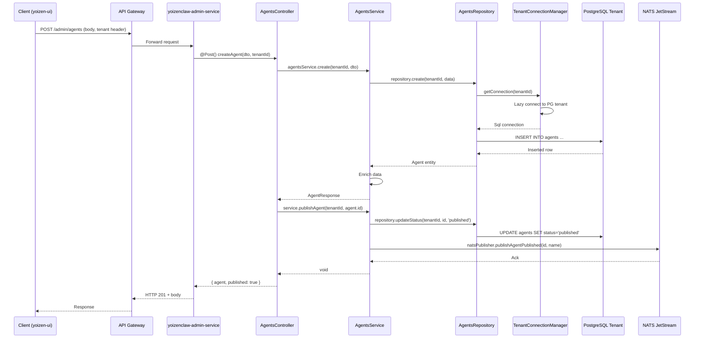
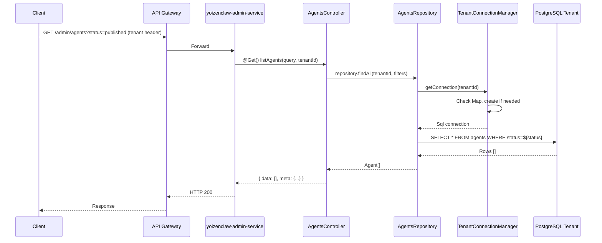

# Design: migrate-yoizen-admin-to-platform

## Technical Approach

Implementar **yoizenclaw-admin-service** siguiendo el patrón arquitectónico de platform-cluster, combinando:
1. **Clean Architecture** (capas Controller → Service → Repository)
2. **Multi-tenancy** (TenantConnectionManager de audit-service)
3. **Event-driven** (NATS JetStream publisher)
4. **Observability** (@yoizen/observability)

El servicio será un **NATS publisher** (no consumer), publicando eventos cuando ocurren cambios de configuración para que el runtime YoizenClaw los consuma.

---

## Architecture Decisions

### Decision 1: Mantener capa Repository (Clean Architecture)

**Choice**: Mantener capa `repositories/` con inyección de TenantConnectionManager
**Alternatives considered**: 
- Queries directamente en services (como auth-service)
- TypeORM para abstracción de DB
**Rationale**: 
- Yoizen-admin original ya tenía esta separación bien definida
- Facilita testing (mocks de repositories)
- Alineado con AGENTS.md de NestJS (Clean Architecture principles)
- Permite cambiar estrategia de persistencia sin tocar lógica de negocio

### Decision 2: TenantConnectionManager Pattern

**Choice**: Reusar patrón de audit-service: Map<string, Sql> con lazy initialization
**Alternatives considered**:
- Crear conexión por request (ineficiente)
- Connection pool global con schema switching (no aisla recursos)
**Rationale**:
- Probado en audit-service en producción
- Lazy initialization optimiza recursos
- Full aislamiento de PostgreSQL por tenant (K8s StatefulSet)
- Reconnect automático si tenant se mueve de nodo

### Decision 3: NATS Publisher Singleton

**Choice**: Provider global `NatsPublisher` inyectable, publica a JetStream EVENTS
**Alternatives considered**:
- Publisher por módulo (duplicación de conexiones)
- Request-response NATS (no necesario para este caso de uso)
**Rationale**:
- Admin-service solo publica eventos, no consume
- JetStream garantiza durabilidad
- Single conexión NATS por servicio es eficiente

### Decision 4: Sin Cifrado de Secrets en Base (placeholder)

**Choice**: Guardar credentials en plaintext con campo `is_encrypted: false` (placeholder)
**Alternatives considered**:
- Integrar AWS KMS/Vault (fuera de scope inicial)
- Cifrado simétrico con clave en env (complejidad extra)
**Rationale**:
- Primer milestone: migrar funcionalidad 1:1
- Cifrado se agregará en cambio separado con diseño de seguridad apropiado
- Documentar claramente que es TEMPORAL

### Decision 5: DTOs en mismo folder del feature

**Choice**: `agents.dto.ts` junto a `agents.controller.ts` (sin subcarpeta dto/)
**Alternatives considered**:
- Subcarpeta `dto/` como sugiere NestJS docs genéricos
**Rationale**:
- Convención de auth-service y audit-service en platform-cluster
- Reduce profundidad de imports
- Cohésión: todo lo relacionado a un feature en un lugar

---

## Data Flow

### Crear Agent + Publish



### Query con Multi-tenancy



---

## File Changes

| File | Action | Description |
|------|--------|-------------|
| `services/yoizenclaw-admin-service/package.json` | Create | Dependencias: @nestjs/common, @nestjs/platform-fastify, postgres, nats, class-validator, @yoizen/shared, @yoizen/observability |
| `services/yoizenclaw-admin-service/tsconfig.json` | Create | Config TypeScript strict mode, paths |
| `services/yoizenclaw-admin-service/src/main.ts` | Create | Bootstrap NestJS con Fastify adapter, ValidationPipe, port binding |
| `services/yoizenclaw-admin-service/src/app.module.ts` | Create | @Global() module, importa Providers + Features |
| `services/yoizenclaw-admin-service/src/providers/tenant-connection-manager.ts` | Create | Map<string, Sql>, lazy connect, schema init |
| `services/yoizenclaw-admin-service/src/providers/nats.provider.ts` | Create | NATS_CONNECTION, JETSTREAM_MANAGER, NatsPublisher provider |
| `services/yoizenclaw-admin-service/src/modules/health/health.module.ts` | Create | HealthModule |
| `services/yoizenclaw-admin-service/src/modules/health/health.controller.ts` | Create | GET /health, checks DB connectivity |
| `services/yoizenclaw-admin-service/src/modules/agents/agents.module.ts` | Create | AgentsModule, providers: service, repository |
| `services/yoizenclaw-admin-service/src/modules/agents/agents.controller.ts` | Create | CRUD endpoints + publish/unpublish |
| `services/yoizenclaw-admin-service/src/modules/agents/agents.service.ts` | Create | Lógica negocio, orquesta repo + NATS |
| `services/yoizenclaw-admin-service/src/modules/agents/agents.repository.ts` | Create | Queries SQL postgres.js, multi-tenant |
| `services/yoizenclaw-admin-service/src/modules/agents/agents.dto.ts` | Create | CreateAgentDto, UpdateAgentDto (class-validator) |
| `services/yoizenclaw-admin-service/src/modules/credentials/credentials.module.ts` | Create | CredentialsModule |
| `services/yoizenclaw-admin-service/src/modules/credentials/credentials.controller.ts` | Create | CRUD + rotate endpoints |
| `services/yoizenclaw-admin-service/src/modules/credentials/credentials.service.ts` | Create | Lógica negocio, cifrado placeholder |
| `services/yoizenclaw-admin-service/src/modules/credentials/credentials.repository.ts` | Create | Queries SQL |
| `services/yoizenclaw-admin-service/src/modules/credentials/credentials.dto.ts` | Create | DTOs con class-validator |
| `services/yoizenclaw-admin-service/src/modules/channels/channels.module.ts` | Create | ChannelsModule |
| `services/yoizenclaw-admin-service/src/modules/channels/channels.controller.ts` | Create | CRUD endpoints |
| `services/yoizenclaw-admin-service/src/modules/channels/channels.service.ts` | Create | Lógica + eventos NATS channel.config.changed |
| `services/yoizenclaw-admin-service/src/modules/channels/channels.repository.ts` | Create | Queries SQL |
| `services/yoizenclaw-admin-service/src/modules/channels/channels.dto.ts` | Create | DTOs |
| `services/yoizenclaw-admin-service/src/modules/jobs/jobs.module.ts` | Create | JobsModule |
| `services/yoizenclaw-admin-service/src/modules/jobs/jobs.controller.ts` | Create | CRUD + enable/disable/run/trigger |
| `services/yoizenclaw-admin-service/src/modules/jobs/jobs.service.ts` | Create | Lógica + eventos job.trigger |
| `services/yoizenclaw-admin-service/src/modules/jobs/jobs.repository.ts` | Create | Queries SQL |
| `services/yoizenclaw-admin-service/src/modules/jobs/jobs.dto.ts` | Create | DTOs |
| `services/yoizenclaw-admin-service/src/modules/config-files/config-files.module.ts` | Create | ConfigFilesModule |
| `services/yoizenclaw-admin-service/src/modules/config-files/config-files.controller.ts` | Create | GET/PUT + deploy endpoint |
| `services/yoizenclaw-admin-service/src/modules/config-files/config-files.service.ts` | Create | Lógica + eventos runtime.config.sync |
| `services/yoizenclaw-admin-service/src/modules/config-files/config-files.repository.ts` | Create | Queries SQL |
| `services/yoizenclaw-admin-service/src/modules/config-files/config-files.dto.ts` | Create | DTOs |
| `services/yoizenclaw-admin-service/src/modules/runtime/runtime.module.ts` | Create | RuntimeModule |
| `services/yoizenclaw-admin-service/src/modules/runtime/runtime.controller.ts` | Create | GET /runtime/status |
| `services/yoizenclaw-admin-service/src/modules/runtime/runtime.service.ts` | Create | Consulta estado de conexiones NATS |
| `services/yoizenclaw-admin-service/test/unit/` | Create | Tests unitarios para services, repositories |
| `services/yoizenclaw-admin-service/test/integration/` | Create | Tests integración con DB, NATS |
| `services/yoizenclaw-admin-service/AGENTS.md` | Create | Documentación técnica del servicio |
| `knative/services/base/yoizenclaw-admin-service.yaml` | Create | Knative Service YAML |
| `infrastructure/base/yoizenclaw-admin-service/` | Create | Configuración K8s si necesario |

---

## Interfaces / Contracts

### Database Schema (por tenant)

```sql
-- Agents
CREATE TABLE agents (
    id UUID PRIMARY KEY DEFAULT gen_random_uuid(),
    name VARCHAR(255) NOT NULL,
    description TEXT,
    system_prompt TEXT NOT NULL,
    model_config JSONB NOT NULL DEFAULT '{}',
    tools JSONB DEFAULT '[]',
    channels JSONB DEFAULT '[]',
    status VARCHAR(50) DEFAULT 'draft', -- draft | published
    is_active BOOLEAN DEFAULT true,
    published_at TIMESTAMPTZ,
    created_at TIMESTAMPTZ DEFAULT NOW(),
    updated_at TIMESTAMPTZ DEFAULT NOW()
);

-- Credentials
CREATE TABLE credentials (
    id UUID PRIMARY KEY DEFAULT gen_random_uuid(),
    name VARCHAR(255) NOT NULL,
    type VARCHAR(50) NOT NULL CHECK (type IN ('api_key', 'oauth', 'basic', 'custom')),
    value TEXT NOT NULL, -- TEMPORAL: sin cifrado (placeholder)
    is_encrypted BOOLEAN DEFAULT false,
    metadata JSONB DEFAULT '{}',
    expires_at TIMESTAMPTZ,
    is_active BOOLEAN DEFAULT true,
    created_at TIMESTAMPTZ DEFAULT NOW(),
    updated_at TIMESTAMPTZ DEFAULT NOW()
);

-- Channels
CREATE TABLE channels (
    id UUID PRIMARY KEY DEFAULT gen_random_uuid(),
    name VARCHAR(255) NOT NULL,
    type VARCHAR(50) NOT NULL CHECK (type IN ('webchat', 'whatsapp', 'telegram', 'slack', 'custom')),
    config JSONB NOT NULL DEFAULT '{}',
    webhook_url TEXT,
    is_active BOOLEAN DEFAULT true,
    created_at TIMESTAMPTZ DEFAULT NOW(),
    updated_at TIMESTAMPTZ DEFAULT NOW()
);

-- Jobs
CREATE TABLE jobs (
    id UUID PRIMARY KEY DEFAULT gen_random_uuid(),
    name VARCHAR(255) NOT NULL,
    agent_id UUID NOT NULL REFERENCES agents(id),
    schedule VARCHAR(255) NOT NULL, -- cron expression, 'interval:X', 'once'
    payload JSONB DEFAULT '{}',
    is_active BOOLEAN DEFAULT true,
    last_run TIMESTAMPTZ,
    next_run TIMESTAMPTZ,
    created_at TIMESTAMPTZ DEFAULT NOW(),
    updated_at TIMESTAMPTZ DEFAULT NOW()
);

-- Job Executions
CREATE TABLE job_executions (
    id UUID PRIMARY KEY DEFAULT gen_random_uuid(),
    job_id UUID NOT NULL REFERENCES jobs(id),
    status VARCHAR(50) NOT NULL, -- pending | running | completed | failed
    event_payload JSONB DEFAULT '{}',
    result JSONB,
    logs TEXT[],
    error_message TEXT,
    retry_count INTEGER DEFAULT 0,
    triggered_by VARCHAR(50), -- schedule | manual | event
    started_at TIMESTAMPTZ,
    finished_at TIMESTAMPTZ,
    created_at TIMESTAMPTZ DEFAULT NOW()
);

-- Config Files
CREATE TABLE config_files (
    id UUID PRIMARY KEY DEFAULT gen_random_uuid(),
    name VARCHAR(255) NOT NULL,
    path TEXT NOT NULL UNIQUE,
    content TEXT NOT NULL,
    format VARCHAR(10) NOT NULL CHECK (format IN ('yaml', 'json')),
    version INTEGER DEFAULT 1,
    is_active BOOLEAN DEFAULT true,
    created_at TIMESTAMPTZ DEFAULT NOW(),
    updated_at TIMESTAMPTZ DEFAULT NOW()
);
```

### TypeScript Interfaces

```typescript
// DTOs con class-validator
export class CreateAgentDto {
  @IsString()
  @IsNotEmpty()
  name: string;

  @IsString()
  @IsOptional()
  description?: string;

  @IsString()
  @IsNotEmpty()
  system_prompt: string;

  @IsObject()
  @IsOptional()
  model_config?: Record<string, unknown>;

  @IsArray()
  @IsString({ each: true })
  @IsOptional()
  tools?: string[];

  @IsArray()
  @IsString({ each: true })
  @IsOptional()
  channels?: string[];
}

export class UpdateAgentDto extends PartialType(CreateAgentDto) {}

// Repository Pattern
export interface IAgentsRepository {
  findAll(tenantId: string, filters: AgentFilters): Promise<Agent[]>;
  findById(tenantId: string, id: string): Promise<Agent | null>;
  create(tenantId: string, data: CreateAgentData): Promise<Agent>;
  update(tenantId: string, id: string, data: UpdateAgentData): Promise<Agent>;
  delete(tenantId: string, id: string): Promise<void>;
  updateStatus(tenantId: string, id: string, status: AgentStatus): Promise<void>;
}
```

### NATS Event Contracts

```typescript
// Eventos publicados por admin-service
interface AgentPublishedEvent {
  type: 'agent.published';
  payload: {
    agentId: string;
    name: string;
    publishedAt: string;
    status: 'published';
  };
  metadata: {
    tenantId: string;
    timestamp: string;
    source: 'admin-service';
  };
}

interface ChannelConfigChangedEvent {
  type: 'channel.config.changed';
  payload: {
    channelId: string;
    channel: string;
    changes: Record<string, unknown>;
  };
  metadata: {
    tenantId: string;
    timestamp: string;
    source: 'admin-service';
  };
}

interface JobTriggerEvent {
  type: 'job.trigger';
  payload: {
    job_id: string;
    execution_id: string;
    event_payload: Record<string, unknown>;
  };
  metadata: {
    tenantId: string;
    timestamp: string;
    source: 'admin-service';
  };
}
```

---

## Testing Strategy

| Layer | What to Test | Approach |
|-------|-------------|----------|
| **Unit** | Services, Repositories, DTOs validation | Mock de TenantConnectionManager y NatsPublisher usando @nestjs/testing. Testear lógica de negocio aisladamente |
| **Integration** | Repositories con PostgreSQL real, TenantConnectionManager | Testcontainers para PostgreSQL por tenant. Validar que queries SQL funcionan correctamente y manejan multi-tenancy |
| **Integration** | NATS Publisher con JetStream | Iniciar NATS server embebido, publicar eventos, verificar llegan a stream |
| **E2E** | Flujo completo: Controller → Service → Repository → DB → NATS | Supertest con app NestJS completa. Validar HTTP responses y mensajes NATS |
| **Contract** | DTOs validación class-validator | Tests automáticos que validan constraints de cada DTO (min length, email format, etc) |

### Test Coverage Targets

| Component | Target Coverage |
|-----------|-----------------|
| Controllers | 80% |
| Services | 90% |
| Repositories | 85% |
| DTOs | 100% validación |

---

## Security Implications

### Authentication/Authorization
- **Impact**: Ningún cambio directo. Se asume que API Gateway valida JWT antes de llegar a este servicio.
- **Medida**: Documentar que este servicio confía en headers de tenant que vienen del gateway.

### Input Validation
- **Impact**: Todos los endpoints reciben user input.
- **Medida**: 
  - ValidationPipe global con `whitelist: true`, `forbidNonWhitelisted: true`
  - class-validator en todos los DTOs
  - SQL injection prevention vía postgres.js prepared statements (tagged templates)

### Data Exposure
- **Impact**: Credentials se almacenan en PostgreSQL.
- **Medida**: 
  - ⚠️ **TEMPORAL**: Sin cifrado en v1.0 (placeholder)
  - Endpoints **MUST NOT** retornar valor de credential
  - Agregar TODO/FIXME para implementar cifrado con KMS/Vault

### Dependencies
- **Nuevas**: 
  - `postgres` (postgres.js) - cliente PostgreSQL seguro
  - `nats` - cliente NATS oficial
  - `class-validator` - validación de input
- **Vulnerabilidades conocidas**: Revisar `npm audit` post-implementación

### Attack Surface
- **Nuevos endpoints**: ~25 endpoints HTTP
- **Mitigación**: 
  - Rate limiting en API Gateway (no en este servicio)
  - Validación estricta de input
  - No exponer stack traces en errores de producción

---

## Performance Considerations

### Critical Path Impact
- **Listados**: GET /agents y similares son paths frecuentes
- **Optimización**: Índices en `status`, `created_at`, `is_active` para cada tabla
- **Paginación**: Default limit=20, max=100 para prevenir memory issues

### Data Volume
- **Expectativa**: ~1000 agents por tenant máximo
- **Estrategia**: Paginación obligatoria, no retornar todos los registros

### Caching
- **Decision**: Sin caching en v1.0
- **Rationale**: Los datos son configuración que cambia frecuentemente, cache complica invalidación
- **Futuro**: Considerar Redis para configs de solo-lectura si hay problemas de performance

### Database
- **Queries críticas**: Listados con filtros (status, type)
- **Índices requeridos**:
  ```sql
  CREATE INDEX idx_agents_status ON agents(status);
  CREATE INDEX idx_agents_created_at ON agents(created_at DESC);
  CREATE INDEX idx_channels_type ON channels(type);
  CREATE INDEX idx_jobs_agent_id ON jobs(agent_id);
  CREATE INDEX idx_jobs_active ON jobs(is_active) WHERE is_active = true;
  ```

### Connection Pooling
- **TenantConnectionManager**: Mantiene 1 conexión por tenant activo
- **Postgres.js default**: max 10 connections por instancia Sql
- **Monitoreo**: Alertar si Map crece >100 tenants (memory leak potencial)

### Benchmarks
- **Target p95**: < 200ms para queries simples, < 500ms para joins complejos
- **Medición**: OpenTelemetry traces con histogramas de latencia

---

## Migration / Rollout

### Datos
- **Estrategia**: Este es un servicio NUEVO, no hay migración de datos desde yoizenclaw
- **Carga inicial**: Tenants deberán recrear sus agents/credentials/channels via API o scripts de seed

### Deployment
- **Fase 1**: Desplegar en ambiente `dev` con un tenant de prueba
- **Fase 2**: Testing E2E contra yoizen-ui (modificado para apuntar a nuevo endpoint)
- **Fase 3**: Desplegar en `staging`, validar con tenant real pero no productivo
- **Fase 4**: Feature flag en API Gateway: gradualmente rutear tráfico de /api/admin/* al nuevo servicio
- **Fase 5**: Full rollout, deprecar yoizen-admin de yoizenclaw

### Feature Flag
```yaml
# En API Gateway routing
- path: /api/admin/*
  route_to: yoizenclaw-admin-service  # Nuevo
  fallback: yoizen-admin  # Viejo (yoizenclaw)
  percentage: 10  # Empezar con 10%, aumentar gradualmente
```

### Rollback
- **Escenario**: Errores críticos en producción
- **Acción**: Cambiar feature flag a 0%, tráfico vuelve a yoizen-admin original
- **Tiempo**: < 5 minutos (configuración Knative/api-gateway)

---

## Open Questions

- [ ] **Cifrado de credentials**: ¿Usar AWS KMS, HashiCorp Vault, o clave simétrica en K8s secrets?
- [ ] **Validación de model_config**: ¿Schema JSON específico por provider (OpenAI, Anthropic, etc)?
- [ ] **Rate limiting**: ¿Implementar aquí o mantener solo en API Gateway?
- [ ] **Soft delete**: ¿Implementar para todas las entidades o solo agents?
- [ ] **Auditoría de cambios**: ¿Tabla audit_log por tenant o usar audit-service existente?

---

*Design created: 2026-03-30*
*Status: Approved for Implementation*
