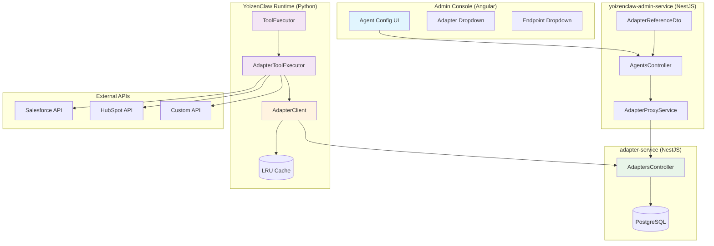
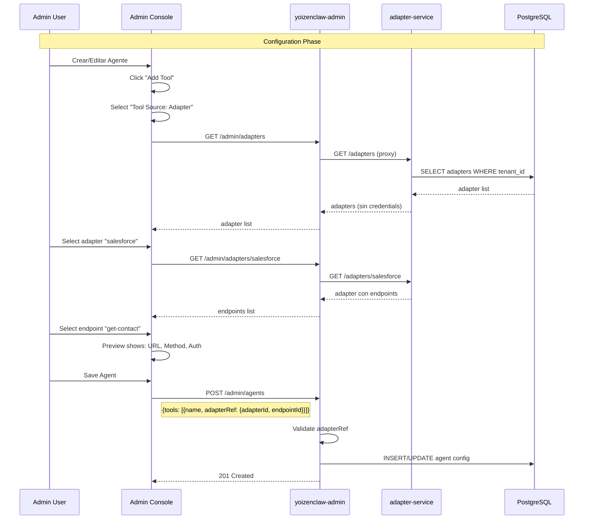
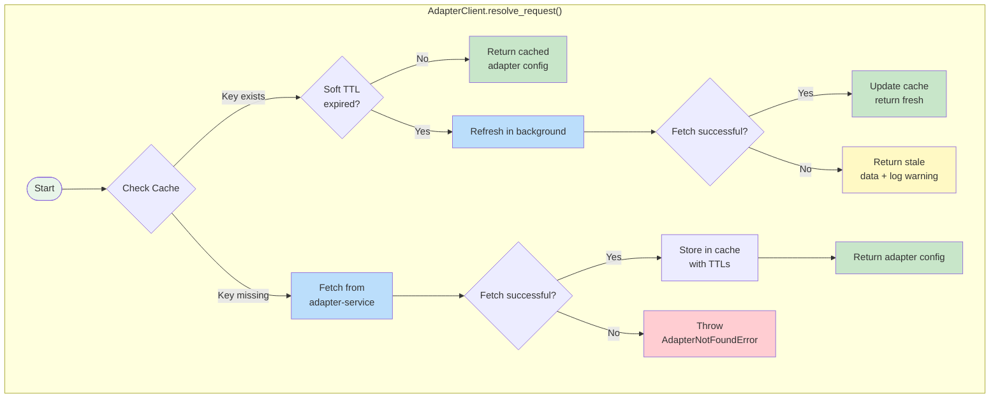
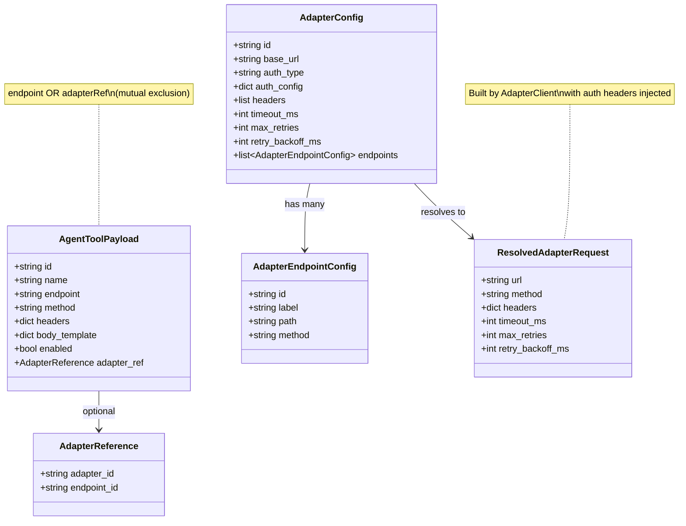
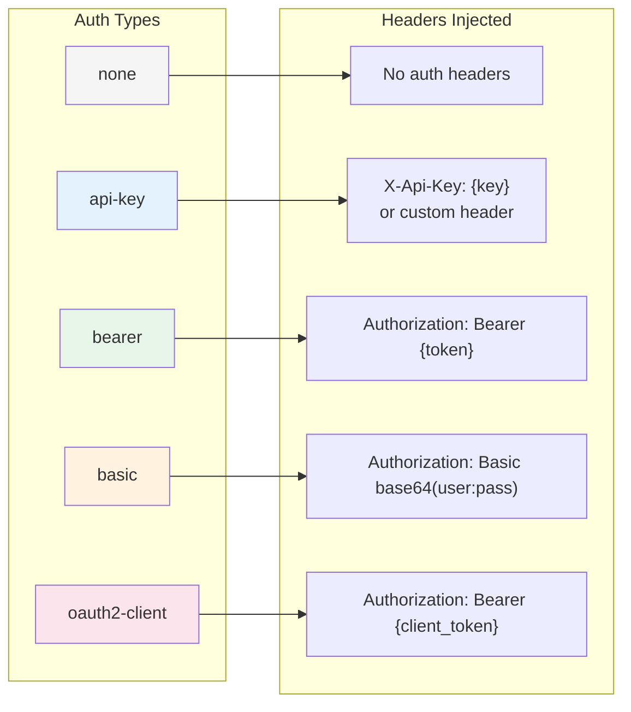
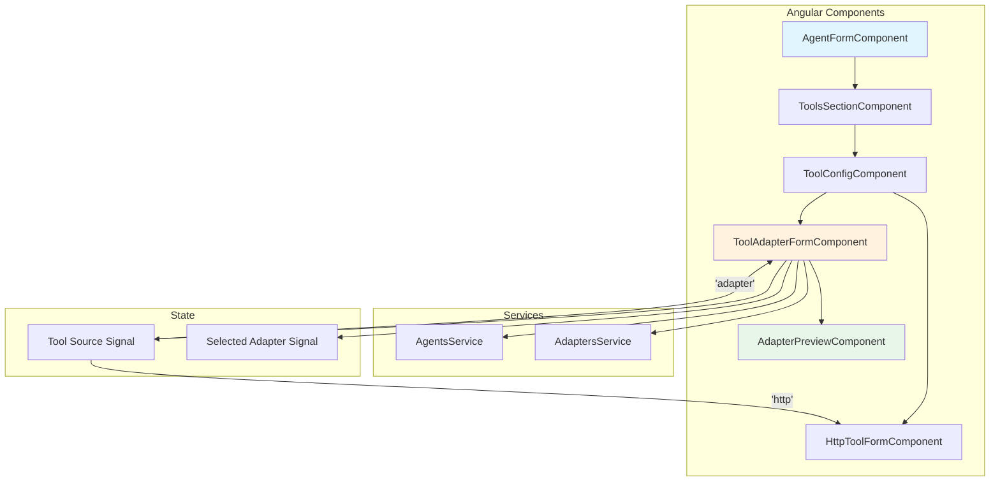
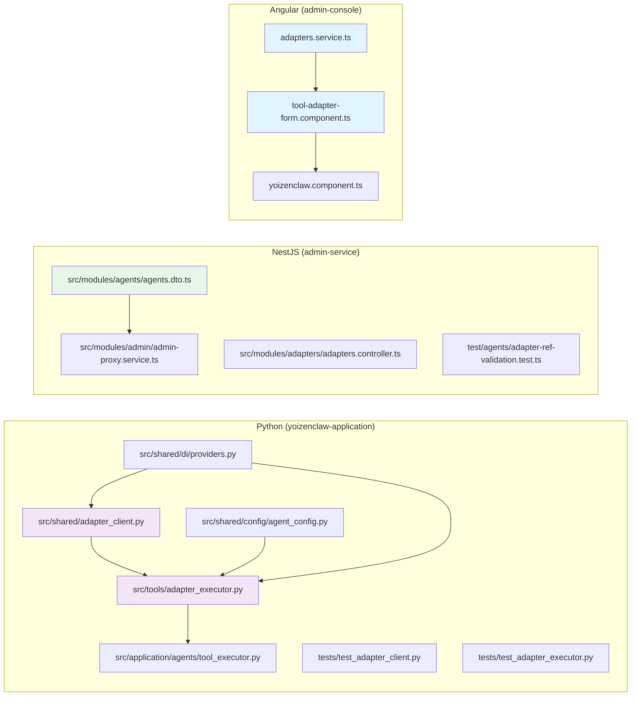

# YoizenClaw Adapter Tools - Architecture Diagrams

## 1. High-Level Architecture



## 2. Configuration Flow



## 3. Execution Flow

```mermaid
sequenceDiagram
    participant User as End User
    participant Runtime as YoizenClaw Runtime
    participant TE as ToolExecutor
    participant AE as AdapterToolExecutor
    participant AC as AdapterClient
    participant Cache as LRU Cache
    participant AS as adapter-service
    participant External as External API

    Note over User,External: Execution Phase

    User->>Runtime: Send message to agent
    Runtime->>Runtime: LLM decides to use tool
    Runtime->>TE: execute_tool(name, payload)
    
    TE->>TE: Lookup tool definition
    TE->>TE: Check for adapterRef
    
    alt adapterRef present
        TE->>AE: execute(adapterRef, payload, tenant_id)
        
        AE->>AC: resolve_request(adapterId, endpointId)
        AC->>Cache: check cache
        Cache-->>AC: cache status
        alt valid (soft TTL)
            AC-->>AE: adapter context
            Note right of AE: headers contain auth tokens
        else
            AC->>AS: GET /adapters/{id}
            
            rect rgb(255,200,200)
                Note right of AC: Headers: X-Yoizen-Tenant
            end
            AS-->>AC: adapter config
            AC->>Cache: store (60s/300s TTL)
        end
        
        Note right of AE: Build request:
        rect rgb(240,248,255)
            Note right of AE
                url = baseUrl + path
                method = endpoint.method
                headers = auth + custom
                X-Yoizen-Tenant = tenant_id
            end
        
        AE->>External: HTTP request
        
        rect rgb(255,255,200)
            Note right of AE
                POST /api/contacts
                Authorization: Bearer ***
                X-Yoizen-Tenant: acme-corp
            end
        
        External-->>AE: response JSON
        
        Note right of AE: Truncate if >100KB
        
        rect rgb(200,220,220)
            Note right of AE
                if len(response) > max_bytes:
                    response = truncate(response)
                    response["_truncated"] = True
                    response["_original_size"] = size
            end
        
        AE-->>TE: result dict
    else no adapterRef (HTTP/NATS)
        TE->>TE: execute_configured_tool(endpoint)
    end
    
    TE-->>Runtime: result
    Runtime->>Runtime: Continue conversation
    Runtime-->>User: Agent response
```

## 4. Adapter Client Cache Strategy



## 5. Data Models



## 6. Auth Header Injection



## 7. Error Handling Flow

```mermaid
flowchart TB
    START([Tool Execution]) --> CHECK{adapterRef<br/>present?}
    
    CHECK -->|No| HTTP[Execute HTTP<br/>tool directly]
    CHECK -->|Yes| FLAG{Feature flag<br/>enabled?}
    
    FLAG -->|No| DISABLED[Return:<br/>"Adapter tools disabled"]
    FLAG -->|Yes| RESOLVE[Resolve adapter<br/>config]
    
    RESOLVE --> FOUND{Adapter<br/>found?}
    FOUND -->|No| NOT_FOUND[Return:<br/>AdapterNotFoundError]
    FOUND -->|Yes| ENDPOINT{Endpoint<br/>found?}
    
    ENDPOINT -->|No| EP_NOT_FOUND[Return:<br/>EndpointNotFoundError]
    ENDPOINT -->|Yes| TIMEOUT{Timeout<br/>configured?}
    
    TIMEOUT -->|Yes| SLOW[SLOW: Use stale<br/>cached data]
    TIMEOUT -->|No| FETCH[Fetch fresh<br/>config]
    
    FETCH --> EXECUTE[Execute HTTP<br/>request]
    SLOW --> EXECUTE
    
    EXECUTE --> HTTP_CODE{HTTP<br/>status?}
    
    HTTP_CODE -->|2xx| SUCCESS[Return response<br/>truncated if >100KB]
    HTTP_CODE -->|4xx| CLIENT_ERR[Return:<br/>ClientError with context]
    HTTP_CODE -->|5xx| SERVER_ERR[Return:<br/>ServerError with context]
    HTTP_CODE -->|Timeout| TIMEOUT_ERR[Return:<br/>TimeoutError]
    
    style NOT_FOUND fill:#ffcdd2
    style EP_NOT_FOUND fill:#ffcdd2
    style CLIENT_ERR fill:#fff9c4
    style SERVER_ERR fill:#ffcdd2
    style TIMEOUT_ERR fill:#ffcdd2
    style SUCCESS fill:#c8e6c9
    style DISABLED fill:#e0e0e0
```

## 8. UI Component Structure



## 9. File Structure



## 10. Deployment & Feature Rollout

```mermaid
flowchart LR
    subgraph "Phase 1: Deploy"
        DEPLOY[Deploy code with<br/>YOIZENCLAW_ADAPTER_TOOLS_ENABLED=false]
    end

    subgraph "Phase 2: Test"
        TEST1[Enable flag in staging]
        TEST2[Run integration tests]
        TEST3[Run E2E tests]
        TEST4[Security audit]
    end

    subgraph "Phase 3: Canary"
        CANARY[Enable for single<br/>tenant via env var]
        MONITOR1[Monitor metrics]
        MONITOR2[Check error rates]
    end

    subgraph "Phase 4: GA"
        GA[Enable globally]
        MONITOR3[Monitor all tenants]
        CLEANUP[Remove feature flag<br/>after validation]
    end

    DEPLOY --> TEST1
    TEST1 --> TEST2
    TEST2 --> TEST3
    TEST3 --> TEST4
    TEST4 --> CANARY
    CANARY --> MONITOR1
    MONITOR1 --> MONITOR2
    MONITOR2 --> GA
    GA --> MONITOR3
    MONITOR3 --> CLEANUP

    style DEPLOY fill:#e3f2fd
    style TEST1 fill:#fff3e0
    style TEST2 fill:#fff3e0
    style TEST3 fill:#fff3e0
    style TEST4 fill:#fff3e0
    style CANARY fill:#e8f5e9
    style GA fill:#c8e6c9
    style CLEANUP fill:#c8e6c9
```



---

## Quick Reference

| Component | File | Key Class/Function |
|-----------|------|-------------------|
| **AdapterClient (Python)** | `adapter_client.py` | `get_adapter()`, `resolve_request()` |
| **AdapterToolExecutor** | `adapter_executor.py` | `execute()` |
| **ToolExecutor** | `tool_executor.py` | `_execute_configured_tool()` |
| **AdapterReference (Py)** | `agent_config.py` | `AdapterReference` model |
| **AdapterReferenceDto (TS)** | `agents.dto.ts` | validation decorators |
| **AdaptersController** | `adapters.controller.ts` | `GET /admin/adapters` |
| **ToolAdapterFormComponent** | `tool-adapter-form.component.ts` | UI for adapter selection |

### Environment Variables

| Variable | Default | Description |
|----------|---------|-------------|
| `YOIZENCLAW_ADAPTER_TOOLS_ENABLED` | `false` | Feature flag for adapter tools |
| `ADAPTER_SERVICE_URL` | - | adapter-service base URL |
| `YOIZENCLAW_TOOL_RESPONSE_MAX_BYTES` | `100000` | Response truncation limit |
| `ADAPTER_CACHE_TTL_SECONDS` | `60` | Cache TTL (soft) |
| `ADAPTER_CACHE_HARD_TTL_SECONDS` | `300` | Cache TTL (hard/fallback) |