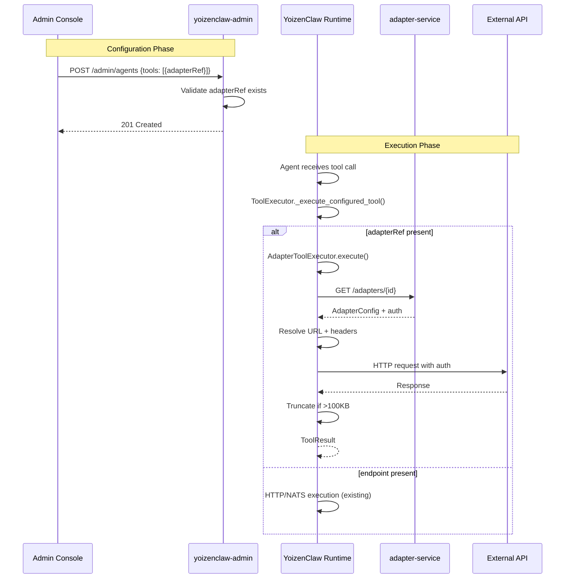

# Design: YoizenClaw Adapter Tools Integration

## Technical Approach

Extend the existing tool schema (`AgentToolPayload`) with an optional `adapterRef` field. Create a Python `AdapterClient` that mirrors the TypeScript implementation in `@yoizen/shared/src/adapter-client.ts`, using the same stale-while-revalidate caching pattern. Wire the new `AdapterToolExecutor` into `ToolExecutor._execute_configured_tool()` to dispatch adapter-backed tools transparently alongside existing HTTP/NATS tools.

The admin-service validates `adapterRef` references and the Angular UI adds adapter selection controls. This approach minimizes changes to existing services while enabling dynamic adapter reuse.

## Architecture Decisions

### Decision 1: Python AdapterClient Implementation

**Choice**: Create new Python package `src/shared/adapter_client.py` in `services/yoizenclaw-runtime`
**Alternatives considered**:
- Call TypeScript AdapterClient via Node subprocess (rejected: adds process overhead, complex error handling)
- Duplicate logic in NATS bridge (rejected: tight coupling, harder to test)
- Route all adapter calls through api-gateway (rejected: adds network hop, latency)

**Rationale**: Python implementation allows direct HTTP calls from YoizenClaw runtime with same caching semantics as TypeScript. Uses `httpx` for async HTTP and local dict cache (no Redis needed in Python runtime - adapter configs are small and per-tenant isolation is maintained).

### Decision 2: Cache Strategy

**Choice**: In-memory LRU cache with TTL, no Redis dependency in Python
**Alternatives considered**:
- Shared Redis cache with TypeScript services (rejected: adds Redis dependency to Python runtime)
- No cache, always call adapter-service (rejected: high latency, unnecessary load)

**Rationale**: Adapter configs change infrequently. Per-instance memory cache is sufficient. The 60s soft TTL + 300s hard TTL from TypeScript implementation is reused. Stale data fallback handles adapter-service unavailability.

### Decision 3: Tool Dispatch Integration

**Choice**: Extend `ToolExecutor._execute_configured_tool()` with adapter branch
**Alternatives considered**:
- Create separate `AdapterSkill` type (rejected: breaks existing skill model, confusing UX)
- Pre-resolve adapters in agent sync (rejected: stale if adapter changes between sync and execution)

**Rationale**: Minimal change to existing code path. The `adapterRef` field is optional, so existing HTTP/NATS tools continue working unchanged. Feature flag allows graceful rollout.

### Decision 4: Admin UI Adapter Selection

**Choice**: Dropdown for "Tool Source: HTTP | Adapter" with conditional fields
**Alternatives considered**:
- Separate "Add Adapter Tool" button (rejected: duplicates tool management UI)
- Auto-generate tools from adapters (rejected: breaks explicit tool definition, hard to sync)

**Rationale**: Simple toggle pattern already used elsewhere. Clear separation between "configure endpoint manually" vs "use managed adapter".

### Decision 5: Auth Header Sanitization

**Choice**: Never log or expose auth tokens in errors; truncate responses over 100KB
**Alternatives considered**:
- Log auth type only (rejected: still leaks structure)
- Store auth config in agent state (rejected: security risk, stale credentials)

**Rationale**: Matches TypeScript security model. Auth headers are resolved at execution time from adapter-service, never stored in agent config.

## Data Flow



## File Changes

| File | Action | Description |
|------|--------|-------------|
| `services/yoizenclaw-runtime/src/shared/adapter_client.py` | Create | Python AdapterClient with SWR cache |
| `services/yoizenclaw-runtime/src/tools/adapter_executor.py` | Create | AdapterToolExecutor class |
| `services/yoizenclaw-runtime/src/application/agents/tool_executor.py` | Modify | Add adapter dispatch branch in `_execute_configured_tool` |
| `services/yoizenclaw-runtime/src/shared/config/agent_config.py` | Modify | Add `AdapterReference` model, `adapterRef` field to `AgentToolPayload` |
| `services/yoizenclaw-runtime/src/shared/di/providers.py` | Modify | Register `AdapterClient` and `AdapterToolExecutor` in DI |
| `services/yoizenclaw-admin-service/src/modules/agents/agents.dto.ts` | Modify | Add `AdapterReferenceDto`, update tool validation |
| `services/yoizenclaw-admin-service/src/modules/adapters/adapters.controller.ts` | Create | Adapter lookup endpoints for UI |
| `services/admin-console/src/app/features/automation/yoizenclaw/components/tool-adapter-form.component.ts` | Create | Angular component for adapter tool config |
| `services/admin-console/src/app/features/automation/yoizenclaw/yoizenclaw.component.ts` | Modify | Integrate ToolAdapterFormComponent |
| `services/yoizenclaw-runtime/tests/test_adapter_client.py` | Create | Unit tests for AdapterClient |
| `services/yoizenclaw-runtime/tests/test_adapter_executor.py` | Create | Unit tests for AdapterToolExecutor |
| `services/yoizenclaw-admin-service/test/agents/adapter-ref-validation.test.ts` | Create | Unit tests for adapterRef validation |

## Interfaces / Contracts

### Python: AdapterReference

```python
# src/shared/config/agent_config.py
from pydantic import BaseModel, Field
from typing import Literal

class AdapterReference(BaseModel):
    """Reference to an adapter endpoint for tool execution."""
    adapter_id: str = Field(..., alias="adapterId", min_length=1)
    endpoint_id: str = Field(..., alias="endpointId", min_length=1)

    model_config = {"populate_by_name": True}

class AgentToolPayload(BaseModel):
    # Existing fields...
    id: str
    name: str
    endpoint: str | None = None  # Now optional
    method: Literal["GET", "POST", "PUT", "DELETE"] | None = None  # Now optional
    headers: dict[str, str] = Field(default_factory=dict)
    body_template: dict[str, Any] | None = Field(default=None, alias="bodyTemplate")
    enabled: bool = True
    description: str | None = None
    field_descriptions: dict[str, str] | None = Field(default=None, alias="fieldDescriptions")

    # NEW FIELD
    adapter_ref: AdapterReference | None = Field(default=None, alias="adapterRef")

    @model_validator(mode="after")
    def validate_tool_source(self) -> "AgentToolPayload":
        has_endpoint = bool(self.endpoint)
        has_adapter_ref = bool(self.adapter_ref)
        if has_endpoint and has_adapter_ref:
            raise ValueError("Tool must have either endpoint OR adapterRef, not both")
        if not has_endpoint and not has_adapter_ref:
            raise ValueError("Tool must have either endpoint OR adapterRef")
        return self
```

### Python: AdapterClient

```python
# src/shared/adapter_client.py
from dataclasses import dataclass
from typing import Any
import httpx

@dataclass
class ResolvedAdapterRequest:
    url: str
    method: str
    headers: dict[str, str]
    timeout_ms: int
    max_retries: int
    retry_backoff_ms: int

@dataclass
class AdapterConfig:
    id: str
    base_url: str
    auth_type: str
    auth_config: dict[str, Any]
    headers: list[dict[str, str]]
    timeout_ms: int
    max_retries: int
    retry_backoff_ms: int
    endpoints: list[dict[str, Any]]

class AdapterClient:
    """Client for resolving adapter configurations with SWR caching."""

    def __init__(
        self,
        base_url: str,
        tenant_id: str,
        cache_ttl_seconds: int = 60,
    ):
        self._base_url = base_url.rstrip("/")
        self._tenant_id = tenant_id
        self._cache_ttl = cache_ttl_seconds
        self._cache: dict[str, tuple[AdapterConfig, float]] = {}

    async def get_adapter(self, adapter_id: str) -> AdapterConfig:
        """Fetch adapter config with stale-while-revalidate caching."""
        ...

    async def resolve_request(
        self, adapter_id: str, endpoint_id: str
    ) -> ResolvedAdapterRequest:
        """Resolve full request config from adapter + endpoint."""
        ...

    def _inject_auth_headers(
        self, adapter: AdapterConfig, headers: dict[str, str]
    ) -> None:
        """Inject authentication headers based on auth type."""
        ...

    def _truncate_response(self, data: Any, max_bytes: int = 100_000) -> Any:
        """Truncate large responses to prevent LLM context overflow."""
        ...
```

### Python: AdapterToolExecutor

```python
# src/tools/adapter_executor.py
from src.shared.adapter_client import AdapterClient, ResolvedAdapterRequest
from src.shared.config.agent_config import AdapterReference

class AdapterToolExecutor:
    """Executes tools backed by adapters."""

    def __init__(
        self,
        adapter_client: AdapterClient,
        http_client: httpx.AsyncClient,
        max_response_bytes: int = 100_000,
    ):
        self._adapter_client = adapter_client
        self._http = http_client
        self._max_bytes = max_response_bytes

    async def execute(
        self,
        tenant_id: str,
        adapter_ref: AdapterReference,
        payload: dict[str, Any],
    ) -> dict[str, Any]:
        """Execute an adapter-backed tool."""
        request = await self._adapter_client.resolve_request(
            adapter_ref.adapter_id, adapter_ref.endpoint_id
        )
        response = await self._http.request(
            method=request.method,
            url=request.url,
            headers={
                **request.headers,
                "X-Yoizen-Tenant": tenant_id,
            },
            json=payload,
            timeout=request.timeout_ms / 1000,
        )
        # Handle errors, truncate response
        ...
```

### TypeScript: DTO Updates

```typescript
// services/yoizenclaw-admin-service/src/modules/agents/agents.dto.ts
import { IsString, IsNotEmpty, ValidateNested, IsOptional, IsIn } from 'class-validator';

class AdapterReferenceDto {
  @IsString()
  @IsNotEmpty()
  adapterId!: string;

  @IsString()
  @IsNotEmpty()
  endpointId!: string;
}

class AgentToolDto {
  // Existing fields...
  name!: string;
  endpoint?: string;
  method?: 'GET' | 'POST' | 'PUT' | 'DELETE';

  @ValidateNested()
  @IsOptional()
  adapterRef?: AdapterReferenceDto;
}
```

## Testing Strategy

| Layer | What to Test | Approach |
|-------|-------------|----------|
| Unit | `AdapterClient.get_adapter()` cache hit/miss | Mock `httpx.AsyncClient`, assert cache behavior |
| Unit | `AdapterClient.resolve_request()` URL construction | Mock adapter responses, verify URL + headers |
| Unit | `AdapterClient._inject_auth_headers()` all auth types | Parameterized tests for `none`, `api-key`, `bearer`, `basic`, `oauth2` |
| Unit | `AdapterToolExecutor.execute()` success path | Mock AdapterClient + httpx, assert request structure |
| Unit | `AdapterToolExecutor.execute()` error mapping | Mock HTTP errors, assert error messages sanitized |
| Unit | `AgentToolPayload` validation | Pydantic validation tests for endpoint vs adapterRef |
| Unit | `AdapterReferenceDto` validation | class-validator tests in admin-service |
| Integration | Admin-service adapter lookup endpoints | Test API against mock adapter-service |
| Integration | Tool execution with real adapter | Docker-compose with adapter-service, call tool |
| E2E | Agent uses adapter tool via UI | Playwright: create agent with adapter tool, execute |

## Security Implications

**No new attack vectors** - the adapter-service already handles auth credential storage and validation. This change adds client-side resolution in Python without storing credentials.

- **Authentication/Authorization**: Adapter auth headers are resolved at execution time from adapter-service. YoizenClaw never stores credentials. Tenant context (`X-Yoizen-Tenant`) is propagated on every adapter request.
- **Input Validation**: `adapterId` and `endpointId` are validated as UUIDs by admin-service before saving. No user input reaches adapter resolution.
- **Data Exposure**: Adapter responses may contain PII. Response truncation prevents LLM context pollution but does not sanitize PII. Admin is responsible for adapter data governance.
- **Dependencies**: `httpx` is already a dependency in yoizenclaw-application. No new third-party packages.
- **Attack Surface**: The new `/admin/adapters` endpoint is protected by existing `TenantGuard` and `AuthGuard`.

## Performance Considerations

- **Critical Path Impact**: Adapter tool execution adds one HTTP round-trip to adapter-service (60-300ms). Cache hit avoids subsequent calls.
- **Data Volume**: Adapter configs are small (< 5KB). Response truncation at 100KB prevents memory issues.
- **Caching**: In-memory LRU cache per runtime instance. Soft TTL 60s, hard TTL 300s. Per-tenant isolation via `tenant_id` key prefix.
- **Database**: No database changes.
- **Benchmarks**: Target < 100ms p95 for cached adapter resolution, < 500ms p95 for uncached.

## Migration / Rollout

**Feature flag rollout**:

1. Deploy code with `YOIZENCLAW_ADAPTER_TOOLS_ENABLED=false` (default)
2. Test in staging with flag enabled
3. Enable for single tenant via runtime env override
4. Enable globally
5. Remove feature flag after validated

**No database migration required** - `adapterRef` is an optional JSONB field.

## Open Questions

- [ ] Should `response_truncation_bytes` be configurable per-tenant or per-agent?
- [ ] Should circuit breaker for adapter-service be shared across all adapter calls or per-adapter?
- [ ] How to handle binary responses (files, images)? Defer to follow-up change?
