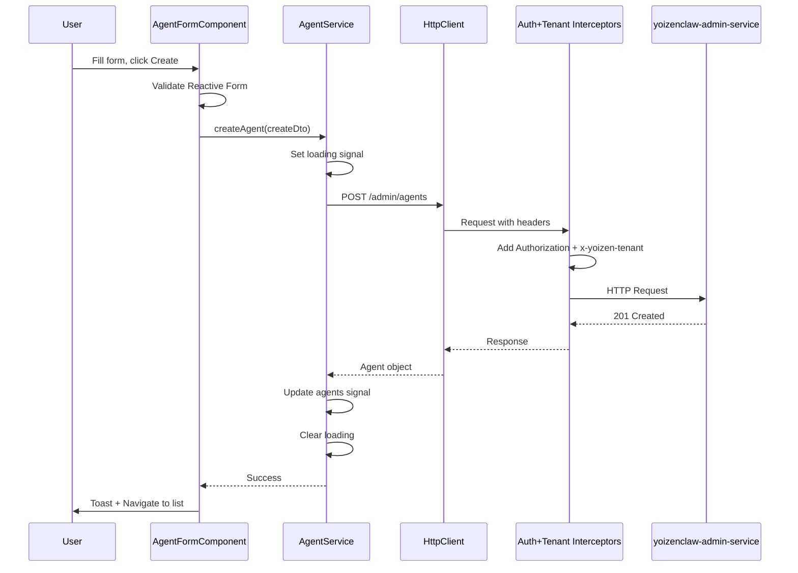
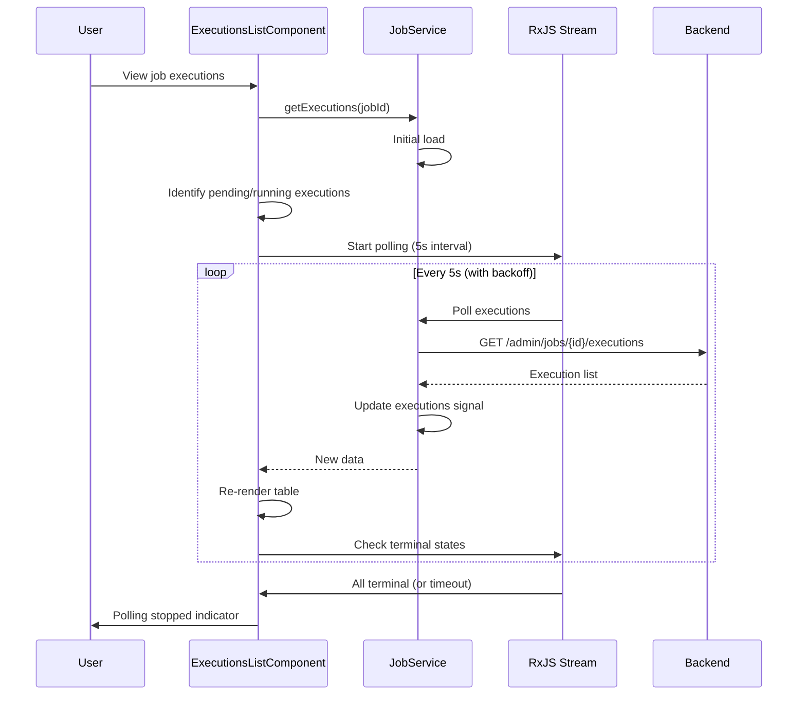
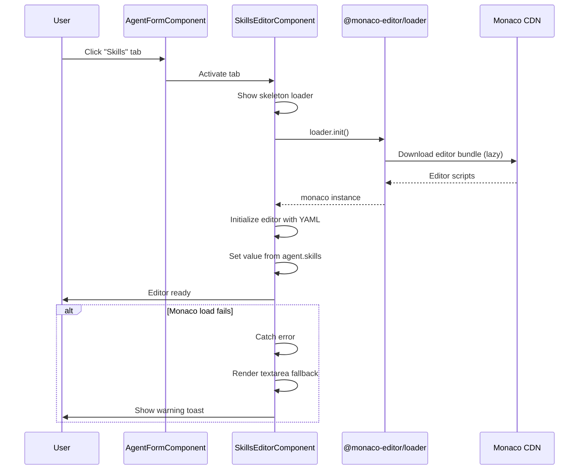
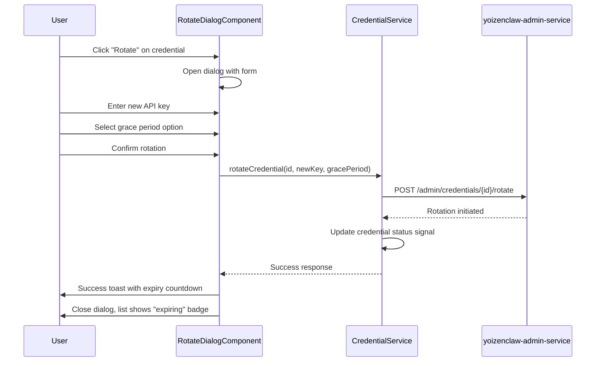

# Design: YoizenClaw Angular UI

## Technical Approach

This design implements a comprehensive feature module for YoizenClaw AI agent management within the admin-console, following established Angular patterns and Clean Architecture principles. The approach leverages:

- **Angular Signals** for reactive state management (consistent with existing AuthService, NotificationService patterns)
- **Standalone Components** with lazy loading (matches existing route structure)
- **Functional Interceptors** (tenant interceptor already exists, needs enhancement for YoizenClaw-specific routing)
- **Reactive Forms** for complex nested configurations (agents with skills/tools)
- **Monaco Editor** dynamically loaded for YAML/JSON editing
- **Shared component reuse** (data-table, status-badge already available)

The design maps to proposal approach by creating three sub-features (agents, jobs, credentials) with shared infrastructure, following the existing admin-console modular structure.

## Architecture Decisions

### Decision: State Management Strategy

**Choice**: Angular Signals for component-level state, Service-level signals for shared state
**Alternatives considered**: NgRx Store, BehaviorSubjects, plain RxJS
**Rationale**: 
- Aligns with existing codebase (AuthService uses signals, NotificationService uses signals)
- Sufficient for 3 CRUD features without cross-feature state dependencies
- Simpler mental model than NgRx for medium-sized feature
- Fine-grained reactivity without boilerplate

### Decision: Monaco Editor Integration

**Choice**: @monaco-editor/loader with dynamic import and textarea fallback
**Alternatives considered**: CodeMirror, Ace Editor, native textarea only
**Rationale**:
- Monaco is industry standard with built-in YAML/JSON support
- Dynamic import keeps bundle small (only loads when Skills or Config tab active)
- Textarea fallback satisfies accessibility requirements (NFR-006)
- Lazy loading aligns with performance targets (NFR-002: < 3s editor load)
- Used for: Model Config JSON (agents), Skills YAML/JSON (config-files)

### Decision: Tenant Header Injection Pattern

**Choice**: Extend existing tenant interceptor to identify YoizenClaw requests
**Alternatives considered**: Per-service header injection, base HTTP class, manual header on every call
**Rationale**:
- Tenant interceptor already exists and works (verified in codebase)
- Need to identify YoizenClaw service endpoints (likely `/admin/*` pattern)
- Maintains single-responsibility: auth interceptor adds JWT, tenant interceptor adds tenant
- Execution order already correct: auth → tenant → request (verified in app.config.ts)

### Decision: Form Architecture for Nested Data

**Choice**: Reactive Forms with FormArray for skills/tools, custom validators
**Alternatives considered**: Template-driven forms, custom form components, external form library
**Rationale**:
- Complex nested structure (agent → skills[] → tools[]) requires programmatic control
- Validation rules are dynamic (provider-specific credential fields)
- Easy to implement custom validators for cron expressions, API key formats
- Matches existing form patterns in codebase (no external form library currently used)

### Decision: Polling Strategy for Job Executions

**Choice**: RxJS interval with exponential backoff, capped at 30s
**Alternatives considered**: WebSockets, Server-Sent Events, manual refresh only
**Rationale**:
- Polling specified in proposal as Phase 1 approach (WebSockets deferred)
- Exponential backoff prevents server overload from long-running jobs
- Auto-stop after 10 minutes prevents infinite polling
- Retry logic handles transient network failures (NFR-008)

### Decision: Component Reuse Strategy

**Choice**: Use existing data-table wrapper + custom row templates, status-badge as-is
**Alternatives considered**: Custom tables per feature, third-party table library
**Rationale**:
- DataTableComponent already provides search, pagination, layout
- StatusBadgeComponent has color mapping for active/pending/error states
- Custom cell templates allow feature-specific columns (cron display, masked secrets)
- Maintains visual consistency across admin-console

### Decision: Service API Base Path

**Choice**: `/api` base with feature-specific paths (matching admin-console pattern)
**Alternatives considered**: `/api/yoizenclaw/admin`, environment-specific paths, separate service domain
**Rationale**:
- Proposal mentions `yoizenclaw-admin-service` with `/admin/*` endpoints
- Admin-console uses `/api` base URL (from environment.ts)
- Backend controllers use: `/admin/agents`, `/admin/jobs`, `/admin/credentials`, `/admin/config-files`
- Likely mapping via gateway: `/api/admin/*` → yoizenclaw-admin-service
- Supports tenant header requirement (all requests need `x-yoizen-tenant`)

### Decision: Module Organization

**Choice**: Flat feature structure with sub-feature folders (agents/, jobs/, credentials/)
**Alternatives considered**: Deep nested modules, single component folder, domain-driven folders
**Rationale**:
- Matches existing pattern: features/automation/scheduler/, features/identity/users/
- Each sub-feature has components/, services/, routes.ts
- Shared models at feature root (yoizenclaw/models/)
- Interceptors at feature level for feature-specific logic

### Decision: Error Handling Strategy

**Choice**: Service-level catchError with toast notifications via NotificationService
**Alternatives considered**: Global HTTP error handler only, component-level try/catch, custom error service
**Rationale**:
- NotificationService already exists for toasts
- Services should handle their own error transformation (Error → User-friendly message)
- Components subscribe and handle UI state updates
- Consistent with existing error handling patterns (auth.service.ts shows error handling)

## Data Flow

### Agent Creation Flow



### Job Execution Polling Flow



### Skills Editor Load Flow



### Credential Rotation Flow



## File Changes

### New Files (35 files)

| File | Action | Description | Spec Ref |
|------|--------|-------------|----------|
| `features/yoizenclaw/yoizenclaw.routes.ts` | Create | Feature-level route configuration with child routes | REQ-YZINFRA-003 |
| `features/yoizenclaw/agents/agents.routes.ts` | Create | Agent sub-feature routes (list, create, edit) | REQ-YZINFRA-002 |
| `features/yoizenclaw/agents/components/agent-list/agent-list.component.ts` | Create | Paginated agent list with data-table | REQ-YZAGENTS-001 |
| `features/yoizenclaw/agents/components/agent-form/agent-form.component.ts` | Create | Create/edit agent form with tabs | REQ-YZAGENTS-002, 003 |
| `features/yoizenclaw/agents/components/skills-editor/skills-editor.component.ts` | Create | Monaco-based skills editor with fallback | REQ-YZAGENTS-005 |
| `features/yoizenclaw/agents/components/tools-editor/tools-editor.component.ts` | Create | Tool configuration form builder | REQ-YZAGENTS-006 |
| `features/yoizenclaw/agents/components/agent-delete-dialog/agent-delete-dialog.component.ts` | Create | Confirmation dialog with safeguards | REQ-YZAGENTS-004 |
| `features/yoizenclaw/agents/components/agent-publish-dialog/agent-publish-dialog.component.ts` | Create | Publish/unpublish confirmation | REQ-YZAGENTS-007 |
| `features/yoizenclaw/agents/services/agent.service.ts` | Create | Agent CRUD + skills/tools/publish operations | REQ-YZAGENTS-001..008 |
| `features/yoizenclaw/jobs/jobs.routes.ts` | Create | Job sub-feature routes (list, create, edit, executions) | REQ-YZINFRA-003 |
| `features/yoizenclaw/jobs/components/job-list/job-list.component.ts` | Create | Job list with status and schedule display | REQ-YZJOBS-001 |
| `features/yoizenclaw/jobs/components/job-form/job-form.component.ts` | Create | Job create/edit with cron helper | REQ-YZJOBS-002, 003 |
| `features/yoizenclaw/jobs/components/executions-list/executions-list.component.ts` | Create | Execution history with polling | REQ-YZJOBS-007, 008 |
| `features/yoizenclaw/jobs/components/job-delete-dialog/job-delete-dialog.component.ts` | Create | Delete confirmation with history warning | REQ-YZJOBS-004 |
| `features/yoizenclaw/jobs/components/cron-helper-dialog/cron-helper-dialog.component.ts` | Create | Cron expression cheat sheet | REQ-YZJOBS-002 |
| `features/yoizenclaw/jobs/services/job.service.ts` | Create | Job CRUD + enable/disable/trigger + executions polling | REQ-YZJOBS-001..008 |
| `features/yoizenclaw/credentials/credentials.routes.ts` | Create | Credential sub-feature routes | REQ-YZINFRA-003 |
| `features/yoizenclaw/credentials/components/credential-list/credential-list.component.ts` | Create | Credential list with masked secrets | REQ-YZCREDS-001 |
| `features/yoizenclaw/credentials/components/credential-form/credential-form.component.ts` | Create | Create/edit with provider-specific fields | REQ-YZCREDS-002, 006 |
| `features/yoizenclaw/credentials/components/credential-delete-dialog/credential-delete-dialog.component.ts` | Create | Delete with usage check | REQ-YZCREDS-004 |
| `features/yoizenclaw/credentials/components/rotate-dialog/rotate-dialog.component.ts` | Create | Rotation workflow with grace period | REQ-YZCREDS-005 |
| `features/yoizenclaw/credentials/services/credential.service.ts` | Create | Credential CRUD + rotate operation | REQ-YZCREDS-001..007 |
| `features/yoizenclaw/models/agent.model.ts` | Create | Agent, Skill, Tool interfaces + DTOs | REQ-YZAGENTS-001..008 |
| `features/yoizenclaw/models/job.model.ts` | Create | Job, JobExecution, Cron interfaces + DTOs | REQ-YZJOBS-001..008 |
| `features/yoizenclaw/models/credential.model.ts` | Create | Credential, ProviderConfig interfaces + DTOs | REQ-YZCREDS-001..007 |
| `features/yoizenclaw/models/index.ts` | Create | Barrel export for all models | - |
| `features/yoizenclaw/interceptors/yoizenclaw.interceptor.ts` | Create | Extends tenant interceptor for YoizenClaw-specific logic | REQ-YZINFRA-001 |
| `features/yoizenclaw/validators/cron.validator.ts` | Create | Cron expression validation function | REQ-YZJOBS-002 |
| `features/yoizenclaw/validators/api-key.validator.ts` | Create | Provider-specific API key format validators | REQ-YZCREDS-002 |
| `features/yoizenclaw/utils/polling.util.ts` | Create | Exponential backoff polling utility | REQ-YZJOBS-008 |
| `features/yoizenclaw/utils/mask-secret.util.ts` | Create | Secret masking utility (show last 4) | REQ-YZCREDS-001 |
| `features/yoizenclaw/index.ts` | Create | Feature barrel export | - |

### Modified Files (3 files)

| File | Action | Description | Spec Ref |
|------|--------|-------------|----------|
| `app.routes.ts` | Modify | Add `/yoizenclaw` lazy-loaded route | REQ-YZINFRA-003 |
| `layout/sidebar/sidebar.component.ts` | Modify | Update `/yoizenclaw` route to use new component structure | REQ-YZINFRA-004 |
| `package.json` | Modify | Add `@monaco-editor/loader` dependency | NFR-002 |

### Deleted Files (0 files)

None - no existing YoizenClaw-specific files to remove.

## File Structure

```
src/app/features/yoizenclaw/
├── yoizenclaw.routes.ts                 # Feature route entry
├── index.ts                             # Barrel export
├── models/
│   ├── agent.model.ts                   # Agent interfaces + DTOs
│   ├── job.model.ts                     # Job + Execution interfaces
│   ├── credential.model.ts              # Credential interfaces
│   ├── config-file.model.ts             # ConfigFile interfaces
│   └── index.ts                         # Model exports
├── agents/
│   ├── agents.routes.ts                 # Agent sub-routes
│   ├── components/
│   │   ├── agent-list/
│   │   │   └── agent-list.component.ts
│   │   ├── agent-form/
│   │   │   └── agent-form.component.ts
│   │   ├── model-config-editor/         # Monaco JSON editor for model_config
│   │   │   └── model-config-editor.component.ts
│   │   ├── tools-editor/                # JSON editor for tools array
│   │   │   └── tools-editor.component.ts
│   │   ├── agent-delete-dialog/
│   │   │   └── agent-delete-dialog.component.ts
│   │   └── agent-publish-dialog/
│   │       └── agent-publish-dialog.component.ts
│   └── services/
│       └── agent.service.ts
├── jobs/
│   ├── jobs.routes.ts
│   ├── components/
│   │   ├── job-list/
│   │   │   └── job-list.component.ts
│   │   ├── job-form/
│   │   │   └── job-form.component.ts
│   │   ├── executions-list/
│   │   │   └── executions-list.component.ts
│   │   ├── job-delete-dialog/
│   │   │   └── job-delete-dialog.component.ts
│   │   └── cron-helper-dialog/
│   │       └── cron-helper-dialog.component.ts
│   └── services/
│       └── job.service.ts
├── config-files/
│   ├── config-files.routes.ts
│   ├── components/
│   │   ├── config-file-list/
│   │   │   └── config-file-list.component.ts
│   │   ├── config-file-editor/          # Monaco YAML/JSON editor
│   │   │   └── config-file-editor.component.ts
│   │   └── config-file-deploy-dialog/
│   │       └── config-file-deploy-dialog.component.ts
│   └── services/
│       └── config-file.service.ts
├── credentials/
│   ├── credentials.routes.ts
│   ├── components/
│   │   ├── credential-list/
│   │   │   └── credential-list.component.ts
│   │   ├── credential-form/
│   │   │   └── credential-form.component.ts
│   │   ├── credential-delete-dialog/
│   │   │   └── credential-delete-dialog.component.ts
│   │   └── rotate-dialog/
│   │       └── rotate-dialog.component.ts
│   └── services/
│       └── credential.service.ts
├── interceptors/
│   └── yoizenclaw.interceptor.ts
├── validators/
│   ├── cron.validator.ts
│   ├── json.validator.ts
│   └── api-key.validator.ts
└── utils/
    ├── polling.util.ts
    └── mask-secret.util.ts
```

## Interfaces / Contracts

### Agent Domain Models

```typescript
// models/agent.model.ts

export type AgentStatus = "draft" | "published" | "archived";

export interface IAgent {
  id: string;
  name: string;
  description: string;
  status: AgentStatus;
  systemPrompt: string;        // UI camelCase
  modelConfig: Record<string, unknown>;  // Contains model, temperature, etc.
  tools: unknown[];          // Opaque JSON array
  channels: unknown[];         // Opaque JSON array
  isActive: boolean;
  createdAt: string;
  updatedAt: string;
  publishedAt?: string;
}

// DTOs for API (snake_case from backend)
export interface ICreateAgentDto {
  name: string;
  description?: string;
  system_prompt: string;       // Backend uses snake_case
  model_config?: Record<string, unknown>;
  tools?: unknown[];
  channels?: unknown[];
}

export interface IUpdateAgentDto {
  name?: string;
  description?: string;
  system_prompt?: string;
  model_config?: Record<string, unknown>;
  tools?: unknown[];
  channels?: unknown[];
  status?: AgentStatus;
  is_active?: boolean;
}

// API Response wrapper - backend uses { agents: [], total: number }
export interface IAgentListResponse {
  agents: IAgent[];  // NOT "items"
  total: number;
}
```

### Job Domain Models

```typescript
// models/config-file.model.ts

export type ConfigFileFormat = "yaml" | "json";

export interface IConfigFile {
  id: string;
  name: string;
  path: string;              // e.g., "/skills/greeting.yaml"
  content: string;          // YAML or JSON content
  format: ConfigFileFormat;
  version: number;
  isActive: boolean;        // Backend: is_active
  createdAt: string;
  updatedAt: string;
}

// DTOs for API (snake_case from backend)
export interface ICreateConfigFileDto {
  name: string;
  path: string;
  content: string;
  format: ConfigFileFormat;
}

export interface IUpdateConfigFileDto {
  name?: string;
  path?: string;
  content?: string;
  format?: ConfigFileFormat;
}

export interface IDeployConfigFilesDto {
  delete_paths?: string[];  // Backend: delete_paths
}

// API Response - backend uses { files: [], total: number }
export interface IConfigFileListResponse {
  files: IConfigFile[];  // NOT "items"
  total: number;
}

export interface IJob {
  id: string;
  name: string;
  description: string;
  agentId: string;         // UUID reference
  schedule: string;        // Cron expression
  payload: Record<string, unknown> | null;  // JSON payload
  isActive: boolean;       // Backend: is_active
  lastRun?: string;        // Backend: last_run
  nextRun?: string;        // Backend: next_run
  createdAt: string;
  updatedAt: string;
}

export interface IJobExecution {
  id: string;
  jobId: string;
  status: ExecutionStatus;
  startedAt: string;
  completedAt?: string;
  duration?: number; // milliseconds
  input?: Record<string, unknown>;
  output?: unknown;
  error?: string;
  logs?: string;
}

// DTOs for API (snake_case from backend)
export interface ICreateJobDto {
  name: string;
  description?: string;
  agent_id: string;        // Backend snake_case
  schedule: string;
  payload?: Record<string, unknown>;
  is_active?: boolean;
}

export interface IUpdateJobDto {
  name?: string;
  description?: string;
  agent_id?: string;
  schedule?: string;
  payload?: Record<string, unknown>;
  is_active?: boolean;
}

// API Response - backend uses { jobs: [], total: number }
export interface IJobListResponse {
  jobs: IJob[];  // NOT "items"
  total: number;
}

export interface IExecutionListResponse {
  executions: IJobExecution[];  // NOT "items"
  total: number;
}
```

### Credential Domain Models

```typescript
// models/credential.model.ts

export type CredentialType = "api_key" | "oauth" | "basic" | "custom";

export interface ICredential {
  id: string;
  name: string;
  type: CredentialType;    // Backend uses "type", not "provider"
  // value: string        // NEVER included in responses - only for create/update
  metadata: Record<string, unknown>;  // Provider-specific settings here
  isEncrypted: boolean;    // Backend: is_encrypted
  isActive: boolean;       // Backend: is_active
  expiresAt?: string;      // Backend: expires_at
  createdAt: string;
  updatedAt: string;
}

// DTOs for API (snake_case from backend)
export interface ICreateCredentialDto {
  name: string;
  type: CredentialType;
  value: string;           // Only time we send the actual secret
  metadata?: Record<string, unknown>;
  expires_at?: string;
  is_active?: boolean;
}

export interface IUpdateCredentialDto {
  name?: string;
  type?: CredentialType;
  value?: string;          // Only if changing secret
  metadata?: Record<string, unknown>;
  expires_at?: string;
  is_active?: boolean;
}

export interface IRotateCredentialDto {
  new_value: string;       // Backend: new_value
  new_expires_at?: string; // Backend: new_expires_at
}

// API Response - backend uses { credentials: [], total: number }
export interface ICredentialListResponse {
  credentials: ICredential[];  // NOT "items"
  total: number;
}
```

### Service Interfaces

```typescript
// agents/services/agent.service.ts

export interface IAgentService {
  // State signals
  readonly agents: Signal<IAgent[]>;
  readonly loading: Signal<boolean>;
  readonly error: Signal<string | null>;
  readonly selectedAgent: Signal<IAgent | null>;

  // CRUD operations - all use PUT /admin/agents/:id for updates
  loadAgents(page?: number, pageSize?: number): Observable<IAgentListResponse>;
  getAgent(id: string): Observable<IAgent>;
  createAgent(dto: ICreateAgentDto): Observable<IAgent>;
  updateAgent(id: string, dto: IUpdateAgentDto): Observable<IAgent>;
  deleteAgent(id: string): Observable<void>;

  // Lifecycle
  publishAgent(id: string): Observable<IAgent>;
  unpublishAgent(id: string): Observable<IAgent>;
}

// jobs/services/job.service.ts

export interface IJobService {
  readonly jobs: Signal<IJob[]>;
  readonly loading: Signal<boolean>;
  readonly executions: Signal<IJobExecution[]>;
  readonly pollingActive: Signal<boolean>;

  loadJobs(page?: number, pageSize?: number): Observable<IJobListResponse>;
  getJob(id: string): Observable<IJob>;
  createJob(dto: ICreateJobDto): Observable<IJob>;
  updateJob(id: string, dto: IUpdateJobDto): Observable<IJob>;
  deleteJob(id: string): Observable<void>;

  // Lifecycle
  enableJob(id: string): Observable<IJob>;
  disableJob(id: string): Observable<IJob>;
  runJob(id: string): Observable<IJobExecution>;           // POST /admin/jobs/:id/run
  triggerJob(id: string, payload?: Record<string, unknown>): Observable<IJobExecution>;  // POST /admin/jobs/:id/trigger

  // Executions - uses GET /admin/jobs/executions?job_id=:id
  loadExecutions(jobId: string, page?: number, pageSize?: number): Observable<IExecutionListResponse>;
  startPolling(jobId: string): void;
  stopPolling(): void;
}

// credentials/services/credential.service.ts

export interface ICredentialService {
  readonly credentials: Signal<ICredential[]>;
  readonly loading: Signal<boolean>;

  loadCredentials(page?: number, pageSize?: number): Observable<ICredentialListResponse>;
  getCredential(id: string): Observable<ICredential>;
  createCredential(dto: ICreateCredentialDto): Observable<ICredential>;
  updateCredential(id: string, dto: IUpdateCredentialDto): Observable<ICredential>;
  deleteCredential(id: string): Observable<void>;

  // Rotation - uses PUT /admin/credentials/:id/rotate
  rotateCredential(id: string, dto: IRotateCredentialDto): Observable<ICredential>;
}

// config-files/services/config-file.service.ts

export interface IConfigFileService {
  readonly configFiles: Signal<IConfigFile[]>;
  readonly loading: Signal<boolean>;
  readonly selectedConfigFile: Signal<IConfigFile | null>;

  loadConfigFiles(page?: number, pageSize?: number): Observable<IConfigFileListResponse>;
  getConfigFileByPath(path: string): Observable<IConfigFile>;
  createOrUpdateConfigFile(dto: ICreateConfigFileDto): Observable<IConfigFile>;
  deleteConfigFile(id: string): Observable<void>;
  
  // Deploy - uses POST /admin/config-files/deploy
  deployConfigFiles(deletePaths?: string[]): Observable<{ files: IConfigFile[]; eventEmitted: boolean }>;
}
```

## Component Design

### AgentListComponent

```typescript
@Component({
  selector: "app-agent-list",
  changeDetection: ChangeDetectionStrategy.OnPush,
  imports: [
    RouterLink,
    MatButtonModule,
    MatIconModule,
    MatTableModule,
    MatPaginatorModule,
    DataTableComponent,
    StatusBadgeComponent,
  ],
  template: `
    <div class="ws-header">
      <div>
        <div class="ws-title">Agents</div>
        <div class="ws-subtitle">AI agents with skills and tools</div>
      </div>
      <button mat-raised-button color="primary" routerLink="new">
        <mat-icon>add</mat-icon>
        New Agent
      </button>
    </div>

    <app-data-table
      [totalItems]="totalItems()"
      [pageSize]="pageSize()"
      (pageChange)="onPage($event)"
    >
      <table mat-table [dataSource]="agents()" class="mat-elevation-z0">
        <!-- Columns: name, description, status, model, modified, actions -->
      </table>
    </app-data-table>
  `,
})
export class AgentListComponent {
  private readonly agentService = inject(AgentService);
  private readonly router = inject(Router);

  readonly agents = computed(() => this.agentService.agents());
  readonly loading = computed(() => this.agentService.loading());
  readonly totalItems = signal(0);
  readonly pageSize = signal(25);

  constructor() {
    this.loadAgents();
  }

  private loadAgents(page = 0): void {
    this.agentService.loadAgents(page, this.pageSize()).subscribe({
      next: (res) => this.totalItems.set(res.total),
    });
  }
}
```

### SkillsEditorComponent (Monaco Integration)

```typescript
@Component({
  selector: "app-skills-editor",
  changeDetection: ChangeDetectionStrategy.OnPush,
  imports: [MatButtonModule, MatProgressSpinnerModule],
  template: `
    <div class="editor-container">
      @if (loading()) {
        <div class="skeleton">
          <mat-spinner diameter="40" />
          <span>Loading editor...</span>
        </div>
      } @else if (monacoError()) {
        <div class="fallback">
          <textarea
            [value]="skillsText()"
            (change)="onTextChange($event)"
            rows="20"
            aria-label="Skills definition (YAML or JSON)"
          ></textarea>
          <div class="warning">Advanced editor unavailable. Using basic mode.</div>
        </div>
      } @else {
        <div #editorContainer class="monaco-container"></div>
      }

      <div class="actions">
        <button mat-raised-button color="primary" (click)="save()" [disabled]="!dirty()">
          Save Skills
        </button>
        <button mat-button (click)="validate()">Validate Syntax</button>
      </div>
    </div>
  `,
})
export class SkillsEditorComponent implements OnDestroy {
  @ViewChild("editorContainer") editorContainer!: ElementRef<HTMLDivElement>;

  readonly initialSkills = input.required<ISkill[]>();
  readonly saveSkills = output<ISkill[]>();

  private editor: monaco.editor.IStandaloneCodeEditor | null = null;
  private loader = import("@monaco-editor/loader").then((m) => m.default);

  readonly loading = signal(true);
  readonly monacoError = signal(false);
  readonly skillsText = signal("");
  readonly dirty = signal(false);

  async ngAfterViewInit(): Promise<void> {
    try {
      const monaco = await this.loader.init();
      this.initEditor(monaco);
      this.loading.set(false);
    } catch {
      this.monacoError.set(true);
      this.loading.set(false);
    }
  }

  private initEditor(monaco: typeof import("monaco-editor")): void {
    // Configure YAML support
    monaco.languages.yaml?.yamlDefaults.setDiagnosticsOptions({
      validate: true,
      schemas: [],
    });

    this.editor = monaco.editor.create(this.editorContainer.nativeElement, {
      value: this.formatSkills(this.initialSkills()),
      language: "yaml",
      theme: "vs-dark",
      minimap: { enabled: false },
      automaticLayout: true,
    });

    this.editor.onDidChangeModelContent(() => {
      this.dirty.set(true);
    });
  }

  save(): void {
    const value = this.editor?.getValue() ?? this.skillsText();
    // Parse YAML/JSON, validate, emit
    this.saveSkills.emit(this.parseSkills(value));
  }

  ngOnDestroy(): void {
    this.editor?.dispose();
  }
}
```

### ExecutionsListComponent (with Polling)

```typescript
@Component({
  selector: "app-executions-list",
  changeDetection: ChangeDetectionStrategy.OnPush,
  imports: [
    MatTableModule,
    MatButtonModule,
    StatusBadgeComponent,
  ],
  template: `
    <div class="executions-header">
      <h3>Execution History</h3>
      @if (pollingActive()) {
        <span class="polling-indicator">
          <mat-icon>sync</mat-icon> Live updates
        </span>
      }
    </div>

    <table mat-table [dataSource]="executions()">
      <!-- status, started, duration, actions columns -->
      <ng-container matColumnDef="status">
        <th mat-header-cell *matHeaderCellDef>Status</th>
        <td mat-cell *matCellDef="let e">
          <app-status-badge [status]="e.status" />
          @if (e.status === 'running') {
            <span class="elapsed">{{ formatElapsed(e.startedAt) }}</span>
          }
        </td>
      </ng-container>
      <!-- ... -->
    </table>
  `,
})
export class ExecutionsListComponent implements OnInit, OnDestroy {
  readonly jobId = input.required<string>();
  private readonly jobService = inject(JobService);

  readonly executions = computed(() => this.jobService.executions());
  readonly pollingActive = computed(() => this.jobService.pollingActive());

  ngOnInit(): void {
    this.jobService.loadExecutions(this.jobId()).subscribe();
    this.jobService.startPolling(this.jobId());
  }

  ngOnDestroy(): void {
    this.jobService.stopPolling();
  }

  formatElapsed(startedAt: string): string {
    const elapsed = Date.now() - new Date(startedAt).getTime();
    return `${Math.floor(elapsed / 1000)}s`;
  }
}
```

## Form Design

### Agent Form Structure

```typescript
// Reactive form for agent create/edit
export class AgentFormComponent {
  private readonly fb = inject(FormBuilder);

  // Main form - uses modelConfig JSON instead of separate model/temperature fields
  readonly agentForm = this.fb.group({
    name: ["", [Validators.required, Validators.maxLength(255)]],
    description: ["", Validators.maxLength(500)],
    systemPrompt: ["", Validators.required],  // Backend: system_prompt
    modelConfig: ["", [Validators.required, jsonValidator()]],  // Backend: model_config (JSON)
    tools: ["[]", jsonValidator()],  // Backend: tools (JSON array)
    channels: ["[]", jsonValidator()],  // Backend: channels (JSON array)
  });

  // Tools are now edited as JSON via Monaco/editor, not FormArray
  onSubmit(): void {
    if (this.agentForm.invalid) return;

    const formValue = this.agentForm.value;
    
    // Convert JSON strings to objects for API
    const dto: ICreateAgentDto = {
      name: formValue.name,
      description: formValue.description,
      system_prompt: formValue.systemPrompt,
      model_config: JSON.parse(formValue.modelConfig),
      tools: JSON.parse(formValue.tools || "[]"),
      channels: JSON.parse(formValue.channels || "[]"),
    };
    // Submit to service
  }
}
```

### Job Form with Cron Validation

```typescript
export class JobFormComponent {
  readonly jobForm = this.fb.group({
    name: ["", [Validators.required, Validators.maxLength(255)]],
    description: [""],
    agentId: ["", Validators.required],  // Backend: agent_id (UUID)
    schedule: ["", [Validators.required, cronValidator()]],  // Backend: schedule (cron string) - NO timezone field
    payload: ["{}", jsonValidator()],  // Backend: payload (JSON, optional)
    isActive: [true],  // Backend: is_active
  });

  // Cron validation helper
  readonly cronError = computed(() => {
    const ctrl = this.jobForm.get("schedule");
    if (ctrl?.hasError("invalidCron")) {
      return "Invalid cron expression. Format: * * * * * (minute hour day month weekday)";
    }
    return null;
  });

  onSubmit(): void {
    if (this.jobForm.invalid) return;

    const formValue = this.jobForm.value;
    const dto: ICreateJobDto = {
      name: formValue.name,
      description: formValue.description,
      agent_id: formValue.agentId,
      schedule: formValue.schedule,
      payload: JSON.parse(formValue.payload || "{}"),
      is_active: formValue.isActive,
    };
    // Submit to service
  }
}

// Custom cron validator - backend uses standard 5-part cron
export function cronValidator(): ValidatorFn {
  return (control: AbstractControl): ValidationErrors | null => {
    const value = control.value;
    if (!value) return null;

    // Standard 5-part cron validation
    const parts = value.trim().split(/\s+/);
    if (parts.length !== 5) {
      return { invalidCron: true, message: "Cron must have 5 parts: minute hour day month weekday" };
    }
    
    // Validate each part format (basic validation)
    const validPattern = /^[\d*,/-]+$/;
    for (const part of parts) {
      if (!validPattern.test(part)) {
        return { invalidCron: true, message: `Invalid cron part: ${part}` };
      }
    }
    
    return null;
  };
}

// JSON validator helper
export function jsonValidator(): ValidatorFn {
  return (control: AbstractControl): ValidationErrors | null => {
    const value = control.value;
    if (!value || value.trim() === "") return null;
    
    try {
      JSON.parse(value);
      return null;
    } catch (e) {
      return { invalidJson: true, message: "Invalid JSON format" };
    }
  };
}
```

### Credential Form (Type-Specific)

```typescript
export class CredentialFormComponent {
  readonly credentialForm = this.fb.group({
    name: ["", [Validators.required, Validators.maxLength(255)]],
    type: ["", Validators.required],  // Backend: type ('api_key'|'oauth'|'basic'|'custom')
    value: ["", Validators.required], // Only on create - NEVER displayed after
    metadata: ["{}", jsonValidator()],  // Backend: metadata (JSON with provider settings)
    expiresAt: [""],  // Backend: expires_at (ISO date, optional)
    isActive: [true],  // Backend: is_active
  });

  // Dynamic type-specific field hints
  readonly typeHints = computed(() => {
    const type = this.credentialForm.get("type")?.value;
    switch (type) {
      case "api_key":
        return {
          valueHint: "API Key (e.g., sk-... for OpenAI)",
          metadataSchema: { provider: "openai|anthropic", model: "string" }
        };
      case "oauth":
        return {
          valueHint: "OAuth Client Secret",
          metadataSchema: { client_id: "string", token_url: "string", scope: "string" }
        };
      case "basic":
        return {
          valueHint: "Password or Secret",
          metadataSchema: { username: "string" }
        };
      case "custom":
        return {
          valueHint: "Custom credential value",
          metadataSchema: {}
        };
      default:
        return { valueHint: "", metadataSchema: {} };
    }
  });

  onSubmit(): void {
    if (this.credentialForm.invalid) return;

    const formValue = this.credentialForm.value;
    const dto: ICreateCredentialDto = {
      name: formValue.name,
      type: formValue.type,
      value: formValue.value,
      metadata: JSON.parse(formValue.metadata || "{}"),
      expires_at: formValue.expiresAt || undefined,
      is_active: formValue.isActive,
    };
    // Submit to service
  }
}
    const secret = this.credentialForm.get("secret")?.value;
    const provider = this.credentialForm.get("provider")?.value;

    if (provider === "openai" && !secret?.startsWith("sk-")) {
      return 'Invalid format. Expected: sk-...';
    }
    if (provider === "anthropic" && !secret?.startsWith("sk-ant-")) {
      return 'Invalid format. Expected: sk-ant-...';
    }
    return null;
  });
}
```

## Routing Design

### Route Structure

```typescript
// yoizenclaw.routes.ts
export const YOIZENCLAW_ROUTES: Routes = [
  {
    path: "",
    redirectTo: "agents",
    pathMatch: "full",
  },
  {
    path: "agents",
    loadComponent: () =>
      import("./agents/components/agent-list/agent-list.component").then(
        (m) => m.AgentListComponent,
      ),
  },
  {
    path: "agents/new",
    loadComponent: () =>
      import("./agents/components/agent-form/agent-form.component").then(
        (m) => m.AgentFormComponent,
      ),
    data: { mode: "create" },
  },
  {
    path: "agents/:id",
    loadComponent: () =>
      import("./agents/components/agent-form/agent-form.component").then(
        (m) => m.AgentFormComponent,
      ),
    data: { mode: "edit" },
  },
  {
    path: "jobs",
    loadComponent: () =>
      import("./jobs/components/job-list/job-list.component").then(
        (m) => m.JobListComponent,
      ),
  },
  {
    path: "jobs/:id/executions",
    loadComponent: () =>
      import("./jobs/components/executions-list/executions-list.component").then(
        (m) => m.ExecutionsListComponent,
      ),
  },
  {
    path: "config-files",
    loadComponent: () =>
      import("./config-files/components/config-file-list/config-file-list.component").then(
        (m) => m.ConfigFileListComponent,
      ),
  },
  {
    path: "config-files/edit",
    loadComponent: () =>
      import("./config-files/components/config-file-editor/config-file-editor.component").then(
        (m) => m.ConfigFileEditorComponent,
      ),
  },
  {
    path: "credentials",
    loadComponent: () =>
      import("./credentials/components/credential-list/credential-list.component").then(
        (m) => m.CredentialListComponent,
      ),
  },
];

// Modified app.routes.ts entry
{
  path: "yoizenclaw",
  loadChildren: () =>
    import("./features/yoizenclaw/yoizenclaw.routes").then(
      (m) => m.YOIZENCLAW_ROUTES,
    ),
},
```

### Navigation Integration

```typescript
// Modified sidebar.component.ts - update YoizenClaw section
{
  title: "Automation",
  items: [
    { label: "Workflows", icon: "account_tree", route: "/workflows" },
    { label: "Hosted Services", icon: "webhook", route: "/hosted-services" },
    {
      label: "YoizenClaw",
      icon: "smart_toy", // Better icon for AI agents
      items: [
        { label: "Agents", icon: "person", route: "/yoizenclaw/agents" },
        { label: "Jobs", icon: "schedule", route: "/yoizenclaw/jobs" },
        { label: "Credentials", icon: "vpn_key", route: "/yoizenclaw/credentials" },
      ],
    },
  ],
},
```

## HTTP Layer Design

### Service Implementation Pattern

```typescript
@Injectable({ providedIn: "root" })
export class AgentService implements IAgentService {
  private readonly http = inject(HttpClient);
  private readonly notificationService = inject(NotificationService);
  private readonly apiUrl = `${environment.apiUrl}/admin`;  // Backend uses /admin/* paths

  // Signals
  readonly agents = signal<IAgent[]>([]);
  readonly loading = signal(false);
  readonly error = signal<string | null>(null);
  readonly selectedAgent = signal<IAgent | null>(null);

  loadAgents(page = 0, pageSize = 25): Observable<IAgentListResponse> {
    this.loading.set(true);
    this.error.set(null);

    // GET /admin/agents?limit=&offset= - Backend returns { agents: [], total: number }
    return this.http
      .get<IAgentListResponse>(`${this.apiUrl}/agents`, {
        params: { 
          limit: pageSize.toString(), 
          offset: (page * pageSize).toString() 
        },
      })
      .pipe(
        tap((res) => this.agents.set(res.agents)),  // NOT res.items
        catchError((err) => {
          this.error.set("Failed to load agents");
          this.notificationService.showError("Failed to load agents");
          return throwError(() => err);
        }),
        finalize(() => this.loading.set(false)),
      );
  }

  createAgent(dto: ICreateAgentDto): Observable<IAgent> {
    this.loading.set(true);

    // POST /admin/agents - Backend expects snake_case: { name, description, system_prompt, model_config, tools, channels }
    return this.http.post<IAgent>(`${this.apiUrl}/agents`, dto).pipe(
      tap((agent) => {
        this.agents.update((list) => [agent, ...list]);
        this.notificationService.showSuccess("Agent created successfully");
      }),
      finalize(() => this.loading.set(false)),
    );
  }

  updateAgent(id: string, dto: IUpdateAgentDto): Observable<IAgent> {
    this.loading.set(true);

    // PUT /admin/agents/:id - All updates (name, system_prompt, model_config, tools, etc.)
    return this.http.put<IAgent>(`${this.apiUrl}/agents/${id}`, dto).pipe(
      tap((updated) => {
        this.agents.update((list) =>
          list.map((a) => (a.id === id ? updated : a))
        );
        this.notificationService.showSuccess("Agent updated successfully");
      }),
      finalize(() => this.loading.set(false)),
    );
  }

  publishAgent(id: string): Observable<IAgent> {
    // POST /admin/agents/:id/publish
    return this.http.post<IAgent>(`${this.apiUrl}/agents/${id}/publish`, {}).pipe(
      tap((agent) => {
        this.agents.update((list) =>
          list.map((a) => (a.id === id ? agent : a))
        );
        this.notificationService.showSuccess("Agent published successfully");
      }),
    );
  }

  unpublishAgent(id: string): Observable<IAgent> {
    // POST /admin/agents/:id/unpublish
    return this.http.post<IAgent>(`${this.apiUrl}/agents/${id}/unpublish`, {}).pipe(
      tap((agent) => {
        this.agents.update((list) =>
          list.map((a) => (a.id === id ? agent : a))
        );
        this.notificationService.showSuccess("Agent unpublished successfully");
      }),
    );
  }

  deleteAgent(id: string): Observable<void> {
    // DELETE /admin/agents/:id
    return this.http.delete<void>(`${this.apiUrl}/agents/${id}`).pipe(
      tap(() => {
        this.agents.update((list) => list.filter((a) => a.id !== id));
        this.notificationService.showSuccess("Agent deleted successfully");
      }),
    );
  }
}

// Job Service with correct endpoints
@Injectable({ providedIn: "root" })
export class JobService implements IJobService {
  private readonly http = inject(HttpClient);
  private readonly notificationService = inject(NotificationService);
  private readonly apiUrl = `${environment.apiUrl}/admin`;

  readonly jobs = signal<IJob[]>([]);
  readonly loading = signal(false);
  readonly executions = signal<IJobExecution[]>([]);
  readonly pollingActive = signal(false);
  private poller?: { stop: () => void };

  loadJobs(page = 0, pageSize = 25): Observable<IJobListResponse> {
    this.loading.set(true);
    
    // GET /admin/jobs?limit=&offset=&agent_id=&is_active=
    return this.http
      .get<IJobListResponse>(`${this.apiUrl}/jobs`, {
        params: { 
          limit: pageSize.toString(), 
          offset: (page * pageSize).toString() 
        },
      })
      .pipe(
        tap((res) => this.jobs.set(res.jobs)),  // Backend returns { jobs: [], total: number }
        finalize(() => this.loading.set(false)),
      );
  }

  runJob(id: string): Observable<IJobExecution> {
    // POST /admin/jobs/:id/run - Execute job with default payload
    return this.http.post<IJobExecution>(`${this.apiUrl}/jobs/${id}/run`, {}).pipe(
      tap((execution) => {
        this.notificationService.showSuccess("Job execution started");
      }),
    );
  }

  triggerJob(id: string, payload?: Record<string, unknown>): Observable<IJobExecution> {
    // POST /admin/jobs/:id/trigger - Execute with custom payload
    return this.http.post<IJobExecution>(`${this.apiUrl}/jobs/${id}/trigger`, { 
      event_payload: payload 
    }).pipe(
      tap((execution) => {
        this.notificationService.showSuccess("Job triggered successfully");
      }),
    );
  }

  loadExecutions(jobId: string, page = 0, pageSize = 25): Observable<IExecutionListResponse> {
    // GET /admin/jobs/executions?job_id=:id&limit=&offset=
    return this.http
      .get<IExecutionListResponse>(`${this.apiUrl}/jobs/executions`, {
        params: { 
          job_id: jobId,
          limit: pageSize.toString(), 
          offset: (page * pageSize).toString() 
        },
      })
      .pipe(
        tap((res) => this.executions.set(res.executions)),  // Backend returns { executions: [], total: number }
      );
  }

  startPolling(jobId: string): void {
    this.pollingActive.set(true);
    this.poller = createPoller(
      () => this.loadExecutions(jobId),
      (res) => !res.executions.some(e => e.status === 'pending' || e.status === 'running'),
    );
    this.poller.start();
  }

  stopPolling(): void {
    this.poller?.stop();
    this.pollingActive.set(false);
  }
}

// Credential Service with correct endpoints
@Injectable({ providedIn: "root" })
export class CredentialService implements ICredentialService {
  private readonly http = inject(HttpClient);
  private readonly notificationService = inject(NotificationService);
  private readonly apiUrl = `${environment.apiUrl}/admin`;

  readonly credentials = signal<ICredential[]>([]);
  readonly loading = signal(false);

  loadCredentials(page = 0, pageSize = 25): Observable<ICredentialListResponse> {
    this.loading.set(true);
    
    // GET /admin/credentials?limit=&offset=&type=&is_active=
    return this.http
      .get<ICredentialListResponse>(`${this.apiUrl}/credentials`, {
        params: { 
          limit: pageSize.toString(), 
          offset: (page * pageSize).toString() 
        },
      })
      .pipe(
        tap((res) => this.credentials.set(res.credentials)),  // Backend returns { credentials: [], total: number }
        finalize(() => this.loading.set(false)),
      );
  }

  rotateCredential(id: string, dto: IRotateCredentialDto): Observable<ICredential> {
    // PUT /admin/credentials/:id/rotate - NOT POST
    return this.http.put<ICredential>(`${this.apiUrl}/credentials/${id}/rotate`, dto).pipe(
      tap((cred) => {
        this.credentials.update((list) =>
          list.map((c) => (c.id === id ? cred : c))
        );
        this.notificationService.showSuccess("Credential rotated successfully");
      }),
    );
  }
}
```

### Polling Utility

```typescript
// utils/polling.util.ts
export function createPoller<T>(
  fetchFn: () => Observable<T>,
  isCompleteFn: (data: T) => boolean,
  options: {
    initialInterval: number;
    maxInterval: number;
    maxDuration: number;
    backoffMultiplier: number;
  } = {
    initialInterval: 5000,
    maxInterval: 30000,
    maxDuration: 600000, // 10 minutes
    backoffMultiplier: 1.5,
  },
): { start: () => Observable<T>; stop: () => void } {
  let currentInterval = options.initialInterval;
  let elapsed = 0;
  let subscription: Subscription | null = null;
  const stop$ = new Subject<void>();

  const start = (): Observable<T> => {
    return new Observable((subscriber) => {
      const poll = () => {
        if (elapsed >= options.maxDuration) {
          stop$.next();
          subscriber.complete();
          return;
        }

        subscription = fetchFn().subscribe({
          next: (data) => {
            subscriber.next(data);
            if (isCompleteFn(data)) {
              stop$.next();
              subscriber.complete();
            } else {
              // Exponential backoff
              currentInterval = Math.min(
                currentInterval * options.backoffMultiplier,
                options.maxInterval,
              );
              elapsed += currentInterval;
              timer(currentInterval).pipe(takeUntil(stop$)).subscribe(() => poll());
            }
          },
          error: (err) => subscriber.error(err),
        });
      };

      poll();

      return () => {
        stop$.next();
        subscription?.unsubscribe();
      };
    });
  };

  const stop = () => stop$.next();

  return { start, stop };
}
```

### Secret Masking Utility

```typescript
// utils/mask-secret.util.ts
export function maskSecret(secret: string): string {
  if (!secret || secret.length < 8) return "***";
  const lastFour = secret.slice(-4);
  const prefix = secret.slice(0, 4);
  return `${prefix}...${lastFour}`;
}

// Provider-specific masking
export function maskProviderSecret(secret: string, provider: ProviderType): string {
  switch (provider) {
    case "openai":
      return secret.startsWith("sk-") ? `sk-...${secret.slice(-4)}` : maskSecret(secret);
    case "anthropic":
      return secret.startsWith("sk-ant-") ? `sk-ant-...${secret.slice(-4)}` : maskSecret(secret);
    default:
      return maskSecret(secret);
  }
}
```

## Testing Strategy

| Layer | What to Test | Approach |
|-------|-------------|----------|
| Unit | Services (Agent, Job, Credential) | Mock HttpClient, test signal updates, error handling |
| Unit | Validators (cron, api-key) | Test valid/invalid inputs, edge cases |
| Unit | Utilities (polling, masking) | Pure function tests with Jest |
| Component | AgentForm, JobForm | TestBed with ReactiveFormsModule, mock services |
| Component | SkillsEditor | Test Monaco fallback, textarea mode, value emission |
| Component | ExecutionsList | Test polling start/stop, status display |
| Integration | Full YoizenClaw flow | Cypress/Playwright: create agent → create job → trigger → view executions |
| E2E | Route navigation | Verify lazy loading, sidebar navigation, guards |
| Visual | Status badges, dialogs | Percy/Chromatic snapshots |

### Service Test Example

```typescript
describe("AgentService", () => {
  let service: AgentService;
  let httpMock: HttpTestingController;

  beforeEach(() => {
    TestBed.configureTestingModule({
      providers: [
        AgentService,
        { provide: NotificationService, useValue: mockNotificationService },
      ],
      imports: [HttpClientTestingModule],
    });
    service = TestBed.inject(AgentService);
    httpMock = TestBed.inject(HttpTestingController);
  });

  it("should load agents and update signal", () => {
    const mockResponse: IAgentListResponse = {
      items: [{ id: "1", name: "Test Agent", status: "draft" } as IAgent],
      total: 1,
      page: 0,
      pageSize: 25,
    };

    service.loadAgents().subscribe();

    const req = httpMock.expectOne("/api/yoizenclaw/admin/agents?page=0&pageSize=25");
    expect(req.request.headers.has("x-yoizen-tenant")).toBe(true);
    req.flush(mockResponse);

    expect(service.agents()).toHaveLength(1);
    expect(service.loading()).toBe(false);
  });

  it("should handle API errors with toast notification", () => {
    service.loadAgents().subscribe({ error: () => {} });

    const req = httpMock.expectOne("/api/yoizenclaw/admin/agents?page=0&pageSize=25");
    req.flush("Error", { status: 500, statusText: "Server Error" });

    expect(service.error()).toBe("Failed to load agents");
    expect(mockNotificationService.showError).toHaveBeenCalled();
  });
});
```

### Component Test Example

```typescript
describe("AgentFormComponent", () => {
  let component: AgentFormComponent;
  let fixture: ComponentFixture<AgentFormComponent>;

  beforeEach(async () => {
    await TestBed.configureTestingModule({
      imports: [AgentFormComponent, ReactiveFormsModule],
      providers: [{ provide: AgentService, useValue: mockAgentService }],
    }).compileComponents();

    fixture = TestBed.createComponent(AgentFormComponent);
    component = fixture.componentInstance;
    fixture.detectChanges();
  });

  it("should validate temperature range", () => {
    const tempCtrl = component.agentForm.get("temperature");
    tempCtrl?.setValue(3.0);
    expect(tempCtrl?.invalid).toBe(true);

    tempCtrl?.setValue(1.0);
    expect(tempCtrl?.valid).toBe(true);
  });

  it("should emit save event with form data", () => {
    const saveSpy = jest.spyOn(component.save, "emit");
    component.agentForm.patchValue({
      name: "Test Agent",
      model: "gpt-4",
      temperature: 0.7,
    });

    component.onSubmit();
    expect(saveSpy).toHaveBeenCalledWith(expect.objectContaining({
      name: "Test Agent",
      model: "gpt-4",
    }));
  });
});
```

### Integration Test Strategy

```typescript
// Cypress E2E test
describe("YoizenClaw Integration", () => {
  it("should create agent, job, and trigger execution", () => {
    // Login and navigate
    cy.login();
    cy.visit("/yoizenclaw/agents");

    // Create agent
    cy.contains("New Agent").click();
    cy.get("[data-testid='agent-name']").type("E2E Test Agent");
    cy.get("[data-testid='agent-model']").select("gpt-4");
    cy.contains("Create").click();
    cy.contains("Agent created successfully").should("be.visible");

    // Create job
    cy.visit("/yoizenclaw/jobs");
    cy.contains("New Job").click();
    cy.get("[data-testid='job-name']").type("E2E Test Job");
    cy.get("[data-testid='job-agent']").select("E2E Test Agent");
    cy.get("[data-testid='job-cron']").type("0 0 * * *");
    cy.contains("Create").click();

    // Trigger and view executions
    cy.contains("Run Now").click();
    cy.contains("Confirm").click();
    cy.url().should("include", "/executions");
    cy.contains("pending").should("be.visible");

    // Wait for completion (with timeout)
    cy.contains("success", { timeout: 30000 }).should("be.visible");
  });
});
```

## Security Implications

- **Authentication/Authorization**: Uses existing JWT interceptor; no changes to auth flows. Requires `yoizenclaw:*` permissions for access (to be added to permission system).

- **Input Validation**: 
  - DTOs validated via class-validator on backend
  - Frontend uses Reactive Forms validators
  - Monaco editor content sanitized before transmission
  - Cron expressions validated before API call

- **Data Exposure**: 
  - API credentials always masked (only last 4 chars shown)
  - Full secrets only in create/rotate POST bodies
  - No secrets stored in component state or localStorage

- **Dependencies**: 
  - `@monaco-editor/loader` loads from CDN (potential SRI concern)
  - All other deps are existing Angular/Material packages
  - No new auth or crypto dependencies

- **Attack Surface**: 
  - New API endpoints exposed through existing proxy
  - Tenant header prevents cross-tenant access
  - Polling endpoints could be abused (mitigated by backoff)

## Performance Considerations

- **Critical Path Impact**: 
  - YoizenClaw routes lazy-loaded (not in main bundle)
  - Monaco editor dynamically imported (~1MB additional when loaded)
  - Target: < 2s TTI for list pages

- **Data Volume**: 
  - All lists paginated (default 25/page, max 50/page)
  - Job executions filtered by job ID (natural partition)
  - No bulk operations that could transfer large datasets

- **Caching**: 
  - Agent list cached in service signal (refreshed on navigation)
  - Job executions not cached (always fresh for polling)
  - No localStorage caching of sensitive data

- **Database**: 
  - Queries use existing backend indexes (tenant_id + status)
  - N+1 avoided by backend joins (agent name in job list)
  - Execution logs streamed for large outputs

- **Benchmarks**: 
  - Monaco load: < 3s from tab click
  - API response to render: < 500ms
  - Polling overhead: < 1% CPU at 5s intervals

## Migration / Rollout

- **Feature Flags**: 
  - Sidebar section controlled by `yoizenclaw` feature flag (already in sidebar component)
  - Route can be disabled by commenting out in app.routes.ts

- **Phased Rollout**: 
  - Phase 1: Internal testing with feature flag enabled for admin group
  - Phase 2: Beta tenants with limited agent quotas
  - Phase 3: General availability

- **Rollback**: 
  - Immediate: Disable route in app.routes.ts
  - Navigation: Hide sidebar section via feature flag
  - Data: No migration needed (backend handles persistence)
  - Code: Git revert of the feature commit

- **Database Changes**: None - all persistence in yoizenclaw-admin-service

## Open Questions

- [ ] Confirm exact API base path for yoizenclaw-admin-service (`/api/yoizenclaw/admin` assumed)
- [ ] Confirm supported AI providers (OpenAI, Anthropic, Azure OpenAI assumed)
- [ ] Confirm maximum tools per agent (10 assumed from spec)
- [ ] Monaco CDN URL or local bundle preference
- [ ] WebSocket support timeline (Phase 2 mentioned in proposal)
- [ ] Permission naming convention (`yoizenclaw:agents:read` vs existing patterns)

## Design Traceability

| Design Section | Requirements Addressed |
|----------------|------------------------|
| Architecture Overview | REQ-YZINFRA-002, 003 |
| State Management | REQ-YZAGENTS-001, REQ-YZJOBS-007, REQ-YZCREDS-001 |
| HTTP Layer | REQ-YZINFRA-001 (tenant header), all data fetch requirements |
| Component Design | REQ-YZAGENTS-001..008, REQ-YZJOBS-001..008, REQ-YZCREDS-001..007 |
| Form Design | REQ-YZAGENTS-002, 003, REQ-YZJOBS-002, 003, REQ-YZCREDS-002, 003 |
| Routing Design | REQ-YZINFRA-003, 004 |
| Type Definitions | All REQ-* data structure requirements |
| Testing Strategy | NFR-001..010 (quality assurance) |

---

**Design Status**: Ready for Task Breakdown
**Next Phase**: sdd-tasks (implementation planning)
**Blockers**: None (open questions are clarifications, not blockers)
