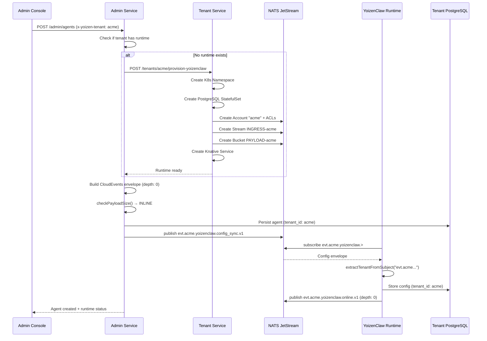
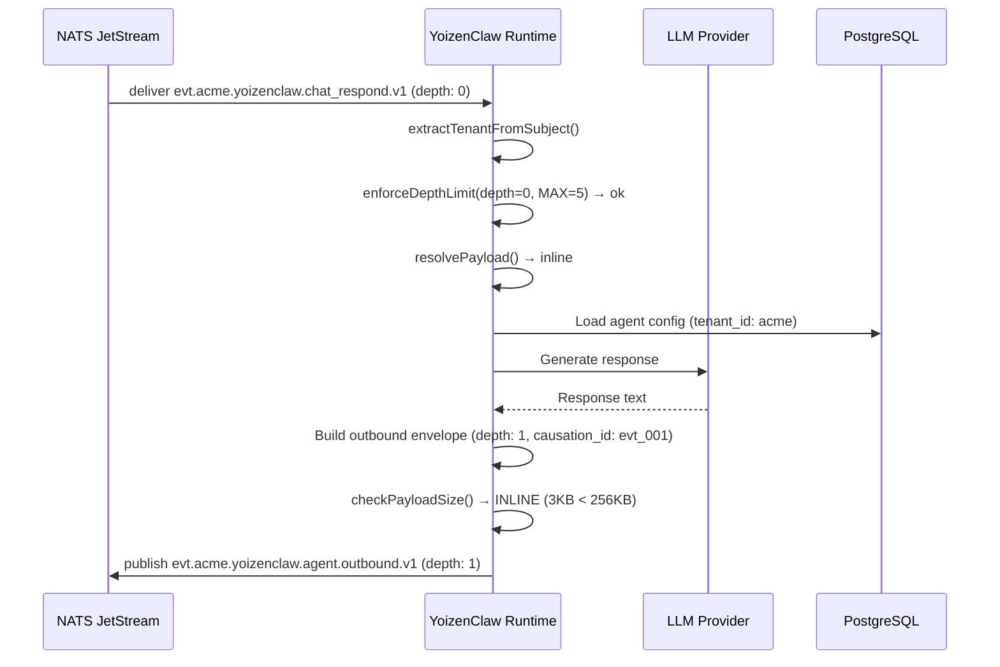
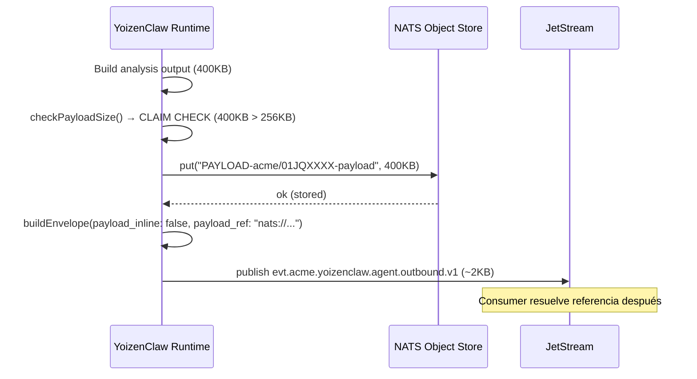

# Design: Integración de YoizenClaw con la Plataforma Yoizen

## Technical Approach

Integración multi-tenant de YoizenClaw siguiendo la arquitectura definida en `wdocs/docs/arquitectura/`. YoizenClaw opera como **agente interno** (trust: alto) que se despliega por tenant en Knative, con aislamiento vía NATS Accounts/ACLs, comunicación con envelopes CloudEvents, Claim Check para payloads grandes, y anti-loop con depth tracking.

## Architecture Decisions

### Decision: Un runtime por tenant vs runtime compartido

**Choice**: Un runtime independiente por tenant desplegado en Knative
**Alternatives considered**: Runtime compartido, Sidecar pattern
**Rationale**: Aislamiento completo de datos y recursos, escalado independiente, consistente con `wdocs/01-service-bus.md` (streams por tenant).

### Decision: NATS subjects con convención wdocs

**Choice**: `evt.{tenant}.yoizenclaw.{action}.v1` per `wdocs/01-service-bus.md`
**Alternatives considered**: `events.{tenant}.runtime.*` (flat), wildcard `events.*.runtime`
**Rationale**: wdocs establece `evt.{tenant}.{domain}.{action}.v1`. Usamos `yoizenclaw` como domain. Ejemplo: `evt.acme.yoizenclaw.config_sync.v1`.

### Decision: CloudEvents Envelope con transport metadata

**Choice**: Envelope CloudEvents con `transport`, `depth`, `causation_id`, `correlation_id` per `wdocs/02-diseño-de-mensajes.md`
**Alternatives considered**: Plain JSON messages
**Rationale**: wdocs/02 requiere envelopes para tracing, anti-loop, y audit trail. El campo `transport` identifica el tipo de agente.

### Decision: YoizenClaw como Agente Interno

**Choice**: `transport.protocol: "internal"`, `transport.agent_id: "yoizenclaw-runtime"`, MAX_DEPTH=5
**Alternatives considered**: Agente de plataforma (OAuth2), agente de tercero (API key)
**Rationale**: wdocs/03-ingress-agentes.md define 4 categorías. YoizenClaw es código nuestro en nuestra infra = interno. Trust alto, rate limit 200 msgs/seg, acceso completo al stream del tenant.

### Decision: Claim Check con NATS Object Store

**Choice**: Payloads > 256KB van a NATS Object Store bucket `PAYLOAD-{tenant}`, referencia en envelope
**Alternatives considered**: Inline siempre, MongoDB GridFS, S3/MinIO
**Rationale**: wdocs/04-claim-check.md establece NATS Object Store con bucket por tenant, TTL alineado al stream, umbral 256KB. Zero infra adicional.

### Decision: NATS Accounts y ACLs por tenant

**Choice**: Cada tenant opera en su propio NATS Account con ACLs restrictivos
**Alternatives considered**: ACLs globales, sin ACLs (confianza en naming)
**Rationale**: wdocs/05-seguridad.md sección 3 requiere aislamiento NATS Account-level. Publish solo desde ingress/service, subscribe solo desde servicios autorizados, cross-tenant prohibido.

### Decision: Anti-loop con campo depth

**Choice**: Campo `depth` en `transport` con MAX_DEPTH=5 para agentes internos
**Alternatives considered**: Sin anti-loop, rate limiting como proxy
**Rationale**: wdocs/03-ingress-agentes.md sección 5 define depth tracking para prevenir loops infinitos. Event rejected → DLQ con razón `depth_exceeded`.

### Decision: Observabilidad alineada a wdocs/06

**Choice**: Métricas `yoizenclaw.*` con tags tenant/agent/channel, logs con `tenant`/`traceid`/`causation_id`, nunca loguear `data.payload`
**Alternatives considered**: OpenTelemetry genérico sin convención
**Rationale**: wdocs/06-observabilidad.md define métricas, logging, alertas y dashboards específicos. PII policy: nunca loguear payload.

### Decision: Tenant Service extiende NATS provisioning

**Choice**: Extender Tenant Service para crear NATS Account + Stream + Object Store + ACLs
**Alternatives considered**: Servicio separado "NATS Provisioner"
**Rationale**: Tenant Service ya provisiona K8s resources. Un solo punto de contacto para infra tenant.

### Decision: Helm chart para despliegue

**Choice**: Helm chart con templates para Knative Service
**Alternatives considered**: Kustomize overlays
**Rationale**: Templating nativo para variables por tenant, versionado, consistente con plataforma.

## Data Flow

### Flujo de creación de agente



### Flujo de chat con agent_outbound



### Flujo de Claim Check (payload grande)



## File Changes

| File | Action | Description |
|------|--------|-------------|
| `services/yoizenclaw-runtime/src/infrastructure/database/memory_postgres_schema.py` | Modify | Agregar `tenant_id` a tablas |
| `services/yoizenclaw-runtime/src/infrastructure/database/memory_postgres.py` | Modify | Queries con tenant_id |
| `services/yoizenclaw-runtime/src/interfaces/nats_bridge.py` | Modify | Subjects wdocs `evt.{tenant}.yoizenclaw.>`, depth tracking |
| `services/yoizenclaw-runtime/src/application/agents/agent_manager.py` | Modify | Caché por tenant, depth tracking |
| `services/yoizenclaw-runtime/src/shared/config/settings.py` | Modify | Agregar `TENANT_ID` env var |
| `services/yoizenclaw-runtime/src/shared/envelope/` | Create | CloudEvents envelope builder |
| `services/yoizenclaw-runtime/src/shared/claim_check/` | Create | Claim Check resolver + checker |
| `services/yoizenclaw-runtime/src/shared/depth/` | Create | Anti-loop depth tracker |
| `services/yoizenclaw-runtime/src/shared/metrics/` | Create | YoizenClaw metrics per wdocs/06 |
| `services/yoizenclaw-runtime/alembic/versions/001_add_tenant_id.py` | Create | Migración tenant_id |
| `services/yoizenclaw-admin-service/src/modules/agents/agents.service.ts` | Modify | Envelope publishing, depth |
| `services/yoizenclaw-admin-service/src/modules/runtime/runtime.service.ts` | Modify | Health checks, NATS Account check |
| `services/tenant-service/src/modules/tenants/tenants.service.ts` | Modify | NATS Account/Stream/Bucket/ACL provisioning |
| `services/tenant-service/src/providers/nats.provider.ts` | Create | NATS Account management |
| `infrastructure/base/yoizenclaw-runtime/` | Create | Helm chart completo |
| `services/admin-console/src/app/agents/` | Create | Módulo Angular completo |
| `packages/shared/src/constants.ts` | Modify | Constantes `YOIZENCLAW_*` |
| `packages/shared-python/envelope.py` | Create | Envelope builder Python |
| `packages/shared-python/tenant.py` | Create | Tenant extraction utils |

## Interfaces / Contracts

### CloudEvents Envelope (wdocs/02 compliance)

```python
# packages/shared-python/envelope.py
from dataclasses import dataclass, field
from typing import Any, Optional
import uuid
from datetime import datetime, timezone

@dataclass
class CloudEventEnvelope:
    specversion: str = "1.0"
    id: str = field(default_factory=lambda: str(uuid.uuid4()))
    source: str = ""
    type: str = ""
    time: str = field(default_factory=lambda: datetime.now(timezone.utc).isoformat())
    traceid: str = ""
    causation_id: Optional[str] = None
    correlation_id: str = ""
    tenant: str = ""
    producer: str = "yoizenclaw"
    domain: str = "messaging"
    channel: str = ""
    provider: str = "internal"
    transport: dict[str, Any] = field(default_factory=dict)
    data: dict[str, Any] = field(default_factory=dict)

def build_internal_agent_envelope(
    tenant: str,
    agent_id: str,
    action: str,
    payload: dict[str, Any],
    causation_id: Optional[str] = None,
    correlation_id: str = "",
    depth: int = 0,
    channel: str = "",
    capabilities: list[str] | None = None,
) -> CloudEventEnvelope:
    return CloudEventEnvelope(
        source=f"/services/yoizenclaw/agents/{agent_id}",
        type=f"io.yoizen.yoizenclaw.agent.{action}.v1",
        tenant=tenant,
        causation_id=causation_id,
        correlation_id=correlation_id,
        channel=channel,
        transport={
            "method": "agent",
            "protocol": "internal",
            "agent_id": agent_id,
            "agent_capabilities": capabilities or ["reply", "classify"],
            "depth": depth,
        },
        data=payload,
    )
```

### NATS Subject Helper (wdocs/01 compliance)

```python
# packages/shared-python/subjects.py
YOIZENCLAW_SUBJECT_PREFIX = "evt.{tenant}.yoizenclaw"
YOIZENCLAW_ACTIONS = {
    "config_sync": "config_sync.v1",
    "jobs_sync": "jobs_sync.v1",
    "job_trigger": "job_trigger.v1",
    "chat_respond": "chat_respond.v1",
    "online": "online.v1",
    "event": "event.v1",
    "agent_outbound": "agent.outbound.v1",
    "execution_status": "job.execution_status.v1",
}

def build_subject(tenant: str, action: str) -> str:
    suffix = YOIZENCLAW_ACTIONS.get(action, f"{action}.v1")
    return f"evt.{tenant}.yoizenclaw.{suffix}"

def extract_tenant_from_subject(subject: str) -> str | None:
    parts = subject.split(".")
    if len(parts) >= 2 and parts[0] == "evt":
        return parts[1]
    return None
```

### Claim Check Resolver (wdocs/04 compliance)

```python
# services/yoizenclaw-runtime/src/shared/claim_check/resolver.py
CLAIM_CHECK_THRESHOLD_BYTES = 262144  # 256 KB

async def check_payload_size(payload_bytes: bytes) -> dict:
    size = len(payload_bytes)
    return {
        "inline": size <= CLAIM_CHECK_THRESHOLD_BYTES,
        "bytes": size,
    }

async def store_payload(
    object_store, tenant: str, event_id: str, payload: bytes
) -> str:
    key = f"PAYLOAD-{tenant}/{event_id}-payload"
    await object_store.put(key, payload)
    return f"nats://objstore/PAYLOAD-{tenant}/{key}"

async def resolve_payload(
    data: dict, object_store
) -> bytes:
    if data.get("payload_inline", True):
        return data.get("payload", b"")
    ref = data.get("payload_ref")
    if not ref:
        raise ValueError("payload_ref missing for non-inline event")
    raw = await object_store.get(ref)
    import hashlib
    checksum = f"sha256:{hashlib.sha256(raw).hexdigest()}"
    expected = data.get("payload_checksum", "")
    if checksum != expected:
        raise ValueError(f"Checksum mismatch: expected {expected}, got {checksum}")
    return raw
```

### Depth Tracker (wdocs/03 compliance)

```python
# services/yoizenclaw-runtime/src/shared/depth/tracker.py
from typing import Any

MAX_DEPTH_INTERNAL = 5

def enforce_depth_limit(
    envelope: dict[str, Any],
    max_depth: int = MAX_DEPTH_INTERNAL,
) -> dict[str, Any]:
    current_depth = envelope.get("transport", {}).get("depth", 0)
    if current_depth >= max_depth:
        raise DepthExceededError(
            f"depth={current_depth} >= MAX_DEPTH={max_depth}"
        )
    return envelope

def increment_depth(envelope: dict[str, Any]) -> dict[str, Any]:
    transport = dict(envelope.get("transport", {}))
    transport["depth"] = transport.get("depth", 0) + 1
    return {**envelope, "transport": transport, "causation_id": envelope.get("id")}

class DepthExceededError(Exception):
    pass
```

### Metrics (wdocs/06 compliance)

```python
# services/yoizenclaw-runtime/src/shared/metrics/yoizenclaw_metrics.py
from opentelemetry import metrics

METER = metrics.get_meter("yoizenclaw")

ingress_published = METER.create_counter(
    "yoizenclaw.ingress.published",
    description="Events published successfully",
    unit="1",
)

ingress_publish_failed = METER.create_counter(
    "yoizenclaw.ingress.publish_failed",
    description="Failed publishes to NATS",
    unit="1",
)

ingress_publish_latency_ms = METER.create_histogram(
    "yoizenclaw.ingress.publish_latency_ms",
    description="Latency of publish operations",
    unit="ms",
)

agent_events = METER.create_counter(
    "yoizenclaw.agent.events",
    description="Events generated by agents",
    unit="1",
)

agent_depth_exceeded = METER.create_counter(
    "yoizenclaw.agent.depth_exceeded",
    description="Events rejected by depth limit",
    unit="1",
)

claimcheck_stored = METER.create_counter(
    "yoizenclaw.claimcheck.stored",
    description="Payloads stored in Object Store",
    unit="1",
)

claimcheck_inline = METER.create_counter(
    "yoizenclaw.claimcheck.inline",
    description="Payloads that traveled inline",
    unit="1",
)

runtime_heartbeat = METER.create_counter(
    "yoizenclaw.runtime.heartbeat",
    description="Runtime heartbeats sent",
    unit="1",
)
```

### NATS Account Provisioning (wdocs/05 compliance)

```typescript
// services/tenant-service/src/providers/nats.provider.ts
interface NatsTenantProvisioning {
  createAccount(tenantId: string): Promise<void>;
  createStream(tenantId: string, tier: "free" | "pro" | "enterprise"): Promise<void>;
  createObjectStore(tenantId: string, tier: string): Promise<void>;
  createACLs(tenantId: string, authorizedServices: string[]): Promise<void>;
  deactivateAccount(tenantId: string): Promise<void>;
}

const STREAM_LIMITS = {
  free: { max_bytes: 1_000_000_000, max_age_days: 7 },
  pro: { max_bytes: 5_000_000_000, max_age_days: 14 },
  enterprise: { max_bytes: 20_000_000_000, max_age_days: 30 },
};
```

## Testing Strategy

| Layer | What to Test | Approach |
|-------|-------------|----------|
| Unit | Envelope builder genera estructura correcta | pytest assertions sobre campos requeridos |
| Unit | Subject builder genera subjects wdocs-compliant | pytest con tenant validation |
| Unit | Depth tracker incrementa y rechaza depth | pytest con depth=5 → DepthExceededError |
| Unit | Claim check resuelve inline y stored payloads | pytest mock Object Store |
| Unit | Tenant extraction from subjects | pytest con subjects parsing |
| Integration | Alembic migrations con upgrade/downgrade | Testcontainers PostgreSQL |
| Integration | NATS subject routing por tenant | Testcontainers NATS, 2 tenants |
| Integration | NATS Account ACLs bloquean cross-tenant | Testcontainers NATS, publish sin auth → reject |
| Integration | Claim Check end-to-end (store + resolve + checksum) | Testcontainers NATS Object Store |
| Integration | Depth enforcement envía a DLQ | Testcontainers NATS, depth chain > 5 |
| Integration | Structured logging con tenant tags | Capture logs, assert campos |
| E2E | Creación completa de agente | Admin Console → Runtime deploy → chat |
| E2E | Aislamiento de datos entre tenants | Verificar tenant A no ve datos de tenant B |
| E2E | Claim Check para respuesta de agente > 256KB | Generate large response, verify Object Store |

## Security Implications

- **Authentication**: Runtime confía en NATS Account ACLs. Admin Service valida `x-yoizen-tenant` header en HTTP requests.
- **Authorization**: NATS ACLs restrictivos por tenant per wdocs/05. Publish solo desde services autorizados, subscribe solo desde consumers del tenant.
- **Input Validation**: DTOs con `class-validator` en Admin Service. Envelope validation en nats_bridge. Depth validation en depth tracker.
- **Data Exposure**: Riesgo mínimo. NATS Account-level aislamiento + PostgreSQL per-tenant + K8s namespace isolation.
- **PII Policy**: NUNCA loguear `data.payload` per wdocs/06 sección 3.4. Payloads pueden contener teléfonos, nombres, contenido de mensajes.
- **Attack Surface**: Incremento mínimo. ACLs NATS bloquean cross-tenant traffic. Depth limit previene loops DoS.
- **Dependencies**: Sin nuevas dependencias de terceros. Todo usa librerías existentes (nats-py, opentelemetry).

## Performance Considerations

- **Critical Path**: Queries con `WHERE tenant_id = $1` + índices compuestos. Impact < 5ms.
- **Claim Check**: Store write before publish. Latencia adicional ~50ms para payloads > 256KB. Resolución en consumer ~30ms.
- **Depth Tracking**: Campo integer en envelope. Zero overhead.
- **NATS Accounts**: Overhead de routing por account. Medido en < 1ms por NATS.
- **Object Store**: Lectura de chunks 128KB. Latencia proporcional al tamaño del payload.
- **Metrics**: Contadores e histogramas OTEL. Overhead < 1ms por operación.

## Migration / Rollout

### Phase 1 (Week 1-2): Foundation
1. Merge Alembic migration (tenant_id)
2. Merge envelope builder + subject helpers
3. Deploy a staging, ejecutar migraciones
4. Verificar backward compatibility

### Phase 2 (Week 3): Core Runtime
1. Deploy NATS bridge con subjects wdocs
2. Deploy depth tracker + claim check
3. Verificar anti-loop con tests

### Phase 3 (Week 4): Admin + Tenant Service
1. Deploy Admin Service con envelope publishing
2. Deploy Tenant Service con NATS Account provisioning
3. Test provisionamiento end-to-end

### Phase 4 (Week 5): Deployment + Observability
1. Merge Helm charts
2. Deploy métricas y dashboards Grafana
3. Verificar alertas

### Phase 5 (Week 6): UI
1. Deploy Admin Console con gestión de agentes
2. E2E testing completo

### Rollback
1. Feature flag `YOIZENCLAW_MULTITENANT_ENABLED=false`
2. `kubectl delete ksvc yoizenclaw-{tenant}`
3. Eliminar NATS Account + Stream + Bucket
4. `alembic downgrade`

## Open Questions

- [ ] ¿Rate limiting por tenant en el runtime? wdocs define 200 msgs/seg para internos
- [ ] ¿Threshold de claim check configurable por tenant? wdocs sugiere 256KB default
- [ ] ¿Backup/restore de agent configs por tenant?
- [ ] ¿Se requiere encriptación at-rest para Object Store? wdocs/05 sección 6.2 lo marca pendiente
- [ ] ¿Tier del stream por defecto para nuevos tenants? wdocs/01 define free/pro/enterprise
