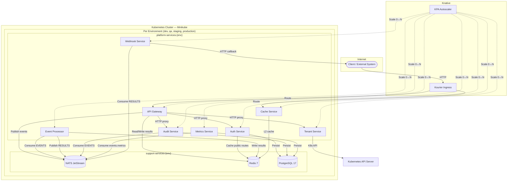
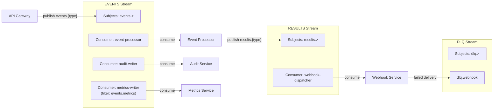
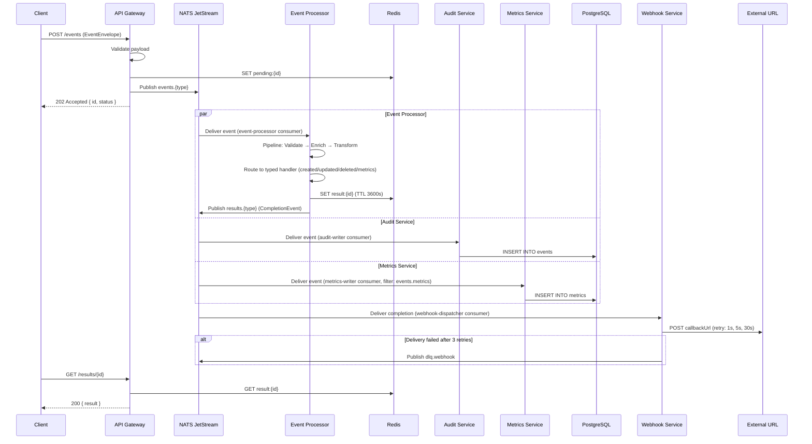
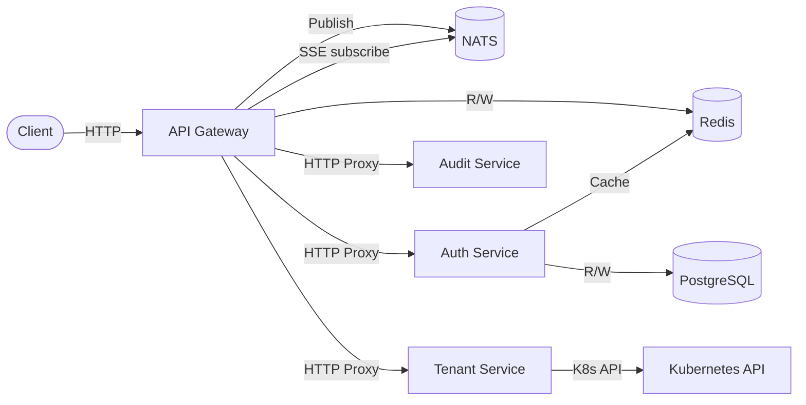
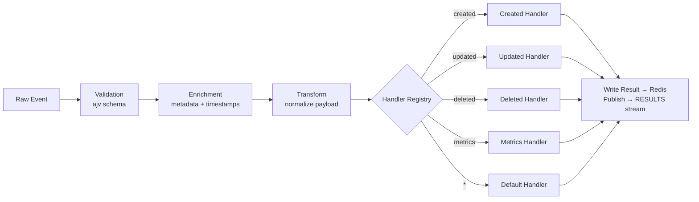
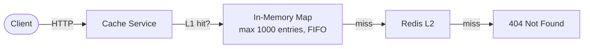
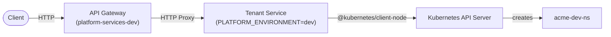
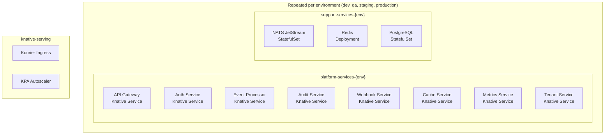

# Yoizen Arch — Architecture

## High-Level Overview



---

## NATS JetStream Streams & Consumers



---

## Event Processing Flow



---

## Service Detail

### API Gateway

| Aspect | Detail |
|--------|--------|
| **Role** | HTTP entry point, event ingestion, SSE streaming, auth proxy, audit proxy, tenant proxy (per-environment) |
| **Port** | 3000 |
| **Scale** | 1 – 10 replicas (concurrency target: 100) |

**Authentication:** All routes require a valid JWT (Bearer token) except those marked as public. The global `AuthGuard` checks every request:

1. Static public routes via `@Public()` decorator (health, token generation)
2. Dynamic public routes from Redis cache (configurable per-tenant per-env and platform-wide per-env)
3. JWT verification (HS256 shared secret from `auth-secret` K8s Secret)
4. Scope enforcement: platform tokens grant full access; tenant tokens are restricted to their scope

**Endpoints:**

| Method | Path | Description | Auth |
|--------|------|-------------|------|
| `POST` | `/auth/token` | Client credentials grant (proxied to Auth Service) | Public |
| `POST` | `/auth/login` | User login (proxied to Auth Service) | Public |
| `POST` | `/auth/refresh` | Refresh access token (proxied to Auth Service) | Public |
| `GET` | `/auth/public-routes` | List dynamic public routes | Platform |
| `POST` | `/auth/public-routes` | Create dynamic public route | Platform |
| `DELETE` | `/auth/public-routes/:id` | Remove dynamic public route | Platform |
| `POST` | `/auth/users` | Create platform user (proxied to Auth Service) | Platform |
| `GET` | `/auth/users` | List platform users (proxied to Auth Service) | Platform |
| `POST` | `/auth/clients` | Create API client (proxied to Auth Service) | Platform |
| `GET` | `/auth/clients` | List API clients (proxied to Auth Service) | Platform |
| `DELETE` | `/auth/clients/:id` | Revoke API client (proxied to Auth Service) | Platform |
| `POST` | `/events` | Ingest event → NATS (202 Accepted) | Required |
| `GET` | `/results/:id` | Fetch processing result from Redis | Required |
| `GET` | `/events/stream` | SSE real-time stream (optional `?types=` filter) | Required |
| `GET` | `/audit/events` | Query audit events (proxied to Audit Service) | Required |
| `GET` | `/audit/events/:id` | Get single audit event (proxied to Audit Service) | Required |
| `POST` | `/tenants` | Create tenant in this environment (proxied to Tenant Service) | Platform |
| `GET` | `/tenants` | List tenants in this environment (proxied to Tenant Service) | Required |
| `GET` | `/tenants/:name` | Get tenant detail (proxied to Tenant Service) | Required |
| `DELETE` | `/tenants/:name` | Delete tenant in this environment (proxied to Tenant Service) | Platform |
| `GET` | `/health` | Aggregated health: NATS + Redis + downstream | Public |



---

### Auth Service

| Aspect | Detail |
|--------|--------|
| **Role** | Authentication and authorization: JWT token generation, user/client management, public routes configuration |
| **Port** | 3000 |
| **Scale** | 1 – 3 replicas (concurrency target: 50) |

Each auth-service instance is **environment-scoped** via `PLATFORM_ENVIRONMENT`. It manages public routes per environment and seeds an admin user on first startup from `ADMIN_EMAIL` / `ADMIN_PASSWORD` env vars.

**Token Scopes:**

| Scope | Description |
|-------|-------------|
| `platform` | Full platform management access (tenant CRUD, audit, user/client management) |
| `tenant:<name>` | Tenant-scoped access restricted to operations for that tenant |

**Identity Sources:**

| Source | Grant | Token Scope |
|--------|-------|-------------|
| Platform User (email + password) | `POST /auth/login` | `platform` |
| API Client (client\_id + client\_secret) | `POST /auth/token` | `platform` or `tenant:<name>` (per client config) |

**JWT Payload:**

```
{
  sub: string,          // user or client ID
  type: 'user' | 'client',
  scope: 'platform' | 'tenant:<name>',
  role?: 'admin' | 'operator',  // users only
  env: string,
  iat: number,
  exp: number
}
```

**Database Schema:**

```sql
platform_users  (id, email, password_hash, role, is_active, created_at, updated_at)
api_clients     (id, client_id, client_secret_hash, name, scope, is_active, created_at, updated_at)
public_routes   (id, method, path_pattern, scope, environment, created_at)
```

**Public Routes:**

Dynamic public routes are stored in PostgreSQL and synced to Redis (`public_routes:{env}`) on every mutation. The API gateway caches them in-memory with a 30-second TTL. Routes can be scoped platform-wide or per-tenant.

**Endpoints:**

| Method | Path | Description |
|--------|------|-------------|
| `POST` | `/auth/token` | Client credentials grant |
| `POST` | `/auth/login` | User login (email + password) |
| `POST` | `/auth/refresh` | Refresh access token |
| `GET` | `/auth/public-routes` | List public routes for this environment |
| `POST` | `/auth/public-routes` | Create public route |
| `DELETE` | `/auth/public-routes/:id` | Remove public route |
| `POST` | `/auth/users` | Create platform user |
| `GET` | `/auth/users` | List platform users |
| `POST` | `/auth/clients` | Create API client |
| `GET` | `/auth/clients` | List API clients |
| `DELETE` | `/auth/clients/:id` | Revoke API client |


---

### Event Processor

| Aspect | Detail |
|--------|--------|
| **Role** | Consume events, validate, enrich, transform, route to handlers |
| **Port** | 3000 |
| **Scale** | 1 – 20 replicas (concurrency target: 50) |

**Pipeline:**



---

### Audit Service

| Aspect | Detail |
|--------|--------|
| **Role** | Persist all events to PostgreSQL for auditing and queries |
| **Port** | 3000 |
| **Scale** | 1 – 5 replicas (concurrency target: 50) |

**Database Schema:**

```sql
CREATE TABLE events (
    id         TEXT PRIMARY KEY,
    type       TEXT NOT NULL,
    payload    JSONB NOT NULL,
    metadata   JSONB,
    subject    TEXT,
    created_at TIMESTAMPTZ DEFAULT NOW()
);
-- Indexes: type, created_at, (type, created_at)
```

**Query Endpoints:**

| Method | Path | Params |
|--------|------|--------|
| `GET` | `/audit/events` | `type`, `from`, `to`, `limit` (1–500), `offset` |
| `GET` | `/audit/events/:id` | — |

---

### Metrics Service

| Aspect | Detail |
|--------|--------|
| **Role** | Consume `events.metrics` and store metrics in PostgreSQL |
| **Port** | 3000 |
| **Scale** | 1 – 5 replicas (concurrency target: 50) |

**Database Schema:**

```sql
CREATE TABLE metrics (
    id         TEXT PRIMARY KEY,
    source     TEXT NOT NULL,
    name       TEXT NOT NULL,
    value      DOUBLE PRECISION NOT NULL,
    tags       JSONB DEFAULT '{}',
    metadata   JSONB DEFAULT '{}',
    created_at TIMESTAMPTZ DEFAULT NOW()
);
-- Indexes: source, name, (source, created_at), created_at
```

**Query Endpoints:**

| Method | Path | Params |
|--------|------|--------|
| `GET` | `/metrics` | `source`, `name`, `from`, `to`, `limit` (1–500), `offset` |
| `GET` | `/metrics/:id` | — |

---

### Webhook Service

| Aspect | Detail |
|--------|--------|
| **Role** | Deliver processing results as HTTP callbacks to external URLs |
| **Port** | 3000 |
| **Scale** | 1 – 5 replicas (concurrency target: 50) |

**Retry Policy:**

| Attempt | Delay |
|---------|-------|
| 1 | 1 second |
| 2 | 5 seconds |
| 3 | 30 seconds |
| Failed | → `dlq.webhook` |

**Delivery Tracking:** In-memory `Map` (FIFO, max 10k entries).

---

### Cache Service

| Aspect | Detail |
|--------|--------|
| **Role** | HTTP key-value cache with L1 (memory) + L2 (Redis) |
| **Port** | 3000 |
| **Scale** | 0 – 5 replicas (concurrency target: 100, **scale-to-zero enabled**) |



**Endpoints:**

| Method | Path | Description |
|--------|------|-------------|
| `GET` | `/cache/:key` | Get value (L1 → L2 fallback) |
| `PUT` | `/cache/:key` | Set value `{ value, ttl? }` |
| `DELETE` | `/cache/:key` | Delete key |
| `POST` | `/cache/batch` | Batch get `{ keys: [] }` |
| `GET` | `/cache` | Scan keys `{ pattern, count }` |

---

### Tenant Service

| Aspect | Detail |
|--------|--------|
| **Role** | Provision and manage tenant namespaces via Kubernetes API |
| **Port** | 3000 |
| **Scale** | 1 – 3 replicas (concurrency target: 50) |

Each tenant-service instance is **environment-scoped** via the `PLATFORM_ENVIRONMENT` env var. Creating a tenant through the dev API gateway creates only `<tenant>-dev-ns`; through qa, only `<tenant>-qa-ns`; and so on. This provides third-level isolation: each environment manages its own tenant namespaces independently.

**Namespace Labels:**

| Label | Value |
|-------|-------|
| `app.kubernetes.io/part-of` | `yoizen-arch` |
| `yoizen.io/tenant` | `<tenant-name>` |
| `yoizen.io/environment` | `dev` / `qa` / `staging` / `production` |
| `yoizen.io/managed-by` | `tenant-service` |



**Endpoints:**

| Method | Path | Description |
|--------|------|-------------|
| `POST` | `/tenants` | Create tenant namespace for this environment |
| `GET` | `/tenants` | List tenants in this environment |
| `GET` | `/tenants/:name` | Get tenant detail (namespace status) |
| `DELETE` | `/tenants/:name` | Delete tenant namespace in this environment |

**Example — create a tenant in dev:**

```bash
curl -X POST http://api-gateway.platform-services-dev.<MINIKUBE_IP>.sslip.io/tenants \
  -H "Content-Type: application/json" \
  -d '{"name":"acme"}'
# Creates: acme-dev-ns
```

**Example — create the same tenant in production:**

```bash
curl -X POST http://api-gateway.platform-services-production.<MINIKUBE_IP>.sslip.io/tenants \
  -H "Content-Type: application/json" \
  -d '{"name":"acme"}'
# Creates: acme-production-ns
```

---

## Infrastructure

### Kubernetes Namespaces

Each environment (dev, qa, staging, production) gets its own isolated pair of namespaces:

| Environment | Support Namespace | Platform Namespace |
|-------------|-------------------|--------------------|
| dev | `support-services-dev` | `platform-services-dev` |
| qa | `support-services-qa` | `platform-services-qa` |
| staging | `support-services-staging` | `platform-services-staging` |
| production | `support-services-production` | `platform-services-production` |



### Knative Autoscaling

| Service | Min Scale | Max Scale | Concurrency Target |
|---------|-----------|-----------|-------------------|
| API Gateway | 1 | 10 | 100 |
| Auth Service | 1 | 3 | 50 |
| Event Processor | 1 | 20 | 50 |
| Audit Service | 1 | 5 | 50 |
| Webhook Service | 1 | 5 | 50 |
| Cache Service | **0** | 5 | 100 |
| Metrics Service | 1 | 5 | 50 |
| Tenant Service | 1 | 3 | 50 |

### Container Build

All services use identical multi-stage Dockerfiles:

```
Stage 1 (install):  oven/bun:1.3-alpine → install dependencies
Stage 2 (build):    copy source + @yoizen/shared → bun build
Stage 3 (runtime):  oven/bun:1.3-alpine → non-root, port 3000
```

Images are built against the Minikube Docker daemon as `dev.local/<service>:local`.

### Support Services Resources (Local Overlay)

| Component | CPU (req/limit) | Memory (req/limit) | Storage |
|-----------|----------------|---------------------|---------|
| NATS | 100m / 500m | 128Mi / 256Mi | 1Gi PVC |
| Redis | 50m / 200m | 64Mi / 128Mi | — |
| PostgreSQL | 100m / 500m | 128Mi / 256Mi | 2Gi PVC |

---

## Shared Package: `@yoizen/shared`

Provides type-safe constants and interfaces consumed by all services.

### Key Constants

| Constant | Value | Used By |
|----------|-------|---------|
| `STREAM_NAME` | `EVENTS` | All except Cache |
| `RESULTS_STREAM_NAME` | `RESULTS` | Event Processor, Webhook |
| `DLQ_STREAM_NAME` | `DLQ` | Webhook |
| `CONSUMER_NAME` | `event-processor` | Event Processor |
| `AUDIT_CONSUMER_NAME` | `audit-writer` | Audit Service |
| `METRICS_CONSUMER_NAME` | `metrics-writer` | Metrics Service |
| `WEBHOOK_CONSUMER_NAME` | `webhook-dispatcher` | Webhook Service |
| `RESULT_TTL` | `3600` (1 hour) | API Gateway, Event Processor |

### Core Interfaces

```
EventEnvelope    → { id, type, payload, metadata?, callbackUrl? }
EventMetadata    → { receivedAt, source, subject }
ProcessedEvent   → { ...envelope, result, processedAt, processingTime }
CompletionEvent  → { eventId, type, status, result, completedAt }
EventResult      → { eventId, status, data, processedAt, processingTime }
MetricsPayload   → { source, name, value, tags?, metadata? }
```

---

## Data Flow Summary

```mermaid
graph TD
    subgraph Ingress
        C([Client]) -->|POST /events| GW[API Gateway]
    end

    subgraph Event Bus — NATS JetStream
        EVENTS[EVENTS Stream<br/>events.>]
        RESULTS[RESULTS Stream<br/>results.>]
        DLQ[DLQ Stream<br/>dlq.>]
    end

    subgraph Processing
        EP[Event Processor]
    end

    subgraph Persistence
        AS[Audit Service] -->|INSERT| PG_E[(PostgreSQL<br/>events table)]
        MS[Metrics Service] -->|INSERT| PG_M[(PostgreSQL<br/>metrics table)]
    end

    subgraph Delivery
        WH[Webhook Service] -->|POST callback| EXT([External URL])
    end

    subgraph Cache Layer
        Redis[(Redis)]
        CS[Cache Service] -->|L1 + L2| Redis
    end

    GW -->|publish| EVENTS
    GW -->|pending/result R/W| Redis

    EVENTS -->|event-processor| EP
    EVENTS -->|audit-writer| AS
    EVENTS -->|"metrics-writer<br/>(events.metrics only)"| MS

    EP -->|write result| Redis
    EP -->|publish| RESULTS

    RESULTS -->|webhook-dispatcher| WH
    WH -->|failed 3x| DLQ

    C -->|GET /results/:id| GW
    GW -->|read| Redis

    C -->|GET /audit/events| GW
    GW -->|HTTP proxy| AS

    C -->|POST /auth/token| GW
    GW -->|HTTP proxy| AUTH[Auth Service]
    AUTH -->|R/W| PG_A[(PostgreSQL<br/>auth tables)]
    AUTH -->|sync public routes| Redis

    C -->|POST /tenants| GW
    GW -->|HTTP proxy| TS[Tenant Service]
    TS -->|K8s API| K8sAPI[Kubernetes API]
```

---

## Deployment Topology

```
┌───────────────────────────────────────────────────────────────────────┐
│  Minikube Cluster (6 CPU, 16GB RAM, Docker driver)                    │
│                                                                       │
│  ┌─── knative-serving ─────────────────────────────────────────────┐  │
│  │  Kourier Ingress  ·  KPA Autoscaler  ·  sslip.io DNS           │  │
│  └─────────────────────────────────────────────────────────────────┘  │
│                                                                       │
│  ┌─── Per Environment (x4: dev, qa, staging, production) ──────────┐  │
│  │                                                                 │  │
│  │  ┌─ platform-services-{env} (Knative Services) ──────────────┐  │  │
│  │  │  api-gateway · auth-service · event-processor               │  │  │
│  │  │  audit-service · cache-service · webhook-service           │  │  │
│  │  │  metrics-service · tenant-service                          │  │  │
│  │  └────────────────────────────────────────────────────────────┘  │  │
│  │                                                                 │  │
│  │  ┌─ support-services-{env} (StatefulSets / Deployments) ─────┐  │  │
│  │  │  NATS JetStream · Redis 7 · PostgreSQL 17                  │  │  │
│  │  └────────────────────────────────────────────────────────────┘  │  │
│  │                                                                 │  │
│  └─────────────────────────────────────────────────────────────────┘  │
│                                                                       │
└───────────────────────────────────────────────────────────────────────┘
```

---

## Tech Stack

| Layer | Technology |
|-------|-----------|
| **Language** | TypeScript 5 (strict mode) |
| **Runtime** | Bun 1.3 |
| **Framework** | NestJS 11 + Fastify |
| **Messaging** | NATS JetStream |
| **Cache** | Redis 7 (via ioredis) |
| **Database** | PostgreSQL 17 (via `postgres` driver) |
| **Orchestration** | Kubernetes (Minikube) |
| **Serverless** | Knative Serving 1.17 |
| **Ingress** | Kourier 1.17 |
| **DNS** | sslip.io (wildcard) |
| **Containers** | Docker multi-stage (oven/bun:1.3-alpine) |
| **IaC** | Kustomize (base + overlays) |
| **Auth** | JWT via `jose` (HS256), `Bun.password` argon2id hashing |
| **Validation** | class-validator (Gateway, Tenant, Auth), ajv (Event Processor) |
| **K8s Client** | @kubernetes/client-node (Tenant Service) |
