# Yoizen Arch — Architecture

## High-Level Overview

```mermaid
graph TB
    subgraph Internet
        Client([Client / External System])
    end

    subgraph cluster ["Kubernetes Cluster — Minikube"]
        subgraph perEnv ["Per Environment (dev, qa, staging, production)"]
            subgraph platformSvc ["platform-services-{env}"]
                GW[API Gateway]
                AUTH[Auth Service]
                EP[Event Processor]
                AS[Audit Service]
                WH[Webhook Service]
                CS[Cache Service]
                MS[Metrics Service]
                TS[Tenant Service]
                SCHED[Scheduler Service]
                REG[Registry Service]
                WF_API[Workflow API]
                WF_WORKER[Workflow Worker]
                WF_HTTP[Workflow HTTP Worker]
            end

            subgraph supportSvc ["support-services-{env}"]
                NATS[(NATS JetStream)]
                Redis[(Redis 7)]
                PG[(PostgreSQL 17)]
                TEMPORAL[(Temporal)]
            end

            subgraph tenantNs ["{tenant}-{env}-ns"]
                TPG[(Tenant PostgreSQL)]
                TSVC[Tenant Knative Services]
            end
        end
    end

    subgraph Knative
        Kourier[Kourier Ingress]
        Autoscaler[KPA Autoscaler]
    end

    Client -->|HTTP| Kourier
    Kourier -->|Route| GW
    Kourier -->|Route| CS

    GW -->|Publish events| NATS
    GW -->|Read/Write results| Redis
    GW -->|HTTP proxy| AUTH
    GW -->|HTTP proxy| AS
    GW -->|HTTP proxy| TS
    GW -->|HTTP proxy| SCHED
    GW -->|HTTP proxy| REG
    GW -->|HTTP proxy| WF_API
    GW -->|"Dynamic route proxy"| TSVC
    AUTH -->|Persist| PG
    AUTH -->|Cache public routes| Redis
    TS -->|K8s API| K8sAPI[Kubernetes API Server]
    TS -->|Provision| TPG

    EP -->|Consume EVENTS| NATS
    EP -->|Publish RESULTS| NATS
    EP -->|Write results| Redis

    AS -->|Consume EVENTS| NATS
    AS -->|Persist| TPG

    MS -->|Consume events.metrics| NATS
    MS -->|Persist| TPG

    WH -->|Consume RESULTS| NATS
    WH -->|HTTP callback| Client

    CS -->|L2 cache| Redis

    SCHED -->|Persist| TPG
    SCHED -->|K8s Jobs| K8sAPI
    REG -->|Persist| PG
    REG -->|Knative API| K8sAPI

    WF_API -->|Start/Query| TEMPORAL
    WF_WORKER -->|Execute workflows| TEMPORAL
    WF_WORKER -->|NATS publish| NATS
    WF_HTTP -->|Execute HTTP activities| TEMPORAL

    Autoscaler -.->|Scale 0-N| GW
    Autoscaler -.->|Scale 0-N| EP
    Autoscaler -.->|Scale 0-N| AS
    Autoscaler -.->|Scale 0-N| WH
    Autoscaler -.->|Scale 0-N| CS
    Autoscaler -.->|Scale 0-N| MS
    Autoscaler -.->|Scale 0-N| TS
    Autoscaler -.->|Scale 0-N| AUTH
    Autoscaler -.->|Scale 0-N| SCHED
    Autoscaler -.->|Scale 0-N| REG
    Autoscaler -.->|Scale 0-N| WF_API
    Autoscaler -.->|Scale 0-N| WF_WORKER
    Autoscaler -.->|Scale 0-N| WF_HTTP
```

---

## NATS JetStream Streams & Consumers

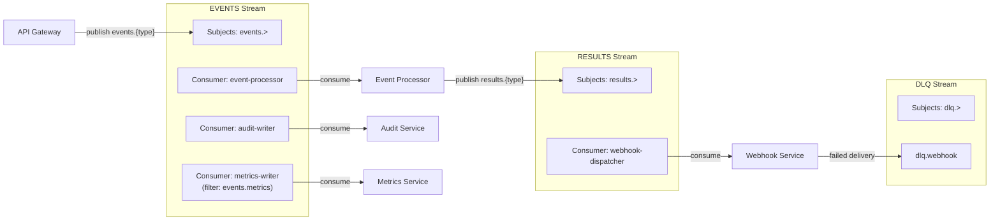

---

## Event Processing Flow

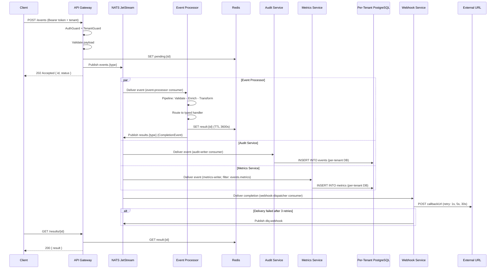

---

## Authentication & Authorization Flow

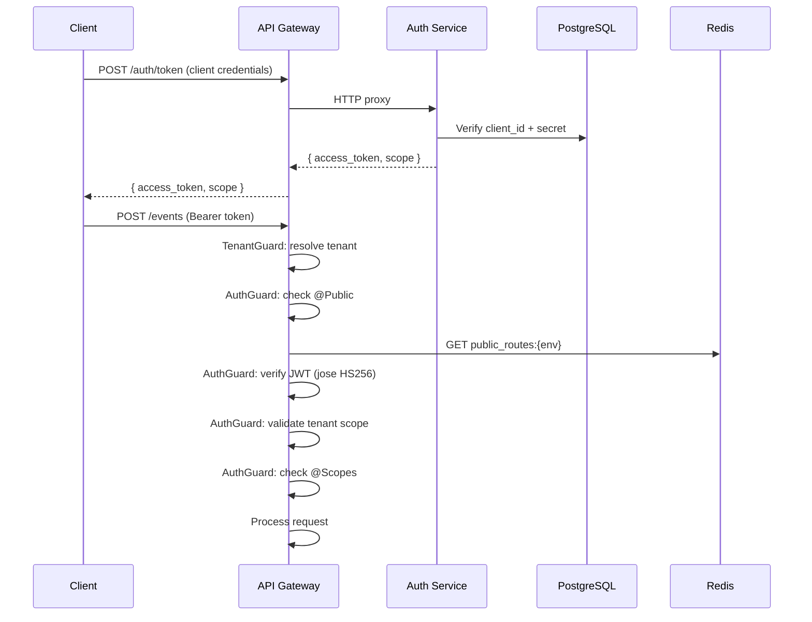

---

## Dynamic Routing Flow

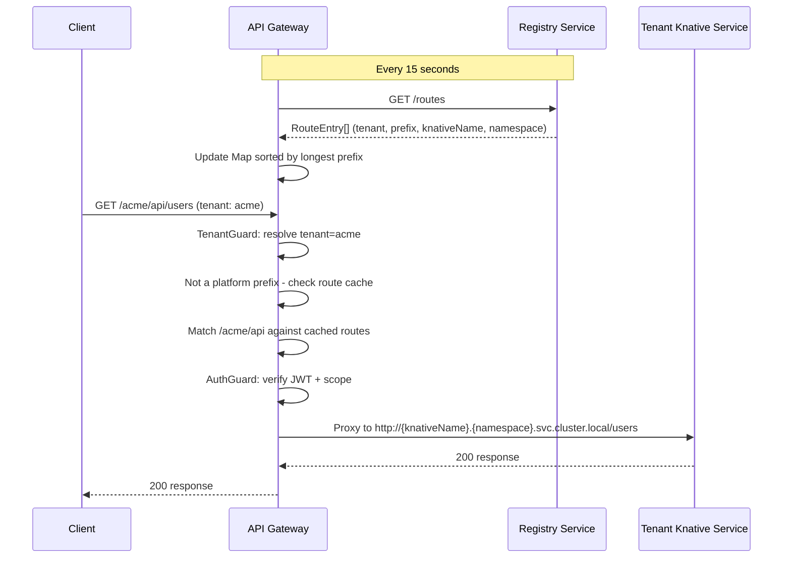

---

## Workflow Execution Flow

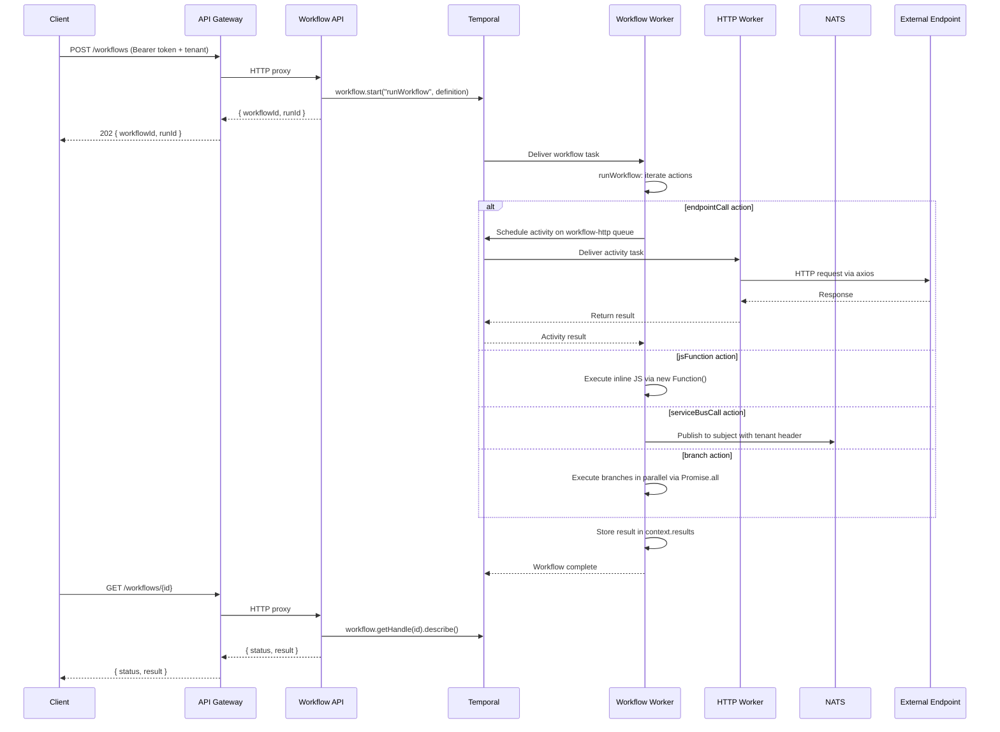

---

## Tenant Provisioning Flow

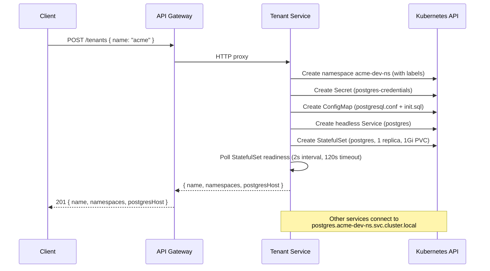

---

## Service Detail

### API Gateway

| Aspect | Detail |
|--------|--------|
| **Role** | HTTP entry point, JWT auth, event ingestion, SSE streaming, dynamic tenant routing, proxies to all downstream services |
| **Port** | 3000 |
| **Scale** | 1 -- 10 replicas (concurrency target: 100) |

**Authentication:** All routes require a valid JWT (Bearer token) except those marked as public. The global `AuthGuard` checks every request:

1. Static public routes via `@Public()` decorator (health, token generation)
2. Dynamic public routes from Redis cache (configurable per-tenant and platform-wide)
3. JWT verification (HS256 shared secret from `auth-secret` K8s Secret)
4. Scope enforcement: platform tokens grant full access; tenant tokens are restricted

**Endpoints:**

| Method | Path | Description | Auth |
|--------|------|-------------|------|
| `POST` | `/auth/token` | Client credentials grant | Public |
| `POST` | `/auth/login` | User login | Public |
| `POST` | `/auth/refresh` | Refresh access token | Public |
| `GET/POST/DELETE` | `/auth/public-routes` | Dynamic public route management | Platform |
| `POST/GET` | `/auth/users` | Platform user management | Platform |
| `POST/GET/DELETE` | `/auth/clients` | API client management | Platform |
| `POST` | `/events` | Ingest event (202 Accepted) | Required |
| `GET` | `/results/:id` | Fetch processing result | Required |
| `GET` | `/events/stream` | SSE real-time stream | Required |
| `GET` | `/audit/events` | Query audit events | Required |
| `POST/GET/DELETE` | `/tenants` | Tenant management | Platform (write) / Required (read) |
| `POST/GET/PATCH/DELETE` | `/schedulers/schedules` | Schedule management | Required |
| `GET` | `/schedulers/executions` | Execution history | Required |
| `POST/GET/PATCH/DELETE` | `/registry/services` | Service registry | Required |
| `POST/PATCH/GET` | `/registry/services/:id/canary` | Canary deployments | Required |
| `POST/GET` | `/workflows` | Workflow management | Required |
| `GET` | `/health` | Aggregated health | Public |

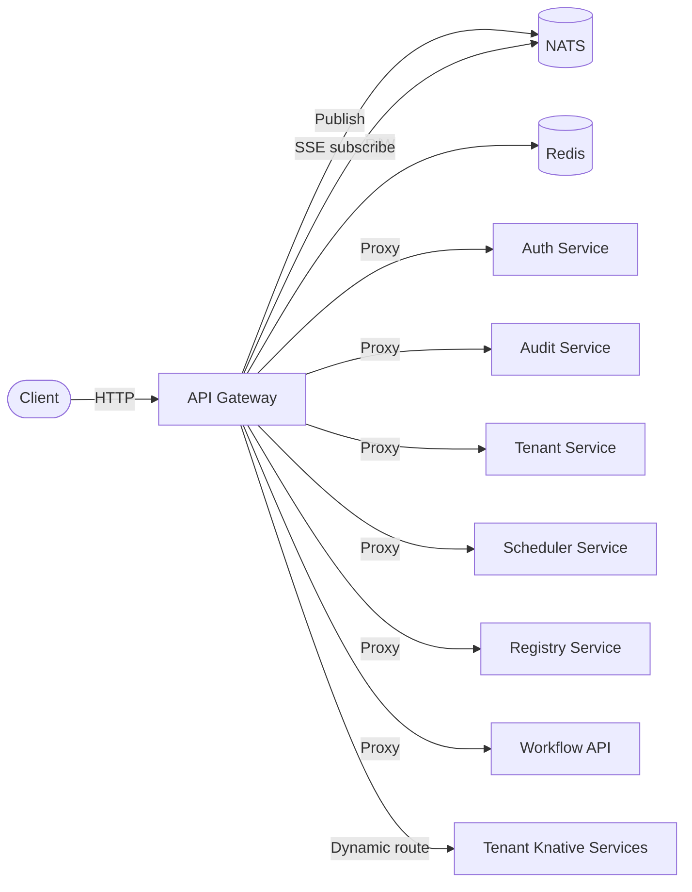

---

### Auth Service

| Aspect | Detail |
|--------|--------|
| **Role** | JWT token generation, user/client management, public routes configuration |
| **Port** | 3000 |
| **Scale** | 1 -- 3 replicas (concurrency target: 50) |

**Token Scopes:**

| Scope | Description |
|-------|-------------|
| `platform` | Full platform management access |
| `tenant:<name>` | Tenant-scoped access |

**Identity Sources:**

| Source | Grant | Token Scope |
|--------|-------|-------------|
| Platform User (email + password) | `POST /auth/login` | `platform` |
| API Client (client_id + client_secret) | `POST /auth/token` | `platform` or `tenant:<name>` |

**Database Schema:**

```sql
platform_users  (id, email, password_hash, role, is_active, created_at, updated_at)
api_clients     (id, client_id, client_secret_hash, name, scope, is_active, created_at, updated_at)
public_routes   (id, method, path_pattern, scope, environment, created_at)
```

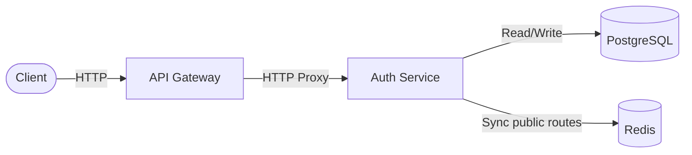

---

### Event Processor

| Aspect | Detail |
|--------|--------|
| **Role** | Consume events, validate, enrich, transform, route to handlers |
| **Port** | 3000 |
| **Scale** | 1 -- 20 replicas (concurrency target: 50) |

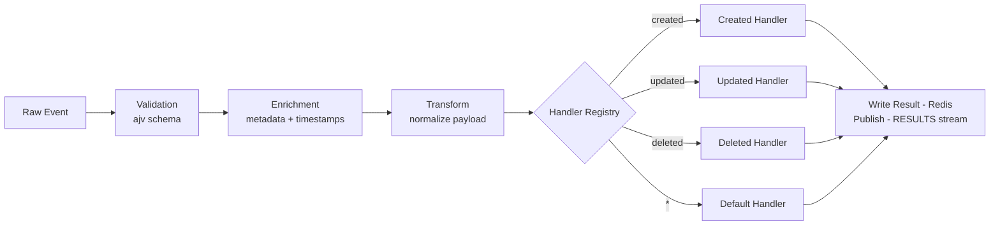

---

### Audit Service

| Aspect | Detail |
|--------|--------|
| **Role** | Persist all events to per-tenant PostgreSQL for auditing and queries |
| **Port** | 3000 |
| **Scale** | 1 -- 5 replicas (concurrency target: 50) |

**Database Schema (per-tenant):**

```sql
CREATE TABLE events (
    id         TEXT PRIMARY KEY,
    type       TEXT NOT NULL,
    payload    JSONB NOT NULL,
    metadata   JSONB,
    subject    TEXT,
    created_at TIMESTAMPTZ DEFAULT NOW()
);
```

---

### Metrics Service

| Aspect | Detail |
|--------|--------|
| **Role** | Consume `events.metrics` and store metrics in per-tenant PostgreSQL |
| **Port** | 3000 |
| **Scale** | 1 -- 5 replicas (concurrency target: 50) |

**Database Schema (per-tenant):**

```sql
CREATE TABLE metrics (
    id         TEXT PRIMARY KEY,
    source     TEXT NOT NULL,
    name       TEXT NOT NULL,
    value      DOUBLE PRECISION NOT NULL,
    tags       JSONB DEFAULT '{}',
    metadata   JSONB DEFAULT '{}',
    created_at TIMESTAMPTZ DEFAULT NOW()
);
```

---

### Webhook Service

| Aspect | Detail |
|--------|--------|
| **Role** | Deliver processing results as HTTP callbacks to external URLs |
| **Port** | 3000 |
| **Scale** | 1 -- 5 replicas (concurrency target: 50) |

**Retry Policy:**

| Attempt | Delay |
|---------|-------|
| 1 | 1 second |
| 2 | 5 seconds |
| 3 | 30 seconds |
| Failed | dlq.webhook |

---

### Cache Service

| Aspect | Detail |
|--------|--------|
| **Role** | HTTP key-value cache with L1 (memory) + L2 (Redis) |
| **Port** | 3000 |
| **Scale** | 0 -- 5 replicas (concurrency target: 100, **scale-to-zero enabled**) |

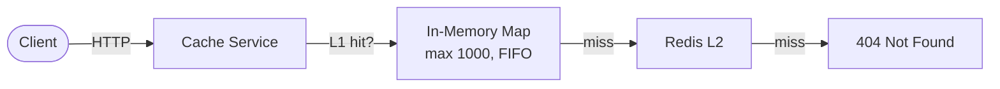

---

### Tenant Service

| Aspect | Detail |
|--------|--------|
| **Role** | Provision tenant namespaces + dedicated PostgreSQL via Kubernetes API |
| **Port** | 3000 |
| **Scale** | 1 -- 3 replicas (concurrency target: 50) |

Each tenant gets a dedicated namespace (`<tenant>-<env>-ns`) with a PostgreSQL StatefulSet provisioned automatically on creation.

**Namespace Labels:**

| Label | Value |
|-------|-------|
| `app.kubernetes.io/part-of` | `yoizen-arch` |
| `yoizen.io/tenant` | `<tenant-name>` |
| `yoizen.io/environment` | `dev` / `qa` / `staging` / `production` |
| `yoizen.io/managed-by` | `tenant-service` |

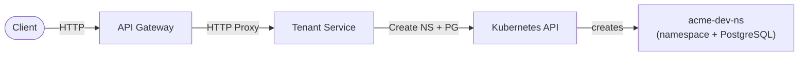

---

### Scheduler Service

| Aspect | Detail |
|--------|--------|
| **Role** | Multi-tenant job scheduling with cron, interval, and one-time support |
| **Port** | 3000 |
| **Scale** | 1 -- 5 replicas (concurrency target: 50) |

**Schedule Types:**

| Type | Expression | Example |
|------|-----------|---------|
| `cron` | Cron expression | `0 */5 * * *` |
| `interval` | Milliseconds | `60000` |
| `one-time` | ISO timestamp | `2025-01-01T00:00:00Z` |

**Execution Modes:**

| Mode | Description |
|------|-------------|
| `js-inline` | In-process JS evaluation |
| `js-k8s` | K8s Job with Bun runtime |
| `docker` | K8s Job with custom image |

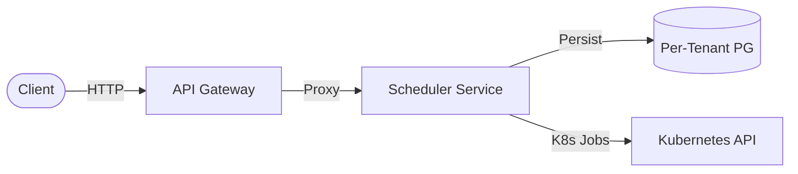

---

### Registry Service

| Aspect | Detail |
|--------|--------|
| **Role** | Knative service registry with route management and canary deployments |
| **Port** | 3000 |
| **Scale** | 1 -- 5 replicas (concurrency target: 50) |

**Database Schema:**

```sql
registered_services (id, tenant_id, name, image, port, min_scale, max_scale, status, knative_name, namespace, ...)
service_routes      (id, service_id, path_prefix, methods[], is_public, strip_prefix, ...)
canary_deployments  (id, service_id, stable_revision, canary_revision, canary_percent, status, ...)
```

**Canary Deployment Flow:**

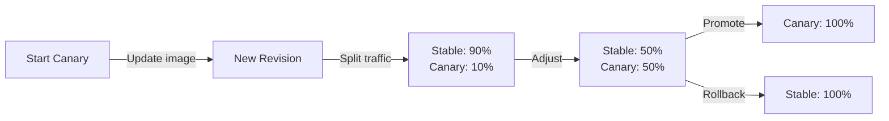

---

### Workflow Service (API + Worker)

| Aspect | Detail |
|--------|--------|
| **Role** | REST API for Temporal workflows + orchestrator worker |
| **Port** | 3000 |
| **Scale** | API: 1--5, Worker: 1--3 |

**Action Types:**

| Activity | Task Queue | Description |
|----------|-----------|-------------|
| `endpointCall` | `workflow-http` | HTTP request via workflow-http-worker |
| `jsFunction` | `workflow-orchestrator` | Inline JS evaluation |
| `serviceBusCall` | `workflow-orchestrator` | NATS publish with tenant header |
| `branch` | (workflow-level) | Parallel execution of sub-actions |

Actions support `{{path.to.value}}` template resolution against the execution context.

---

### Workflow HTTP Worker

| Aspect | Detail |
|--------|--------|
| **Role** | Standalone Temporal worker for HTTP activities |
| **Port** | 3000 (health only) |
| **Scale** | 1 -- 5 replicas |

Executes `endpointCall` activities via `axios` with automatic `x-yoizen-tenant` header injection. Max 200 concurrent activity tasks.

---

## Infrastructure

### Kubernetes Namespaces

| Environment | Support Namespace | Platform Namespace |
|-------------|-------------------|--------------------|
| dev | `support-services-dev` | `platform-services-dev` |
| qa | `support-services-qa` | `platform-services-qa` |
| staging | `support-services-staging` | `platform-services-staging` |
| production | `support-services-production` | `platform-services-production` |

Additionally, each tenant gets `<tenant>-<env>-ns` namespaces with isolated PostgreSQL.

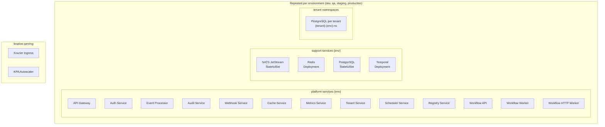

### Knative Autoscaling

| Service | Min Scale | Max Scale | Concurrency Target |
|---------|-----------|-----------|-------------------|
| API Gateway | 1 | 10 | 100 |
| Auth Service | 1 | 3 | 50 |
| Event Processor | 1 | 20 | 50 |
| Audit Service | 1 | 5 | 50 |
| Webhook Service | 1 | 5 | 50 |
| Cache Service | **0** | 5 | 100 |
| Metrics Service | 1 | 5 | 50 |
| Tenant Service | 1 | 3 | 50 |
| Scheduler Service | 1 | 5 | 50 |
| Registry Service | 1 | 5 | 50 |
| Workflow API | 1 | 5 | 50 |
| Workflow Worker | 1 | 3 | 50 |
| Workflow HTTP Worker | 1 | 5 | 100 |

### Container Build

All services use multi-stage Dockerfiles:

```
Stage 1 (install):  oven/bun:1.3-alpine → install dependencies
Stage 2 (build):    copy source + @yoizen/shared → bun build
Stage 3 (runtime):  oven/bun:1.3-alpine → non-root, port 3000
```

Workflow services use `oven/bun:1.3-debian` (Temporal native SDK requires glibc).

Images are built against the Minikube Docker daemon as `dev.local/<service>:local`.

### Support Services Resources (Local Overlay)

| Component | CPU (req/limit) | Memory (req/limit) | Storage |
|-----------|----------------|---------------------|---------|
| NATS | 100m / 500m | 128Mi / 256Mi | 1Gi PVC |
| Redis | 50m / 200m | 64Mi / 128Mi | -- |
| PostgreSQL | 100m / 500m | 128Mi / 256Mi | 2Gi PVC |
| Temporal | 100m / 500m | 128Mi / 256Mi | -- (uses PG) |

---

## Shared Package: `@yoizen/shared`

Provides type-safe constants and interfaces consumed by all services.

### Key Constants

| Constant | Value | Used By |
|----------|-------|---------|
| `STREAM_NAME` | `EVENTS` | All except Cache |
| `RESULTS_STREAM_NAME` | `RESULTS` | Event Processor, Webhook |
| `DLQ_STREAM_NAME` | `DLQ` | Webhook |
| `CONSUMER_NAME` | `event-processor` | Event Processor |
| `AUDIT_CONSUMER_NAME` | `audit-writer` | Audit Service |
| `METRICS_CONSUMER_NAME` | `metrics-writer` | Metrics Service |
| `WEBHOOK_CONSUMER_NAME` | `webhook-dispatcher` | Webhook Service |
| `RESULT_TTL` | `3600` (1 hour) | API Gateway, Event Processor |
| `TENANT_HEADER` | `x-yoizen-tenant` | All services |
| `WORKFLOW_ORCHESTRATOR_TASK_QUEUE` | `workflow-orchestrator` | Workflow Service |
| `WORKFLOW_HTTP_TASK_QUEUE` | `workflow-http` | Workflow HTTP Worker |

### Core Interfaces

```
EventEnvelope    → { id, type, payload, metadata?, callbackUrl? }
EventMetadata    → { receivedAt, source, subject, tenantId? }
ProcessedEvent   → { ...envelope, result, processedAt, processingTime }
CompletionEvent  → { eventId, type, status, result, completedAt, callbackUrl? }
EventResult      → { eventId, status, data, processedAt, processingTime }
MetricsPayload   → { source, name, value, tags?, metadata?, timestamp? }
JwtPayload       → { sub, type, scope, role?, env, iat, exp }
TokenResponse    → { access_token, token_type, expires_in, scope, refresh_token? }
WorkflowDefinition → { name, tenant, application, request, actions }
WorkflowAction   → EndpointCallAction | JsFunctionAction | ServiceBusCallAction | BranchAction
```

---

## Data Flow Summary

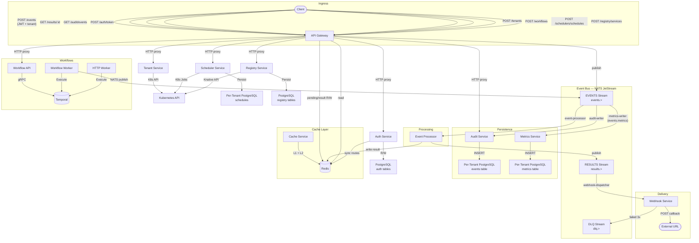

---

## Deployment Topology

```
┌───────────────────────────────────────────────────────────────────────┐
│  Minikube Cluster (6 CPU, 16GB RAM, Docker driver)                    │
│                                                                       │
│  ┌─── knative-serving ─────────────────────────────────────────────┐  │
│  │  Kourier Ingress  ·  KPA Autoscaler  ·  sslip.io DNS           │  │
│  └─────────────────────────────────────────────────────────────────┘  │
│                                                                       │
│  ┌─── Per Environment (x4: dev, qa, staging, production) ──────────┐  │
│  │                                                                 │  │
│  │  ┌─ platform-services-{env} (Knative Services) ──────────────┐  │  │
│  │  │  api-gateway · auth-service · event-processor              │  │  │
│  │  │  audit-service · cache-service · webhook-service           │  │  │
│  │  │  metrics-service · tenant-service · scheduler-service      │  │  │
│  │  │  registry-service · workflow-api · workflow-worker          │  │  │
│  │  │  workflow-http-worker                                      │  │  │
│  │  └────────────────────────────────────────────────────────────┘  │  │
│  │                                                                 │  │
│  │  ┌─ support-services-{env} (StatefulSets / Deployments) ─────┐  │  │
│  │  │  NATS JetStream · Redis 7 · PostgreSQL 17 · Temporal       │  │  │
│  │  └────────────────────────────────────────────────────────────┘  │  │
│  │                                                                 │  │
│  │  ┌─ {tenant}-{env}-ns (Per-Tenant) ──────────────────────────┐  │  │
│  │  │  PostgreSQL StatefulSet · Tenant Knative Services           │  │  │
│  │  └────────────────────────────────────────────────────────────┘  │  │
│  │                                                                 │  │
│  └─────────────────────────────────────────────────────────────────┘  │
│                                                                       │
└───────────────────────────────────────────────────────────────────────┘
```

---

## Tech Stack

| Layer | Technology |
|-------|-----------|
| **Language** | TypeScript 5 (strict mode) |
| **Runtime** | Bun 1.3 |
| **Framework** | NestJS 11 + Fastify |
| **Messaging** | NATS JetStream |
| **Cache** | Redis 7 (via ioredis) |
| **Database** | PostgreSQL 17 (via `postgres` driver) |
| **Workflow** | Temporal |
| **Auth** | JWT via `jose` (HS256), `Bun.password` argon2id hashing |
| **Orchestration** | Kubernetes (Minikube) |
| **Serverless** | Knative Serving 1.17 |
| **Ingress** | Kourier 1.17 |
| **DNS** | sslip.io (wildcard) |
| **Containers** | Docker multi-stage (oven/bun:1.3-alpine, debian for Temporal) |
| **IaC** | Kustomize (base + overlays) |
| **Validation** | class-validator (Gateway, Auth, Tenant, Scheduler, Registry), ajv (Event Processor) |
| **K8s Client** | @kubernetes/client-node (Tenant, Scheduler, Registry services) |
