# Platform Architecture

This document is the high-level map of the platform. It focuses on ownership boundaries and service placement, not detailed message-by-message flows.

The platform runs as an event-driven, multi-tenant system on Kubernetes. It uses support infrastructure shared by each environment (`support-services-{env}`), platform application services (`platform-services-{env}`), and per-tenant runtime/data boundaries represented inside the platform tier.

## Three-Layer Model

- **Support services** host shared infrastructure for one environment: NATS JetStream, Redis, Temporal, and shared PostgreSQL.
- **Platform services** implement APIs, workflow orchestration, integrations, tenant lifecycle, and UI backends.
- **Per-tenant runtime/data boundary** isolates tenant-specific AI runtime execution and tenant databases while still participating in platform-level eventing.

## High-Level Service Map

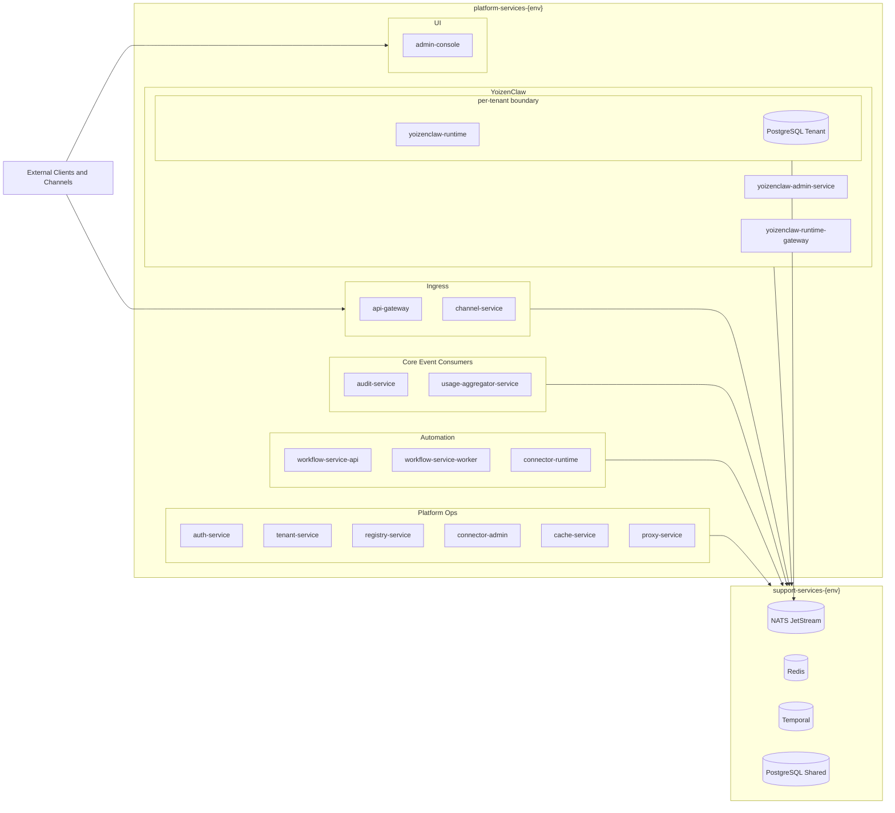

## Service Roles

| Service | Layer | Role |
|---|---|---|
| `api-gateway` | Platform | External HTTP entry, auth enforcement, service proxying, webhook ingress entry |
| `channel-service` | Platform | Channel ingress/egress orchestration (Telegram/WhatsApp), normalized message events |
| `audit-service` | Platform | Durable event audit persistence to tenant PostgreSQL |
| `usage-aggregator-service` | Platform | Cross-stream usage aggregation for tenant analytics |
| `workflow-service-api` | Platform | Workflow management API and Temporal client entry |
| `workflow-service-worker` | Platform | Temporal worker and NATS trigger bridge |
| `connector-runtime` | Platform | High-concurrency activity worker for `endpointCall`, `serviceCall`, and `agentCall` |
| `yoizenclaw-admin-service` | Platform | CRUD and publish lifecycle for agents, templates, credentials, files |
| `yoizenclaw-runtime-gateway` | Platform | Async execution bridge between API/workflows and runtime via NATS |
| `yoizenclaw-runtime` | Per-tenant boundary | Per-tenant AI runtime execution service |
| `auth-service` | Platform | JWT issuance and dynamic public-route sync |
| `tenant-service` | Platform | Tenant lifecycle and namespace/data provisioning |
| `registry-service` | Platform | Dynamic service registry and route metadata |
| `connector-admin` | Platform | Outbound HTTP connector configuration store and lookup |
| `cache-service` | Platform | L1/L2 cache abstraction backed by Redis |
| `proxy-service` | Platform | HTTP proxy for external tenant-dependent backends |
| `admin-console` | Platform | Operational UI for platform and YoizenClaw admin workflows |

## Key Architecture Decisions

- **Namespace layering is intentional**: support infra is environment-scoped, application services are platform-scoped, and tenant runtime/data are isolated behind tenant boundaries.
- **JetStream is the default async backbone**: durable stream/consumer semantics are used for internal flows; core NATS is reserved for lightweight platform signals.
- **Temporal isolates orchestration concerns**: workflow logic remains in workflow workers while HTTP/agent I/O scales separately through `connector-runtime`.
- **Per-tenant data ownership is explicit**: audit, metrics, scheduler data, and YoizenClaw runtime state are tenant-bound.

## Related Documents

- `DOCS/README.md` — entry point and reading order
- `SERVICES.md` — complete service communication map
- `DOCS/08-WORKFLOW-TELEGRAM-SEQUENCE.md` — concrete Telegram inbound execution path
- `DOCS/03-NATS-JETSTREAM.md` — canonical streams, subjects, and envelope contract
- `DOCS/04-WORKFLOW-ENGINE.md` — trigger consumer and action execution model
- `DOCS/02-INFRASTRUCTURE.md` — support services and deployment models

---

## Dynamic Routing Flow

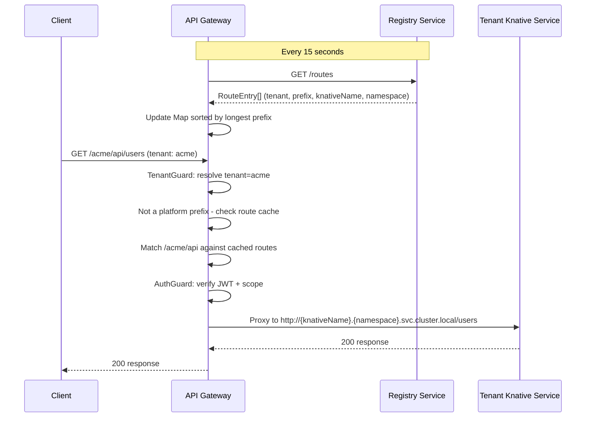

---

## Workflow Execution Flow

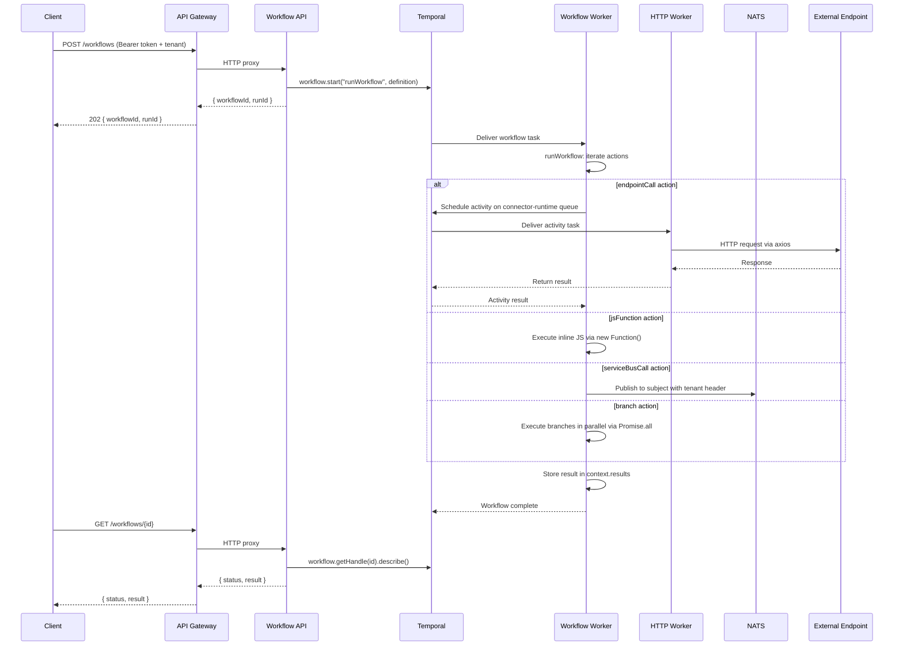

---

## Tenant Provisioning Flow

Tenant creation is asynchronous: the HTTP request returns `202 Accepted` with a `provisioningStatus`, and a JetStream consumer in `tenant-service` drives the actual provisioning through ordered phases. Each phase is wrapped in `runPhase(...)` so a hang in any one step shows up as a `phase=<name> status=started` line with no matching `status=ok` in the structured logs.

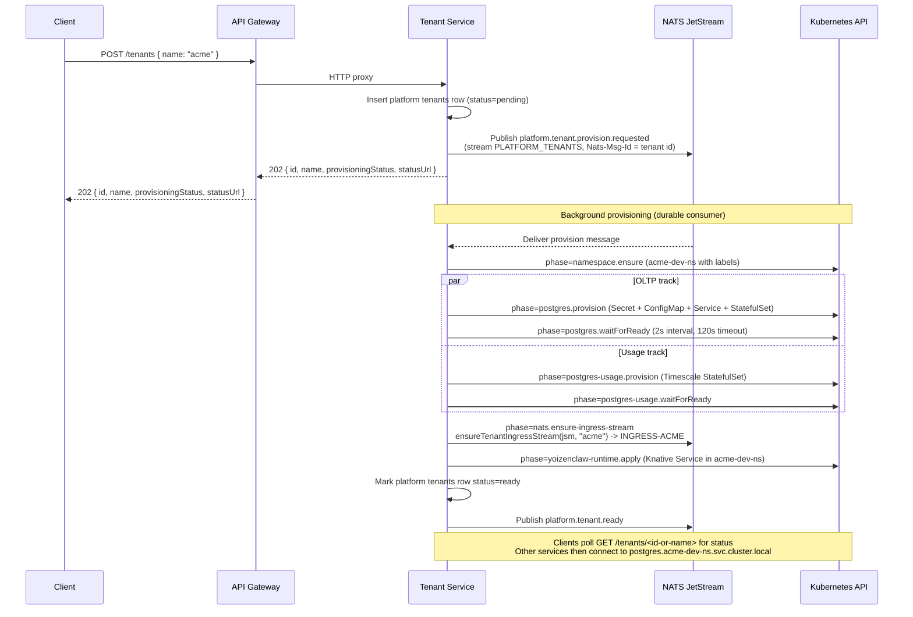

Why `nats.ensure-ingress-stream` sits between Postgres readiness and the runtime apply: the per-tenant `yoizenclaw-runtime` pod attaches durable JetStream consumers for `evt.<tenant>.yoizenclaw-admin-service.…>` and `evt.<tenant>.yoizenclaw-runtime-gateway.…>` as part of its FastAPI lifespan. If `INGRESS-<TENANT>` is missing it crashes with `NotFoundError: stream not found` (NATS `err_code=10059`). Pre-creating the stream here guarantees the runtime can subscribe on first boot; the runtime additionally retains its own idempotent ensure + core-NATS fallback as a safety net (see [03-NATS-JETSTREAM.md](03-NATS-JETSTREAM.md#ingress-stream-provisioning-ingress-tenant)).

---

## Service Detail

### API Gateway

| Aspect | Detail |
|--------|--------|
| **Role** | HTTP entry point, JWT auth, event ingestion, SSE streaming, dynamic tenant routing, proxies to all downstream services |
| **Port** | 3000 |
| **Scale** | 1 -- 10 replicas (concurrency target: 100) |

**Authentication:** All routes require a valid JWT (Bearer token) except those marked as public. The global `AuthGuard` checks every request:

1. Static public routes via `@Public()` decorator (health, token generation)
2. Dynamic public routes from Redis cache (configurable per-tenant and platform-wide)
3. JWT verification (HS256 shared secret from `auth-secret` K8s Secret)
4. Scope enforcement: platform tokens grant full access; tenant tokens are restricted

**Endpoints:**

| Method | Path | Description | Auth |
|--------|------|-------------|------|
| `POST` | `/auth/token` | Client credentials grant | Public |
| `POST` | `/auth/login` | User login | Public |
| `POST` | `/auth/refresh` | Refresh access token | Public |
| `GET/POST/DELETE` | `/auth/public-routes` | Dynamic public route management | Platform |
| `POST/GET` | `/auth/users` | Platform user management | Platform |
| `POST/GET/DELETE` | `/auth/clients` | API client management | Platform |
| `POST` | `/events` | Ingest event (202 Accepted) | Required |
| `GET` | `/results/:id` | Fetch processing result | Required |
| `GET` | `/events/stream` | SSE real-time stream | Required |
| `GET` | `/audit/events` | Query audit events | Required |
| `POST/GET/DELETE` | `/tenants` | Tenant management | Platform (write) / Required (read) |
| `POST/GET/PATCH/DELETE` | `/registry/services` | Service registry | Required |
| `POST/PATCH/GET` | `/registry/services/:id/canary` | Canary deployments | Required |
| `POST/GET` | `/workflows` | Workflow management | Required |
| `POST/GET/PATCH/DELETE` | `/api/connectors` | Connector configuration (proxied to `connector-admin`) | Required |
| `GET` | `/health` | Aggregated health | Public |

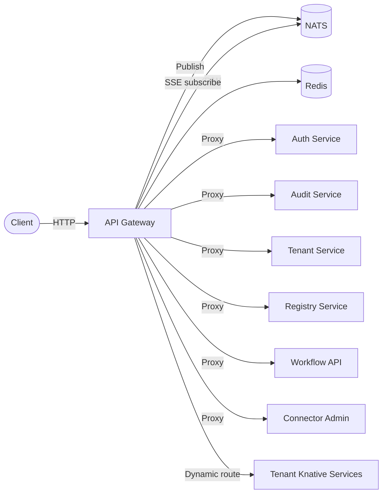

---

### Auth Service

| Aspect | Detail |
|--------|--------|
| **Role** | JWT token generation, user/client management, public routes configuration |
| **Port** | 3000 |
| **Scale** | 1 -- 3 replicas (concurrency target: 50) |

**Token Scopes:**

| Scope | Description |
|-------|-------------|
| `platform` | Full platform management access |
| `tenant:<name>` | Tenant-scoped access |

**Identity Sources:**

| Source | Grant | Token Scope |
|--------|-------|-------------|
| Platform User (email + password) | `POST /auth/login` | `platform` |
| API Client (client_id + client_secret) | `POST /auth/token` | `platform` or `tenant:<name>` |

**Database Schema:**

```sql
platform_users  (id, email, password_hash, role, is_active, created_at, updated_at)
api_clients     (id, client_id, client_secret_hash, name, scope, is_active, created_at, updated_at)
public_routes   (id, method, path_pattern, scope, environment, created_at)
```

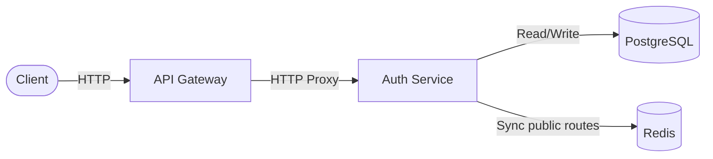

---

### Audit Service

| Aspect | Detail |
|--------|--------|
| **Role** | Persist all events to per-tenant PostgreSQL for auditing and queries |
| **Port** | 3000 |
| **Scale** | 1 -- 5 replicas (concurrency target: 50) |

**Database Schema (per-tenant):**

```sql
CREATE TABLE events (
    id         TEXT PRIMARY KEY,
    type       TEXT NOT NULL,
    payload    JSONB NOT NULL,
    metadata   JSONB,
    subject    TEXT,
    created_at TIMESTAMPTZ DEFAULT NOW()
);
```

---

### Cache Service

| Aspect | Detail |
|--------|--------|
| **Role** | HTTP key-value cache with L1 (memory) + L2 (Redis) |
| **Port** | 3000 |
| **Scale** | 0 -- 5 replicas (concurrency target: 100, **scale-to-zero enabled**) |

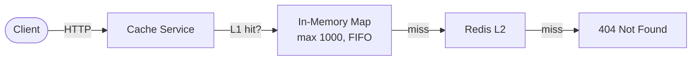

---

### Tenant Service

| Aspect | Detail |
|--------|--------|
| **Role** | Provision tenant namespaces, dedicated PostgreSQL (OLTP + usage), the `INGRESS-<tenant>` JetStream stream, and the per-tenant `yoizenclaw-runtime` Knative Service. Driven by a durable JetStream consumer on `PLATFORM_TENANTS` so provisioning is retried on transient failure and survives pod restarts. |
| **Port** | 3000 |
| **Scale** | 1 -- 3 replicas (concurrency target: 50) |

Each tenant gets a dedicated namespace (`<tenant>-<env>-ns`) containing a PostgreSQL StatefulSet (OLTP), a Timescale-based usage StatefulSet, and a per-tenant `yoizenclaw-runtime` Knative Service. The `INGRESS-<TENANT>` JetStream stream is provisioned in parallel on the shared NATS cluster before the runtime ksvc is applied — see [Tenant Provisioning Flow](#tenant-provisioning-flow) for ordering and [03-NATS-JETSTREAM.md](03-NATS-JETSTREAM.md#ingress-stream-provisioning-ingress-tenant) for the full three-layer ensure contract.

**Namespace Labels:**

| Label | Value |
|-------|-------|
| `app.kubernetes.io/part-of` | `yoizen-arch` |
| `yoizen.io/tenant` | `<tenant-name>` |
| `yoizen.io/environment` | `dev` / `qa` / `staging` / `production` |
| `yoizen.io/managed-by` | `tenant-service` |

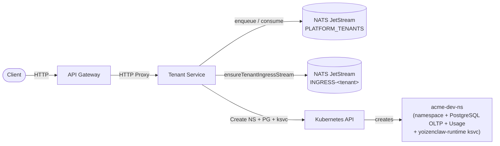

---

### Registry Service

| Aspect | Detail |
|--------|--------|
| **Role** | Knative service registry with route management and canary deployments |
| **Port** | 3000 |
| **Scale** | 1 -- 5 replicas (concurrency target: 50) |

**Database Schema:**

```sql
registered_services (id, tenant_id, name, image, port, min_scale, max_scale, status, knative_name, namespace, ...)
service_routes      (id, service_id, path_prefix, methods[], is_public, strip_prefix, ...)
canary_deployments  (id, service_id, stable_revision, canary_revision, canary_percent, status, ...)
```

**Canary Deployment Flow:**

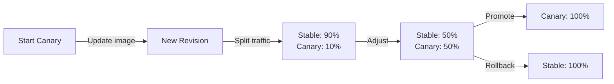

---

### Workflow Service (API + Worker)

| Aspect | Detail |
|--------|--------|
| **Role** | REST API for Temporal workflows + orchestrator worker |
| **Port** | 3000 |
| **Scale** | API: 1--5, Worker: 1--3 |

**Action Types:**

| Activity | Task Queue | Description |
|----------|-----------|-------------|
| `endpointCall` | `connector-runtime` | HTTP request via connector-runtime |
| `serviceCall` | `connector-runtime` | Internal/service-aware HTTP request via connector-runtime |
| `jsFunction` | `workflow-orchestrator` | Inline JS evaluation |
| `agentCall` | `workflow-orchestrator` | YoizenClaw agent chat via workflow-service local activity |
| `serviceBusCall` | `workflow-orchestrator` | NATS publish with tenant header |
| `branch` | (workflow-level) | Parallel execution of sub-actions |

Actions support `{{path.to.value}}` template resolution against the execution context.

---

### Connector Runtime

| Aspect | Detail |
|--------|--------|
| **Role** | Standalone Temporal worker for generic HTTP execution activities |
| **Port** | 3000 (health only) |
| **Scale** | 1 -- 5 replicas (KEDA-driven on `connector-runtime` task queue) |
| **Task Queue** | `CONNECTOR_RUNTIME_TASK_QUEUE` (`connector-runtime`) |
| **Config Source** | `connector-admin` REST API via `AdapterClient` (Redis SWR cache) |

Executes `endpointCall` and `serviceCall` via `tracedFetch` with automatic `x-yoizen-tenant` header injection, connector resolution, response caching, and internal service mirror lookup. Max 200 concurrent activity tasks.

---

## Infrastructure

### Kubernetes Namespaces

| Environment | Support Namespace | Platform Namespace |
|-------------|-------------------|--------------------|
| dev | `support-services-dev` | `platform-services-dev` |
| qa | `support-services-qa` | `platform-services-qa` |
| staging | `support-services-staging` | `platform-services-staging` |
| production | `support-services-production` | `platform-services-production` |

Additionally, each tenant gets `<tenant>-<env>-ns` namespaces with isolated PostgreSQL.

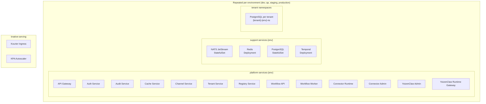

### Knative Autoscaling

| Service | Min Scale | Max Scale | Concurrency Target |
|---------|-----------|-----------|-------------------|
| API Gateway | 1 | 10 | 100 |
| Auth Service | 1 | 3 | 50 |
| Audit Service | 1 | 5 | 50 |
| Cache Service | **0** | 5 | 100 |
| Channel Service | 1 | 5 | 50 |
| Tenant Service | 1 | 3 | 50 |
| Registry Service | 1 | 5 | 50 |
| Workflow API | 1 | 5 | 50 |
| Workflow Worker | 1 | 3 | 50 |
| Connector Admin (API + worker) | 1 | 5 | 50 |
| Connector Runtime | 1 | 5 | 100 (KEDA on Temporal queue) |
| YoizenClaw Admin Service | 1 | 5 | 50 |
| YoizenClaw Runtime Gateway | 1 | 5 | 50 |

### Container Build

All services use multi-stage Dockerfiles:

```
Stage 1 (install):  oven/bun:1.3-alpine → install dependencies
Stage 2 (build):    copy source + @yoizen/shared → bun build
Stage 3 (runtime):  oven/bun:1.3-alpine → non-root, port 3000
```

Workflow services use `oven/bun:1.3-debian` (Temporal native SDK requires glibc).

Images are built against the Minikube Docker daemon as `dev.local/<service>:local`.

### Support Services Resources (Local Overlay)

| Component | CPU (req/limit) | Memory (req/limit) | Storage |
|-----------|----------------|---------------------|---------|
| NATS | 100m / 500m | 128Mi / 256Mi | 1Gi PVC |
| Redis | 50m / 200m | 64Mi / 128Mi | -- |
| PostgreSQL | 100m / 500m | 128Mi / 256Mi | 2Gi PVC |
| Temporal | 100m / 500m | 128Mi / 256Mi | -- (uses PG) |

---

## Shared Package: `@yoizen/shared`

Provides type-safe constants and interfaces consumed by all services.

### Key Constants

| Constant | Value | Used By |
|----------|-------|---------|
| `RESULT_KEY_PREFIX` / `PENDING_KEY_PREFIX` | `result:` / `pending:` | Per-tenant runtime/Redis cache layer |
| `RESULT_TTL` / `PENDING_TTL` | `3600` (1 hour) | Runtime/Redis cache layer |
| `STREAM_MAX_AGE_NS` | 7 days (ns) | All NATS stream provisioning |
| `MAX_DELIVER` | `5` | All durable consumers |
| `TENANT_HEADER` | `x-yoizen-tenant` | All services |
| `REGISTRY_KNATIVE_GROUP` / `REGISTRY_KNATIVE_VERSION` / `REGISTRY_KNATIVE_SERVICES_PLURAL` | `serving.knative.dev` / `v1` / `services` | Registry Service, Tenant Service (Knative API client) |
| `REGISTRY_PRODUCER` / `PLATFORM_DOMAIN` | `registry-service` / `platform` | Registry Service (lifecycle event subjects) |
| `ADAPTER_MANAGED_BY_REGISTRY` | `registry-service` | Connector Admin (internal-sync ownership marker) |
| `WORKFLOW_ORCHESTRATOR_TASK_QUEUE` | `workflow-orchestrator` | Workflow Service |
| `CONNECTOR_RUNTIME_TASK_QUEUE` | `connector-runtime` | Connector Runtime |
| `WORKFLOW_DEFAULT_TIMEOUT_MS` | `60000` | Workflow Service |
| `GATEWAY_AUDIT_*` | gateway audit stream/subject/consumer constants | API Gateway, Audit Service |
| `YOIZENCLAW_*` (subject prefix + per-event helpers) | `evt.{tenant}.yoizenclaw-admin-service.automation.yoizenclaw.internal.*` | YoizenClaw Admin / Runtime / Runtime Gateway |
| `YOIZENCLAW_RUNTIME_GATEWAY_*` (`evt.{tenant}.yoizenclaw-runtime-gateway.automation.yoizenclaw.internal.*`) | execution lifecycle subjects | YoizenClaw Runtime Gateway / Workflow Service |

### Core Interfaces

```
EventEnvelope    → { id, type, payload, metadata?, callbackUrl? }
EventMetadata    → { receivedAt, source, subject, tenantId? }
ProcessedEvent   → { ...envelope, result, processedAt, processingTime }
CompletionEvent  → { eventId, type, status, result, completedAt, callbackUrl? }
EventResult      → { eventId, status, data, processedAt, processingTime }
MetricsPayload   → { source, name, value, tags?, metadata?, timestamp? }
JwtPayload       → { sub, type, scope, role?, env, iat, exp }
TokenResponse    → { access_token, token_type, expires_in, scope, refresh_token? }
WorkflowDefinition → { name, tenant, application, request, actions }
WorkflowAction   → EndpointCallAction | JsFunctionAction | ServiceBusCallAction | BranchAction
```

---

## Data Flow Summary

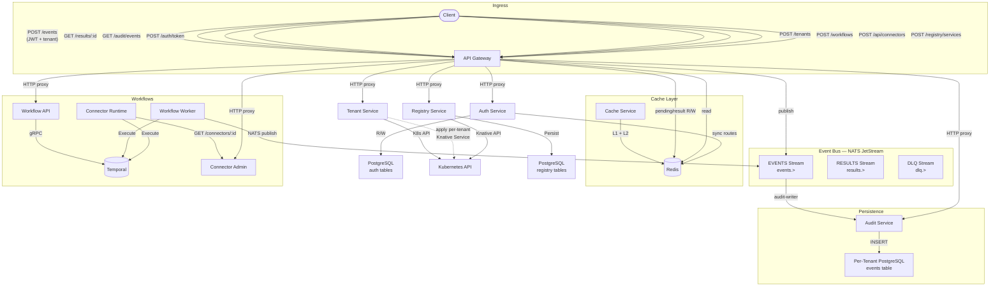

---

## Deployment Topology

```
┌───────────────────────────────────────────────────────────────────────┐
│  Minikube Cluster (6 CPU, 16GB RAM, Docker driver)                    │
│                                                                       │
│  ┌─── knative-serving ─────────────────────────────────────────────┐  │
│  │  Kourier Ingress  ·  KPA Autoscaler  ·  sslip.io DNS           │  │
│  └─────────────────────────────────────────────────────────────────┘  │
│                                                                       │
│  ┌─── Per Environment (x4: dev, qa, staging, production) ──────────┐  │
│  │                                                                 │  │
│  │  ┌─ platform-services-{env} (Knative Services) ──────────────┐  │  │
│  │  │  api-gateway · auth-service · audit-service                │  │  │
│  │  │  cache-service · channel-service · tenant-service          │  │  │
│  │  │  registry-service · workflow-service · workflow-worker     │  │  │
│  │  │  connector-runtime · connector-admin                       │  │  │
│  │  │  yoizenclaw-admin-service · yoizenclaw-runtime-gateway     │  │  │
│  │  │  usage-aggregator-service · proxy-service · admin-console  │  │  │
│  │  └────────────────────────────────────────────────────────────┘  │  │
│  │                                                                 │  │
│  │  ┌─ support-services-{env} (StatefulSets / Deployments) ─────┐  │  │
│  │  │  NATS JetStream · Redis 7 · PostgreSQL 17 · Temporal       │  │  │
│  │  └────────────────────────────────────────────────────────────┘  │  │
│  │                                                                 │  │
│  │  ┌─ {tenant}-{env}-ns (Per-Tenant) ──────────────────────────┐  │  │
│  │  │  PostgreSQL StatefulSet · yoizenclaw-runtime Knative Svc   │  │  │
│  │  └────────────────────────────────────────────────────────────┘  │  │
│  │                                                                 │  │
│  └─────────────────────────────────────────────────────────────────┘  │
│                                                                       │
└───────────────────────────────────────────────────────────────────────┘
```

---

## Tech Stack

| Layer | Technology |
|-------|-----------|
| **Language** | TypeScript 5 (strict mode) |
| **Runtime** | Bun 1.3 |
| **Framework** | NestJS 11 + Fastify |
| **Messaging** | NATS JetStream |
| **Cache** | Redis 7 (via ioredis) |
| **Database** | PostgreSQL 17 (via `postgres` driver) |
| **Workflow** | Temporal |
| **Auth** | JWT via `jose` (HS256), `Bun.password` argon2id hashing |
| **Orchestration** | Kubernetes (Minikube) |
| **Serverless** | Knative Serving 1.17 |
| **Ingress** | Kourier 1.17 |
| **DNS** | sslip.io (wildcard) |
| **Containers** | Docker multi-stage (oven/bun:1.3-alpine, debian for Temporal) |
| **IaC** | Kustomize (base + overlays) |
| **Validation** | class-validator (Gateway, Auth, Tenant, Registry, Connector Admin), ajv (workflow payload schemas) |
| **K8s Client** | @kubernetes/client-node (Tenant, Registry services) |
