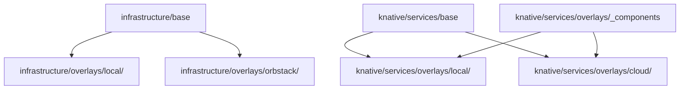

# Infrastructure and Deployment

This document explains how infrastructure services support the platform and how workloads are deployed and scaled across environments.

## Support Services

Support services are shared per environment (`support-services-{env}`) and back all platform workloads.

| Service | Primary role | Platform usage |
|---|---|---|
| NATS JetStream | Durable event backbone | Internal async messaging on `INGRESS-<tenant>` and DLQ streams |
| Redis | Shared low-latency state/cache | L2 cache, execution status store, public-routes sync cache |
| PostgreSQL | Persistent relational storage | Shared platform DB + tenant-isolated DBs |
| Temporal | Durable orchestration engine | Workflow execution and activity queue dispatch |

### Redis Roles (explicit)

Redis serves three distinct roles across the platform:

1. **L2 cache for connector-backed HTTP resolution**
   - Used by `AdapterClient` (consumed by `connector-runtime`) with stale-while-revalidate behavior; cache is keyed per tenant + connector id.
2. **Execution state store for YoizenClaw runtime gateway path**
   - Stores pending/running/completed/failed execution status so playground and runtime API reads can poll quickly.
3. **Auth/gateway route synchronization cache**
   - Stores dynamic public route data consumed by gateway auth checks.

## Deployment Models

| Model | Used by | Why |
|---|---|---|
| Knative Service | HTTP-facing APIs (`api-gateway`, `auth-service`, `registry-service`, etc.) | Request-driven autoscaling and revision support |
| Plain Deployment + KEDA | Queue/worker workloads (`connector-runtime`, workflow workers, consumer workers) | Pull-based scaling from backlog metrics |
| Per-tenant Helm release | `agent-ai-service` | Tenant-level runtime/data isolation and independent lifecycle |

## Kustomize Structure

The platform uses Kustomize for manifests and environment overlays.

- Infra base: `infrastructure/base/`
- Infra overlays: `infrastructure/overlays/local/`, `infrastructure/overlays/orbstack/`
- Service base: `knative/services/base/`
- Service overlays: `knative/services/overlays/local/`, `knative/services/overlays/cloud/`

## KEDA Scaling (connector-runtime)

`connector-runtime` is scaled by the KEDA Temporal scaler using activity queue backlog:

- Target queue: `connector-runtime` (`CONNECTOR_RUNTIME_TASK_QUEUE`)
- Queue type: `activity`
- `minReplicaCount: 1`
- `maxReplicaCount: 20`
- `targetQueueSize: 10`
- `activationTargetQueueSize: 0`

This keeps activity execution latency stable during bursts while avoiding Knative-style request autoscaling for pull-based workers.

## Add a New Service (Checklist)

- Add base manifest in `knative/services/base/` (Knative Service or Deployment).
- Add image/env patches in target overlay (`knative/services/overlays/.../<env>`).
- Add KEDA ScaledObject if workload is queue/stream consumer.
- Add health/proxy wiring in gateway if externally accessible through platform API.
- Update docs (`DOCS/01-ARCHITECTURE.md`, `SERVICES.md`) with role and dependencies.

## References

- `DOCS/14-DEPLOYMENT-ARCHITECTURE.md`
- `knative/services/base/scaledobjects/connector-runtime.yaml`
- `infrastructure/base/`
- `infrastructure/overlays/`
