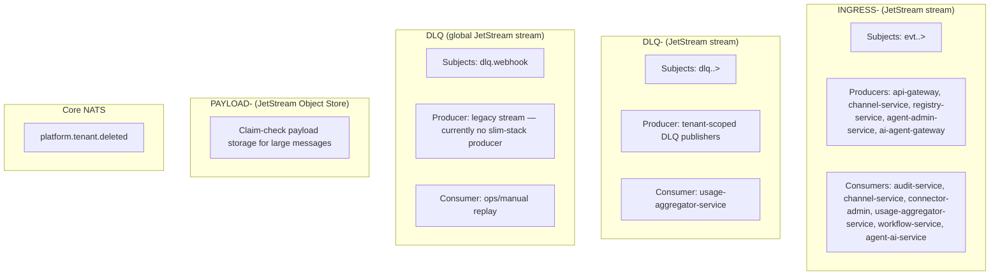

# NATS and JetStream

This document is the source of truth for messaging infrastructure in the platform: stream topology, subject taxonomy, and envelope contract.

Use this together with `DOCS/01-ARCHITECTURE.md` (service placement) and `DOCS/04-WORKFLOW-ENGINE.md` (workflow action behavior).

## JetStream vs Core NATS

- **JetStream** is the default for platform events: durable streams, durable consumers, replay, and at-least-once delivery.
- **Core NATS** is reserved for lightweight fire-and-forget signals where persistence is not required.
- Current core signal in production: `platform.tenant.deleted` (used to evict tenant caches and DB pools).

## Stream Topology



## Streams Reference

| Stream/Bucket | Type | Subjects/Keyspace | Purpose |
|---|---|---|---|
| `INGRESS-<tenant>` | JetStream stream | `evt.<tenant>.>` | Canonical tenant event bus |
| `DLQ-<tenant>` | JetStream stream | `dlq.<tenant>.>` | Tenant-scoped dead letters and post-processing |
| `DLQ` | JetStream stream | `dlq.webhook` | Legacy global DLQ — narrowed from `dlq.>` to free the `dlq.<tenant>.>` namespace for tenant-scoped DLQ streams. Currently no slim-stack producer; retained for ops replay tooling. |
| `PAYLOAD-<tenant>` | JetStream Object Store | Object keys (`<event-id>-payload`) | Claim-check storage for large payloads |
| `platform.tenant.deleted` | Core NATS subject | `platform.tenant.deleted` | Fire-and-forget tenant teardown signal |

## Subject Taxonomy

Canonical format (8 tokens):

```text
evt.<tenant>.<producer>.<domain>.<channel>.<provider>.<kind>.v<version>
```

| Token | Meaning | Example |
|---|---|---|
| `tenant` | Tenant identifier | `acme` |
| `producer` | Service that publishes | `api-gateway` |
| `domain` | Business domain | `messaging`, `automation`, `platform` |
| `channel` | Logical channel | `telegram`, `events`, `platform` |
| `provider` | External/internal provider | `telegram`, `internal`, `gateway` |
| `kind` | Event operation kind | `webhook_received`, `completed`, `execution_requested` |
| `version` | Subject schema version | `v1` |

Examples:

- `evt.acme.api-gateway.messaging.telegram.webhook.webhook_received.v1`
- `evt.acme.registry-service.platform.events.system.service_registered.v1`
- `evt.acme.ai-agent-gateway.automation.platform.internal.execution_requested.v1`

## Envelope Contract (Canonical)

The canonical contract is defined in code, not duplicated by hand:

- `packages/shared/src/interfaces.ts` (`EventEnvelope`, `EventTransport`, `EventData`)

Top-level required fields in `EventEnvelope`:

| Field | Type | Notes |
|---|---|---|
| `specversion`, `id`, `source`, `type`, `resource`, `time` | string | CloudEvents-inspired core |
| `traceid` | string | OpenTelemetry trace identifier |
| `causation_id` | string \| null | Upstream event ID |
| `correlation_id` | string | End-to-end flow ID |
| `tenant`, `producer`, `domain`, `channel`, `provider`, `accountid` | string | Routing and ownership |
| `idempotencykey` | string | Deterministic dedupe key |
| `transport` | `EventTransport` | `method`, `protocol`, optional `agent_id`, optional `depth` |
| `data` | `EventData` | payload metadata and payload/claim-check reference |

Allowed platform extensions:

- `callback_url`
- `adapter_id`
- `enrich_adapter`
- `forward_adapter`

## Provisioning and Lifecycle

Tenant streams are pre-provisioned by `tenant-service` during tenant creation, with idempotent safety-net calls from publishers and the per-tenant runtime so cold-start, restore, and out-of-order boot scenarios remain self-healing.

### Ingress Stream Provisioning (`INGRESS-<tenant>`)

Provisioning happens at three layers, in priority order:

1. **Primary (eager, during tenant creation)** — `tenant-service`'s `TenantProvisioningExecutor` invokes `ensureTenantIngressStream(jsm, tenantId)` as a dedicated `nats.ensure-ingress-stream` phase, executed **after** OLTP + usage Postgres readiness and **before** applying the per-tenant `agent-ai-service` Knative Service. This closes the race where the runtime pod would otherwise boot, attempt to attach durable JetStream consumers for `evt.<tenant>.agent-admin-service.…>` and `evt.<tenant>.ai-agent-gateway.…>`, and crash its FastAPI lifespan with `NotFoundError: stream not found` (NATS `err_code=10059`).
2. **Safety net (lazy, before first publish)** — Producers (`api-gateway`, `channel-service`, `registry-service`, `agent-admin-service`, `ai-agent-gateway`) call `ensureTenantIngressStream(jsm, tenantId)` before publishing to `evt.<tenant>.>`. This guards against tenants that pre-date the primary path or whose stream was pruned externally.
3. **Self-healing (lazy, at runtime startup)** — `agent-ai-service`'s `RuntimeNatsBridge._ensure_tenant_ingress_stream` performs the same idempotent ensure when the bridge connects. If the broker still rejects the JetStream subscribe (e.g. transient permissions error), each subscription falls back to a core NATS subscription on the same wildcard via `_subscribe_via_jetstream_with_fallback`, so the runtime stays online and converges to JetStream delivery once the stream becomes available.

Common contract across all three layers:

- Stream naming comes from `getTenantStreamName(tenantId)` -> `INGRESS-${tenantId.toUpperCase()}`.
- Subject pattern comes from `getTenantSubjectPattern(tenantId)` -> `evt.${tenantId}.>`.
- Provisioning is idempotent: TS-side calls coalesce concurrent ensures via an in-flight promise map and seed an in-memory per-pod cache on success; the broker error `STREAM_NAME_IN_USE` (`err_code=10058`) is treated as success on every layer.
- Current defaults are `RetentionPolicy.Limits`, max age 7 days, max bytes 256 MB.

Code references:

- `services/tenant-service/src/modules/provisioning/tenant-provisioning-executor.service.ts` (eager pre-provisioning phase)
- `services/agent-ai-service/src/messaging/bridge.py` (`_ensure_tenant_ingress_stream`, `_subscribe_via_jetstream_with_fallback`)
- `packages/database/src/nats-provider.ts` (`ensureTenantIngressStream` shared helper)
- `packages/shared/src/tenant-stream.constants.ts`
- `packages/shared/src/channel.constants.ts`

### Durable Consumer Lifecycle (Per Tenant)

- Consumers use `MultiTenantConsumerManager` with `streamPattern: /^INGRESS-/`.
- The manager discovers existing tenant streams and ensures a durable consumer per tenant stream.
- Consumers do not create ingress streams; they reconcile against discovered streams.
- Typical durable names: `audit-service`, `channel-service`, `connector-admin`, `usage-aggregator-service`, `workflow-triggers`, `agent-ai-service`.

### DLQ Lifecycle

- When DLQ is enabled in manager config, tenant DLQ resources are provisioned alongside the durable.
- Tenant DLQ stream pattern is `DLQ-<tenant>` with subjects `dlq.<tenant>.>`.
- Some services also consume DLQ streams via a second manager instance (for example usage aggregation).

### Tiered Limits Status

- Tier-aware limits (free/pro/enterprise) exist in constants and helpers.
- At this moment, runtime stream provisioning still applies shared defaults in code paths used by publishers.
- Documented limits should be treated as current implementation behavior, not intended policy.

## Historical Note

- Older docs referenced `EVENTS` and `RESULTS` as the main business streams.
- Current canonical topology is tenant-scoped `INGRESS-<tenant>` plus DLQ streams.
- Use `INGRESS-<tenant>` as the default event stream in all new docs and implementations.
