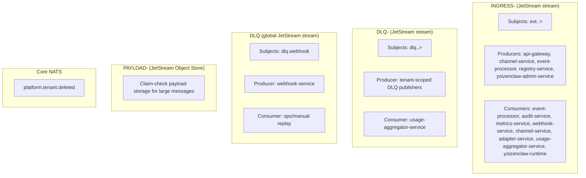

# NATS and JetStream

This document is the source of truth for messaging infrastructure in the platform: stream topology, subject taxonomy, and envelope contract.

Use this together with `DOCS/01-ARCHITECTURE.md` (service placement) and `DOCS/04-WORKFLOW-ENGINE.md` (workflow action behavior).

## JetStream vs Core NATS

- **JetStream** is the default for platform events: durable streams, durable consumers, replay, and at-least-once delivery.
- **Core NATS** is reserved for lightweight fire-and-forget signals where persistence is not required.
- Current core signal in production: `platform.tenant.deleted` (used to evict tenant caches and DB pools).

## Stream Topology



## Streams Reference

| Stream/Bucket | Type | Subjects/Keyspace | Purpose |
|---|---|---|---|
| `INGRESS-<tenant>` | JetStream stream | `evt.<tenant>.>` | Canonical tenant event bus |
| `DLQ-<tenant>` | JetStream stream | `dlq.<tenant>.>` | Tenant-scoped dead letters and post-processing |
| `DLQ` | JetStream stream | `dlq.webhook` | Global webhook delivery failures |
| `PAYLOAD-<tenant>` | JetStream Object Store | Object keys (`<event-id>-payload`) | Claim-check storage for large payloads |
| `platform.tenant.deleted` | Core NATS subject | `platform.tenant.deleted` | Fire-and-forget tenant teardown signal |

## Subject Taxonomy

Canonical format (8 tokens):

```text
evt.<tenant>.<producer>.<domain>.<channel>.<provider>.<kind>.v<version>
```

| Token | Meaning | Example |
|---|---|---|
| `tenant` | Tenant identifier | `acme` |
| `producer` | Service that publishes | `api-gateway` |
| `domain` | Business domain | `messaging`, `automation`, `platform` |
| `channel` | Logical channel | `telegram`, `events`, `yoizenclaw` |
| `provider` | External/internal provider | `telegram`, `internal`, `gateway` |
| `kind` | Event operation kind | `webhook_received`, `completed`, `execution_requested` |
| `version` | Subject schema version | `v1` |

Examples:

- `evt.acme.api-gateway.messaging.telegram.webhook.webhook_received.v1`
- `evt.acme.event-processor.platform.events.gateway.completed.v1`
- `evt.acme.yoizenclaw-runtime-gateway.automation.yoizenclaw.internal.execution_requested.v1`

## Envelope Contract (Canonical)

The canonical contract is defined in code, not duplicated by hand:

- `packages/shared/src/interfaces.ts` (`EventEnvelope`, `EventTransport`, `EventData`)

Top-level required fields in `EventEnvelope`:

| Field | Type | Notes |
|---|---|---|
| `specversion`, `id`, `source`, `type`, `resource`, `time` | string | CloudEvents-inspired core |
| `traceid` | string | OpenTelemetry trace identifier |
| `causation_id` | string \| null | Upstream event ID |
| `correlation_id` | string | End-to-end flow ID |
| `tenant`, `producer`, `domain`, `channel`, `provider`, `accountid` | string | Routing and ownership |
| `idempotencykey` | string | Deterministic dedupe key |
| `transport` | `EventTransport` | `method`, `protocol`, optional `agent_id`, optional `depth` |
| `data` | `EventData` | payload metadata and payload/claim-check reference |

Allowed platform extensions:

- `callback_url`
- `adapter_id`
- `enrich_adapter`
- `forward_adapter`

## Historical Note

- Older docs referenced `EVENTS` and `RESULTS` as the main business streams.
- Current canonical topology is tenant-scoped `INGRESS-<tenant>` plus DLQ streams.
- Use `INGRESS-<tenant>` as the default event stream in all new docs and implementations.
