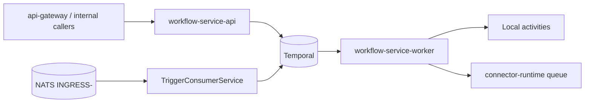
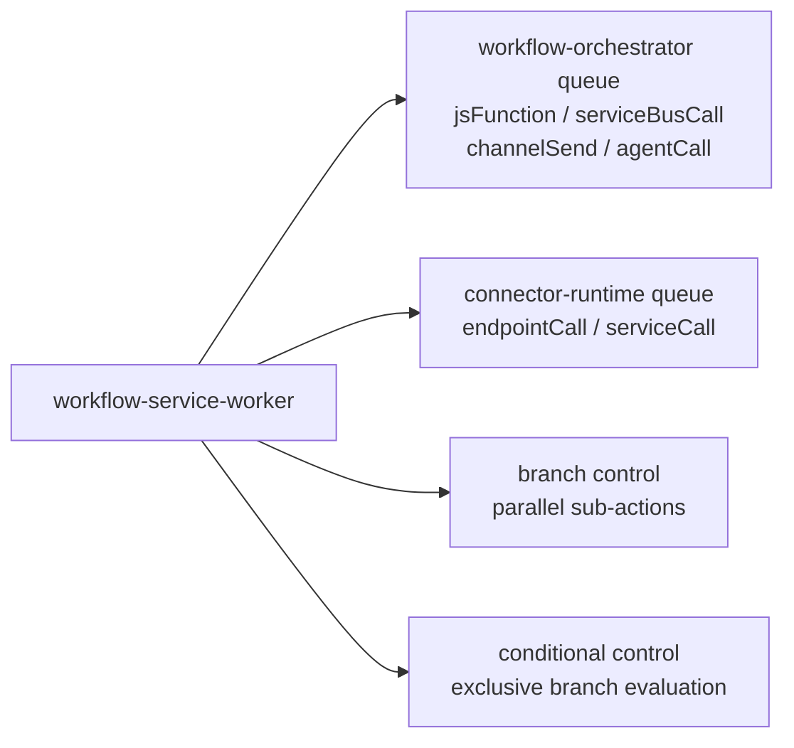
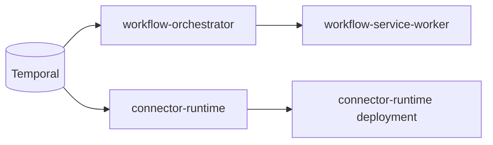

# Workflow Engine

This document explains how workflow orchestration works in the platform: process boundaries, trigger-to-execution flow, action dispatch model, and scaling.

## Two-Process Architecture

The workflow engine runs as two independent processes from the same service codebase:

- `workflow-service-api` (HTTP API): workflow CRUD and execution management.
- `workflow-service-worker` (Temporal worker): workflow execution and trigger handling.



## Trigger Consumer

`TriggerConsumerService` in `workflow-service-worker` is the NATS-to-Temporal bridge for message-based automation.

- Consumes `evt.*.channel-service.messaging.*.*.received.v1` from tenant streams `INGRESS-*` using durable `workflow-triggers`.
- Resolves matching definitions where `trigger.type = message_received`.
- Applies trigger filters (`accountIds`, `channels`, `providers`, `patterns`).
- Supports `exclusive` and `shared` trigger modes: when any matching definition has `mode: "exclusive"`, only the first exclusive one fires; otherwise all shared workflows fire.
- Starts Temporal workflows with idempotency (`idempotencyKey = envelope.idempotencykey + def.id`) and causal-chain propagation (`causation_id`, `correlation_id`, `transport.depth` extracted from the triggering envelope per DOCS/arquitectura/02 §6).

Incoming large payloads (>256 KB) are transparently inflated before the handler runs via the claim-check middleware in `MultiTenantConsumerManager.wrapHandler` (`packages/database/src/multi-tenant-consumer-manager.ts`). The consumer itself is unaware of the claim-check; it always sees a fully inflated envelope.

## Action Types

Current supported actions in `runWorkflow`:

| Action | Task queue | Timeout | Behavior |
|---|---|---|---|
| `endpointCall` | `connector-runtime` | 30 s (5 attempts) | Outbound HTTP call (connector-aware when adapterId/endpointId configured) |
| `serviceCall` | `connector-runtime` | 30 s (5 attempts) | Internal service HTTP call (mirror/fallback resolution) |
| `agentCall` | `workflow-orchestrator` (local) | 15 m start-to-close, 30 s heartbeat (3 attempts) | Agent execution via `YoizenClawExecutionClient` over JetStream |
| `jsFunction` | `workflow-orchestrator` (local) | 30 s | Inline JavaScript execution |
| `serviceBusCall` | `workflow-orchestrator` (local) | 30 s | Publishes message to NATS subject for tenant |
| `channelSend` | `workflow-orchestrator` (local) | 30 s | Publishes channel send command envelope |
| `branch` | workflow control | — | Parallel branch execution; branch results are merged back into the main context |
| `conditional` | workflow control | — | Sequential condition evaluation; first matching branch executes |

Notes:

- `serviceBusCall` publishes to the tenant stream path (subject provided by action args); envelope structure and subject conventions are documented in `DOCS/03-NATS-JETSTREAM.md`.
- `agentCall` runs on the orchestrator queue (no separate task queue) and uses `YoizenClawExecutionClient` which publishes `execution_requested.v1` over JetStream and subscribes for lifecycle events; see `DOCS/05-AGENT-EXECUTION-FLOW.md`.
- `endpointCall` and `serviceCall` use an extended retry policy (max 5 attempts, 1 s → 30 s exponential backoff) designed to ride out one full circuit-breaker cooldown window (30 s).

## Action Dispatch Model

`runWorkflow` executes actions sequentially. For each action, templates are resolved from execution context (`request`, `results`, `workflow`, `variables`) before dispatch.



## Execution Completion Publisher

At the end of every `runWorkflow` execution (success or failure), a best-effort `publishExecutionCompletedEvent` activity fires on the orchestrator queue (`startToCloseTimeout: "5s"`, max 2 attempts). It emits:

```
evt.<tenant>.workflow-service.workflow.internal.native.execution_completed.v1
```

to `INGRESS-<tenant>`. The `workflow-api`'s `ExecutionProjectorService` consumes this subject (durable `workflow-projector`) and batches UPDATEs into `workflow_executions`, decoupling the hot-path from Postgres writes.

## Task Queue Topology and Scaling

- Orchestrator execution queue: `workflow-orchestrator` (`WORKFLOW_ORCHESTRATOR_TASK_QUEUE`).
- HTTP activity queue: `connector-runtime` (`CONNECTOR_RUNTIME_TASK_QUEUE`).
- `connector-runtime` workers self-configure max 400 concurrent activity executions per pod.



Note: KEDA Temporal scalers for connector-runtime are absent from the current dev-only configuration — the worker runs as a plain Deployment with a fixed replica count.

## References

- `services/workflow-service/src/temporal/workflows.ts`
- `services/workflow-service/src/temporal/activities/` (all activities)
- `services/workflow-service/src/modules/triggers/trigger-consumer.service.ts`
- `packages/database/src/multi-tenant-consumer-manager.ts` (claim-check middleware)
- `packages/shared/src/workflow.interfaces.ts`
- `DOCS/03-NATS-JETSTREAM.md`
