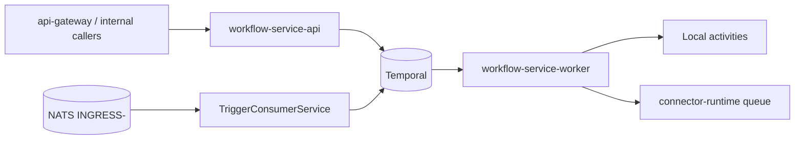
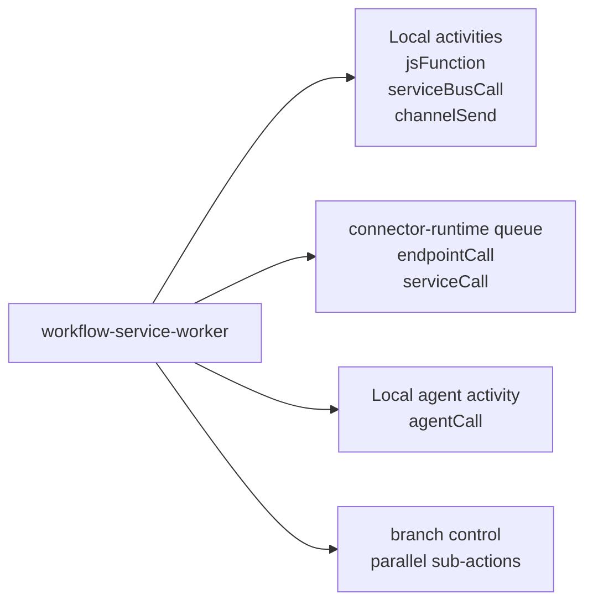
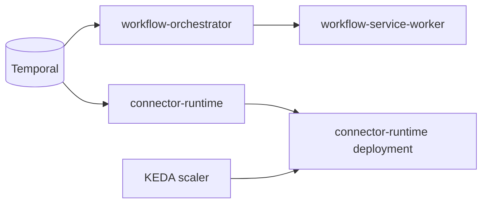

# Workflow Engine

This document explains how workflow orchestration works in the platform: process boundaries, trigger-to-execution flow, action dispatch model, and scaling.

## Two-Process Architecture

The workflow engine runs as two independent processes from the same service codebase:

- `workflow-service-api` (HTTP API): workflow CRUD and execution management.
- `workflow-service-worker` (Temporal worker): workflow execution and trigger handling.

## Trigger Consumer

`TriggerConsumerService` in `workflow-service-worker` is the NATS-to-Temporal bridge for message-based automation.

- Consumes `evt.*.channel-service.messaging.*.*.received.v1` from tenant streams `INGRESS-*` using durable `workflow-triggers`.
- Resolves matching definitions where `trigger.type = message_received`.
- Applies trigger filters (`accountIds`, `channels`, `providers`, `patterns`).
- Starts Temporal workflows with idempotency and causal-chain propagation.

## Action Types

Current supported actions in `runWorkflow`:

| Action | Runs where | Behavior |
|---|---|---|
| `endpointCall` | `connector-runtime` queue | Outbound HTTP call (connector-aware when configured) |
| `serviceCall` | `connector-runtime` queue | Internal service HTTP call (mirror/fallback resolution) |
| `agentCall` | orchestrator queue (5m timeout) | Agent execution activity returning AI reply payload |
| `jsFunction` | local activity | Inline JavaScript execution |
| `serviceBusCall` | local activity | Publishes message to NATS subject for tenant |
| `channelSend` | local activity | Publishes channel send command envelope |
| `branch` | workflow control | Parallel branch execution and merge of branch results |

Notes:

- `serviceBusCall` publishes to the tenant stream path (subject provided by action args); envelope structure and subject conventions are documented in `DOCS/03-NATS-JETSTREAM.md`.
- `sleep` appears in older docs but is not currently implemented in `services/workflow-service/src/temporal/workflows.ts`.

## Action Dispatch Model

`runWorkflow` executes actions in sequence. For each action, templates are resolved from execution context (`request`, `results`, `workflow`) before dispatch.

## Task Queue Topology and Scaling

- Orchestrator execution queue: `workflow-orchestrator` (`WORKFLOW_ORCHESTRATOR_TASK_QUEUE`).
- HTTP activity queue: `connector-runtime` (`CONNECTOR_RUNTIME_TASK_QUEUE`).
- `connector-runtime` scales with the KEDA Temporal scaler (`min=1`, `max=20`, `targetQueueSize=10`) based on activity backlog.

## References

- `services/workflow-service/src/temporal/workflows.ts`
- `services/workflow-service/src/modules/triggers/trigger-consumer.service.ts`
- `knative/services/base/scaledobjects/connector-runtime.yaml`
- `DOCS/03-NATS-JETSTREAM.md`
