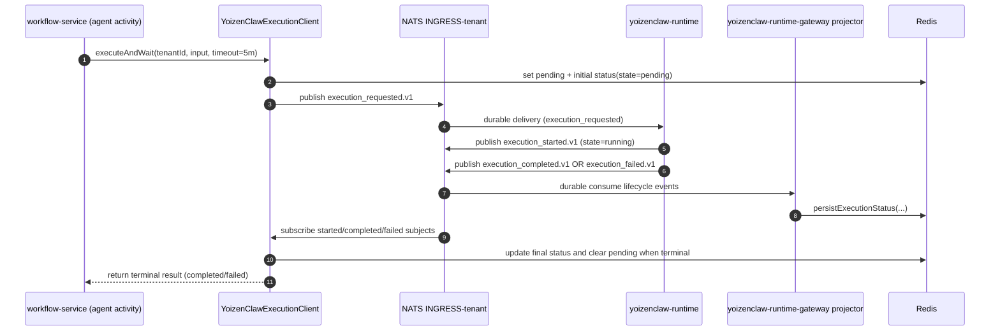

# Agent Execution Flow

This document describes how a workflow `agentCall` reaches YoizenClaw runtime and how results come back to the workflow.

The path is asynchronous over JetStream and uses Redis as execution state storage.

## Component Roles

| Component | Role |
|---|---|
| `workflow-service` (`executeAgentCall`) | Submits and waits for agent execution as a Temporal activity |
| `YoizenClawExecutionClient` (`@yoizen/shared`) | Publishes `execution_requested.v1`, subscribes to lifecycle events, persists status in Redis |
| `yoizenclaw-runtime-gateway` | API-facing execution submit/get/stream service and durable status projector |
| `NATS JetStream` (`INGRESS-<tenant>`) | Durable transport for request and lifecycle events |
| `yoizenclaw-runtime` | Consumes execution request, runs agent, publishes started/completed/failed events |
| `Redis` | Stores pending and result status records keyed by tenant + execution ID |

## End-to-End Sequence

## Lifecycle Events

| Event | Subject Template | State |
|---|---|---|
| requested | `evt.{tenant}.yoizenclaw-runtime-gateway.automation.yoizenclaw.internal.execution_requested.v1` | `pending` |
| started | `evt.{tenant}.yoizenclaw-runtime-gateway.automation.yoizenclaw.internal.execution_started.v1` | `running` |
| completed | `evt.{tenant}.yoizenclaw-runtime-gateway.automation.yoizenclaw.internal.execution_completed.v1` | `completed` |
| failed | `evt.{tenant}.yoizenclaw-runtime-gateway.automation.yoizenclaw.internal.execution_failed.v1` | `failed` |

## Runtime Behavior

- `yoizenclaw-runtime` consumes `execution_requested` and calls `generate_chat_reply(...)`.
- On start, it emits `execution_started`.
- On success, it emits `execution_completed` with `result.reply` and optional `result.tool_calls`.
- On exception, it emits `execution_failed` with `result.errorCode` and `result.errorMessage`.

## Failure Modes

- **Execution timeout (workflow-side):** `executeAndWait` times out after 5 minutes and fails the activity when no terminal event is observed.
- **Runtime failure:** runtime emits `execution_failed`; workflow activity raises an error with runtime message.
- **Circuit breaker open:** workflow `executeAgentCall` can fail fast with non-retryable `CIRCUIT_OPEN` when breaker denies calls for a tenant+agent key.
- **Cold-start config gap (`waiting_for_config`)**: runtime health reports `runtime_config=waiting_for_config` until config is loaded. In this state, agent execution may not complete in time and manifests as timeout/retry behavior upstream.

## References

- `services/workflow-service/src/temporal/activities/agent-call.activity.ts`
- `packages/shared/src/yoizenclaw-execution-client.ts`
- `services/yoizenclaw-runtime-gateway/src/modules/executions/executions.service.ts`
- `services/yoizenclaw-runtime/src/messaging/handlers/executions.py`
- `services/yoizenclaw-runtime/src/api/handlers/health.py`
