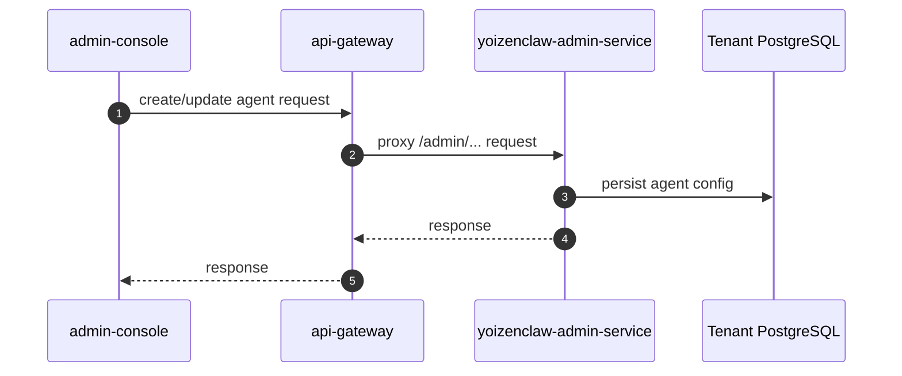
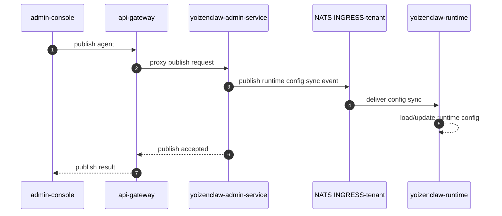
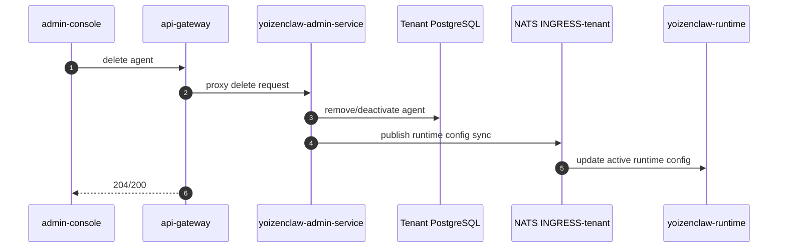
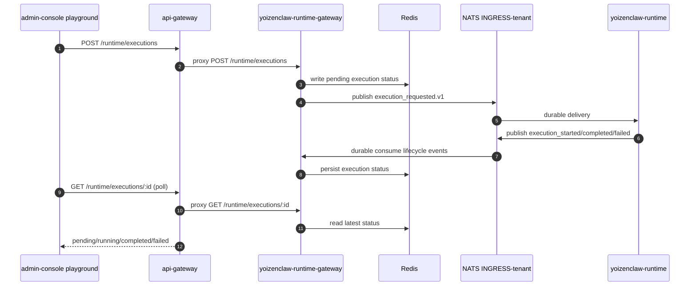
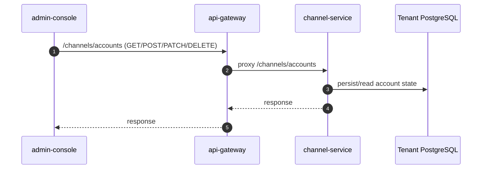

# UI Flows

This document explains how UI actions in Angular consoles map to backend services and internal execution paths.

All UI traffic goes through `api-gateway`.

## YoizenClaw Agent CRUD (admin-console)

### Component to Backend Mapping

| UI area | Frontend location | Gateway path | Backend owner |
|---|---|---|---|
| Agent management | `admin-console` YoizenClaw screens | `/admin/*` via gateway | `yoizenclaw-admin-service` |
| Runtime test chat (playground) | `features/automation/yoizenclaw/playground.component.ts` | `/runtime/executions` | `yoizenclaw-runtime-gateway` |

### Create / Edit Agent

### Publish Agent

### Delete Agent

## Test Chat (Playground)

The playground does not go through Temporal workflow orchestration. It submits execution directly to runtime gateway and then polls execution status.

### Execution Flow

### Result Delivery Mode

- Current playground uses polling (`GET /runtime/executions/:id` every ~1s, max wait ~5m).
- Runtime gateway also exposes SSE stream endpoint (`/runtime/executions/stream`) for future UI use.

## Channel Account Management (admin-console)

The admin-console uses the account API surface exposed by gateway.

### Account CRUD Flow

### Notes

- Telegram bot token and provider credentials are sent via account APIs; storage ownership is in `channel-service`.

## References

- `services/admin-console/src/app/core/services/yoizenclaw-runtime.service.ts`
- `services/admin-console/src/app/features/automation/yoizenclaw/playground.component.ts`
- `services/admin-console/src/app/core/services/channel-admin.service.ts`
- `services/api-gateway/src/modules/runtime/runtime.controller.ts`
- `services/api-gateway/src/modules/channels/channels.controller.ts`
