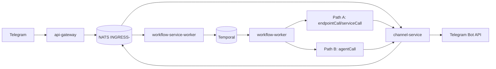
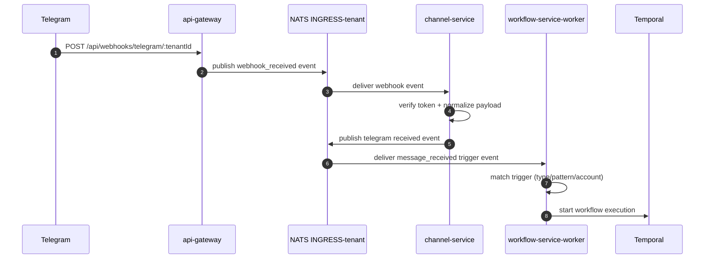
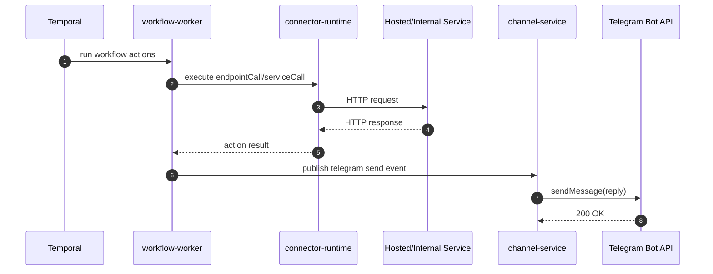
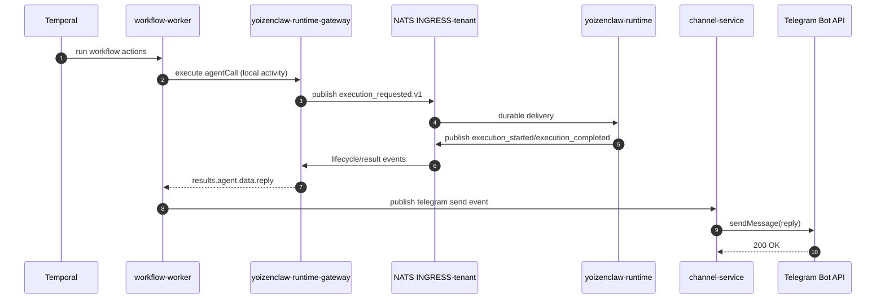

# Telegram Ingest Flow

This document explains the workflow-based path for an inbound Telegram message.

It is split into two execution paths after the workflow starts:

1. **Path A**: call a simple hosted/internal service (`endpointCall` or `serviceCall`)
2. **Path B**: call an AI agent (`agentCall`) on YoizenClaw runtime

This document intentionally omits the channel-service auto-reply shortcut.

## Overview

## Common Inbound Steps (Both Paths)

## Path A - Simple Hosted Service Call

Use this path when a workflow action needs an HTTP call (`endpointCall`/`serviceCall`) before replying on Telegram.

## Path B - Agent Call (YoizenClaw)

Use this path when the workflow action is `agentCall`.

## Key Subjects in This Flow

| Step | Subject Pattern | Stream |
|---|---|---|
| Webhook ingress published by gateway | `evt.<tenant>.api-gateway.messaging.telegram.webhook.webhook_received.v1` | `INGRESS-<tenant>` |
| Normalized inbound message published by channel-service | `evt.<tenant>.channel-service.messaging.telegram.telegram.received.v1` | `INGRESS-<tenant>` |
| Outbound send command published by workflow | `evt.<tenant>.channel-service.messaging.telegram.telegram.send.v1` | `INGRESS-<tenant>` |
| Agent execution request published by runtime-gateway | `evt.<tenant>.yoizenclaw-runtime-gateway.automation.yoizenclaw.internal.execution_requested.v1` | `INGRESS-<tenant>` |

## Notes

- After the message is on NATS, this trigger-based path does not go through `workflow-service-api`; `workflow-service-worker` starts Temporal directly.
- `agentCall` path uses `yoizenclaw-runtime-gateway` and `yoizenclaw-runtime` over JetStream events.
