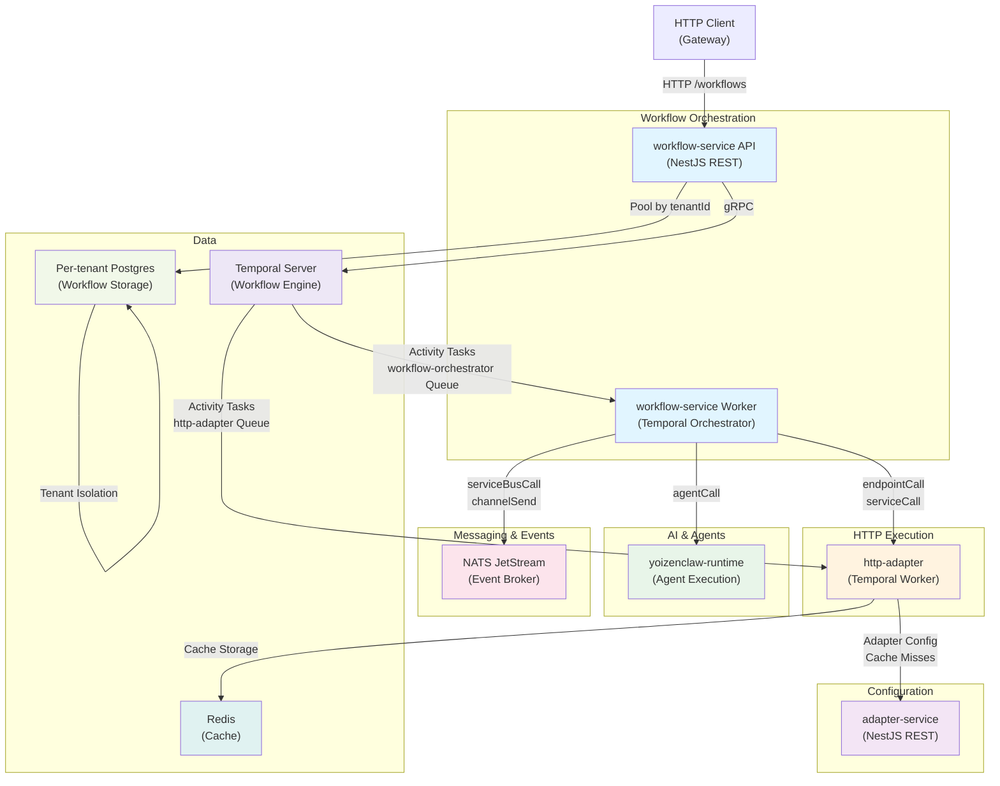
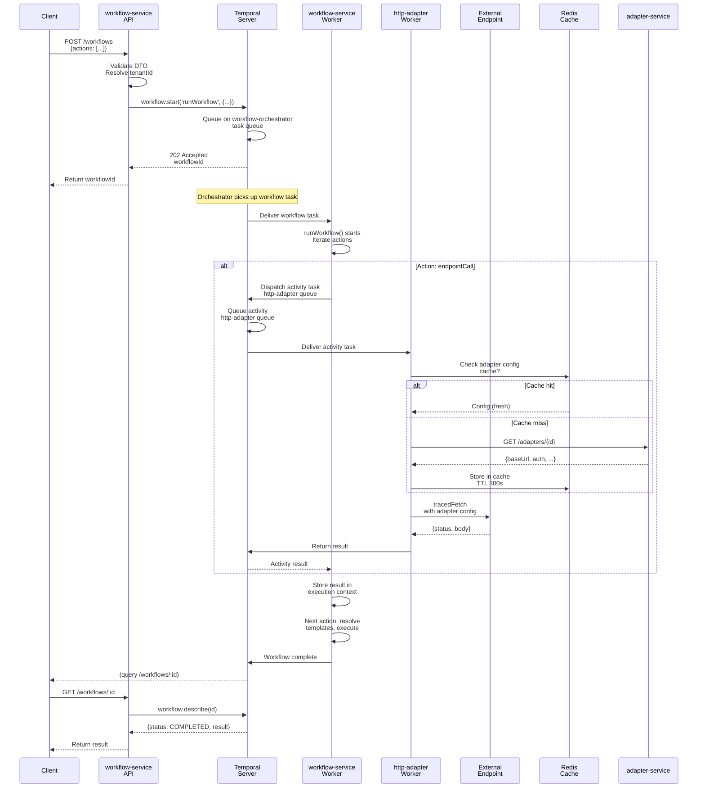
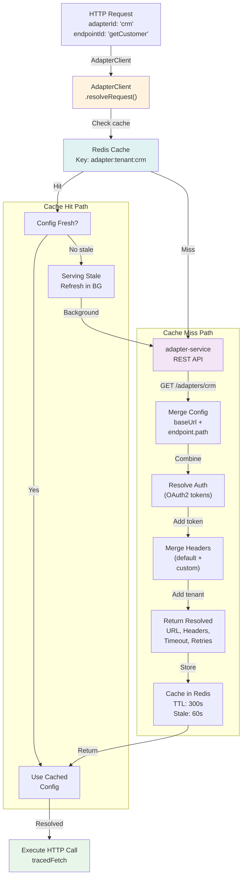
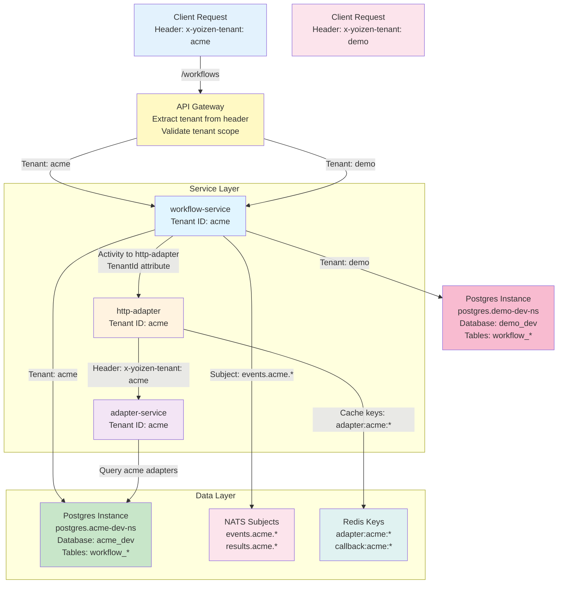
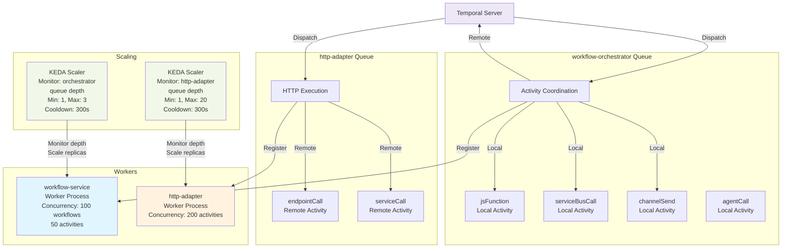
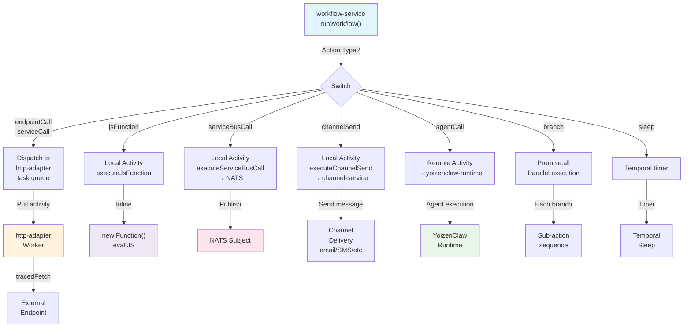
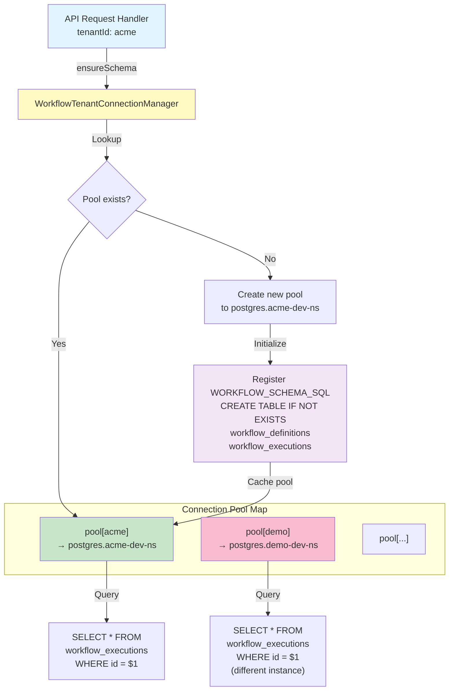
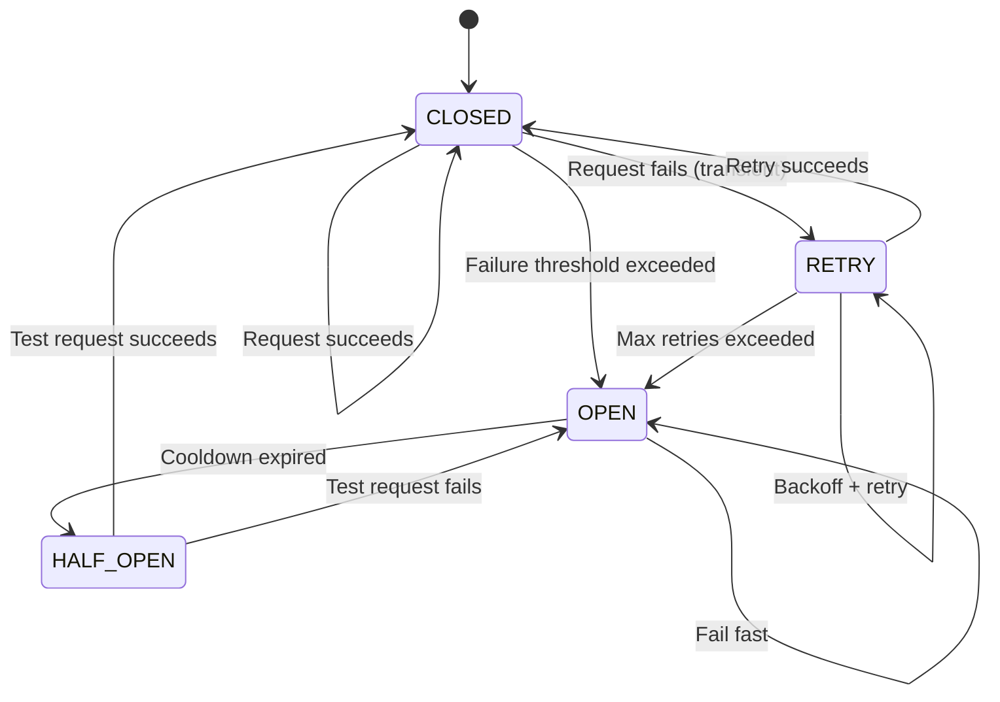

# Service Architecture Diagrams

This document provides visual diagrams of the platform's service architecture, focusing on the refactored HTTP Adapter and Workflow Service boundary, multi-tenancy patterns, and data flow.

## 1. Service Boundary & Communication

High-level view of core services and their interactions:

**Key Points**:
- **workflow-service** splits into API (REST) and Worker (Temporal orchestration)
- **http-adapter** is a separate Temporal worker for HTTP execution
- **adapter-service** provides config; http-adapter caches in Redis
- **Per-tenant Postgres** isolates workflow data by tenant
- **NATS** handles event publishing from workflows

---

## 2. Workflow Execution Timeline

How a workflow request flows through the system:

**Key Moments**:
1. Client POSTs workflow definition
2. workflow-service API validates and starts Temporal workflow
3. Temporal queues workflow task on orchestrator queue
4. Worker picks up, iterates actions
5. For HTTP actions: dispatch to http-adapter queue
6. http-adapter resolves adapter config (cache hit/miss)
7. Execute HTTP call, return result
8. Next action can use previous result via templates
9. Client queries for status/result

---

## 3. Adapter Configuration Resolution Flow

How http-adapter resolves adapter-driven requests:

**Cache Strategy**:
- **TTL**: 300 seconds (adapter configs valid for 5 minutes)
- **Stale window**: 60 seconds (serve stale while refreshing)
- **Background refresh**: On stale hit, refresh in background, serve cached value immediately
- **Miss**: Fetch from adapter-service synchronously

---

## 4. Multi-Tenant Data Isolation

How tenant information flows through the system and ensures isolation:

**Isolation Boundaries**:
1. **Header**: `x-yoizen-tenant` propagates through all layers
2. **Database**: Each tenant gets their own Postgres instance
3. **NATS**: Subjects include tenant ID prefix
4. **Redis**: Cache keys include tenant scope
5. **Temporal**: Search attribute `TenantId` for workflow queries

---

## 5. Temporal Task Queue Architecture

Two independent task queues with different concurrency models:

**Queue Design**:
- **workflow-orchestrator**: Coordinates multi-step execution; local activities (JS, NATS) run inline
- **http-adapter**: Specialized for HTTP; high concurrency (200) to handle network latency
- **Separate scaling**: Each queue scales independently based on task depth
- **Temporal dispatch**: Remote activities (endpointCall) dispatch back to Temporal for load balancing

---

## 6. Action Execution Paths

Different routing based on action type:

**Routing Logic**:
- **Remote activities** (endpointCall, serviceCall, agentCall): Dispatch to task queue, await result
- **Local activities** (jsFunction, serviceBusCall, channelSend): Execute inline, await result
- **Control flow** (branch, sleep): Temporal native (no activity)
- **Error handling**: Failed action blocks workflow (no automatic compensation)

---

## 7. Per-Tenant Postgres Connection Pattern

How workflow-service maintains isolated connections per tenant:

**Connection Strategy**:
- **Per-tenant pools**: Each tenant gets a dedicated Postgres connection pool
- **Lazy creation**: Pools created on first access to tenant
- **Schema registration**: `workflow_definitions` and `workflow_executions` created idempotently
- **No shared table**: No `tenant_id` column; database is the boundary
- **DNS resolution**: K8s DNS resolves `postgres.{tenantId}-{env}-ns.svc.cluster.local`

---

## 8. Circuit Breaker & Retry Flow (http-adapter)

How http-adapter handles failures and protects against cascading failures:

**Behavior**:
1. **Normal (CLOSED)**: Execute requests, track failures
2. **Degraded (OPEN)**: Fail fast, return 503, don't attempt request
3. **Recovery (HALF_OPEN)**: Allow one test request; success closes circuit, failure reopens
4. **Retries**: Exponential backoff for transient failures (network timeout, 5xx)
5. **Non-retryable**: 4xx status codes fail immediately

---

## Summary

The refactored architecture separates concerns into:

1. **Workflow Orchestration** (`workflow-service`) — Coordinates multi-step execution
2. **HTTP Execution** (`http-adapter`) — Specialized worker for HTTP calls with adapter resolution
3. **Configuration** (`adapter-service`) — Manages adapter configs, cached by http-adapter
4. **AI & Agents** (`yoizenclaw-runtime`) — Autonomous agent execution
5. **Multi-tenancy** — Per-tenant Postgres, NATS subject prefixes, header propagation
6. **Temporal Task Queues** — Two independent queues for independent scaling

This design enables:
- **Independent scaling**: HTTP-heavy workloads scale http-adapter separately
- **Tenant isolation**: Per-tenant databases prevent cross-tenant data leakage
- **High concurrency**: 200 parallel HTTP requests per http-adapter replica
- **Resilience**: Circuit breaker + retries protect against cascading failures
- **Observability**: Each action traces through Temporal with OpenTelemetry instrumentation
