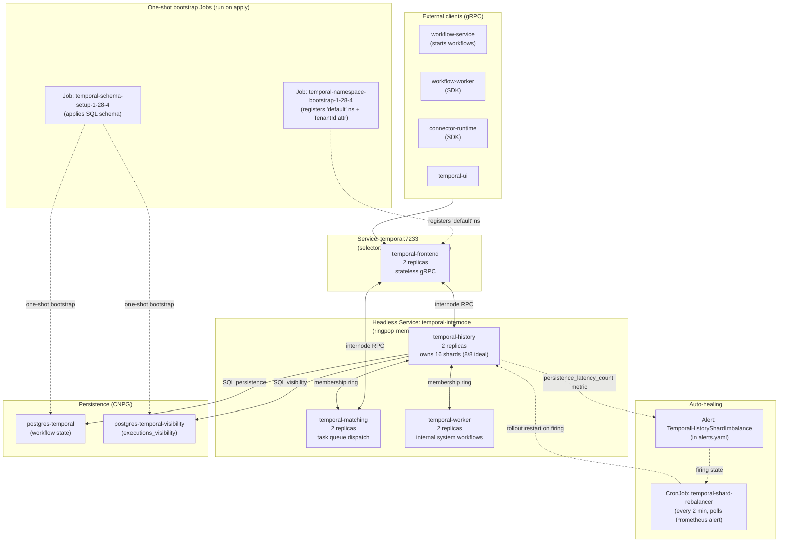

# RUNBOOK — Temporal Operations

> Day-2 reference for operating the Temporal cluster.
> Scope: anything Temporal-related that's NOT a one-time migration.
>
> Companion docs (read for context, not for daily ops):
> - [`DOCS/RUNBOOK-TEMPORAL-HA-MIGRATION.md`](RUNBOOK-TEMPORAL-HA-MIGRATION.md) —
>   how the cluster got from `auto-setup` to split-role HA in 2026-05-22.
> - [`DOCS/RUNBOOK-TEMPORAL-VISIBILITY-SPLIT.md`](RUNBOOK-TEMPORAL-VISIBILITY-SPLIT.md) —
>   how the visibility datastore moved to its own CNPG cluster on 2026-05-22.
> - [`post-mortem/POST-MORTEM.md`](../post-mortem/POST-MORTEM.md) —
>   2026-05-22 stress run that motivated both of the above.
> - [`tests/stress/runbook.md`](../tests/stress/runbook.md) — how to
>   run and interpret stress tests against this cluster.

---

## 1. Quick reference card

```bash
# Replace with your env (dev / qa / staging / production):
NS=support-services-dev

# Health probe (returns "WorkflowService: SERVING" when OK)
kubectl -n $NS exec deploy/temporal-frontend -c temporal -- \
  tctl --address temporal:7233 cluster health

# All 8 expected pods (2 per role)
kubectl -n $NS get pods -l app.kubernetes.io/name=temporal \
  -L temporal.io/role -o wide

# Shard ownership distribution (1 line per history pod with ops/s rate)
kubectl -n $NS exec deploy/prometheus -- \
  wget -qO- 'http://localhost:9090/api/v1/query?query=sum%20by%20(instance)%20(rate(persistence_latency_count%7Btemporal_role%3D%22history%22%7D%5B5m%5D))'

# Force shard rebalance (manual variant of what the bootstrap + cron do)
kubectl -n $NS rollout restart deployment/temporal-history
kubectl -n $NS rollout status   deployment/temporal-history --timeout=300s

# Recent auto-healer decisions
kubectl -n $NS logs -l app.kubernetes.io/component=shard-rebalancer \
  --tail=50 --prefix

# Purge all workflow state (clean slate between stress runs)
./scripts/purge-temporal.sh --namespace=$NS --yes
```

---

## 2. Topology



The cluster splits into 4 roles, each in its own Deployment, all
sharing the `app.kubernetes.io/name=temporal` label for Prometheus
discovery and distinguished by `temporal.io/role`. Clients only ever
talk to the `temporal:7233` Service (selector pinned to `role=frontend`).

### 2.1 Role responsibilities

| Role | Replicas (base) | Purpose | Bind ports | CPU profile (local-base) |
|---|---|---|---|---|
| `frontend` | 2 | gRPC entrypoint for all clients. Stateless. Routes RPCs to history/matching via ringpop. | `:7233` gRPC, `:7243` HTTP, `:6933` membership, `:9090` metrics | req 250m / lim 1500m |
| `history` | **3** (bumped 2→3 on 2026-05-24) | Owns the 16 shards. Every `UpdateWorkflowExecution`, `RecordActivityTask*`, timer tick hits here. **HOT PATH.** | `:7234` gRPC, `:6934` membership, `:9090` metrics | req 350m / lim 2 (per pod, 3 pods total) |
| `matching` | 2 | Task queue dispatch. Owns task queue partitions via ringpop. | `:7235` gRPC, `:6935` membership, `:9090` metrics | req 250m / lim 1500m |
| `worker` | 2 | Internal system workflows only (NOT user task queues — that's `workflow-worker`). Pure SDK client. | `:6939` membership, `:9090` metrics. **NO `:7239` gRPC bind** (declared but never opened). | req 150m / lim 750m |

**Why history = 3 replicas** (not 2): with 16 shards / 3 pods, max
ringpop-hash skew is 6/5/5 = 37.5% ownership concentration, **structurally
below** the `TemporalHistoryShardImbalance` alert's 75% threshold. The
2026-05-24 stress run demonstrated that 2 replicas + auto-healer
created a restart-storm (10 restarts in 54 min) that dropped SDK
throughput by 60%. Going to 3 pods makes the storm impossible by
construction. See §8.1 + the §5.1 of `RUNBOOK-TEMPORAL-HA-MIGRATION.md`
companion for the full history.

---

## 3. Service inventory

### 3.1 Kubernetes resources

```bash
kubectl -n $NS get -l app.kubernetes.io/name=temporal \
  deploy,svc,sa,role,rolebinding,cronjob,job,cm
```

Expected output groups (after bootstrap + healthy steady-state):

| Kind | Name | Replicas / count |
|---|---|---|
| Deployment | `temporal-frontend` / `-history` / `-matching` / `-worker` | 2 each (base) |
| Deployment | `temporal-ui` | 1 (unrelated to the 4 roles — Web UI only) |
| Service | `temporal` | ClusterIP (selector: `temporal.io/role=frontend`) |
| Service | `temporal-internode` | Headless (per-pod DNS for ringpop) |
| Service | `temporal-{frontend,history,matching,worker}-metrics` | Headless (per-role metrics scrape) |
| Service | `temporal-ui` | ClusterIP for the Web UI |
| ConfigMap | `temporal-server-config` | `config_template.yaml` (dockerize input) |
| ConfigMap | `temporal-dynamic-config` | `production-sql.yaml` (runtime dynamic config, 60s polling) |
| ServiceAccount + Role + RoleBinding | `temporal-schema-wait` | RBAC for init container `wait-for-schema` |
| ServiceAccount + Role + RoleBinding | `temporal-shard-rebalancer` | RBAC for auto-healer CronJob |
| Job | `temporal-schema-setup-<version>` | One-shot SQL schema apply (idempotent) |
| Job | `temporal-namespace-bootstrap-<version>` | Registers `default` ns + `TenantId` search attribute |
| CronJob | `temporal-shard-rebalancer` | `*/2 * * * *`, polls Prometheus alert |

### 3.2 Persistence (CNPG, not in `infrastructure/base/temporal/`)

- [`postgres-temporal`](../infrastructure/base/postgres/postgres-temporal-cluster.yaml) —
  workflow state (`executions`, `history_node`, `tasks`, ...). 2 instances HA in base; 1 instance in dev overlays.
- [`postgres-temporal-visibility`](../infrastructure/base/postgres/postgres-temporal-visibility-cluster.yaml) —
  `executions_visibility` only. Split off the default cluster on 2026-05-22 (see visibility-split runbook).

### 3.3 Image versions (all pinned, no `:latest`)

| Image | Tag | Where |
|---|---|---|
| Temporal server | `temporalio/server:1.28.4` | 4 role Deployments |
| Temporal admin tools (schema migrations + namespace setup) | `temporalio/admin-tools:1.28.4-tctl-1.18.4-cli-1.6.2` | 2 bootstrap Jobs |
| Kubectl client (init containers + auto-healer) | `alpine/k8s:1.31.13` | 4 init containers + 1 CronJob |

Why these specific tags — see §7 (image / version pinning rules).

---

## 4. Configuration

### 4.1 Static config — `config_template.yaml`

Hand-rolled Postgres-only template at
[`configmap-docker.yaml`](../infrastructure/base/temporal/configmap-docker.yaml).
Rendered to `/etc/temporal/config/docker.yaml` by `dockerize` (the
`temporalio/server` entrypoint) on every pod boot. Key fields:

| Field | Value | Notes |
|---|---|---|
| `persistence.numHistoryShards` | **`16` (hard-coded)** | CHANGING THIS ORPHANS HISTORY — every workflow's owning shard is derived from this value. Only safe on a clean DB. |
| `persistence.default` | `postgres-temporal-rw:5432` / db `temporal` | Reads `POSTGRES_*` env vars |
| `persistence.visibility` | `postgres-temporal-visibility-rw:5432` / db `temporal_visibility` | Reads `VISIBILITY_POSTGRES_*` env vars |
| `services.{frontend,history,matching,worker}.rpc.{grpcPort,membershipPort}` | hard-coded | Match `service-internode.yaml` published ports |
| `clusterMetadata.clusterInformation.active.rpcAddress` | `temporal:7233` (default) | Internal worker connects here for system workflows |
| `publicClient.hostPort` | `temporal:7233` (default) | Same |
| `dynamicConfigClient.filepath` | `/etc/temporal/config/dynamicconfig/production-sql.yaml` | 60s polling for live changes |

### 4.2 Dynamic config — `production-sql.yaml`

[`configmap-dynamic-config.yaml`](../infrastructure/base/temporal/configmap-dynamic-config.yaml).
Mounted read-only at `/etc/temporal/config/dynamicconfig/`. Re-read
every 60s. Current keys (intentionally minimal):

```yaml
frontend.workerHeartbeatsEnabled:
  - value: true
frontend.listWorkersEnabled:
  - value: true
```

To add a new key without a Deployment restart: edit this ConfigMap,
`kubectl apply`, wait up to 60s for the change to land. Watch
`/etc/temporal/config/dynamicconfig/production-sql.yaml` inside any
role pod to confirm the mount synced.

### 4.3 Environment variables per Deployment

All 4 role Deployments share these (defined in each `deployment-*.yaml`):

| Env | Value | Purpose |
|---|---|---|
| `SERVICES` | role name (`frontend` / `history` / `matching` / `worker`) | Tells `start-temporal.sh` which subcommand to run |
| `BIND_ON_IP` | `0.0.0.0` | Pod binds on all interfaces; entrypoint sets `TEMPORAL_BROADCAST_ADDRESS` to the pod IP automatically |
| `PROMETHEUS_ENDPOINT` | `0.0.0.0:9090` | Metrics exporter |
| `PUBLIC_FRONTEND_ADDRESS` | `temporal:7233` | Where the internal worker calls the frontend |
| `POSTGRES_SEEDS` | `postgres-temporal-rw` | Default datastore |
| `VISIBILITY_POSTGRES_SEEDS` | `postgres-temporal-visibility-rw` | Visibility datastore (split, see visibility-split runbook) |
| `DBNAME` / `VISIBILITY_DBNAME` | `temporal` / `temporal_visibility` | DB names |
| `{POSTGRES,VISIBILITY_POSTGRES}_{USER,PWD}` | from `postgres-temporal-credentials` / `postgres-temporal-visibility-credentials` Secrets | DB creds |
| `DYNAMIC_CONFIG_FILE_PATH` | `/etc/temporal/config/dynamicconfig/production-sql.yaml` | See §4.2 |

`NUM_HISTORY_SHARDS` is **NOT** set as an env var (deliberately removed
during the HA migration). The value is hard-coded in `config_template.yaml`
to prevent accidental shard count changes via env-var typos.

### 4.4 Overlays

Dev sizing per pod (much smaller than base, fits a laptop):

| Overlay | File | Strategy |
|---|---|---|
| `local-base` (minikube) | [`postgres-temporal-resources.yaml`](../infrastructure/overlays/local/local-base/patches/postgres-temporal-resources.yaml) | 2 replicas per role, sizing fits 12-core node |
| `orbstack-base` | [`postgres-temporal.yaml`](../infrastructure/overlays/orbstack/orbstack-base/patches/postgres-temporal.yaml) | 2 replicas per role, smaller sizing for laptop |

---

## 5. Bootstrap procedures

### 5.1 Fresh cluster (clean slate)

```bash
NS=support-services-dev   # adjust per env

# 1. Drop any pre-existing legacy Temporal Deployment (if migrating from
#    auto-setup — see RUNBOOK-TEMPORAL-HA-MIGRATION.md).
kubectl -n $NS delete deploy/temporal --ignore-not-found

# 2. Optional: wipe stale workflow state on the CNPG clusters so the
#    new ring starts with no orphan workflows. Not needed if the DBs
#    are fresh.
./scripts/purge-temporal.sh --namespace=$NS --skip-restart --yes

# 3. Apply the kustomize overlay. Creates:
#    - 2 ConfigMaps (docker template + dynamic config)
#    - 2 sets of SA/Role/RoleBinding (schema-wait + shard-rebalancer)
#    - 2 Jobs (schema-setup, namespace-bootstrap)
#    - 6 Services (1 frontend + 1 internode + 4 metrics)
#    - 4 role Deployments
#    - 1 CronJob (shard-rebalancer)
kubectl apply -k infrastructure/overlays/local/dev

# 4. Wait for the schema Job (idempotent, fast on populated DBs).
kubectl -n $NS wait --for=condition=complete \
  job/temporal-schema-setup-1-28-4 --timeout=300s

# 5. Wait for the 4 role Deployments in parallel.
for role in frontend history matching worker; do
  kubectl -n $NS rollout status deploy/temporal-${role} --timeout=300s &
done
wait

# 6. Wait for the namespace bootstrap Job (registers 'default' + TenantId
#    search attribute — without this, workflow-worker and
#    connector-runtime SDK clients crash on first boot).
kubectl -n $NS wait --for=condition=complete \
  job/temporal-namespace-bootstrap-1-28-4 --timeout=7m

# 7. Cluster health smoke check.
kubectl -n $NS exec deploy/temporal-frontend -c temporal -- \
  tctl --address temporal:7233 cluster health
# Expect: temporal.api.workflowservice.v1.WorkflowService: SERVING
```

The bootstrap scripts ([`bootstrap-minikube.sh`](../bootstrap-minikube.sh),
[`bootstrap-orbstack.sh`](../bootstrap-orbstack.sh)) do steps 3-6 for
fresh environments PLUS an automatic post-bootstrap `kubectl rollout
restart deployment/temporal-history` (see §6.3 L1) to force a balanced
shard ring on first boot. Operators running the bootstrap script only
need step 2 if they're doing a clean-slate purge.

### 5.2 Re-apply (idempotent path, after config change)

```bash
kubectl apply -k infrastructure/overlays/local/dev
# That's it. Idempotent:
# - ConfigMap changes: pods re-read dynamic config within 60s; static
#   config (`config_template.yaml`) requires a Deployment restart.
# - Job manifests: kubectl recognizes existing Jobs; if the spec is
#   unchanged it's a no-op (Jobs are immutable).
# - Deployments: standard rolling update if spec.template changed.
```

If you changed `config_template.yaml`, follow with:
```bash
for role in frontend history matching worker; do
  kubectl rollout restart deploy/temporal-$role -n $NS
done
```

### 5.3 Version bump (Temporal server)

See §7.1 for the image-tag dependency matrix. Procedure:

```bash
# 1. Update the version in 5 places. Use sed for safety:
OLD=1.28.4
NEW=1.29.2  # example
OLD_DASH=${OLD//./-}
NEW_DASH=${NEW//./-}
find infrastructure/base/temporal/ DOCS/RUNBOOK-TEMPORAL.md \
  DOCS/RUNBOOK-TEMPORAL-HA-MIGRATION.md bootstrap-minikube.sh \
  bootstrap-orbstack.sh -type f \
  -exec sed -i "s/temporalio\/server:$OLD/temporalio\/server:$NEW/g" {} \;
# Also bump admin-tools (find the matching compound tag at
# https://hub.docker.com/v2/repositories/temporalio/admin-tools/tags?name=$NEW)
# and the suffixed Job names: temporal-schema-setup-$OLD_DASH ->
# temporal-{schema-setup,namespace-bootstrap}-$NEW_DASH

# 2. Delete the OLD Jobs so the kustomize apply can re-create them
#    fresh with the new image (Jobs are immutable — apply on existing
#    same-name Job is a no-op):
kubectl -n $NS delete job/temporal-schema-setup-$OLD_DASH \
  job/temporal-namespace-bootstrap-$OLD_DASH --ignore-not-found

# 3. Apply + wait for the new Jobs + rollout (same as §5.1 steps 3-7).
```

---

## 6. Day-2 operations

### 6.1 Inspect cluster health

```bash
# Frontend gRPC health
kubectl -n $NS exec deploy/temporal-frontend -c temporal -- \
  tctl --address temporal:7233 cluster health
# Expect: WorkflowService: SERVING

# Membership ring (lists all hosts the frontend can see)
kubectl -n $NS exec deploy/temporal-frontend -c temporal -- \
  tctl --address temporal:7233 admin cluster describe
# Look for "reachableMembers" — expect 8 entries (2 per role × 4 roles).

# Per-role pod state
kubectl -n $NS get pods -l app.kubernetes.io/name=temporal \
  -L temporal.io/role,statefulset.kubernetes.io/pod-name
```

### 6.2 Inspect shard ownership distribution

```bash
# Persistence ops/s by history pod — proxy for shard ownership.
# A balanced cluster shows both pods within ~30% of each other.
kubectl -n $NS exec deploy/prometheus -- \
  wget -qO- 'http://localhost:9090/api/v1/query?query=sum%20by%20(instance)%20(rate(persistence_latency_count%7Btemporal_role%3D%22history%22%7D%5B5m%5D))' \
  | python3 -c "
import json,sys
for r in json.load(sys.stdin)['data']['result']:
  print(f\"  {r['metric'].get('instance','?')}: {float(r['value'][1]):.0f} ops/s\")
"
# Imbalanced output (alert-firing condition):
#   temporal-history-A: 230 ops/s
#   temporal-history-B: 0 ops/s
# Balanced output (healthy):
#   temporal-history-A: 110 ops/s
#   temporal-history-B: 120 ops/s
```

### 6.3 Force shard rebalance

Now mostly unnecessary by design: with 3 history pods + 16 shards
(see §2.1) the worst-case ownership skew is 6/5/5 = 37.5%, structurally
below the 75% alert threshold. The 4-layer defense still exists for
edge cases:

| Mechanism | When it activates | Time-to-balanced |
|---|---|---|
| **L0 — Structural (3 replicas)** | Always. Max skew bounded by replica count. | N/A — by construction |
| **L1 — Bootstrap automation** | Every `apply_infrastructure()` in the bootstrap scripts. | Immediate at boot |
| **L2 — Auto-healer CronJob** | Runs every 2 min. Acts ONLY if alert is `firing` AND last restart was >15 min ago (cooldown). | ~15-17 min cap (5 min alert + 2 min cron + 1 min rollout, then cooldown locks for 15 min) |
| **L3 — Manual rollout** | When L2 is suspended or you need to skip the cooldown. | ~1-2 min |

L3 manual procedure (bypasses the cooldown):
```bash
kubectl -n $NS rollout restart deployment/temporal-history
kubectl -n $NS rollout status   deployment/temporal-history --timeout=300s
# Verify balance via §6.2 after ~30s
```

See §8.1 for why this is needed (Temporal's ringpop only rebalances
on host LEAVE, not on JOIN) and §8.6 for the restart-storm post-mortem
that motivated both the 3-replica bump AND the cooldown.

### 6.4 Auto-healer CronJob control

The rebalancer has TWO guards before it acts:
1. **Cooldown** (15 min default): refuses to restart if `temporal-history`
   was already restarted within `REBALANCER_COOLDOWN_SECONDS`. Read from
   the deployment's `kubectl.kubernetes.io/restartedAt` annotation.
2. **Alert state**: only acts if `TemporalHistoryShardImbalance` is
   `firing` (not `pending`).

Both guards must clear for a restart to happen. Steady-state behavior
on a healthy cluster: the cron runs every 2 min, both guards short-circuit
in <1s, exit clean.

```bash
# View recent decisions
kubectl -n $NS logs -l app.kubernetes.io/component=shard-rebalancer \
  --tail=50 --prefix

# Expected log patterns:
#   [rebalancer] Last restart 342s ago (cooldown=900s). 558s remaining — skipping.
#   ^ cooldown active after a recent restart
#
#   [rebalancer] Polling http://prometheus:9090 for alert '...' state...
#   [rebalancer] 'TemporalHistoryShardImbalance' is inactive — no action.
#   ^ cooldown cleared, alert not firing — happy path
#
#   [rebalancer] '...' is FIRING (1 instance(s)).
#   [rebalancer] Triggering: kubectl rollout restart deployment/temporal-history
#   ^ both guards clear, restart proceeding

# Trigger a manual run (validates cron without waiting for the schedule).
# Note: respects the cooldown — if a recent restart happened, the manual
# run will skip too.
kubectl -n $NS create job --from=cronjob/temporal-shard-rebalancer \
  manual-test-$(date +%s)

# Suspend (e.g., during a planned shard migration where you don't want
# the cron to interfere)
kubectl -n $NS patch cronjob/temporal-shard-rebalancer \
  -p '{"spec":{"suspend":true}}'

# Resume
kubectl -n $NS patch cronjob/temporal-shard-rebalancer \
  -p '{"spec":{"suspend":false}}'

# Inspect the alert it depends on
kubectl -n $NS exec deploy/prometheus -- \
  wget -qO- 'http://localhost:9090/api/v1/alerts' \
  | python3 -c "
import json,sys
d = json.load(sys.stdin)
for a in d.get('data',{}).get('alerts',[]):
    if a['labels'].get('alertname')=='TemporalHistoryShardImbalance':
        print(f\"  state: {a['state']}, since: {a['activeAt']}\")
        print(f\"  labels: {a['labels']}\")
"

# Override the cooldown for a specific incident (e.g., the alert is
# legitimately persistent and you want the rebalancer to act sooner):
kubectl -n $NS patch cronjob/temporal-shard-rebalancer --type=json \
  -p '[{"op":"replace",
        "path":"/spec/jobTemplate/spec/template/spec/containers/0/env",
        "value":[{"name":"REBALANCER_COOLDOWN_SECONDS","value":"300"}]}]'
# Remember to revert via `kubectl apply -k ...` after the incident.
```

### 6.5 Inspect failed / timed-out workflows

```bash
# Sample TimedOut workflows (e.g., debugging after a stress test)
kubectl -n $NS exec deploy/temporal-frontend -c temporal -- \
  temporal workflow list \
    --address temporal:7233 --namespace default \
    --query "ExecutionStatus='TimedOut'" \
    --limit 10 --output json

# Show full event history of one workflow (look at the last event:
# WORKFLOW_EXECUTION_TIMED_OUT means the wf budget ran out,
# ACTIVITY_TASK_TIMED_OUT means a specific activity exceeded its budget)
kubectl -n $NS exec deploy/temporal-frontend -c temporal -- \
  temporal workflow show \
    --address temporal:7233 --namespace default \
    --workflow-id "$WID" --run-id "$RID" --output json

# Duration distribution of TimedOut workflows — if executions much
# longer than the configured timeout (WORKFLOW_DEFAULT_TIMEOUT_MS=600s),
# the timer queue is backed up. See §8.1 for the shard imbalance link.
kubectl -n $NS exec deploy/temporal-frontend -c temporal -- \
  temporal workflow list \
    --address temporal:7233 --namespace default \
    --query "ExecutionStatus='TimedOut'" \
    --limit 20 --output json | python3 -c "
import json,sys,re
m = re.findall(r'\"executionDuration\":\\s*\"([0-9.]+)s\"', sys.stdin.read())
d = sorted(float(x) for x in m)
n = len(d)
print(f'n={n}  p50={d[n//2]:.0f}s  p95={d[int(n*0.95)]:.0f}s  max={d[-1]:.0f}s')
"
```

### 6.6 Purge workflow state

Drop ALL workflow state without dropping schema. Useful between
back-to-back stress runs. Implemented by
[`scripts/purge-temporal.sh`](../scripts/purge-temporal.sh):

```bash
./scripts/purge-temporal.sh --namespace=$NS --yes

# Variants:
./scripts/purge-temporal.sh --namespace=$NS --skip-restart --yes
# ^ wipe but leave temporal at 0 replicas (you'll restart later)

./scripts/purge-temporal.sh --namespace=$NS counts
# ^ read-only: print row counts in workflow tables (BEFORE/AFTER probe)
```

The script handles the 4 role Deployments (scales each to 0, runs
TRUNCATE, scales each back to its captured replica count). Preserves
namespaces, schema_version, cluster_metadata, and queue tables — so
the schema bootstrap Job does NOT re-run after the next start.

### 6.7 Restart a single pod (e.g., to clear a stuck shard)

```bash
# Kill ONE history pod — its shards will migrate to the survivor,
# and on re-join it'll acquire its hash-assigned half. This is the
# poor man's manual rebalance.
kubectl -n $NS delete pod \
  $(kubectl -n $NS get pods -l temporal.io/role=history \
    -o jsonpath='{.items[0].metadata.name}')
```

Don't do this in a loop — for repeated rebalance, use the rolling
restart in §6.3.

### 6.8 Bump postgres-temporal resources

Persistence sizing lives in the overlays:

- [`postgres-temporal-resources.yaml`](../infrastructure/overlays/local/local-base/patches/postgres-temporal-resources.yaml)
  (local / minikube)
- [`postgres-temporal.yaml`](../infrastructure/overlays/orbstack/orbstack-base/patches/postgres-temporal.yaml)
  (orbstack)

CNPG handles parameter changes via rolling restart; the cluster
takes ~30s of read-only window during the primary failover. Apply
with `kubectl apply -k ...` and watch with:

```bash
kubectl -n $NS get cluster.postgresql.cnpg.io/postgres-temporal -w
```

---

## 7. Image / version pinning rules

These are the gotchas we hit during the HA migration. The choices
are deliberate; if you change them, read the rationale first.

### 7.1 Temporal version matrix

When bumping `temporalio/server` from version X to Y, you MUST also:

| Place | Change | Why |
|---|---|---|
| `deployment-{frontend,history,matching,worker}.yaml` | `image: temporalio/server:Y` | Server binary |
| `job-schema-setup.yaml` | `image: temporalio/admin-tools:Y-tctl-<TCTL>-cli-<CLI>` | Schema migration files MUST match the server version. The `admin-tools` repo uses compound tags — pick the latest `Y-tctl-*-cli-*` from <https://hub.docker.com/v2/repositories/temporalio/admin-tools/tags?name=Y> |
| `job-namespace-bootstrap.yaml` | Same admin-tools tag | Uses the same binary |
| Job names | `temporal-schema-setup-Y-DASHED`, `temporal-namespace-bootstrap-Y-DASHED` | Forces re-creation (Jobs are immutable) |
| `RUNBOOK-TEMPORAL.md` (this file), `RUNBOOK-TEMPORAL-HA-MIGRATION.md`, bootstrap scripts | Same version refs | Documentation truth |

There is **no short `temporalio/admin-tools:1.28.4` tag** — Bitnami-
style compound tags only. Always pick the highest patch for the same
server version (no rolling tags, those float).

### 7.2 Why `alpine/k8s:1.31.13` instead of `registry.k8s.io/kubectl:v1.31.x`

Used by:
- `wait-for-schema` init container on the 4 role Deployments
- `temporal-shard-rebalancer` CronJob

Why not the official distroless `registry.k8s.io/kubectl:v1.31.x`:
- It has no shell, so we can't do the conditional `get-then-wait`
  logic the init container needs to tolerate a GC'd Job (the schema
  Job has `ttlSecondsAfterFinished: 600`).
- `kubectl wait --ignore-not-found` was only added in **kubectl 1.32+**.
  On 1.31 it returns "unknown flag" and the init container fails.

Why not `bitnami/kubectl`:
- Bitnami moved versioned tags to a paid registry (Bitnami Secure
  Images) in 2025. The public Docker Hub only has `:latest` + SHA
  digests, which breaks our version-pinning policy.

Why `alpine/k8s` is OK:
- Maintained by ozbillwang since 2018 (kubernetes contributor),
  used by thousands of CI pipelines.
- Bundles `kubectl + sh + wget + jq` — exactly what our scripts need.
- Version tags track Kubernetes minors (`1.31.X`).

### 7.3 Why `numHistoryShards` is hard-coded (not env-driven)

[`configmap-docker.yaml`](../infrastructure/base/temporal/configmap-docker.yaml)
sets `persistence.numHistoryShards: 16` literally, not via
`{{ default .Env.NUM_HISTORY_SHARDS "4" }}` like upstream.

Reason: **changing this value after schema bootstrap orphans
history**. Every workflow's owning shard is computed from this value.
A typo in the env var (e.g., default to 4 instead of 16 on a fresh
deploy) silently routes new workflows to shards 0-3 while old ones
live on shards 0-15. They become invisible to each other.

Pinning it in the configmap means: changing it requires touching the
manifest in git, which forces a code review.

### 7.4 Why the worker role uses an HTTP probe instead of TCP

The internal `worker` role declares `services.worker.rpc.grpcPort: 7239`
in `config_template.yaml`, but **never binds that port**. The worker
is a pure SDK client — it polls system task queues (`temporal-sys-tq-scanner-*`)
against the frontend. It only opens:
- Membership: ringpop on `:6939`
- Metrics: prometheus exporter on `:9090`

`tcpSocket: { port: 7239 }` probes will always fail with `connection
refused`. The [`deployment-worker.yaml`](../infrastructure/base/temporal/deployment-worker.yaml)
uses `httpGet: { path: /metrics, port: metrics }` instead, which
double-duties as a liveness signal (process up) and metrics-exporter-up
signal. The other 3 roles keep TCP probes on their respective gRPC
ports (those DO bind).

---

## 8. Known hazards

### 8.1 History shard imbalance (post-mortem §10.2 / 2026-05-23 stress §3)

**Symptom**: one history pod handles all 16 shards while its sibling
is idle. Under load, the saturated pod produces thousands of
`Update workflow execution operation failed` errors with
`context deadline exceeded`, while clients see workflow tasks taking
4+ min schedule-to-start, and >50% of workflows TimedOut.

**Cause**: Temporal's ringpop ring only rebalances shards on host
LEAVE, not on host JOIN. The first history pod to register in
`cluster_membership` claims all 16 shards. The second pod stays idle
and its CAS-based acquire attempts lose every race against the
busy survivor's range_id updates.

**Mitigation**: see §6.3 (3-layer defence). Bootstrap rolling-restart
handles fresh boots; auto-healer CronJob handles re-skew; manual
rollout is the fallback.

**Long-term**: a `preStop` hook calling `tctl admin shard close-shard`
on graceful shutdown would let shards migrate proactively. Tracked
as a follow-up; not blocking.

### 8.2 Schema Job ageing causes pod boot failure

The schema Job has `ttlSecondsAfterFinished: 600` (10 min). After
that, K8s GCs it. The schema itself stays applied in Postgres
forever. Before fix, the next pod restart would block forever on
`kubectl wait` for a missing Job.

**Fix in repo**: the `wait-for-schema` init container uses a
`get-then-wait` pattern that exits 0 if the Job is absent. See
`deployment-frontend.yaml` lines around the init container for the
inline script.

**You hit this if**: you see init container logs like `Error from
server (NotFound): jobs.batch "temporal-schema-setup-1-28-4" not
found`. Means your manifests are pinned to the pre-fix revision —
update to current `main`.

### 8.3 Version-suffixed Job re-creation on rollback

If you bump from version X to Y, then need to roll back to X within
10 min, the old `temporal-schema-setup-X` Job is still in K8s with
its `ttlSecondsAfterFinished` timer running. Re-applying tries to
create a same-name Job with a different spec — **K8s rejects the
spec change as immutable**.

**Mitigation**: delete the stale Job before reapplying:
```bash
kubectl -n $NS delete job/temporal-schema-setup-1-28-4 \
  job/temporal-namespace-bootstrap-1-28-4 --ignore-not-found
kubectl apply -k infrastructure/overlays/...
```

### 8.4 `dockerize` template malformation

The `temporalio/server` image entrypoint runs `dockerize -template
/etc/temporal/config/config_template.yaml:/etc/temporal/config/docker.yaml`
on every boot. A typo in our `configmap-docker.yaml` causes
`template: config_template.yaml:N: ...` in pod logs and a hard crash.

**Dry-run before applying** (extract just the template body and
render it locally):
```bash
docker run --rm \
  -v "$(pwd)/infrastructure/base/temporal/configmap-docker.yaml:/tmp/cm.yaml" \
  -e SERVICES=frontend -e POSTGRES_SEEDS=fake -e POSTGRES_USER=fake \
  -e POSTGRES_PWD=fake -e VISIBILITY_POSTGRES_SEEDS=fake \
  -e VISIBILITY_POSTGRES_USER=fake -e VISIBILITY_POSTGRES_PWD=fake \
  -e BIND_ON_IP=0.0.0.0 -e PROMETHEUS_ENDPOINT=0.0.0.0:9090 \
  --entrypoint sh temporalio/server:1.28.4 \
  -c 'awk "/config_template.yaml: \\|/{p=1;next} /^[a-z]/{p=0} p" /tmp/cm.yaml > /etc/temporal/config/config_template.yaml && dockerize -template /etc/temporal/config/config_template.yaml:/tmp/out.yaml && cat /tmp/out.yaml'
```

### 8.5 SDK clients crash without `default` namespace + `TenantId` attribute

`temporalio/auto-setup` used to register the `default` namespace +
`Custom*Field` search attributes on every boot. `temporalio/server`
does NOT — so without our `temporal-namespace-bootstrap` Job:

- `workflow-worker` and `connector-runtime` SDK clients crash on first
  boot with `Namespace default is not found.` (DescribeNamespace fails).
- `workflow-service-worker` fails every `workflow.start` call with
  `Namespace default has no mapping defined for search attribute TenantId`
  (because the workflow uses `searchAttributes: { TenantId: [...] }` on
  every start).

**Fix in repo**: the
[`job-namespace-bootstrap.yaml`](../infrastructure/base/temporal/job-namespace-bootstrap.yaml)
runs both registrations idempotently after the frontend is `SERVING`.

**You hit this if**: SDK pods crashloop with `NamespaceNotFoundFailure`
shortly after a fresh bootstrap. Means the namespace-bootstrap Job
hasn't run (or failed). Check `kubectl logs job/temporal-namespace-bootstrap-<version>`.

### 8.6 Auto-healer restart-storm (resolved 2026-05-24)

**Symptom (observed 2026-05-24 stress)**: with 2 history pods + the L2
CronJob auto-healer enabled, a heavier stress run produced **89%
TimedOut workflows** (vs 54% baseline without the auto-healer). The
rebalancer triggered **10 rolling-restarts in 54 minutes**, exactly
every 6 minutes — each restart dropped SDK throughput in half during
the 60-90s rollout window. Workflows accumulated in-flight, hit the
10-min `WORKFLOW_DEFAULT_TIMEOUT_MS`, and the timer queue (already
backed up by the restart churn) took until AFTER stress end to mark
them all TimedOut.

**Cause**: rate-window contamination of the
`TemporalHistoryShardImbalance` alert. The expression uses
`rate(persistence_latency_count[5m])`. Post-restart, the ring is
balanced immediately, but the metric's 5-min window still includes
pre-restart skewed samples for ~5 min. Alert stays `firing`
continuously, cron tick at T+2min sees firing → restart again → loop.

**Fix (applied 2026-05-24)**:
1. **Cooldown in the rebalancer** (`REBALANCER_COOLDOWN_SECONDS=900`):
   reads `kubectl.kubernetes.io/restartedAt` annotation. If the last
   restart was <15min ago, skip — gives the rate window time to roll
   forward before the next decision. See §6.4.
2. **history replicas bumped 2 → 3** in base manifest. With 16 shards /
   3 pods, max ringpop skew is 6/5/5 = 37.5%, structurally below the
   75% alert threshold. The storm becomes impossible by construction
   even without the cooldown — the cooldown is now belt-and-suspenders.

**If you suspect a restart storm is recurring**:
```bash
# How many history ReplicaSets in the last 24h? More than 2-3 is suspicious.
kubectl -n $NS get rs -l temporal.io/role=history \
  --sort-by=.metadata.creationTimestamp \
  -o jsonpath='{range .items[*]}{.metadata.creationTimestamp}{"\n"}{end}'

# How many rebalancer Jobs ran today? Most should be ~5s (no action).
# Any >30s = it actually triggered a restart.
kubectl -n $NS get pods -l app.kubernetes.io/component=shard-rebalancer \
  -o jsonpath='{range .items[*]}{.metadata.name} {.status.startTime} {.status.containerStatuses[0].state.terminated.finishedAt}{"\n"}{end}'
```

If you see >2 restarts in an hour, something is genuinely broken
(persistent imbalance the cooldown can't mask). Investigate before
the next stress run — likely the workload is asymmetric (one tenant
hot-spotting a small set of shards) or postgres-temporal is the
actual bottleneck.

### 8.7 Client compatibility — DO NOT rename the `temporal` Service

Pre-HA-migration the `temporal` Service was a single ClusterIP that
routed to the auto-setup pods. Post-migration it still has the same
name and port `:7233`, but the selector is now pinned to
`temporal.io/role=frontend`. Clients (workflow-service, workflow-worker,
connector-runtime, temporal-ui) all hardcode `temporal:7233`. **No
client needs an env-var change.**

If a future client picks up the per-role internal Service names
(`temporal-internode`, `temporal-*-metrics`), it MUST go through the
`temporal` Service for the gRPC frontend.

---

## 9. Alerts reference

All Temporal alerts live in
[`infrastructure/base/observability/prometheus/alerts.yaml`](../infrastructure/base/observability/prometheus/alerts.yaml).

### 9.1 Temporal server alerts (`temporal-server` group)

| Alert | Fires when | First responder action |
|---|---|---|
| `TemporalServerDown` | Prometheus can't scrape any temporal pod for >1m | Check pod state, frontend gRPC port, postgres reachability |
| `TemporalScheduleToStartHigh` | Workflow tasks p95 schedule_to_start >5s for 2m | Check shard imbalance (§6.2 + §8.1), then scale workflow-worker if balanced |
| `TemporalActivityScheduleToStartHigh` | Activity tasks p95 schedule_to_start >5s for 2m | Same — likely the dedicated activity worker (workflow-worker / connector-runtime) is under-provisioned, OR shard imbalance |
| `TemporalWorkflowTimeoutsSpike` | Workflow timeouts >0.5/s for 2m | Symptom of saturation — check `TemporalScheduleToStartHigh`, `TemporalHistoryShardImbalance`, and postgres-temporal status |
| `TemporalPersistenceLatencyHigh` | Persistence operation p99 >100ms for 2m | Check postgres IO, connections, autovacuum lag (see postgres alerts §9.2) |
| `TemporalStickyCacheHitLow` | Sticky cache hit ratio <70% for 10m | Worker pods too few or being scaled-down too aggressively. Bump `minReplicaCount`. |
| `TemporalHistoryShardImbalance` | One history pod owns >75% of persistence ops, sustained 5m, total rate >10 ops/s | Auto-remediated by L2 CronJob (§6.4). If alert persists for >15m, check that the rebalancer Job is running. |

### 9.2 Temporal Postgres alerts (`temporal-postgres` group)

| Alert | Fires when | First responder action |
|---|---|---|
| `TemporalPostgresDown` | CNPG pod unreachable >1m | Check CNPG cluster status: `kubectl get cluster.postgresql.cnpg.io` |
| `TemporalPostgresReplicationLagHigh` | Replication lag >10s for 2m | Standby is falling behind. Investigate IO on standby or long queries. |
| `TemporalPostgresDeadTuplesHigh` | >100k dead tuples on history_node/tasks/etc for 10m | Autovacuum falling behind. Check `autovacuum_*` params in overlays. |
| `TemporalPostgresConnectionsSaturated` | >80% of max_connections for 5m | Bump `max_connections` (currently 500 base, 300 local-base, 150 orbstack) or investigate stuck idle-in-transaction sessions. |
| `TemporalPostgresCheckpointSyncSlow` | Checkpoint sync >1000ms/s for 5m | IO saturation. Tune `checkpoint_timeout` / `max_wal_size`. |
| `TemporalPostgresWalSizeGrowing` | WAL >10GB for 10m | Replication slot stuck or checkpoint not progressing. Check `pg_replication_slots`. |
| `TemporalServerErrors` | `temporal_service_errors` rate >0.5/s for 5m | Possible persistence-backend degradation. Cross-check postgres alerts above. |

---

## 10. References

- **Manifests**: [`infrastructure/base/temporal/`](../infrastructure/base/temporal/)
- **Persistence**: [`infrastructure/base/postgres/postgres-temporal-cluster.yaml`](../infrastructure/base/postgres/postgres-temporal-cluster.yaml), [`postgres-temporal-visibility-cluster.yaml`](../infrastructure/base/postgres/postgres-temporal-visibility-cluster.yaml)
- **Overlays**: [`infrastructure/overlays/local/local-base/patches/postgres-temporal-resources.yaml`](../infrastructure/overlays/local/local-base/patches/postgres-temporal-resources.yaml), [`infrastructure/overlays/orbstack/orbstack-base/patches/postgres-temporal.yaml`](../infrastructure/overlays/orbstack/orbstack-base/patches/postgres-temporal.yaml)
- **Bootstrap scripts**: [`bootstrap-minikube.sh`](../bootstrap-minikube.sh), [`bootstrap-orbstack.sh`](../bootstrap-orbstack.sh)
- **Purge script**: [`scripts/purge-temporal.sh`](../scripts/purge-temporal.sh)
- **Prometheus alerts**: [`infrastructure/base/observability/prometheus/alerts.yaml`](../infrastructure/base/observability/prometheus/alerts.yaml)
- **Stress test runbook**: [`tests/stress/runbook.md`](../tests/stress/runbook.md)
- **Historical migration runbook**: [`DOCS/RUNBOOK-TEMPORAL-HA-MIGRATION.md`](RUNBOOK-TEMPORAL-HA-MIGRATION.md)
- **Historical visibility-split runbook**: [`DOCS/RUNBOOK-TEMPORAL-VISIBILITY-SPLIT.md`](RUNBOOK-TEMPORAL-VISIBILITY-SPLIT.md)
- **2026-05-22 stress post-mortem**: [`post-mortem/POST-MORTEM.md`](../post-mortem/POST-MORTEM.md)
