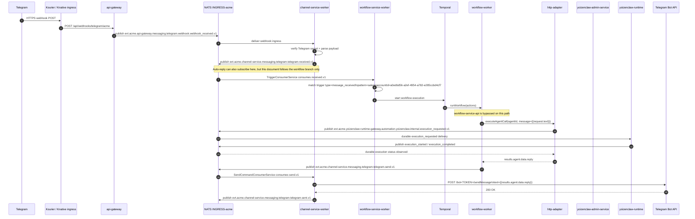
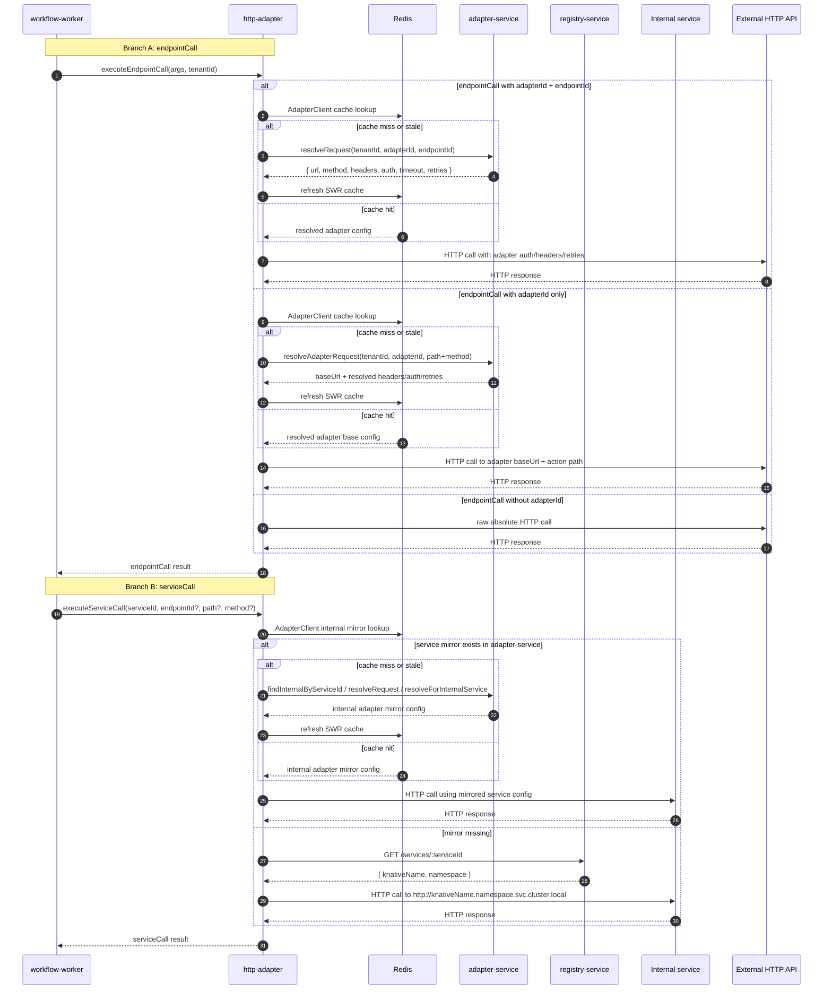

# Telegram Workflow Sequence

This document describes the **workflow-based** path for an inbound Telegram message in the current cluster, using the concrete `sales` workflow shape:

- trigger: `message_received`
- pattern: `sales`
- account: `a0edbd56-a2ef-4954-a782-e285ccbd4cf7`
- actions: `agentCall` -> `channelSend`

It does **not** describe the `channel-service` auto-reply shortcut except where noted.

---

## Scope

- **Kubernetes context:** `orbstack`
- **Platform namespace:** `platform-services-dev`
- **Support namespace:** `support-services-dev`
- **Tenant namespace:** `acme-dev-ns`
- **Tenant id used on NATS subjects:** `acme`

Important clarifications:

1. This path does **not** use `workflow-service-api` after the inbound message is on NATS.
2. This path does **not** use `event-processor`.
3. This concrete `sales` workflow does **not** use `adapter-service`.
4. `yoizenclaw-runtime` is reached **indirectly** via `yoizenclaw-admin-service`.

---

## Example Workflow

Relevant parts of the configured workflow shape:

```json
{
  "name": "sales",
  "tenantId": "acme",
  "trigger": {
    "type": "message_received",
    "mode": "exclusive",
    "config": {
      "patterns": ["sales"],
      "accountIds": ["a0edbd56-a2ef-4954-a782-e285ccbd4cf7"]
    }
  },
  "actions": [
    {
      "name": "agent",
      "activity": "agentCall",
      "args": {
        "agentId": "7533c598-978d-4784-b573-a7c3b1084cf0",
        "message": "{{request.text}}"
      }
    },
    {
      "name": "sales_out",
      "activity": "channelSend",
      "args": {
        "to": "{{request.from}}",
        "text": "{{results.agent.data.reply}}",
        "type": "text",
        "channel": "telegram",
        "provider": "telegram",
        "accountId": "a0edbd56-a2ef-4954-a782-e285ccbd4cf7"
      }
    }
  ]
}
```

---

## Live Cluster Aliases

Captured from `kubectl` on context `orbstack`.

| Alias | Namespace | Live resource | State at capture | Role in flow |
|------|-----------|---------------|------------------|--------------|
| `GW` | `platform-services-dev` | `api-gateway-00006-deployment-78895969fb-gpspz` | Running | Public webhook entrypoint |
| `CH-W` | `platform-services-dev` | `channel-service-worker-7f577fb969-d84tm` | Running | Webhook ingress consumer + outbound send consumer |
| `WF-SW` | `platform-services-dev` | `workflow-service-worker-5968fdbfc6-lwmnl` | Running | NATS trigger consumer (`message_received`) |
| `WF-W` | `platform-services-dev` | `workflow-worker-69df6999f6-478wv` | Running | Temporal orchestrator worker |
| `HTTP-ADAPTER` | `platform-services-dev` | `http-adapter-56688bb9f5-hd2sr` | Running | Remote activities (`serviceCall`, `endpointCall`) |
| `YZ-ADMIN` | `platform-services-dev` | `ksvc/yoizenclaw-admin-service` | Ready, but pod scaled to zero at capture (`Deployment 0/0`) | HTTP bridge to runtime |
| `YZ-RT` | `acme-dev-ns` | `yoizenclaw-runtime-00003-deployment-6f55cc5975-hcrgw` | Running | Actual runtime that generates the AI reply |
| `NATS` | `support-services-dev` | `svc/nats` | Running | JetStream + request/reply transport |
| `TEMPORAL` | `support-services-dev` | `svc/temporal` | Running | Workflow engine / task queues |
| `TELEGRAM API` | external | `https://api.telegram.org` | external | Final outbound send target |

> Note: `yoizenclaw-admin-service` is Knative and was scaled to zero when captured. That does not invalidate the path; the first `agentCall` will cold-start it.

---

## Sequence: Telegram -> Workflow -> YoizenClaw -> Telegram



---

## What Runs Where

| Step | Runs in | Transport | Uses adapter-service? | Notes |
|------|---------|-----------|------------------------|-------|
| Inbound Telegram webhook | `api-gateway` | HTTP | No | Public entrypoint `POST /api/webhooks/telegram/:tenantId` |
| Telegram payload normalization | `channel-service-worker` | JetStream consumer | No | Verifies Telegram secret token and publishes canonical `received.v1` |
| Workflow trigger matching | `workflow-service-worker` | JetStream consumer | No | Starts Temporal execution from `message_received` events |
| Action orchestration | `workflow-worker` | Temporal task queue | No | Executes workflow actions in order |
| `agentCall` | `workflow-worker` | Local Temporal activity -> JetStream | No | Publishes durable `execution_requested.v1` via shared YoizenClaw execution client |
| Runtime chat dispatch | `yoizenclaw-runtime` | JetStream durable consumer | No | Consumes `execution_requested.v1` and emits lifecycle/result events |
| AI reply generation | `yoizenclaw-runtime` | In-process execution | No | Produces the reply payload |
| `channelSend` | `workflow-worker` | Local activity -> NATS publish | No | Publishes `...telegram.telegram.send.v1` directly |
| Outbound Telegram send | `channel-service-worker` | JetStream consumer -> HTTP | No | Calls Telegram Bot API |

---

## How Other Workflow Activities Execute

The concrete `sales` workflow uses only `agentCall` and `channelSend`, but the workflow engine has multiple execution modes:

| Activity | Executed by | Actual path | Adapter-service involvement |
|----------|-------------|-------------|-----------------------------|
| `agentCall` | `workflow-worker` | JetStream `execution_requested.v1` -> `yoizenclaw-runtime` -> durable result events -> shared client wait | **No** |
| `channelSend` | `workflow-worker` | Publish `evt.<tenant>.channel-service.messaging.<channel>.<provider>.send.v1` -> `channel-service` egress | **No** |
| `endpointCall` | `http-adapter` | Direct HTTP, or adapter-resolved HTTP when `adapterId` is present | **Optional** |
| `serviceCall` | `http-adapter` | Mirror-first internal service resolution via adapter mirror; fallback to `registry-service` DNS lookup | **Usually yes** |
| `serviceBusCall` | `workflow-worker` | Direct NATS publish to arbitrary subject | **No** |

### `endpointCall`

`endpointCall` supports three modes:

1. `adapterId` + `endpointId`: fully resolved by `AdapterClient`
2. `adapterId` only: adapter base URL + supplied relative path
3. no `adapterId`: raw absolute URL via `fetch`

So your intuition was correct for `endpointCall`: it **can** route through `adapter-service`, but only when the workflow action includes adapter information.

### `serviceCall`

`serviceCall` is more internal-platform oriented:

1. it tries the adapter mirror first (`findInternalByServiceId`)
2. if that mirror exists, request resolution goes through `adapter-service`
3. if not, it falls back to `registry-service` to resolve the service DNS

So `serviceCall` is the activity most directly tied to the internal service registry / adapter mirror model.

---

## Sequence: Adapter-Heavy Workflow Activities

This second diagram shows how the workflow engine executes the two HTTP-oriented activities that are most likely to involve the internal adapter / registry model:

1. `endpointCall`
2. `serviceCall`



### Reading This Diagram

1. `endpointCall` is the generic outbound HTTP activity.
2. `serviceCall` is the internal-service-aware HTTP activity.
3. Both run on `http-adapter`, not on `workflow-worker` directly.
4. Redis here is the client-side SWR cache used by `AdapterClient` inside `http-adapter`.
5. `adapter-service` is only involved when the action references adapter-managed config or an internal mirrored service.
6. `registry-service` is only the fallback path for `serviceCall` when no adapter mirror exists.

---

## Why `workflow-service-api` Is Not On This Path

`workflow-service-api` is used for HTTP-driven workflow operations such as:

1. `POST /api/workflows/:id/execute`
2. `GET /api/workflows/:id`
3. `GET /api/workflows/:id/executions`

But for a channel-triggered workflow, the active path is:

1. `channel-service` publishes `received.v1`
2. `workflow-service-worker` consumes that event
3. `workflow-service-worker` starts the Temporal execution directly

So the API service is bypassed once the message enters the NATS-triggered branch.

---

## Alternate Path Not Shown

`channel-service` also has an **auto-reply** consumer on the same `received.v1` subject. That means some Telegram replies may bypass `workflow-service` entirely:

1. Telegram webhook
2. `api-gateway`
3. `channel-service` ingress
4. `channel-service` auto-reply
5. Telegram Bot API

This document intentionally follows the **workflow-based** branch because that is the path relevant to the `sales` workflow example.

---

## Live Validation Trigger

At capture time, `yoizenclaw-admin-service` had no running pod because Knative had scaled it to zero.

If you want to validate the live cold-start + request/reply path with logs instead of only code inspection, send a Telegram message that:

1. targets the configured Telegram bot/account `a0edbd56-a2ef-4954-a782-e285ccbd4cf7`
2. contains the trigger text `sales`

That should wake `yoizenclaw-admin-service` and drive the exact path documented above.
