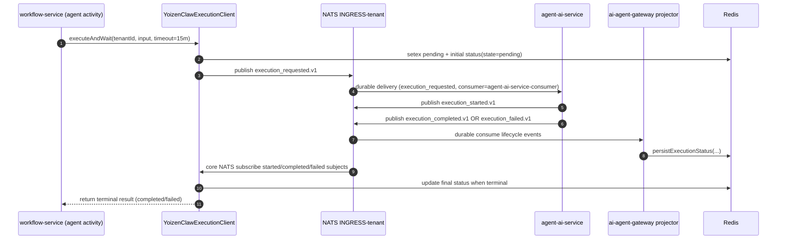

# Agent Execution Flow

Class: descriptive
Summary: The asynchronous path a workflow `agentCall` takes to agent-ai-service and back — subjects, Redis execution state, timeouts, failure modes, and the Vercel AI SDK version/migration status.

This document describes how a workflow `agentCall` reaches agent-ai-service and how results come back to the workflow.

The path is asynchronous over JetStream and uses Redis as execution state storage. The activity runs on the `workflow-orchestrator` task queue (not a separate one) with a 15-minute start-to-close timeout and 30-second heartbeat timeout.

## Component Roles

| Component | Role |
|---|---|
| `workflow-service` (`executeAgentCall` activity) | Submits and waits for agent execution; runs on the `workflow-orchestrator` task queue |
| `YoizenClawExecutionClient` (`packages/shared/src/execution-client.ts`) | Publishes `execution_requested.v1` to JetStream, subscribes to lifecycle events via core NATS, persists status in Redis |
| `agent-ai-service` (`MultiTenantConsumerService` + `MessageRouterService`) | Consumes `execution_requested` from `INGRESS-<tenant>` (durable `agent-ai-service-consumer`), runs agent via `ExecutionHandler`, publishes `execution_started/completed/failed` events |
| `ai-agent-gateway` | API-facing execution submit/get/stream service and durable status projector; publishes `execution_requested` under its own producer token, reads the three result kinds |
| `NATS JetStream` (`INGRESS-<tenant>`) | Durable transport for request and lifecycle events |
| `Redis` | Stores pending and result status records keyed by `<tenant>:<prefix><executionId>` |

## Subject Patterns

Each lifecycle event carries the producer token of the service that actually publishes it — the request comes from the gateway, the three results from `agent-ai-service`:

| Event | Publisher | Subject Pattern |
|---|---|---|
| requested | `ai-agent-gateway` (`YoizenClawExecutionClient`) | `evt.<tenant>.ai-agent-gateway.automation.platform.internal.execution_requested.v1` |
| started | `agent-ai-service` | `evt.<tenant>.agent-ai-service.automation.platform.internal.execution_started.v1` |
| completed | `agent-ai-service` | `evt.<tenant>.agent-ai-service.automation.platform.internal.execution_completed.v1` |
| failed | `agent-ai-service` | `evt.<tenant>.agent-ai-service.automation.platform.internal.execution_failed.v1` |

Until 2026-08-07 all four rode the `ai-agent-gateway` token regardless of publisher; the E3 migration (`PENDIENTES/04-e3-subject.spec.md`, commits 931d16dd + a3bd82c0) split them so subject token 2 names the real publisher. Readers of stored history must still accept the old token — `TAXONOMY.md` rule 6 classifies both.

The `YoizenClawExecutionClient` subscribes to `started`, `completed`, and `failed` on core NATS (not durable JetStream) for real-time result delivery. The `ai-agent-gateway` projector also binds a durable consumer to persist terminal state in Redis for late-joiners and retries.

## End-to-End Sequence



## Consumer Filter

`agent-ai-service` durable (`agent-ai-service-consumer`) subscribes to these subjects on `INGRESS-<tenant>`:

```
evt.*.agent-admin-service.automation.platform.internal.config_sync.v1
evt.*.agent-admin-service.automation.platform.internal.jobs_sync.v1
evt.*.agent-admin-service.automation.platform.internal.job_trigger.v1
evt.*.agent-admin-service.automation.platform.internal.chat_respond.v1
evt.*.agent-admin-service.automation.platform.internal.agent_outbound.v1
evt.*.agent-admin-service.automation.platform.internal.agent_published.v1
evt.*.agent-admin-service.automation.platform.internal.agent_unpublished.v1
evt.*.agent-admin-service.automation.platform.internal.skill_changed.v1
evt.*.ai-agent-gateway.automation.platform.internal.execution_requested.v1
```

`MessageRouterService` dispatches `execution_requested` actions to `ExecutionHandler`.

## Runtime Behavior

- `agent-ai-service` consumes `execution_requested` and routes to `ExecutionHandler`.
- On start it emits `execution_started`.
- On success it emits `execution_completed` with top-level result fields:
  `response`, `usage`, `costUsd`, `toolCalls`, `toolResults`, `model`, and
  `provider`.
- On exception it emits `execution_failed` with a top-level `error` string.

## Streaming (SDK `runtime.stream()`)

The flow above is the **buffered** path (`workflow-service` `agentCall`,
`chat.service.generateReply()`) — it waits for the full reply before
returning. A separate, additive **streaming** path exists for direct SDK
callers: `agent-ai-service` can publish per-token deltas to an ephemeral,
non-`evt.` NATS subject (`rt.<tenant>.exec.<executionId>.token`), relayed
through `ai-agent-gateway` and `api-gateway` as SSE and exposed by the SDK
as `runtime.stream()` (`AsyncIterable<RuntimeStreamEvent>`). It reuses the
same JetStream submission/lifecycle events described above for terminal
state — streaming only adds the live token side-channel. See
[runtime-streaming.md](../architecture/runtime-streaming.md) for the full
design (subjects, envelope shape, cancellation, and SDK semantics).

## MCP tool calls

Agents can also invoke tools exposed by external MCP servers (not just
adapter/builtin tools) via `agent-ai-service`'s MCP tool bridge, filtered
per-agent by `enabled_mcp_tools`. See
[mcp-connections.md](../architecture/mcp-connections.md) for the full
design and [adapter-tools.md](adapter-tools.md) for how MCP tools compare
to adapter/builtin tools in the agent tool-resolution path.

## Failure Modes

- **Execution timeout (activity-side):** the Temporal activity has `startToCloseTimeout: "15m"`. `executeAndWait` uses the configurable `AGENT_CALL_TIMEOUT_MS` (default 15 minutes). The activity heartbeats every 15 s so Temporal detects hangs via the 30 s `heartbeatTimeout`.
- **Runtime failure:** `agent-ai-service` emits `execution_failed`; the activity raises an error with the runtime message.
- **Circuit breaker open:** `executeAgentCall` fails non-retryably with `CIRCUIT_OPEN` when the `DistributedCircuitBreaker` (Redis-backed) denies calls for a `<tenant>:<agentId>` key. Breaker config: 10 failures / 120 s window, 60 s cooldown, 3 probe successes to close.
- **Redis unavailable:** `executeAgentCall` fails non-retryably with `REDIS_UNAVAILABLE` after ioredis exhausts `maxRetriesPerRequest: 3`, surfacing the configuration error to the operator instead of burning activity retries.
- **Cold-start config gap:** until `agent-ai-service` has loaded agent config for the tenant, an execution may not complete in time and manifests as a timeout upstream.

## Vercel AI SDK — version and migration status

The LLM layer is the upstream **Vercel AI SDK v6**. This section records only the
parts that are claims about THIS repo; for the SDK's own API read the upstream
docs at <https://ai-sdk.dev/docs> (the repo used to carry a 1365-line vendor
manual at `DOCS/reference/ai-sdk.md`; it was deleted by the docs-truth-audit T10
because it described the vendor, not the platform).

Pinned versions (`services/agent-ai-service/package.json`,
`services/agent-admin-service/package.json`): `ai ^6.0.197`,
`@ai-sdk/openai ^3.0.68`, `@ai-sdk/anthropic ^3.0.81`,
`@ai-sdk/google ^3.0.80`, `@ai-sdk/mcp ^1.0.46`. `agent-admin-service` pulls only
`openai` + `mcp`; `agent-ai-service` pulls all four.

v5 → v6 migration status, verified against the source:

| v6 API | Status in this repo |
|---|---|
| `generateText({ output: Output.object() })` replacing `generateObject` | **Not migrated.** `llm-executor.service.ts` still calls `generateObject`, and `agent-admin-service`'s SKB calls it (behind `as any`) in `skb-query.service.ts` and `skb-schema-analyzer.service.ts` |
| `streamText({ output: … })` replacing `streamObject` | **Not migrated.** `llm-executor.service.ts` `streamStructuredOutput` still calls `streamObject` |
| `stopWhen: stepCountIs(n)` replacing `maxSteps` | **Partly migrated.** `llm-executor.service.ts` uses `stopWhen: [stepCountIs(maxSteps), stopWhenToolLimit]`; `chat/session-chat.service.ts` still passes `maxSteps: 5` in two places |
| `tool({ inputSchema })` replacing `{ parameters }` | Migrated — every tool definition under `modules/tools/` and `modules/skills/` uses `inputSchema` |
| `maxOutputTokens` replacing `maxTokens` | Migrated in `llm-executor.service.ts` (the service's own `params.maxTokens` is an internal name mapped onto it) |
| Gateway model strings (`"anthropic/claude-sonnet-4.5"`) | Not used. Providers are built with `createOpenAI` / `createAnthropic` / `createGoogleGenerativeAI` factories in `provider-registry.service.ts` |

## References

- `services/workflow-service/src/temporal/activities/agent-call.activity.ts`
- `packages/shared/src/execution-client.ts`
- `services/agent-ai-service/src/modules/nats-consumer/multi-tenant-consumer.service.ts`
- `services/agent-ai-service/src/modules/nats-consumer/message-router.service.ts`
- `services/ai-agent-gateway/src/modules/executions/executions.service.ts`
- `packages/shared/src/constants.ts` (platform subject constants)
