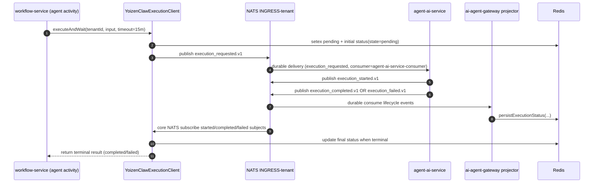

# Agent Execution Flow

This document describes how a workflow `agentCall` reaches agent-ai-service and how results come back to the workflow.

The path is asynchronous over JetStream and uses Redis as execution state storage. The activity runs on the `workflow-orchestrator` task queue (not a separate one) with a 15-minute start-to-close timeout and 30-second heartbeat timeout.

## Component Roles

| Component | Role |
|---|---|
| `workflow-service` (`executeAgentCall` activity) | Submits and waits for agent execution; runs on the `workflow-orchestrator` task queue |
| `YoizenClawExecutionClient` (`packages/shared/src/execution-client.ts`) | Publishes `execution_requested.v1` to JetStream, subscribes to lifecycle events via core NATS, persists status in Redis |
| `agent-ai-service` (`MultiTenantConsumerService` + `MessageRouterService`) | Consumes `execution_requested` from `INGRESS-<tenant>` (durable `agent-ai-service-consumer`), runs agent via `ExecutionHandler`, publishes `execution_started/completed/failed` events |
| `ai-agent-gateway` | API-facing execution submit/get/stream service and durable status projector; lifecycle events use `ai-agent-gateway` as producer token |
| `NATS JetStream` (`INGRESS-<tenant>`) | Durable transport for request and lifecycle events |
| `Redis` | Stores pending and result status records keyed by `<tenant>:<prefix><executionId>` |

## Subject Patterns

All lifecycle events use the `ai-agent-gateway` producer token regardless of which service publishes them:

| Event | Subject Pattern |
|---|---|
| requested | `evt.<tenant>.ai-agent-gateway.automation.platform.internal.execution_requested.v1` |
| started | `evt.<tenant>.ai-agent-gateway.automation.platform.internal.execution_started.v1` |
| completed | `evt.<tenant>.ai-agent-gateway.automation.platform.internal.execution_completed.v1` |
| failed | `evt.<tenant>.ai-agent-gateway.automation.platform.internal.execution_failed.v1` |

The `YoizenClawExecutionClient` subscribes to `started`, `completed`, and `failed` on core NATS (not durable JetStream) for real-time result delivery. The `ai-agent-gateway` projector also binds a durable consumer to persist terminal state in Redis for late-joiners and retries.

## End-to-End Sequence



## Consumer Filter

`agent-ai-service` durable (`agent-ai-service-consumer`) subscribes to these subjects on `INGRESS-<tenant>`:

```
evt.*.agent-admin-service.automation.platform.internal.config_sync.v1
evt.*.agent-admin-service.automation.platform.internal.jobs_sync.v1
evt.*.agent-admin-service.automation.platform.internal.job_trigger.v1
evt.*.agent-admin-service.automation.platform.internal.chat_respond.v1
evt.*.agent-admin-service.automation.platform.internal.agent_outbound.v1
evt.*.agent-admin-service.automation.platform.internal.agent_published.v1
evt.*.agent-admin-service.automation.platform.internal.agent_unpublished.v1
evt.*.agent-admin-service.automation.platform.internal.skill_changed.v1
evt.*.ai-agent-gateway.automation.platform.internal.execution_requested.v1
```

`MessageRouterService` dispatches `execution_requested` actions to `ExecutionHandler`.

## Runtime Behavior

- `agent-ai-service` consumes `execution_requested` and routes to `ExecutionHandler`.
- On start it emits `execution_started`.
- On success it emits `execution_completed` with top-level result fields:
  `response`, `usage`, `costUsd`, `toolCalls`, `toolResults`, `model`, and
  `provider`.
- On exception it emits `execution_failed` with a top-level `error` string.

## Failure Modes

- **Execution timeout (activity-side):** the Temporal activity has `startToCloseTimeout: "15m"`. `executeAndWait` uses the configurable `AGENT_CALL_TIMEOUT_MS` (default 15 minutes). The activity heartbeats every 15 s so Temporal detects hangs via the 30 s `heartbeatTimeout`.
- **Runtime failure:** `agent-ai-service` emits `execution_failed`; the activity raises an error with the runtime message.
- **Circuit breaker open:** `executeAgentCall` fails non-retryably with `CIRCUIT_OPEN` when the `DistributedCircuitBreaker` (Redis-backed) denies calls for a `<tenant>:<agentId>` key. Breaker config: 10 failures / 120 s window, 60 s cooldown, 3 probe successes to close.
- **Redis unavailable:** `executeAgentCall` fails non-retryably with `REDIS_UNAVAILABLE` after ioredis exhausts `maxRetriesPerRequest: 3`, surfacing the configuration error to the operator instead of burning activity retries.
- **Cold-start config gap (`waiting_for_config`):** runtime health reports `runtime_config=waiting_for_config` until config is loaded. In this state agent execution may not complete in time and manifests as timeout upstream.

## References

- `services/workflow-service/src/temporal/activities/agent-call.activity.ts`
- `packages/shared/src/execution-client.ts`
- `services/agent-ai-service/src/modules/nats-consumer/multi-tenant-consumer.service.ts`
- `services/agent-ai-service/src/modules/nats-consumer/message-router.service.ts`
- `services/ai-agent-gateway/src/modules/executions/executions.service.ts`
- `packages/shared/src/constants.ts` (platform subject constants)
