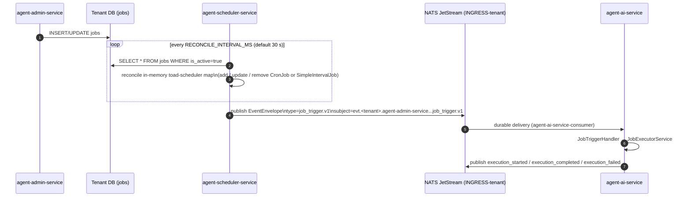

# Scheduled Agent Jobs

Jobs are recurring or one-shot work units that trigger an agent on a schedule. They are stored per-tenant in a `jobs` table, polled every ~30 seconds by `agent-scheduler-service`, and delivered as CloudEvents envelopes to `agent-ai-service` for execution.

## Architecture Overview

```
agent-admin-service       agent-scheduler-service          agent-ai-service
 (jobs CRUD + storage)     (reconciler + toad-scheduler)   (job executor)
        │                           │                              │
        │  tenant DB: jobs table    │                              │
        │◄──────────────────────────│                              │
        │                           │  every ~30s                  │
        │                           │  readAllTenantJobs()         │
        │                           │  reconcile in-memory map     │
        │                           │                              │
        │                           │  on fire: publishJobTrigger  │
        │                           │──────────────────────────────►
        │                           │  NATS JetStream              │
        │                           │  INGRESS-{tenant}            │
        │                           │  subject: job_trigger.v1     │
        │                           │                              │
        │                           │                              │ JobTriggerHandler
        │                           │                              │ → JobExecutorService
        │                           │                              │ → action_type dispatch
```

## End-to-End Sequence



## Schedule Formats

Schedule type is determined by the shared `parseSchedule` function (`packages/shared/src/schedule.utils.ts`), used at reconcile time by `agent-scheduler-service` (`services/agent-scheduler-service/src/modules/scheduler/job-reader.service.ts`) and by `agent-admin-service` for `next_run` calculation:

| Format | Detected as | Example | Toad-scheduler type |
|---|---|---|---|
| `"once"` | `once` (one-shot, no recurring schedule) | `"once"` | — |
| All-digit string | `interval` in **seconds** | `"3600"` = 3 600 s | `SimpleIntervalJob` |
| `interval:<digits>` | `interval` in **minutes** | `"interval:60"` = 60 min | `SimpleIntervalJob` |
| Anything else | `cron` | `"0 9 * * 1-5"` | `CronJob` |

Malformed forms (`interval:abc`, `interval:0`, `"0"`, intervals over the ~24.85-day `setInterval` limit) are classified as `invalid` rather than falling through to cron.

The `agent-admin-service` `calculateNextRun` helper (`services/agent-admin-service/src/modules/jobs/schedule.utils.ts`, called from `jobs.postgres.repository.ts`) computes `next_run` for display: no next run for `once`, `now + intervalMs` for intervals, and real cron parsing via the `cron-parser` library for cron expressions. The scheduler computes actual fire times from toad-scheduler's cron engine.

## Job Object

```typescript
interface IJob {
  id: string;            // UUID
  name: string;          // display name (max 255 chars)
  agent_id: string;      // UUID of the target agent
  schedule: string;      // "once", bare-integer seconds, "interval:<minutes>", or cron expression
  payload: Record<string, unknown>; // forwarded as eventPayload
  is_active: boolean;
  last_run: Date | null;
  next_run: Date | null;
  created_at: Date;
  updated_at: Date;
}
```

The `payload` object is passed verbatim as `eventPayload` in the NATS envelope. `agent-ai-service` reads `payload.action_type` to dispatch to the correct executor:

| `action_type` | Executor |
|---|---|
| `llm_call` | `LlmActionService` |
| `webhook` | `WebhookActionService` |
| `function` | `FunctionActionService` |
| `python_code` | `FunctionActionService` (stub) |
| `agent_task` | `AgentTaskService` |
| _(missing/unknown)_ | Error — `execution_failed` published |

## API Endpoints

### `agent-admin-service` — CRUD (`/admin/jobs`)

All routes require `x-yoizen-tenant` header and `TenantGuard`.

| Method | Path | Description |
|---|---|---|
| `GET` | `/admin/jobs` | List jobs; query: `agent_id`, `is_active`, `limit`, `offset` |
| `GET` | `/admin/jobs/executions` | List execution records; query: `job_id`, `status`, `limit`, `offset` |
| `GET` | `/admin/jobs/:id` | Get one job |
| `POST` | `/admin/jobs` | Create a job (returns 201) |
| `PUT` | `/admin/jobs/:id` | Update a job |
| `DELETE` | `/admin/jobs/:id` | Delete a job (returns 204) |
| `POST` | `/admin/jobs/:id/enable` | Set `is_active=true` |
| `POST` | `/admin/jobs/:id/disable` | Set `is_active=false` |
| `POST` | `/admin/jobs/:id/run` | Manually run now (returns IJobExecution, 201) |
| `POST` | `/admin/jobs/:id/trigger` | Run with custom `event_payload` body (returns IJobExecution, 201) |

Controller: `services/agent-admin-service/src/modules/jobs/jobs.controller.ts`.

### `agent-scheduler-service` — Read-only (`/admin`)

Protected by `AdminApiKeyGuard` when `ADMIN_API_KEY` is configured. Requests
must send `x-internal-api-key` with the same value. If `ADMIN_API_KEY` is unset,
the admin endpoints are disabled and return forbidden instead of allowing
unauthenticated access.

| Method | Path | Description |
|---|---|---|
| `GET` | `/admin/jobs` | Active in-memory schedules summary |
| `GET` | `/admin/executions?limit=N` | Recent execution records from Redis |
| `GET` | `/admin/tenants` | Known tenant IDs |

Controller: `services/agent-scheduler-service/src/modules/admin/admin.controller.ts`.

## Execution History

Scheduler-side history is stored in Redis under the key `scheduler:history:<tenantId>:<jobId>:<triggeredAt>` with a 7-day TTL (`ExecutionHistoryService`, `services/agent-scheduler-service/src/modules/scheduler/execution-history.service.ts`). Each record captures `status` = `triggered | published | failed` — it reflects whether the NATS publish succeeded, not whether the agent completed.

Agent-admin-service also maintains an `IJobExecution` table (backed by both Mongo and Postgres repositories), written when `run`/`trigger` endpoints are called directly. Status values for that store are `pending | running | completed | failed`.

There is no automatic cleanup of the `IJobExecution` table; only the Redis scheduler history has a TTL.

## NATS Subject

The scheduler publishes to the `AGENT_ADMIN_JOB_TRIGGER` constant:

```
evt.<tenant>.agent-admin-service.automation.platform.internal.job_trigger.v1
```

The envelope type is `io.yoizen.agent-admin-service.job.triggered.v1`. `agent-ai-service`'s durable consumer (`agent-ai-service-consumer`) subscribes to `job_trigger.v1` subjects on `INGRESS-<tenant>` (see [execution.md](./execution.md) for the full consumer filter).

## Leader Election

Only one scheduler instance fires jobs at a time. Leadership uses a PostgreSQL advisory lock via `LEADER_ELECTION_POSTGRES_URL`. If the env var is unset and no tenants are registered yet, the scheduler defers and retries every 10 seconds. The in-memory `activeSchedules` map is per-process; a newly elected leader rebuilds it from the DB on first reconcile.

## Seed Jobs

`services/agent-admin-service/data/jobs.yaml` defines two reference jobs:

| ID | Name | Schedule | Agent | Purpose |
|---|---|---|---|---|
| `job-metrics-snapshot` | Metrics Snapshot | `interval:3600` | `agent-default` | Collect conversation metrics |
| `job-demo-notification` | Demo Notification | `once` | `agent-sales-assistant` | Test job for admin UI |

These are reference definitions only — the YAML is not auto-seeded; they must be created via the API or admin console.

**Do not copy them verbatim.** The fixture has drifted from every shape on this page:
`interval:3600` is **3 600 minutes (60 h)** under `parseSchedule`, not the "every hour"
its own `description` claims (bare `"3600"` would be the hourly form); its keys are
`enabled`/`payload.action`, while `IJob` uses `is_active` and the executor dispatches on
`payload.action_type` — a job created from this payload would hit the unknown-action
branch and publish `execution_failed`.

## Sample Requests

### Create a job

```bash
curl -X POST http://agent-admin-service/admin/jobs \
  -H "Content-Type: application/json" \
  -H "x-yoizen-tenant: acme" \
  -d '{
    "name": "Daily Summary",
    "agent_id": "550e8400-e29b-41d4-a716-446655440000",
    "schedule": "0 8 * * *",
    "payload": {
      "action_type": "agent_task",
      "action_config": { "prompt": "Generate daily summary report" }
    },
    "is_active": true
  }'
```

### Trigger manually with custom payload

```bash
curl -X POST http://agent-admin-service/admin/jobs/550e.../trigger \
  -H "Content-Type: application/json" \
  -H "x-yoizen-tenant: acme" \
  -d '{
    "event_payload": {
      "action_type": "llm_call",
      "agent_id": "550e8400-...",
      "action_config": { "prompt": "Run emergency check" }
    }
  }'
```

## Admin Console Pages

| Component | File | Purpose |
|---|---|---|
| `SchedulesComponent` | `automation/schedules/schedules.component.ts` | List all jobs |
| `ScheduleFormDialogComponent` | `automation/schedules/schedule-form-dialog.component.ts` | Create / edit a job |
| `ScheduleDetailComponent` | `automation/schedules/detail/schedule-detail.component.ts` | Job detail view |
| `ScheduleExecutionsComponent` | `automation/schedules/detail/schedule-executions.component.ts` | Execution history per job |
| `ScheduleOverviewComponent` | `automation/schedules/detail/schedule-overview.component.ts` | Job overview / stats |

## File Reference

| File | Description |
|---|---|
| `services/agent-admin-service/src/modules/jobs/jobs.controller.ts` | CRUD + enable/disable/run/trigger endpoints |
| `services/agent-admin-service/src/modules/jobs/jobs.dto.ts` | CreateJobDto, UpdateJobDto, TriggerJobDto |
| `services/agent-admin-service/src/modules/jobs/jobs.repository.interface.ts` | IJob shape |
| `services/agent-admin-service/src/modules/jobs/jobs.postgres.repository.ts` | PostgreSQL implementation |
| `services/agent-admin-service/src/modules/jobs/schedule.utils.ts` | `calculateNextRun` (uses `cron-parser`) |
| `packages/shared/src/schedule.utils.ts` | Shared `parseSchedule` (once / interval / cron classification) |
| `services/agent-admin-service/data/jobs.yaml` | Reference seed jobs (not auto-applied) |
| `services/agent-scheduler-service/src/modules/scheduler/scheduler.service.ts` | Reconcile loop, toad-scheduler management, leader election |
| `services/agent-scheduler-service/src/modules/scheduler/job-reader.service.ts` | Reads active jobs from each tenant DB |
| `services/agent-scheduler-service/src/modules/scheduler/job-trigger.service.ts` | Fire callback — delegates to the publisher below |
| `services/agent-scheduler-service/src/providers/nats.provider.ts` | `publishJobTrigger` — builds the envelope (`EVENT_TYPE_JOB_TRIGGER`) and publishes to `buildPlatformSubject(AGENT_ADMIN_JOB_TRIGGER, tenantId)` |
| `services/agent-scheduler-service/src/modules/scheduler/leader-election.service.ts` | `pg_try_advisory_lock` leadership |
| `services/agent-scheduler-service/src/modules/scheduler/execution-history.service.ts` | Redis-backed 7-day history |
| `services/agent-scheduler-service/src/modules/admin/admin.controller.ts` | Internal read-only ops endpoint |
| `services/agent-scheduler-service/src/config.ts` | `RECONCILE_INTERVAL_MS` (default 30 000), `LEADER_ELECTION_POSTGRES_URL` |
| `services/agent-ai-service/src/nats-handlers/job-trigger.handler.ts` | Receives job_trigger envelope, delegates to JobExecutorService |
| `services/agent-ai-service/src/modules/job-executor/job-executor.service.ts` | Dispatches action_type, publishes execution lifecycle events |
