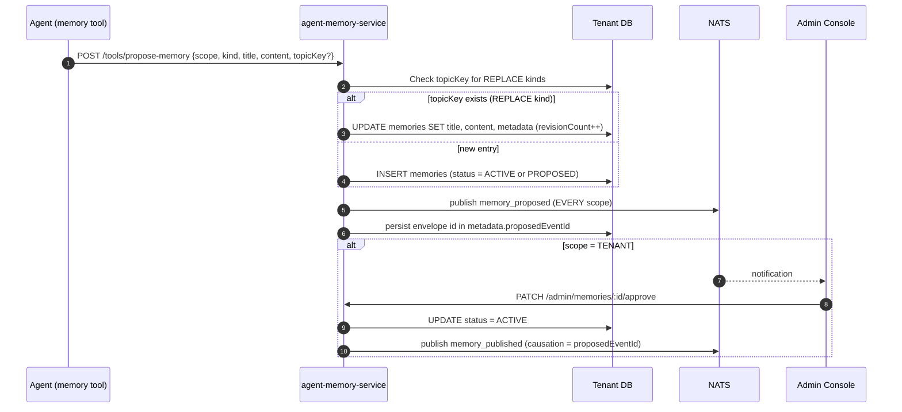

# Agent Long-Term Memory

`agent-memory-service` stores facts, preferences, notices, incidents, and promotions that agents can read and write across conversations. Memory is scoped to a session, a user, or an entire tenant, and has a lightweight approval workflow for tenant-wide writes.

## Scopes, Kinds, and Statuses

### Scopes

| Scope | Meaning | Initial Status |
|---|---|---|
| `SESSION` | Visible to a single conversation | `ACTIVE` immediately |
| `USER` | Visible across all sessions for one user | `ACTIVE` immediately |
| `TENANT` | Visible to all agents in the tenant | `PROPOSED` — requires admin approval |

Defined in `services/agent-memory-service/src/modules/memory/domain/enums.ts`.

### Kinds

| Kind | Merge strategy | Typical use |
|---|---|---|
| `PREFERENCE` | `REPLACE` (upsert by `topicKey`) | User language, tone, preferences |
| `FACT` | `REPLACE` | Current plan, account state |
| `NOTICE` | `REPLACE` | One-time notice or announcement |
| `INCIDENT` | `KEEP_BOTH` | Error events, escalations |
| `PROMO` | `KEEP_BOTH` | Promotional messages |

`REPLACE` kinds deduplicate using `topicKey`: if a memory with the same `topicKey` and scope already exists, `proposeMemory` updates it in place and increments `metadata.revisionCount`. `KEEP_BOTH` always creates a new row.

### Statuses

| Status | Transitions |
|---|---|
| `PROPOSED` | → `ACTIVE` (approve) or `REJECTED` (reject) |
| `ACTIVE` | Normal read state |
| `REJECTED` | Terminal |
| `ARCHIVED` | Set manually |

Note: the SQL schema's status check constraint allows exactly these four values. `PUBLISHED` and `EXPIRED` are legacy statuses that `schema-initializer.ts` migrates to `ACTIVE`/`ARCHIVED` on startup; they still appear as filter options in the LLM memory tool's input schema (`memory.tool.ts`) but are no longer valid stored statuses.

## Tenant Schema

Each tenant gets its own `memories` table created on demand by `initAgentMemoryTenantSchema` (`services/agent-memory-service/src/providers/schema-initializer.ts`), which runs the DDL from `services/agent-memory-service/src/schema/memory-schema.sql`.

```sql
CREATE TABLE IF NOT EXISTS memories (
    id          UUID PRIMARY KEY DEFAULT gen_random_uuid(),
    tenant_id   VARCHAR(32) NOT NULL,
    user_id     VARCHAR(255),
    session_id  VARCHAR(255),
    scope       VARCHAR(20) NOT NULL CHECK (scope IN ('SESSION', 'USER', 'TENANT')),
    kind        VARCHAR(20) NOT NULL CHECK (kind IN ('PROMO', 'INCIDENT', 'NOTICE', 'PREFERENCE', 'FACT')),
    status      VARCHAR(20) NOT NULL DEFAULT 'ACTIVE',
    CONSTRAINT memories_status_check
                CHECK (status IN ('PROPOSED', 'ACTIVE', 'REJECTED', 'ARCHIVED')),
    title       TEXT NOT NULL,
    content     TEXT NOT NULL,
    metadata    JSONB NOT NULL DEFAULT '{}',
    topic_key   VARCHAR(255),
    expires_at  TIMESTAMPTZ,
    created_at  TIMESTAMPTZ NOT NULL DEFAULT NOW(),
    updated_at  TIMESTAMPTZ NOT NULL DEFAULT NOW(),
    search_vector tsvector GENERATED ALWAYS AS ( ... ) STORED
);
```

Indexes are created on `session_id`, `scope`, `kind`, `status`, `topic_key`, `created_at`, `expires_at`, and a GIN index on `search_vector`. Full-text search uses Spanish language weights (title `'A'`, content `'B'`).

## Proposal Flow



**Key rule:** Only `TENANT` scope memories start as `PROPOSED`. `SESSION` and `USER`
scope memories become `ACTIVE` immediately regardless of who creates them. A
`skipApproval` flag forces `ACTIVE` even for `TENANT` scope.

**The `memory_proposed` event is NOT scope-gated.** `proposeMemory` publishes it on
every successful create *and* on every `REPLACE`-kind upsert, whatever the scope, as
long as a NATS publisher is wired. Only the approve/reject follow-ups are
TENANT-specific, because only `TENANT` memories can be in `PROPOSED`.

Event names, from `EVENT_TYPES` in `services/agent-memory-service/src/providers/nats.provider.ts`
(each type is projected from its own subject by `buildEventTypeFromSubject`, so the
two can never disagree): `memory_proposed`, **`memory_published`** (the approve
event — not "approved"), `memory_rejected`, `memory_expired`. Publishing is
best-effort: a failure is logged and leaves the memory row unchanged.

## API Endpoints

### Agent-facing: `agent-memory-service` (`/tools/*`)

The agent-facing controller is at `services/agent-memory-service/src/modules/memory/controllers/agent-tools.controller.ts`. All routes require `x-yoizen-tenant` header.

| Method | Path | Description |
|---|---|---|
| `POST` | `/tools/propose-memory` | Propose or upsert a memory |
| `GET` | `/tools/memories` | List memories with filters |
| `GET` | `/tools/memories/:id/timeline` | Session/user activity timeline |

### Admin-facing: `agent-memory-service` (`/admin/memories*`)

The admin controller is at `services/agent-memory-service/src/modules/memory/controllers/admin-memories.controller.ts`.

| Method | Path | Description |
|---|---|---|
| `GET` | `/admin/memories` | List all memories (filterable) |
| `GET` | `/admin/memories/proposals` | List memories with `status=PROPOSED` |
| `GET` | `/admin/memories/:id` | Get a single memory |
| `POST` | `/admin/memories` | Create a memory (skips approval for SESSION/USER) |
| `PATCH` | `/admin/memories/:id` | Update title, content, or metadata |
| `PATCH` | `/admin/memories/:id/approve` | Approve a PROPOSED memory |
| `PATCH` | `/admin/memories/:id/reject` | Reject a PROPOSED memory |
| `DELETE` | `/admin/memories/:id` | Delete a memory |

Query parameters for `GET /admin/memories`: `scope`, `kind`, `status`, `search` (full-text), `sessionId`, `userId`, `includeExpired`, `limit` (1–500), `offset`.

### Proposal review: `agent-admin-service` (`/admin/memories/proposals*`)

`agent-admin-service` proxies proposal review through `AgentsRuntimeService` to `agent-memory-service`. Controller: `services/agent-admin-service/src/modules/memories/memories.controller.ts`.

| Method | Path | Description |
|---|---|---|
| `GET` | `/admin/memories/proposals` | List proposals (filter: `status`, `kind`, `limit`) |
| `POST` | `/admin/memories/proposals/:id/approve` | Approve; accepts `{ reason? }` body; uses `x-yoizen-user-id` header as reviewer |
| `POST` | `/admin/memories/proposals/:id/reject` | Reject; same shape |

## LLM Memory Tool

`agent-ai-service` exposes a built-in `memory` tool to the LLM at runtime. The tool definition and handler are in `services/agent-ai-service/src/modules/tools/builtin-tools/memory.tool.ts`.

Supported actions:

| Action | Required fields | Effect |
|---|---|---|
| `list` | — | List memories; auto-injects `sessionId`/`userId` from execution context |
| `search` | `search` | Full-text search against ACTIVE memories |
| `get` | `id` | Retrieve one memory by ID |
| `create` | `title`, `content` | Propose a memory via `MemoryClientService.create` |
| `update` | `id` | Patch title, content, metadata, or topicKey |
| `delete` | `id` | Hard-delete a memory |
| `approve` | `id` | Approve a PROPOSED memory |
| `reject` | `id` | Reject a PROPOSED memory |

Output is capped at `MAX_OUTPUT_CHARS` (16 384). `buildTruncatedListOutput` enforces it in three steps, because an item count alone is not enough — one memory can exceed the whole budget: keep the first **5** items, clamp each item's `content` to **500** chars (suffixed `…[truncated]`), then drop items until the serialized envelope fits. The result carries `truncated: true` and a `message` stating the real total.

`MemoryClientService` (`services/agent-ai-service/src/modules/memory/memory-client.service.ts`) calls `agent-memory-service` via HTTP using `MEMORY_SERVICE_URL` and passes `x-yoizen-tenant` on every request.

## Memory Context Injection

Before each LLM call, `MemoryContextBuilderService` (`services/agent-ai-service/src/modules/memory/memory-context-builder.service.ts`) calls `MemoryClientService.search` with the incoming user message as the query — an HTTP `GET {MEMORY_SERVICE_URL}/admin/memories?search=<message>&limit=10&status=ACTIVE`, i.e. the ADMIN endpoint, not the `/tools/*` one. The top 5 contents are joined with `"; "` into a summary string; up to 10 items are formatted as a bullet list. Any failure is caught and degrades to an empty context. `formatForPrompt` returns:

```
Tenant memory summary:
<joined content of top 5>

Tenant memories:
- <title>: <content>
...
```

`ContextBuilderService` puts this string on `memoryContext`, and
`SessionChatService` **appends** it as the LAST section of the assembled system
prompt (after the agent instructions, skill, and rules blocks) — it is not
prepended.

## Sample Request/Response

### Propose a memory (agent tool path)

```bash
curl -X POST http://agent-memory-service/tools/propose-memory \
  -H "Content-Type: application/json" \
  -H "x-yoizen-tenant: acme" \
  -d '{
    "scope": "USER",
    "kind": "PREFERENCE",
    "title": "Preferred language",
    "content": "User prefers responses in Spanish",
    "userId": "user-123",
    "topicKey": "user-123/language-preference"
  }'
```

Response (201):

```json
{
  "id": "a1b2c3d4-...",
  "scope": "USER",
  "kind": "PREFERENCE",
  "status": "ACTIVE",
  "title": "Preferred language",
  "content": "User prefers responses in Spanish",
  "topicKey": "user-123/language-preference",
  "metadata": {},
  "createdAt": "2026-06-12T10:00:00Z",
  "updatedAt": "2026-06-12T10:00:00Z"
}
```

### Approve a TENANT-scope proposal (admin path)

```bash
curl -X PATCH http://agent-memory-service/admin/memories/a1b2c3d4-.../approve \
  -H "x-yoizen-tenant: acme"
```

Response (200): updated memory object with `status: "ACTIVE"`.

## Admin Console Pages

Three Angular components handle memory management under `services/admin-console/src/app/features/automation/ai/`:

| Component | File | Purpose |
|---|---|---|
| `MemoriesComponent` | `memories.component.ts` | List and manage all tenant memories |
| `MemoryFormDialogComponent` | `memory-form-dialog.component.ts` | Create or edit a memory |
| `MemoryProposalsPanelComponent` | `memory-proposals-panel.component.ts` | Review and approve/reject PROPOSED memories |

## File Reference

| File | Description |
|---|---|
| `services/agent-memory-service/src/modules/memory/domain/enums.ts` | `MemoryScope`, `MemoryKind`, `MemoryStatus`, `MergeStrategy` |
| `services/agent-memory-service/src/modules/memory/services/memory.service.ts` | Core business logic: propose, approve, reject, topicKey dedup |
| `services/agent-memory-service/src/modules/memory/controllers/agent-tools.controller.ts` | Agent-facing HTTP API (`/tools/*`) |
| `services/agent-memory-service/src/modules/memory/controllers/admin-memories.controller.ts` | Admin HTTP API (`/admin/memories*`) |
| `services/agent-memory-service/src/modules/memory/dto/propose-memory.dto.ts` | Proposal request shape (title max 500 chars, content max 50 000 chars) |
| `services/agent-memory-service/src/schema/memory-schema.sql` | Per-tenant DDL with full-text search vector |
| `services/agent-memory-service/src/providers/schema-initializer.ts` | Runs DDL on tenant connection init |
| `services/agent-ai-service/src/modules/memory/memory-client.service.ts` | HTTP client for `agent-memory-service` |
| `services/agent-ai-service/src/modules/memory/memory-context-builder.service.ts` | Builds and formats memory context for LLM prompt |
| `services/agent-ai-service/src/modules/tools/builtin-tools/memory.tool.ts` | Built-in `memory` tool exposed to the LLM |
| `services/agent-admin-service/src/modules/memories/memories.controller.ts` | Proposal review proxy in agent-admin-service |
