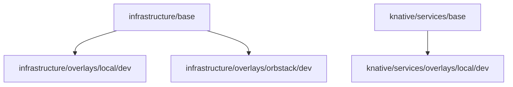

# Infrastructure and Deployment

> **Developer mode:** This document describes the current single-node developer
> configuration. Multi-environment (qa/staging/production), cloud overlays, KEDA
> autoscaling, Temporal 4-role HA, and Redis cluster mode were removed from the
> active configuration. See the notes below for what changed and what was cut.

This document explains how infrastructure services support the platform and how workloads are deployed and scaled.

## Support Services

Support services are shared in `support-services-dev` and back all platform workloads.

| Service | Primary role | Platform usage |
|---|---|---|
| NATS JetStream | Durable event backbone | Internal async messaging on `INGRESS-<tenant>` and DLQ streams |
| Redis | Shared low-latency state/cache | L2 cache, execution status store, public-routes sync cache |
| PostgreSQL | Persistent relational storage | Shared platform DB + tenant-isolated DBs (via CloudNativePG) |
| Temporal | Durable orchestration engine | Workflow execution and activity queue dispatch |

### Redis

Developer mode runs a **standalone** Redis StatefulSet (`REDIS_CLUSTER_MODE=false`). The previous Redis Cluster (3-node) was collapsed to a single node for simplicity.

### Redis Roles (explicit)

Redis serves three distinct roles across the platform:

1. **L2 cache for connector-backed HTTP resolution**
   - Used by `AdapterClient` (consumed by `connector-runtime`) with stale-while-revalidate behavior; cache is keyed per tenant + connector id.
2. **Execution state store for YoizenClaw runtime gateway path**
   - Stores pending/running/completed/failed execution status so playground and runtime API reads can poll quickly.
3. **Auth/gateway route synchronization cache**
   - Stores dynamic public route data consumed by gateway auth checks.

### Temporal

Developer mode runs a **single `temporalio/auto-setup` Deployment** named `temporal` (labels: `app.kubernetes.io/name=temporal`, `temporal.io/role=frontend`). All four internal Temporal roles (frontend, history, matching, worker) run in one process. The `temporal` Service serves `:7233`.

The 4-role HA split (separate `temporal-frontend`, `-history`, `-matching`, `-worker` Deployments) was an experiment used during stress testing but is no longer the active configuration. `runbooks/temporal-ha-migration.md` describes that one-time migration for historical context.

Developer mode also uses a single `postgres-temporal` CNPG cluster for both workflow state and visibility (both `POSTGRES_SEEDS` and `VISIBILITY_POSTGRES_SEEDS` point to `postgres-temporal-rw`). The separate `postgres-temporal-visibility` cluster described in `runbooks/temporal-visibility-split.md` is not active in developer mode.

## Deployment Models

| Model | Used by | Why |
|---|---|---|
| Knative Service | HTTP-facing APIs (`api-gateway`, `auth-service`, `registry-service`, etc.) | Request-driven autoscaling and revision support |
| Plain Deployment (fixed replicas) | Queue/worker workloads (`connector-runtime`, workflow workers, consumer workers) | All workers run at min-scale=max-scale=1 in developer mode |

> **KEDA removed:** KEDA ScaledObjects were deleted from the base manifests.
> All worker Deployments use fixed `replicas: 1`. Scale-to-zero components
> (`_components/scale-to-zero-*/`) are not used by the active `dev` overlay.

## Kustomize Structure

The platform uses Kustomize for manifests and environment overlays.

- Infra base: `infrastructure/base/`
- Infra overlays: `infrastructure/overlays/local/dev`, `infrastructure/overlays/orbstack/dev`
- Service base: `knative/services/base/`
- Service overlays: `knative/services/overlays/local/dev` (postgres or mongo variant)

> Note: `knative/services/overlays/cloud/` and multi-env overlays (qa/staging/production)
> were deleted. The scale-to-zero component directories under `_components/` were removed
> too — only a `README.md` documenting their prior existence remains, and no active overlay
> references them.

## Add a New Service (Checklist)

- Add base manifest in `knative/services/base/` (Knative Service or Deployment).
- Add image/env patches in `knative/services/overlays/local/dev/`.
- Add health/proxy wiring in gateway if externally accessible through platform API.
- Update docs (`DOCS/architecture/overview.md`) with role and dependencies.

## References

- `infrastructure/base/`
- `infrastructure/overlays/`
