# Platform Architecture

This document is the high-level map of the platform. It focuses on ownership boundaries and service placement, not detailed message-by-message flows.

The platform runs as an event-driven, multi-tenant system on Kubernetes. It uses support infrastructure shared by each environment (`support-services-{env}`), platform application services (`platform-services-{env}`), and per-tenant runtime/data boundaries represented inside the platform tier.

## Three-Layer Model

- **Support services** host shared infrastructure for one environment: NATS JetStream, Redis, Temporal, and the shared CNPG PostgreSQL clusters (`postgres-shared`, `postgres-usage-shared`, `postgres-temporal`, `postgres-temporal-visibility`).
- **Platform services** implement APIs, workflow orchestration, integrations, tenant lifecycle, agent runtime, and UI backends.
- **Per-tenant data boundary** isolates tenant data: each tenant gets its own namespace with a `postgres` ExternalName service aliasing the shared CNPG cluster (default `shared` tier) or a dedicated StatefulSet (`dedicated` tier override), plus per-tenant NATS streams.

## High-Level Service Map

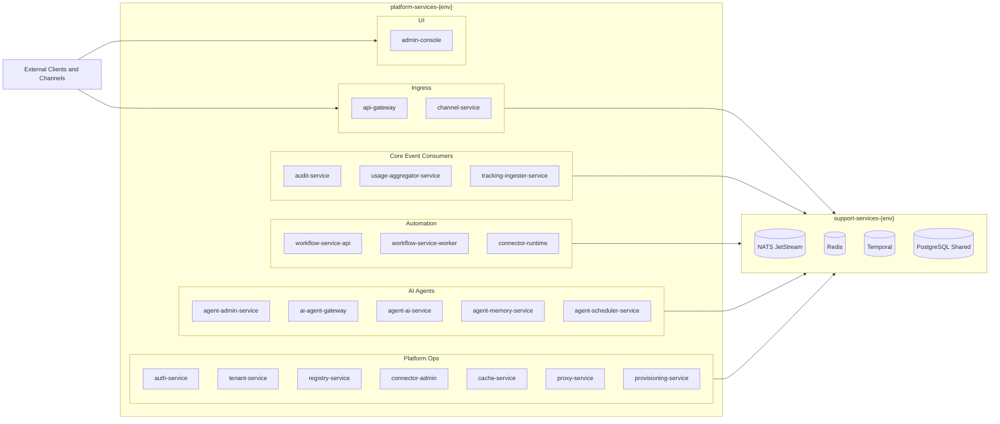

## Service Roles

| Service | Layer | Role |
|---|---|---|
| `api-gateway` | Platform | External HTTP entry, auth enforcement, service proxying, webhook ingress entry |
| `channel-service` | Platform | Channel ingress/egress orchestration (WhatsApp, Instagram, Telegram, generic HTTP), normalized message events |
| `audit-service` | Platform | Durable event audit persistence to tenant PostgreSQL |
| `usage-aggregator-service` | Platform | Cross-stream usage aggregation for tenant analytics |
| `tracking-ingester-service` | Platform | Durable event tracking: consumes every bus event into `tracking.tracked_events` (taxonomy classification, causal chains, payload lifecycle) and serves the trace/chain/run read APIs |
| `workflow-service-api` | Platform | Workflow management API and Temporal client entry |
| `workflow-service-worker` | Platform | Temporal worker and NATS trigger bridge |
| `connector-runtime` | Platform | High-concurrency activity worker for `endpointCall` and `serviceCall` |
| `agent-admin-service` | Platform | CRUD and publish lifecycle for agents, templates, credentials, files |
| `ai-agent-gateway` | Platform | Async execution bridge between API/workflows and runtime via NATS |
| `agent-ai-service` | Platform | AI agent runtime: LLM pipeline, tools, memory context, job execution |
| `agent-memory-service` | Platform | Long-term agent memory: proposals, approval workflow, scoped retrieval |
| `agent-scheduler-service` | Platform | Cron/interval scheduler for agent jobs; fires `job_trigger` events to NATS |
| `auth-service` | Platform | JWT issuance and dynamic public-route sync |
| `tenant-service` | Platform | Tenant lifecycle and namespace/data provisioning |
| `registry-service` | Platform | Dynamic service registry and route metadata |
| `connector-admin` | Platform | Outbound HTTP connector configuration store and lookup |
| `cache-service` | Platform | L1/L2 cache abstraction backed by Redis |
| `proxy-service` | Platform | HTTP proxy for external tenant-dependent backends |
| `admin-console` | Platform | Operational UI for platform and YoizenClaw admin workflows |
| `provisioning-service` | Platform | Declarative manifest provisioning: validate/plan/apply reconciler (channels/connectors/agents/KBs/hosted services/workflows), write-only per-resource secrets CRUD + internal-only secrets broker with scope binding |

## Key Architecture Decisions

- **Namespace layering is intentional**: support infra is environment-scoped, application services are platform-scoped, and tenant runtime/data are isolated behind tenant boundaries.
- **JetStream is the default async backbone**: durable stream/consumer semantics are used for internal flows; core NATS is reserved for lightweight platform signals.
- **Temporal isolates orchestration concerns**: workflow logic remains in workflow workers while HTTP/agent I/O scales separately through `connector-runtime`.
- **Per-tenant data ownership is explicit**: audit, metrics, scheduler data, and agent runtime state are tenant-bound.

## Multi-Tenancy Model

- One cluster, multiple tenants.
- **NATS**: per-tenant streams (`INGRESS-<TENANT>`, `DLQ-<TENANT>`, `PAYLOAD-<TENANT>` object store).
- **Database**: logical database per tenant on the shared CNPG cluster (default `shared` tier), exposed inside `<tenant>-<env>-ns` as a `postgres` ExternalName Service; `dedicated` tier provisions a per-tenant StatefulSet instead.
- **HTTP**: every tenant-scoped call carries the `x-yoizen-tenant` header.
- **JWT scopes**: `tenant:<name>` for tenant operators, `platform` for platform-level access.
- **No NATS ACLs** — tenant isolation is enforced at the application layer (subject prefixes + durable consumer filters), not by the broker.

See [multi-tenancy.md](multi-tenancy.md) for the full model.

## Related Documents

- `DOCS/README.md` — entry point and reading order
- `DOCS/messaging/service-bus.md` — canonical streams, subjects, and envelope contract (also covers claim-check)
- `DOCS/channels/telegram-sequence.md` — concrete Telegram inbound execution path
- `DOCS/workflows/engine.md` — trigger consumer and action execution model
- `DOCS/architecture/infrastructure.md` — support services and deployment models
- `DOCS/architecture/runtime-streaming.md` — live token streaming from `agent-ai-service` to SDK consumers
- `DOCS/architecture/mcp-connections.md` — MCP outbound tool connections, screen-by-screen parity with connectors

---

## Dynamic Routing Flow

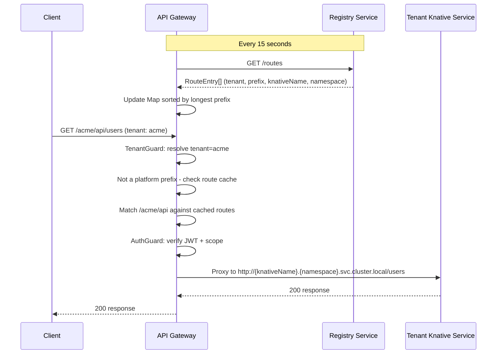

---

## Workflow Execution Flow

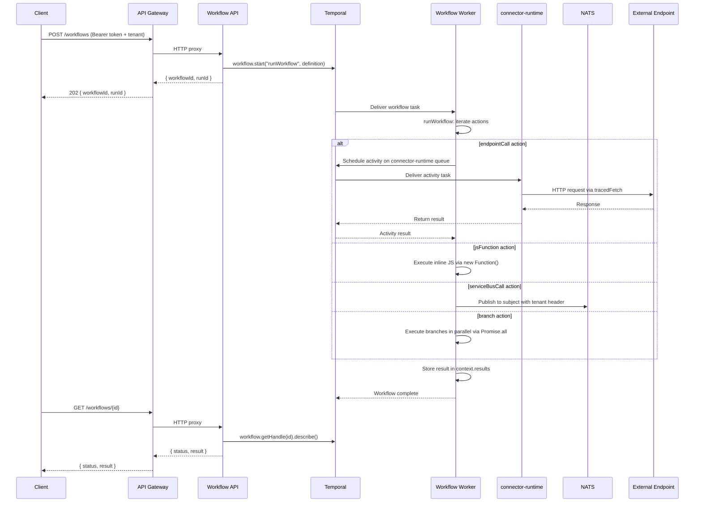

---

## Tenant Provisioning Flow

Tenant creation is asynchronous: the HTTP request returns `202 Accepted` with a `provisioningStatus`, and a JetStream consumer in `tenant-service` drives the actual provisioning through ordered phases. Each phase is wrapped in `runPhase(...)` so a hang in any one step shows up as a `phase=<name> status=started` line with no matching `status=ok` in the structured logs.

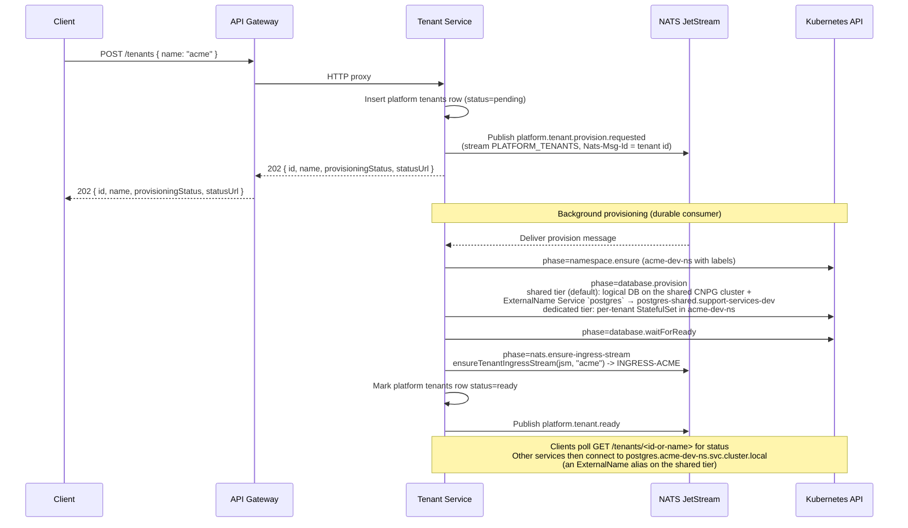

The database phase is storage-engine aware (`postgres.provider.ts` / `mongo.provider.ts`): on the default `shared` tier it creates a logical database for the tenant on the shared CNPG cluster and exposes it inside the tenant namespace as an ExternalName Service named `postgres`, so consumers keep using the same `postgres.<tenant>-<env>-ns` hostname regardless of tier. Pre-creating `INGRESS-<TENANT>` before marking the tenant ready guarantees downstream consumers can attach durable JetStream consumers on first use (see [messaging/service-bus.md](../messaging/service-bus.md#ingress-stream-provisioning-ingress-tenant)).

---

## Service Detail

### API Gateway

| Aspect | Detail |
|--------|--------|
| **Role** | HTTP entry point, JWT auth, event ingestion, SSE streaming, dynamic tenant routing, proxies to all downstream services |
| **Port** | 3000 |
| **Scale** | 1 -- 10 replicas (`metric: rps`, target 500) — pinned to 1 by the dev overlay |

**Authentication:** All routes require a valid JWT (Bearer token) except those marked as public. The global `AuthGuard` checks every request:

1. Static public routes via `@Public()` decorator (health, token generation)
2. Dynamic public routes from Redis cache (configurable per-tenant and platform-wide)
3. JWT verification (HS256 shared secret from `auth-secret` K8s Secret)
4. Scope enforcement: platform tokens grant full access; tenant tokens are restricted

**Endpoints (canonical `/api/v1/*` paths; see "API Versioning" below):**

| Method | Path | Description | Auth |
|--------|------|-------------|------|
| `POST` | `/api/v1/auth/token` | Client credentials grant | Public |
| `POST` | `/api/v1/auth/login` | User login | Public |
| `POST` | `/api/v1/auth/refresh` | Refresh access token | Public |
| `GET/POST/DELETE` | `/api/v1/auth/public-routes` | Dynamic public route management | Platform |
| `POST/GET` | `/api/v1/auth/users` | Platform user management | Platform |
| `POST/GET/DELETE` | `/api/v1/auth/clients` | API client management | Platform |
| `POST/GET/PATCH/DELETE` | `/api/v1/auth/tenant-users`, `/api/v1/auth/tenant-roles` | Tenant-scoped identity + role management | Required |
| `GET` | `/api/v1/audit/events` / `/api/v1/audit/channel-events` | Query audit + channel audit events | Required |
| `POST/GET/PATCH/DELETE` | `/api/v1/tenants` | Tenant management | Platform (write) / Required (read) |
| `POST/GET/PATCH/DELETE` | `/api/v1/registry/services` | Service registry | Required |
| `POST/PATCH/GET` | `/api/v1/registry/services/:id/canary` | Canary deployments | Required |
| `POST/GET` | `/api/v1/workflows` | Workflow management | Required |
| `POST/GET/PATCH/DELETE` | `/api/v1/connectors` | Connector configuration (proxied to `connector-admin`) | Required |
| `GET` | `/api/v1/connectors/usage` | Aggregated connector call usage (proxied to `connector-admin`) | Required |
| `POST/GET/PATCH/DELETE` | `/api/v1/channels/accounts` | Channel account management (proxied to `channel-service`) | Required |
| `GET` | `/api/v1/channels/usage` / `/api/v1/channels/usage/totals` | Channel usage metrics (proxied to `channel-service`) | Required |
| `POST` | `/api/v1/runtime/executions` / `/api/v1/runtime/executions/stream` | Agent execution submit + SSE token streaming (proxied to `ai-agent-gateway`) | Required |
| `SSE` | `/api/v1/channels/stream` | Live channel message stream | Required |
| `POST/GET` | `/api/v1/connectors/:connectorId/endpoints/:endpointId/invoke`, `/api/v1/connectors/invocations/:id` | Direct connector invoke + async result polling | Required |
| `GET` | `/api/v1/tracking/{events,chains/:correlationId,runs/*,node-stats,node-runs}` | Trace/chain/run read APIs (proxied to `tracking-ingester-service`) | Required |
| `POST/PUT/GET` | `/api/v1/provisioning/manifests/*`, `/api/v1/provisioning/secrets` | Declarative manifest validate/plan/apply + write-only secrets | Required |
| `GET` | `/api/v1/dashboard/stats` | Console dashboard aggregate | Required |
| `*` | `/api/v1/admin/*` | 11 admin controllers proxied to `agent-admin-service` / `agent-scheduler-service`: `agents`, `jobs`, `knowledge-bases` (+ `/:kbId/documents`), `mcp-servers`, `memories`, `skills`, `structured-kb`, `system-variables`, `tools`, plus a root `admin` config controller | Required |
| `*` | `/api/v1/proxy/*` | Tenant-dependent external backends (proxied to `proxy-service`) | Required |
| `GET/POST` | `/api/webhooks/:channel/:tenantId[/:instance]` | Provider webhook ingress — **not** versioned or tenant-guarded | Public |
| `GET` | `/health`, `/readyz` | Aggregated health (excluded from the `api` global prefix) | Public |

There is no `POST /events`, `GET /results/:id`, or `GET /events/stream` on the
gateway: those generic ingest/result routes were removed. Event ingestion happens
through the channel webhook bridge (`/api/webhooks/...`), and execution results
come back over `/api/v1/runtime/executions/:id` or the SSE stream.

#### API Versioning

The gateway applies a global `api` prefix plus NestJS URI versioning
(`setGlobalPrefix` + `enableVersioning` in `services/api-gateway/src/main.ts`):

```ts
app.setGlobalPrefix("api", { exclude: [...] });
app.enableVersioning({
  type: VersioningType.URI,
  defaultVersion: ["1", VERSION_NEUTRAL],
});
```

Every route is exposed both as the canonical `/api/v1/...` and as the
unversioned `/api/...` alias, without per-controller `@Version()`
decorators. Unversioned requests are treated as a **deprecated legacy
path**: an `onSend` hook flags any `/api/...` request that isn't already
`/api/v1/...` and isn't in the exemption list, and adds `Deprecation: true`
and a `Link: <.../api/v1/...>; rel="successor-version"` header pointing at
the versioned successor. `/api/docs` (Swagger) is listed in
`VERSIONING_EXEMPT_PREFIXES` and is never flagged, since it was never a
versioned route to begin with.

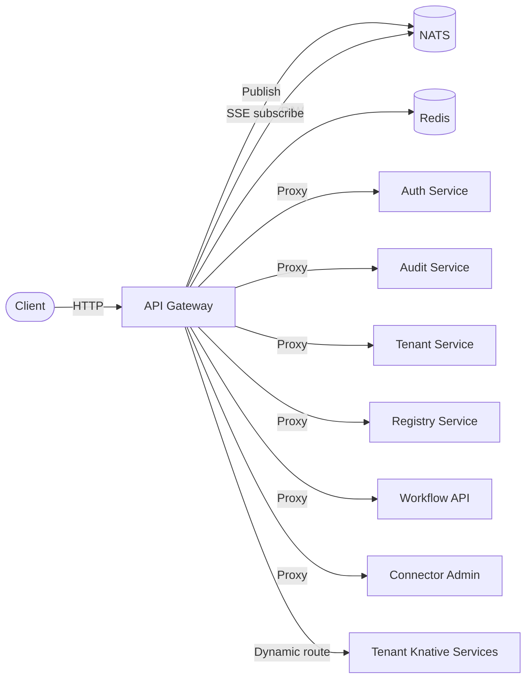

---

### Auth Service

| Aspect | Detail |
|--------|--------|
| **Role** | JWT token generation, user/client management, public routes configuration |
| **Port** | 3000 |
| **Scale** | 1 -- 3 replicas (concurrency target: 50) |

**Token Scopes:**

| Scope | Description |
|-------|-------------|
| `platform` | Full platform management access |
| `tenant:<name>` | Tenant-scoped access |

**Identity Sources:**

| Source | Grant | Token Scope |
|--------|-------|-------------|
| Platform User (email + password) | `POST /auth/login` | `platform` |
| API Client (client_id + client_secret) | `POST /auth/token` | `platform` or `tenant:<name>` |

**Database Schema:**

```sql
platform_users  (id, email, password_hash, role, is_active, created_at, updated_at)
api_clients     (id, client_id, client_secret_hash, name, scope, is_active, created_at, updated_at)
public_routes   (id, method, path_pattern, scope, environment, created_at)
tenants         (mirror of the platform tenants list, used for scope validation)
```

`auth-service` additionally owns **tenant-scoped** identities that do not live in
the platform database: `tenant_users` and `tenant_roles` in the per-tenant store
(`tenant-users.*.repository.ts`), exposed as
`/api/v1/auth/tenant-users` and `/api/v1/auth/tenant-roles`.

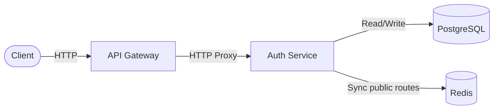

---

### Audit Service

| Aspect | Detail |
|--------|--------|
| **Role** | Persist all events to per-tenant PostgreSQL for auditing and queries |
| **Port** | 3000 |
| **Scale** | 1 -- 10 replicas (concurrency target: 100) |

**Database Schema (per-tenant):**

```sql
CREATE TABLE events (
    id             TEXT        PRIMARY KEY,
    type           TEXT        NOT NULL,
    payload        JSONB       NOT NULL DEFAULT '{}',
    metadata       JSONB       NOT NULL DEFAULT '{}',
    subject        TEXT        NOT NULL DEFAULT '',
    created_at     TIMESTAMPTZ NOT NULL DEFAULT NOW(),
    correlation_id TEXT,
    causation_id   TEXT,
    depth          INTEGER     NOT NULL DEFAULT 0
);
-- indexes: type, created_at, (type, created_at),
--          (correlation_id, depth, created_at), causation_id
```

The lineage trio (`correlation_id` / `causation_id` / `depth`) is top-level and
indexed since 2026-06-20 — that is what backs the chain endpoints in
[messaging/envelope.md](../messaging/envelope.md) §8. `subject` here is the NATS
subject, not the envelope's `resource` field. Source:
`services/audit-service/src/modules/audit/audit.postgres.repository.ts`
(alongside `channel_events`, `execution_events` and `gateway_audit_events`).

---

### Cache Service

| Aspect | Detail |
|--------|--------|
| **Role** | HTTP key-value cache with L1 (memory) + L2 (Redis) |
| **Port** | 3000 |
| **Scale** | 1 -- 5 replicas (concurrency target: 100) |

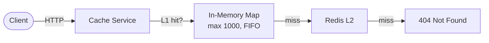

---

### Tenant Service

| Aspect | Detail |
|--------|--------|
| **Role** | Provision tenant namespaces, tenant databases (shared CNPG logical DB by default, dedicated StatefulSet by tier), and the `INGRESS-<tenant>` JetStream stream. Driven by a durable JetStream consumer on `PLATFORM_TENANTS` so provisioning is retried on transient failure and survives pod restarts. |
| **Port** | 3000 |
| **Scale** | 1 -- 3 replicas (concurrency target: 50) |

Each tenant gets a dedicated namespace (`<tenant>-<env>-ns`). On the default `shared` tier the namespace contains only a `postgres` ExternalName Service aliasing `postgres-shared.support-services-dev`; on the `dedicated` tier it holds a per-tenant PostgreSQL StatefulSet. The `INGRESS-<TENANT>` JetStream stream is provisioned on the shared NATS cluster before the tenant is marked ready — see [Tenant Provisioning Flow](#tenant-provisioning-flow) for ordering and [messaging/service-bus.md](../messaging/service-bus.md#ingress-stream-provisioning-ingress-tenant) for the full ensure contract.

**Namespace Labels:**

| Label | Value |
|-------|-------|
| `app.kubernetes.io/part-of` | `yoizen-arch` |
| `yoizen.io/tenant` | `<tenant-name>` |
| `yoizen.io/environment` | `dev` / `qa` / `staging` / `production` |
| `yoizen.io/managed-by` | `tenant-service` |

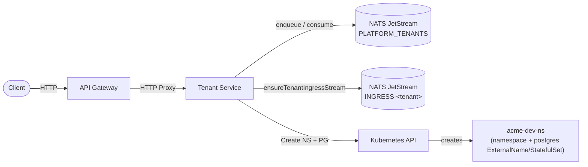

---

### Registry Service

| Aspect | Detail |
|--------|--------|
| **Role** | Knative service registry with route management and canary deployments |
| **Port** | 3000 |
| **Scale** | 1 -- 3 replicas (concurrency target: 50) |

**Database Schema:**

```sql
registered_services (id, tenant_id, name, image, port, min_scale, max_scale, status, knative_name, namespace, ...)
service_routes      (id, service_id, path_prefix, methods[], is_public, strip_prefix, ...)
canary_deployments  (id, service_id, stable_revision, canary_revision, canary_percent, status, ...)
```

**Canary Deployment Flow:**

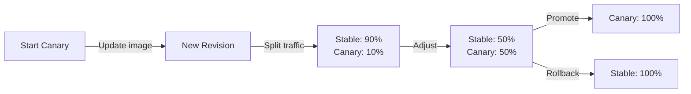

---

### Provisioning Service

| Aspect | Detail |
|--------|--------|
| **Role** | Declarative manifest reconciler: validate/plan/apply for channels, connectors, agents, knowledge bases, hosted-service refs, and workflows described in one manifest; write-only per-resource k8s Secrets CRUD; internal-only secrets broker with scope-binding enforcement |
| **Port** | 3000 |
| **Scale** | 1 -- 3 replicas (concurrency target: 50) |

Full contract (manifest lifecycle, plan verdicts, apply partial-failure/resume, KB
checksum reconciliation, secrets broker binding enforcement, RBAC, known follow-ups):
`services/provisioning-service/README.md`. Reconciliation never writes to other
services' tables directly — it calls their existing internal APIs (channels,
connectors, agents, registry, workflows), same rule as workflow `serviceCall`. v1 is
create-or-update only; there is no prune/delete semantics. The secrets broker's
`POST /internal/secrets/resolve` route is never exposed through the gateway.

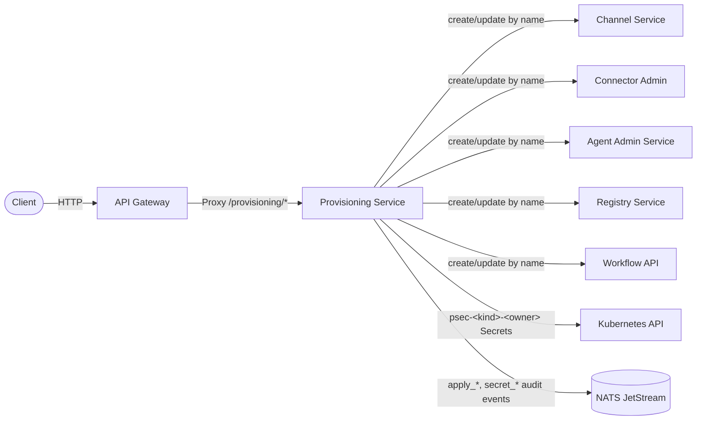

---

### Workflow Service (API + Worker)

| Aspect | Detail |
|--------|--------|
| **Role** | REST API for Temporal workflows + orchestrator worker |
| **Port** | 3000 |
| **Scale** | API: 1--15 Knative replicas (concurrency target: 100); Worker: plain Deployment, fixed `replicas: 1` in developer mode |

**Action Types:**

| Activity | Task Queue | Description |
|----------|-----------|-------------|
| `endpointCall` | `connector-runtime` | HTTP request via connector-runtime |
| `serviceCall` | `connector-runtime` | Internal/service-aware HTTP request via connector-runtime |
| `mcpCall` | `connector-runtime` | Calls a tool on an external MCP server via connector-runtime |
| `jsFunction` | `workflow-orchestrator` | Inline JS evaluation |
| `agentCall` | `workflow-orchestrator` | YoizenClaw agent chat via workflow-service local activity |
| `serviceBusCall` | `workflow-orchestrator` | NATS publish with tenant header |
| `channelSend` | `workflow-orchestrator` | Outbound channel send via `channel-service` |
| `branch` | (workflow-level) | Parallel execution of sub-actions |
| `conditional` | (workflow-level) | Branches evaluated in order; first match wins |

Actions support `{{path.to.value}}` template resolution against the execution context.

---

### Connector Runtime

| Aspect | Detail |
|--------|--------|
| **Role** | Standalone Temporal worker for generic HTTP execution activities |
| **Port** | 3000 (health only) |
| **Scale** | Plain Deployment, replicas: 1 in developer mode (KEDA removed) |
| **Task Queue** | `CONNECTOR_RUNTIME_TASK_QUEUE` (`connector-runtime`) |
| **Config Source** | `connector-admin` REST API via `AdapterClient` (Redis SWR cache) |

Executes `endpointCall` and `serviceCall` via `tracedFetch` with automatic `x-yoizen-tenant` header injection, connector resolution, response caching, and internal service mirror lookup. Also executes `mcpCall`, which resolves the MCP server config from `agent-admin-service`, opens an ephemeral MCP connection, and calls the named tool. Max 400 concurrent activity tasks per worker pod.

---

## Infrastructure

### Kubernetes Namespaces

Developer mode uses only the `dev` environment. The qa/staging/production overlays were removed from the repository to keep the developer configuration minimal.

| Environment | Support Namespace | Platform Namespace |
|-------------|-------------------|--------------------|
| dev | `support-services-dev` | `platform-services-dev` |

Additionally, each tenant gets a `<tenant>-dev-ns` namespace holding its database boundary: an ExternalName alias to the shared CNPG cluster (default `shared` tier) or a dedicated PostgreSQL StatefulSet (`dedicated` tier).

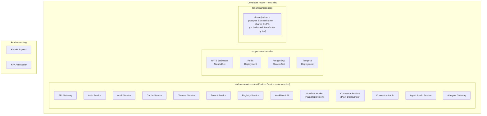

### Knative Autoscaling

These are the **base manifest** values (`knative/services/base/*.yaml`). The dev
overlay overrides every Knative Service to `min-scale = max-scale = 1`
(`knative/services/overlays/local/postgres-dev/kustomization.yaml`), so nothing
below actually autoscales in developer mode — the table records the intended
shape, not the running one.

| Service | Min Scale | Max Scale | Concurrency Target |
|---------|-----------|-----------|-------------------|
| API Gateway | 1 | 10 | 500 — note this one uses `metric: rps`, not `concurrency` |
| Auth Service | 1 | 3 | 50 |
| Audit Service (API) | 1 | 10 | 100 |
| Cache Service | 1 | 5 | 100 |
| Channel Service (API) | 1 | 20 | 100 |
| Tenant Service | 1 | 3 | 50 |
| Registry Service | 1 | 3 | 50 |
| Workflow API | 1 | 15 | 100 |
| Workflow Worker | — | — | Plain Deployment, fixed `replicas: 1` (not Knative) |
| Connector Admin (API) | 1 | 3 | 50 |
| Connector Admin (worker) | — | — | Plain Deployment, fixed `replicas: 1` (not Knative) |
| Connector Runtime | — | — | Plain Deployment (not Knative; KEDA removed) |
| Agent Admin Service | 1 | 3 | 50 |
| AI Agent Gateway | 1 | 3 | 50 |
| Agent AI / Memory / Scheduler Services | 1 | 3 | 50 |
| Provisioning Service | 1 | 3 | 50 |
| Usage Aggregator (API) | 1 | 3 | 100 |
| Proxy Service | 1 | 5 | 50 |
| Admin Console | 1 | 3 | 200 |

Note: `audit-service`, `channel-service`, `connector-admin`, `agent-admin-service` and
`usage-aggregator-service` each split into a Knative-scaled API and a plain-Deployment worker
(fixed `replicas: 1`); the table above shows the API autoscaling values.
`tracking-ingester-service` is worker-only — `tracking-ingester-worker` is a plain
`Deployment` with a companion ClusterIP `Service`, never a Knative Service, so it has no row
above.

### Container Build

All services use multi-stage Dockerfiles:

```
Stage 1 (deps):     node:24-alpine → pnpm install (workspace)
Stage 2 (build):    tsc -p tsconfig[.build].json → dist/
Stage 3 (runtime):  oven/bun:1.3-alpine → non-root, port 3000
```

`workflow-service` and `connector-runtime` use `oven/bun:1.3-slim` (Debian) for the runtime stage — the Temporal native SDK (`@temporalio/core-bridge`) ships glibc-only binaries that cannot load on Alpine/musl.

Images are built against the shared OrbStack Docker daemon as `dev.local/<service>:local` (no push or load step needed).

### Support Services Resources (Local Overlay)

| Component | CPU (req/limit) | Memory (req/limit) | Storage | Source |
|-----------|----------------|---------------------|---------|--------|
| NATS | 100m / 1 | 256Mi / 1Gi | 2Gi PVC (base declares 50Gi) | `overlays/local/local-base/patches/nats-resources.yaml` |
| Redis | 150m / 1 | 256Mi / 512Mi | 256Mi PVC | `patches/redis-resources.yaml`; PVC in `base/redis/statefulset.yaml` |
| PostgreSQL (shared CNPG cluster) | 250m / 1 | 512Mi / 1Gi | 20Gi | `base/postgres/postgres-shared-cluster.yaml` |
| PostgreSQL (per-tenant `dedicated`-tier StatefulSet) | 50m / 250m | 64Mi / 128Mi | 1Gi PVC | built in code by `tenant-service`'s `postgres.provider.ts`, not by a manifest |
| Temporal | 500m / 2 | 512Mi / 1Gi | -- (uses PG) | `base/temporal/deployment-autosetup.yaml` |

---

## Workspace Packages

| Package | Purpose |
|---------|---------|
| `@yoizen/shared` | Types (`EventEnvelope`, `ChannelEnvelope`, `WebhookIngressEnvelope`), subject/stream/header constants |
| `@yoizen/database` | DB helpers: `ensureTenantIngressStream`, `ensureTenantDlqStream`, claim-check, migrations |
| `@yoizen/observability` | `PinoLoggerService`, OpenTelemetry setup, NATS spans, split-service bootstrap (`SERVICE_MODE`) |
| `@yoizen/angular-shared` | Shared Angular building blocks for `admin-console` |
| `@yoizen/testing` | Test utilities (consumed by auth/tenant services) |
| `@yoizen/platform-sdk` | Full-surface platform SDK — 21 resource namespaces (agents, audit, auth-admin, channels, config-files, connectors, dashboard, jobs, knowledge-bases, manifests, mcp-servers, memories, registry, runtime, secrets, skills, structured-kb, system-variables, tenants, webhooks, workflows). Message ingest via the http channel is one capability among many. Lives at repo-root `sdk/` — **not** a workspace member (imported by path). |

## Shared Package: `@yoizen/shared`

Provides type-safe constants and interfaces consumed by all services.

### Key Constants

| Constant | Value | Used By |
|----------|-------|---------|
| `RESULT_KEY_PREFIX` / `PENDING_KEY_PREFIX` | `result:` / `pending:` | Per-tenant runtime/Redis cache layer |
| `RESULT_TTL` / `PENDING_TTL` | `3600` (1 hour) | Runtime/Redis cache layer |
| `STREAM_MAX_AGE_NS` | 7 days (ns) | **No production caller** — exported from `constants.ts` and re-exported from `index.ts`, nothing else. Stream provisioning uses `CHANNEL_STREAM_MAX_AGE_NS` (or the tier limits) instead. |
| `MAX_DELIVER` | `5` | **No production caller** either: `packages/database`'s `nats-durable-consumer.ts` uses its own `DEFAULT_MAX_DELIVER = 5`, channel flows use `CHANNEL_MAX_DELIVER`, and `connector-admin`'s internal-sync declares a local `MAX_DELIVER` that shadows the shared one. Same value, three declarations. |
| `TENANT_HEADER` | `x-yoizen-tenant` | All services |
| `REGISTRY_KNATIVE_GROUP` / `REGISTRY_KNATIVE_VERSION` / `REGISTRY_KNATIVE_SERVICES_PLURAL` | `serving.knative.dev` / `v1` / `services` | Registry Service, Tenant Service (Knative API client) |
| `REGISTRY_PRODUCER` / `REGISTRY_DOMAIN` | `registry-service` / `platform` | Registry Service (lifecycle event subjects) |
| `ADAPTER_MANAGED_BY_REGISTRY` | `registry-service` | Connector Admin (internal-sync ownership marker) |
| `WORKFLOW_ORCHESTRATOR_TASK_QUEUE` | `workflow-orchestrator` | Workflow Service |
| `CONNECTOR_RUNTIME_TASK_QUEUE` | `connector-runtime` | Connector Runtime |
| `WORKFLOW_DEFAULT_TIMEOUT_MS` | `600_000` (10 min) | Workflow Service |
| `GATEWAY_AUDIT_*` | gateway audit stream/subject/consumer constants | API Gateway, Audit Service |
| `AGENT_ADMIN_*` (subject prefix + per-event helpers) | `evt.{tenant}.agent-admin-service.automation.platform.internal.*` | Agent Admin Service / Runtime / Runtime Gateway |
| `AI_AGENT_GATEWAY_*` (`evt.{tenant}.ai-agent-gateway.automation.platform.internal.*`) | execution lifecycle subjects | AI Agent Gateway / Workflow Service |

### Core Interfaces

Canonical source: `packages/shared/src/interfaces.ts`. Key types:

```
EventEnvelope  → CloudEvents-inspired; fields: specversion, id, source, type, resource, time,
                 traceid, causation_id, correlation_id, tenant, producer, domain, channel,
                 provider, accountid, idempotencykey, transport (EventTransport), data (EventData)
EventData      → { received_at, payload_inline: boolean, payload_ref: string|null,
                   payload_bytes: number, payload_checksum: string,
                   payload: object|null }   ← payload is null when claim-check active
EventTransport → { method, protocol, agent_id?, depth? }
ChannelEnvelope → canonical post-ingress envelope produced by channel-service
WebhookIngressEnvelope → pre-ingress envelope produced by api-gateway (no accountid)
JwtPayload     → { sub, type, scope, role?, env, iat, exp }
WorkflowDefinition → { name, tenant, application, request, actions }
WorkflowAction → EndpointCallAction | McpCallAction | JsFunctionAction | ServiceBusCallAction
                 | ServiceCallAction | ChannelSendAction | AgentCallAction | BranchAction
                 | ConditionalAction        (packages/shared/src/workflow.interfaces.ts)
```

---

## Data Flow Summary

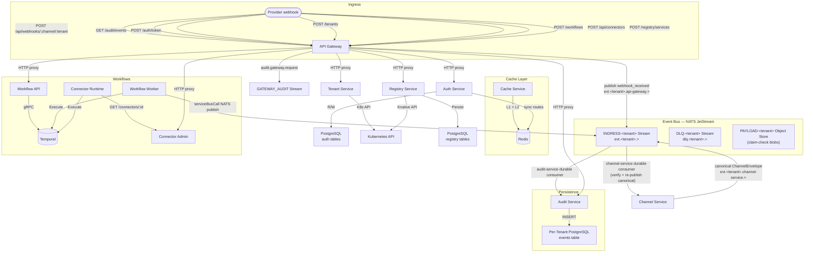

---

## Deployment Topology

```
┌───────────────────────────────────────────────────────────────────────┐
│  OrbStack Kubernetes (shared Docker daemon, local-path storage)       │
│                                                                       │
│  ┌─── knative-serving ─────────────────────────────────────────────┐  │
│  │  Kourier Ingress  ·  dev.local DNS  ·  KPA Autoscaler          │  │
│  └─────────────────────────────────────────────────────────────────┘  │
│                                                                       │
│  ┌─── Developer mode (single env: dev) ────────────────────────────┐  │
│  │                                                                 │  │
│  │  ┌─ platform-services-dev (Knative Services + Deployments) ──┐  │  │
│  │  │  api-gateway · auth-service · audit-service                │  │  │
│  │  │  cache-service · channel-service · tenant-service          │  │  │
│  │  │  registry-service · workflow-service · connector-admin     │  │  │
│  │  │  workflow-worker (Deployment) · connector-runtime (Dep.)   │  │  │
│  │  │  agent-admin-service · ai-agent-gateway                    │  │  │
│  │  │  agent-memory-service · agent-scheduler-service            │  │  │
│  │  │  usage-aggregator-service · proxy-service · admin-console  │  │  │
│  │  └────────────────────────────────────────────────────────────┘  │  │
│  │                                                                 │  │
│  │  ┌─ support-services-{env} (StatefulSets / Deployments) ─────┐  │  │
│  │  │  NATS JetStream · Redis 7 · PostgreSQL 17 · Temporal       │  │  │
│  │  └────────────────────────────────────────────────────────────┘  │  │
│  │                                                                 │  │
│  │  ┌─ {tenant}-{env}-ns (Per-Tenant) ──────────────────────────┐  │  │
│  │  │  postgres ExternalName → shared CNPG (or dedicated PG)    │  │  │
│  │  └────────────────────────────────────────────────────────────┘  │  │
│  │                                                                 │  │
│  └─────────────────────────────────────────────────────────────────┘  │
│                                                                       │
└───────────────────────────────────────────────────────────────────────┘
```

---

## Tech Stack

| Layer | Technology |
|-------|-----------|
| **Language** | TypeScript 5 (strict mode) |
| **Runtime** | Bun 1.3 |
| **Framework** | NestJS 11 + Fastify |
| **Messaging** | NATS JetStream |
| **Cache** | Redis 7 (via ioredis) |
| **Database** | PostgreSQL 17 (via `postgres` driver) |
| **Workflow** | Temporal |
| **Auth** | JWT via `jose` (HS256), `Bun.password` argon2id hashing |
| **Orchestration** | Kubernetes (OrbStack) |
| **Serverless** | Knative Serving 1.17 |
| **Ingress** | Kourier 1.17 |
| **DNS** | dev.local (static, resolved via a managed /etc/hosts block) |
| **Containers** | Docker multi-stage (node:24-alpine build, oven/bun:1.3-alpine runtime; bun slim/Debian for Temporal workers) |
| **IaC** | Kustomize (base + overlays) |
| **Validation** | class-validator (16 services declare it, incl. Gateway, Auth, Tenant, Registry, Connector Admin, Provisioning), ajv (workflow payload schemas) |
| **K8s Client** | `@kubernetes/client-node` (`tenant-service`, `registry-service`, `provisioning-service`, `@yoizen/database`) |

---

## Workflow / Connector-Runtime Service Boundary

Zoomed view of the core automation services and their dependencies. `workflow-service`
splits into an API (REST entry) and a Worker (Temporal orchestrator); `connector-runtime`
is a separate Temporal worker specialized for HTTP execution.

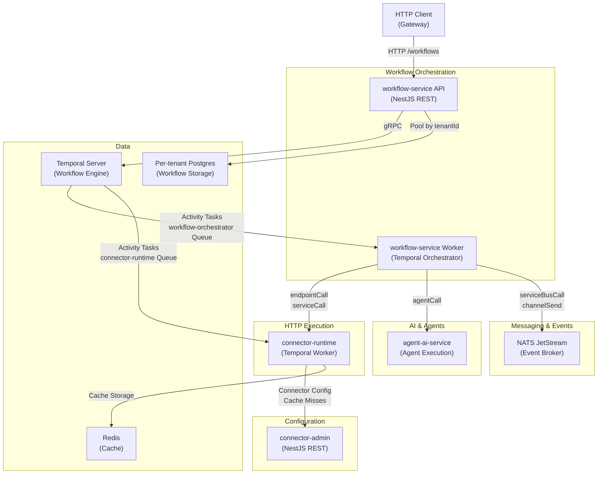

**Key points:**
- `workflow-service` splits into API (REST) and Worker (Temporal orchestration)
- `connector-runtime` is a separate Temporal worker for HTTP execution; max 400 concurrent activities
- `connector-admin` provides config; `connector-runtime` caches it in Redis via `AdapterClient` (SWR)
- Per-tenant Postgres isolates workflow data (shared CNPG logical DB for `shared` tier, per-tenant StatefulSet for `dedicated` tier)
- NATS handles event publishing from `serviceBusCall` workflow actions

---

## Connector Configuration Resolution

How `connector-runtime` resolves connector-driven requests via `AdapterClient`:

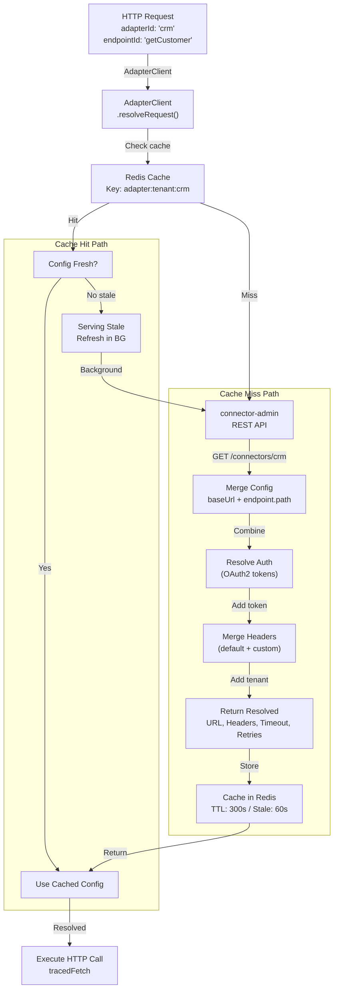

**Cache strategy:** TTL 300s, stale window 60s, background refresh on stale hit.

---

## Multi-Tenant Data Isolation (Workflow Layer)

How tenant data flows through the automation services, showing per-tenant database, NATS
subject prefix, and Redis key isolation:

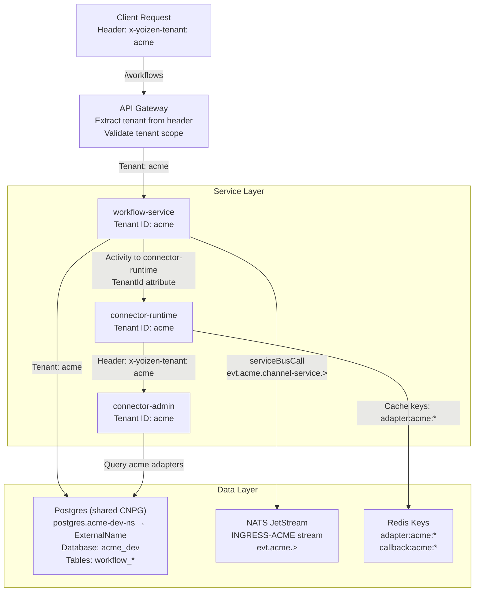

**Isolation boundaries:** HTTP header → per-tenant DB → NATS subject prefix → Redis key prefix → Temporal search attribute `TenantId`.

---

## Temporal Task Queue Architecture

Two independent task queues with different concurrency models. Both workers are plain
Deployments (not Knative) with `replicas: 1` in developer mode — KEDA was removed.

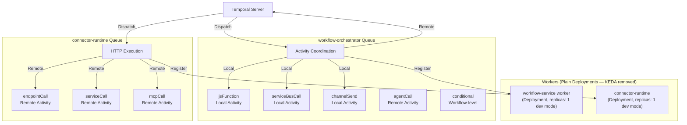

- **workflow-orchestrator**: coordinates multi-step execution; `jsFunction`, `serviceBusCall`,
  `channelSend` run as local activities; `agentCall` dispatches remotely to `agent-ai-service`
- **connector-runtime**: specialized for HTTP (and MCP tool calls); high concurrency (400) to handle network latency
- **Temporal dispatch**: remote activities (endpointCall, serviceCall, mcpCall) dispatch back via Temporal for load balancing

---

## Action Execution Paths

How `workflow-service` routes each action type:

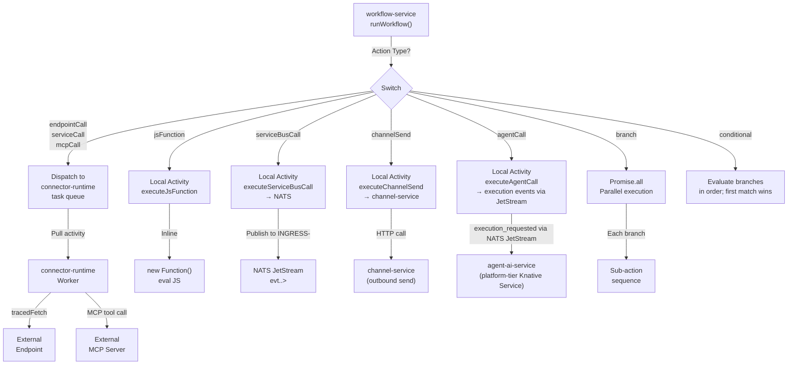

- Remote activities on `connector-runtime` queue (endpointCall, serviceCall, mcpCall): dispatched to Temporal, awaited
- Local activities (jsFunction, serviceBusCall, channelSend, agentCall): execute inline in the workflow-service worker process
- Control flow (branch, conditional): Temporal workflow-level; no separate activity
- No built-in `sleep` action — use `jsFunction` or an external scheduled trigger

---

## Per-Tenant Postgres Connection Pattern

How `workflow-service` maintains isolated connection pools per tenant:

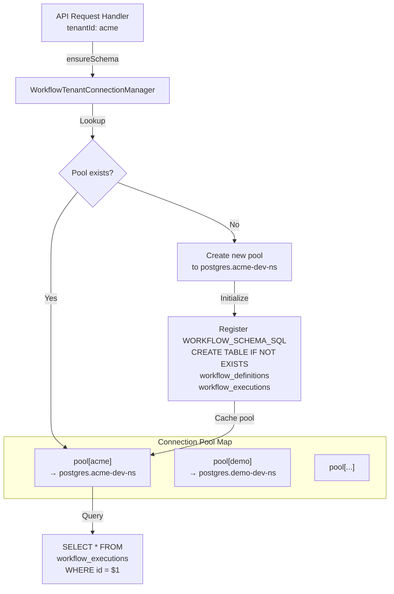

- Pools are created lazily on first tenant access
- `workflow_definitions` and `workflow_executions` created idempotently per pool
- No shared table — the database is the tenant boundary
- K8s DNS resolves `postgres.{tenantId}-{env}-ns.svc.cluster.local`

---

## Circuit Breaker State Machine (connector-runtime)

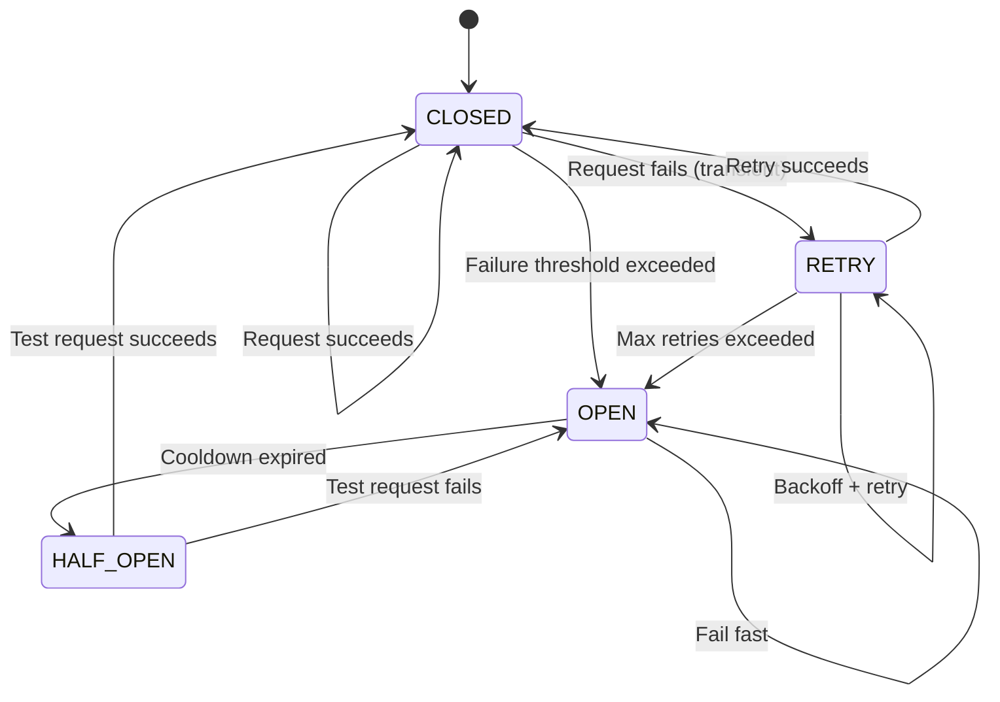

- **CLOSED**: normal execution, failures tracked
- **OPEN**: fail fast (503), requests not attempted
- **HALF_OPEN**: one test request; success closes circuit, failure reopens
- **Retries**: exponential backoff for transient failures (network timeout, 5xx)
- **Non-retryable**: 4xx status codes fail immediately

---

## Two-Stage Webhook Bridge and Claim-Check

How inbound provider webhooks flow through the system, including large-payload offload:

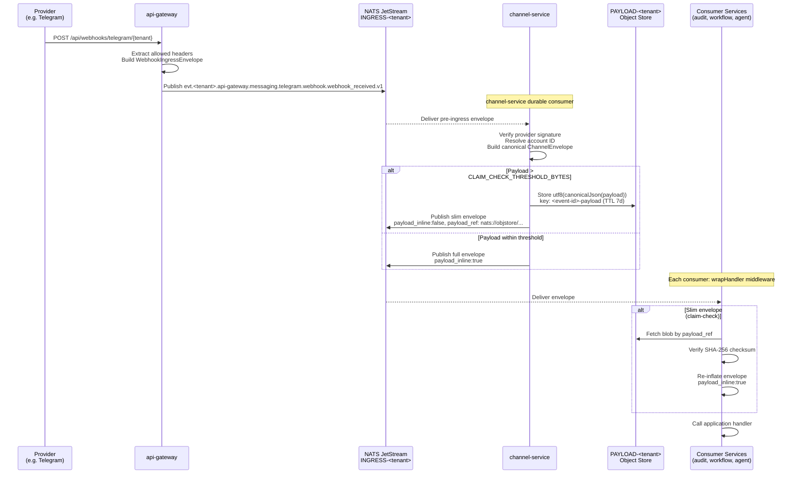

**Key invariants:**
- `api-gateway` publishes `WebhookIngressEnvelope` (no `accountid`; signature not yet verified)
- `channel-service` is the only service that verifies signatures and re-publishes the canonical `ChannelEnvelope` with `accountid` set
- The canonical `ChannelEnvelope` inherits `correlation_id`, `causation_id`, and `depth` from the pre-ingress `WebhookIngressEnvelope` instead of resetting them, so the causal chain is unbroken across the webhook → canonical hop (threaded through `processInbound` → `createChannelEnvelope`)
- All downstream consumers MUST use the canonical envelope, not the pre-ingress one
- `wrapHandler` in `MultiTenantConsumerManager` is the single resolution point for claim-check envelopes; individual handlers never deal with `payload_inline: false`
