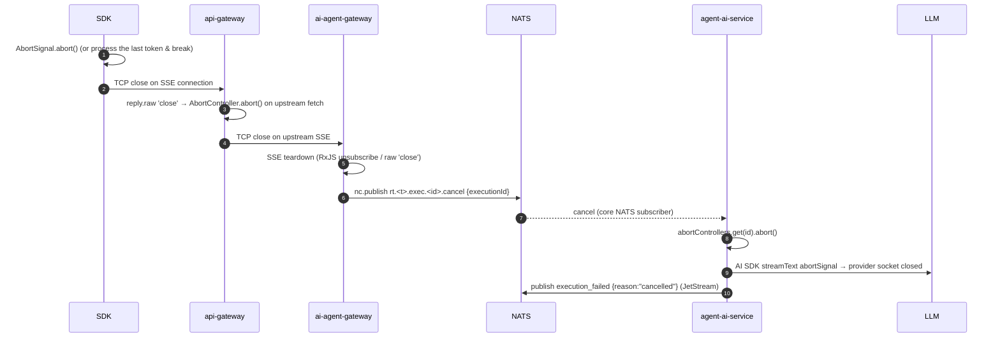

# Runtime Execution Token Streaming — Design

Class: descriptive
Summary: Token streaming from agent-ai-service to the SDK: the per-tenant `rt.` NATS subjects, the ai-agent-gateway SSE relay, the api-gateway passthrough and `runtime.stream()`.

Status: Implemented (commit 4d77d0a; SDK e2e 61/61 passing, including
mid-flight abort). Decision: **Option A** — `agent-ai-service`
publishes model output tokens to a per-tenant NATS subject; `ai-agent-gateway`
subscribes and relays through SSE; `api-gateway` adds a streaming passthrough;
the SDK exposes `runtime.stream()` as a typed async iterator.

Invariant preserved: **single execution path**. Job submission stays via
NATS/JetStream through `ai-agent-gateway` (`YoizenClawExecutionClient.submitExecution`
→ `INGRESS-<tenant>` → `agent-ai-service`). Streaming is an additive,
ephemeral side-channel; it does not introduce a second way to run an agent.

This document is file-anchored so an implementer can execute it without
re-deriving decisions.

---

## 0. Pre-implementation baseline (RECORD — superseded)

> **This section is history, not present truth.** It records the code as traced
> on **2026-07-05**, *before* the design below was built. Everything it calls
> missing now exists: the SDK has `runtime.stream()`
> (`sdk/src/resources/runtime/client.ts`), api-gateway has
> `pipe-upstream-sse-to-reply.util.ts` and `@Post("stream")` on
> `runtime.controller.ts`, and `packages/shared` carries
> `buildRuntimeStreamSubject` + `runtime-stream.interfaces.ts`. Read §1 onward
> for the as-built shape; keep this section only to understand what changed.
>
> The subject and constant names below are frozen at their 2026-07-05 values
> too. On **2026-08-07** the E3 migration
> (`PENDIENTES/04-e3-subject.spec.md`, commits 931d16dd + a3bd82c0) moved the
> `execution_started/completed/failed` lifecycle family — and the `online.v1`
> heartbeat — off the `ai-agent-gateway` producer token onto
> `agent-ai-service`, renaming the constants to
> `AGENT_AI_EXECUTION_STARTED/COMPLETED/FAILED`. `execution_requested` did NOT
> move: the gateway really does publish it, so
> `AI_AGENT_GATEWAY_EXECUTION_REQUESTED` is unchanged.

Traced from source (verified 2026-07-05):

- **SDK** — `sdk/src/resources/runtime/client.ts` exposes `createExecution` /
  `getExecution` / `health`. It deliberately has **no** `stream()` — see the
  "STREAMING GAP" block in `sdk/src/resources/runtime/types.ts`. Transport is
  `sdk/src/core/transport.ts` (`createTransport().request()`), JSON-only over
  `httpJson` (`sdk/src/infrastructure/http.js`). There is no `requestStream()`.
- **api-gateway** — `services/api-gateway/src/modules/runtime/runtime.controller.ts`
  (`POST /runtime/executions`, `GET /runtime/executions/:id`) delegates to
  `runtime-proxy.service.ts`, which does a single `tracedFetch()` + `res.json()`
  (`RuntimeProxyService.proxy`). It buffers the body and cannot pass SSE. NestJS
  URI versioning is on (`main.ts` `enableVersioning({ type: VersioningType.URI })`
  → `/api/v1`). A Fastify `onRequest` proxy hook already does raw proxying
  (`src/hooks/proxy.hook.ts`, `src/utils/pipe-upstream-to-reply.util.ts` — but
  the latter buffers via `upstream.text()`). Global `AuthGuard` + `TenantGuard`
  + `ValidationPipe` + `AuditInterceptor`.
- **ai-agent-gateway** —
  `services/ai-agent-gateway/src/modules/executions/executions.controller.ts`:
  `POST /runtime/executions` (submit), `GET /runtime/executions/:id`,
  and `@Sse("stream")` at `GET /runtime/executions/stream`.
  `executions.service.ts`:
  - `submitExecution()` → `YoizenClawExecutionClient.submitExecution` (publishes
    `execution_requested` to JetStream `INGRESS-<tenant>`).
  - `streamExecutionEvents()` subscribes **core NATS** (`nc.subscribe`, ephemeral)
    to what are today `AGENT_AI_EXECUTION_STARTED/COMPLETED/FAILED` (then named
    `AI_AGENT_GATEWAY_EXECUTION_*`; renamed 2026-08-07, see the banner) via
    `src/utils/nats-stream-observable.util.ts` (`createNatsMultiSubjectObservable`)
    and maps to RxJS `MessageEvent`. **This is the reuse anchor for the token relay.**
  - A durable `MultiTenantConsumerManager` projects the same lifecycle events to
    Redis (`handleResultMessage`).
- **agent-ai-service** — NATS consumer → `message-router.service.ts`
  (`extractActionType` → `"execution_requested"`) →
  `nats-handlers/execution.handler.ts` → `chat.service.generateReply()`
  (**buffered, non-streaming**) → `publishStatus()` emits
  `execution_started/completed/failed` to
  `evt.<tenant>.ai-agent-gateway.automation.platform.internal.<kind>.v1`
  (JetStream — the producer token became `agent-ai-service` on 2026-08-07, see
  the banner). Streaming primitives already exist but are unused by this path:
  - `chat.service.generateStream()` → `llm-executor.service.streamTextRaw()`
    returns `{ textStream: AsyncIterable<string>, usage, provider, model }`
    (AI SDK `streamText().textStream`). **This is the token source.**
  - The legacy `execution.controller.ts` `POST execution/stream` (direct HTTP
    SSE, not NATS, not reachable through the gateway) served as the shape
    reference for this design; it was removed on 2026-07-07 after the NATS
    pipeline superseded it (zero callers, no client-disconnect abort).
- **Envelope contract** — `skills/envelope-messages/SKILL.md` +
  `packages/shared/src/{interfaces,envelope.utils,constants,execution-client}.ts`.
  Helpers: `buildEventEnvelope`, `deriveEnvelope`, `buildPlatformSubject`,
  `computeIdempotencyKey`, `isCompliantEnvelope`.
- **Knative** — `knative/services/base/{agent-ai-service,ai-agent-gateway,api-gateway}.yaml`
  set **no** `timeoutSeconds`. Knative default request timeout is **300s** and
  the cluster `max-revision-timeout-seconds` default is **600s** — a hard cap on
  any long-lived SSE connection. Must be raised (§6).

---

## 1. Event model (on the wire)

### 1.1 Two transport tiers, deliberately split

| Tier | Events | NATS transport | Retention | Rationale |
|---|---|---|---|---|
| **Ephemeral** | `token`, `tool_call`, `tool_result`, `cancel` (control) | **Core NATS** (`nc.publish` / `nc.subscribe`) | none | High-frequency, display-only, no replay value. Losing a token after the consumer is gone is acceptable; persisting millions of deltas is not. Matches the existing gateway SSE pattern (`createNatsMultiSubjectObservable`). |
| **Durable** | `execution_started`, `execution_completed`, `execution_failed` | **JetStream** `INGRESS-<tenant>` (unchanged) | tenant stream retention | Already implemented, already projected to Redis, recoverable via `GET /runtime/executions/:id`. These are the source of truth for terminal state. |

**Critical subject-namespace decision.** The per-tenant JetStream stream
`INGRESS-<tenant>` binds subject filter `evt.<tenant>.>`
(`getTenantSubjectPattern`). JetStream ingests **by subject**, regardless of
whether the publisher used `js.publish` or `nc.publish`. Therefore token deltas
**must NOT** use an `evt.<tenant>.…` subject, or every token would be persisted
into the tenant stream. Ephemeral events get a **dedicated, non-`evt.` subject
namespace that no stream binds**:

```
rt.<tenant>.exec.<executionId>.<kind>        # kind ∈ token | tool_call | tool_result
rt.<tenant>.exec.<executionId>.cancel        # control (gateway → agent-ai-service)
```

`rt.` = runtime ephemeral stream. It is intentionally **outside** the `evt.`
CloudEvents taxonomy defined in the envelope skill, and this deviation is the
whole point: it guarantees no JetStream capture. The **envelope inside** each
message stays fully compliant (all `isCompliantEnvelope` fields present) — only
the NATS subject differs. Subject and `envelope.type` are independent by design.

> Add helper `buildRuntimeStreamSubject(tenant, executionId, kind)` and constant
> `RUNTIME_STREAM_SUBJECT_PREFIX = "rt.{tenant}.exec.{executionId}"` to
> `packages/shared/src/constants.ts`. Guarantee (test): the produced subject
> never starts with `evt.`.

### 1.2 Envelope for ephemeral token events

Built with `buildEventEnvelope` (root) or `deriveEnvelope` from the incoming
`execution_requested` envelope (preferred — propagates `correlation_id`,
`causation_id`, `traceid`, `depth`). Compliant fields, streaming-specific values:

| Field | Value |
|---|---|
| `type` | `io.yoizen.platform.runtime.token.v1` (and `…tool_call.v1`, `…tool_result.v1`, `…cancel.v1`) |
| `source` | `agent-ai-service` (token/tool) / `ai-agent-gateway` (cancel) |
| `producer` | `agent-ai-service` (token/tool) / `ai-agent-gateway` (cancel) |
| `resource` | `execution/<executionId>` |
| `domain` / `channel` / `provider` | `automation` / `platform` / `internal` (`AUTOMATION_DOMAIN` / `PLATFORM_CHANNEL` / `PLATFORM_PROVIDER`) |
| `idempotencykey` | `computeIdempotencyKey(payload)` — kept for `isCompliantEnvelope`, but core NATS does **not** dedup; it is not load-bearing here |
| `correlation_id` | the execution's correlation id (== `executionId` unless a `conversationId` was passed) |

> Producer-token note (updated 2026-08-07). When this design was written the
> lifecycle code published with subject producer segment `ai-agent-gateway`
> while `envelope.producer` was `agent-ai-service` (`execution.handler.ts` vs
> `constants.ts`) — an inconsistency in the `evt.` path, and one of the reasons
> the `rt.` namespace was defined without a producer segment. That
> inconsistency is **RESOLVED**: E3 (`PENDIENTES/04-e3-subject.spec.md`,
> commits 931d16dd + a3bd82c0) moved every agent-ai-service publish — the three
> lifecycle kinds and the `online.v1` heartbeat — onto
> `evt.{tenant}.agent-ai-service.automation.platform.internal.<kind>.v1`, so
> subject token 2 and `envelope.producer` now agree on the `evt.` path as well.
> The `rt.` rationale therefore stands on the JetStream-capture argument of
> §1.1 alone (no stream binds `rt.`), plus the structural property that a
> subject with no producer segment cannot disagree with `envelope.producer` by
> construction — it no longer works around a live drift, because there is none.
> On both paths we set `envelope.producer` honestly to the real publisher.

### 1.3 Token payload (`data.payload`)

```jsonc
// token
{ "executionId": "…", "agentId": "…", "seq": 42, "delta": "Hello", "done": false }
// tool_call
{ "executionId": "…", "agentId": "…", "seq": 43, "toolName": "search", "args": { … } }
// tool_result
{ "executionId": "…", "agentId": "…", "seq": 44, "toolName": "search", "result": { … }, "isError": false }
```

`seq` is a monotonic per-execution counter assigned by `agent-ai-service`. It is
**not** a resume cursor (tokens are not replayable, §2.5); it exists so the
relay and client can detect gaps and order events deterministically when
interleaving token and lifecycle streams.

### 1.4 Lifecycle events — unchanged

`execution_started/completed/failed` are unchanged **by this design**: same
JetStream retention, same payload, same `publishStatus`
(`execution.handler.ts`). Their subjects did move later — E3 (2026-08-07,
`PENDIENTES/04-e3-subject.spec.md`) renamed the family to
`evt.{tenant}.agent-ai-service.automation.platform.internal.<kind>.v1`
(`AGENT_AI_EXECUTION_STARTED/COMPLETED/FAILED`) so the subject stops naming a
service that does not publish it — but that is a rename inside the `evt.`
taxonomy, not a change to the streaming contract described here. `completed`
already carries
`usage`, `costUsd`, `toolCalls`, `model`, `provider` — the SDK's terminal event.

---

## 2. Flow

### 2.1 Sequence — happy path

```mermaid
sequenceDiagram
    autonumber
    participant SDK
    participant APIGW as api-gateway (Fastify)
    participant AAGW as ai-agent-gateway
    participant NATS
    participant AAS as agent-ai-service
    participant LLM as LLM provider

    SDK->>APIGW: POST /api/v1/runtime/executions/stream (JWT, body)
    Note over APIGW: AuthGuard + TenantGuard run;<br/>then reply.hijack() → raw SSE passthrough
    APIGW->>AAGW: POST /runtime/executions/stream (x-yoizen-tenant, trusted-user)
    Note over AAGW: generate executionId FIRST
    AAGW->>NATS: nc.subscribe rt.<t>.exec.<id>.token/tool_* (core, ephemeral)
    AAGW->>NATS: nc.subscribe evt.<t>…execution_started/completed/failed
    AAGW->>NATS: submitExecution(id) → JetStream INGRESS-<t> execution_requested
    NATS-->>AAS: execution_requested (durable consumer)
    AAS->>NATS: publish execution_started (JetStream)
    NATS-->>AAGW: execution_started → SSE event
    AAGW-->>APIGW: event: started
    APIGW-->>SDK: event: started
    loop token deltas
        AAS->>LLM: streamText(...).textStream (AI SDK)
        LLM-->>AAS: delta
        AAS->>NATS: nc.publish rt.<t>.exec.<id>.token {seq,delta}
        NATS-->>AAGW: token → SSE event
        AAGW-->>APIGW: event: token
        APIGW-->>SDK: event: token  (yielded by async iterator)
    end
    AAS->>NATS: publish execution_completed (JetStream, usage/cost)
    NATS-->>AAGW: completed → SSE event
    AAGW-->>APIGW: event: completed → end stream
    APIGW-->>SDK: event: completed → iterator returns
```

**Race elimination.** The gateway **subscribes before it submits** (steps
6–8). Because `submitExecution` accepts an explicit `executionId`
(`SubmitExecutionOptions.executionId` in `execution-client.ts`), the gateway
generates the id, opens the ephemeral subscription, then submits. No token can
be emitted before the subscriber exists → zero head-loss. This is why the
recommended entry point is a **combined** `POST …/executions/stream`, not
"POST then open a separate GET stream by id" (which races).

### 2.2 Client disconnect → abort all the way to the provider



Implementation requirements:
- **agent-ai-service** keeps `Map<executionId, AbortController>` in the streaming
  execution handler; passes `abortSignal` into `streamText` (AI SDK supports it —
  add `abortSignal` to `StreamTextParams` and forward in `llm-executor.streamTextRaw`).
  Subscribe `rt.<t>.exec.*.cancel` (or per-id) and abort on receipt. On abort,
  publish `execution_failed` with `reason: "cancelled"` and drop the controller.
- **ai-agent-gateway** publishes the `cancel` control message when its SSE
  connection tears down (Nest `@Sse` Observable teardown, or raw `'close'` if we
  drop to raw — see §3.3).
- **api-gateway** aborts the upstream `fetch` when the Fastify `reply.raw`
  emits `'close'`, propagating the disconnect one hop up.

This is the only correct way to stop provider token burn on disconnect, because
execution is decoupled (fire-and-forget over NATS) — there is no synchronous
call to cancel.

### 2.3 Provider error mid-stream

`agent-ai-service` `streamText` throws or `stream.usage` rejects mid-iteration →
handler catches → publishes `execution_failed` with `error` → gateway relays a
`failed` SSE event and ends the stream. Tokens already delivered stay. In the
SDK, `failed` is a **normal terminal event** the iterator yields (not a thrown
error); the consumer inspects it. Only **transport/connection** errors throw
(`SdkError`). Rationale: a provider error is data about the execution, not a
client-side failure; mixing thrown exceptions into a `for await` mid-stream is
hostile ergonomics.

### 2.4 Slow consumer / backpressure

Token text integrity forbids dropping deltas (a dropped token corrupts the
rendered text). Policy, in order:
1. **Bounded per-connection buffer** at the gateway relay: on each emit the
   relay checks the client socket's unflushed backlog
   (`socket.writableLength`) against `STREAM_RELAY_MAX_BUFFERED_BYTES`
   (256 KB). This measures true backpressure — a draining consumer never hits
   it, however long the stream runs. (The first implementation wrongly capped
   the *total* stream at 256 events/256 KB, killing any reply longer than
   ~250 tokens; fixed 2026-07-07.)
2. On sustained backlog → **close the stream** with a terminal `failed` event
   `{ reason: "slow_consumer" }` (do **not** drop tokens). The client can fall
   back to `getExecution(id)` for the final buffered result (Redis).
3. Set NATS core subscription slow-consumer limits so a stuck relay is detected
   and its subscription drained rather than growing unbounded.

Drop-oldest is explicitly rejected for tokens. (If a future event type is
loss-tolerant, it can opt into drop-oldest; tokens do not.)

### 2.5 Reconnect / resumability — **not resumable (v1)**

Recommendation: tokens are **not resumable**. No `Last-Event-ID` replay for the
`token` tier. Justification:
- Ephemeral core NATS has no history; there is nothing to replay.
- A per-execution replay buffer (JetStream working stream or Redis list of every
  token) reintroduces exactly the persistence cost §1.1 avoids, for display-only
  data.
- Terminal state **is** recoverable: on any disconnect the SDK can call
  `getExecution(id)` (Redis-backed, `ExecutionsService.getExecution`) to obtain
  the final reply, usage, and cost. So correctness (final answer) survives a
  dropped stream; only the live token animation is lost.

The SDK documents this: `stream()` is best-effort live rendering; durable result
retrieval is `getExecution()`. A future opt-in `{ resumable: true }` can add a
bounded JetStream replay stream `RT-<tenant>` (short `max_age`, e.g. 5 min) keyed
by `executionId` + `seq` as the resume cursor — designed for later, not built now.

---

## 3. Per-service changes (file-level)

### 3.1 `packages/shared` (contract first — everyone depends on it)

- `src/constants.ts` — add `RUNTIME_STREAM_SUBJECT_PREFIX`,
  `buildRuntimeStreamSubject(tenant, executionId, kind)`, kind constants
  (`RUNTIME_TOKEN`, `RUNTIME_TOOL_CALL`, `RUNTIME_TOOL_RESULT`, `RUNTIME_CANCEL`),
  and `type` strings `io.yoizen.platform.runtime.{token,tool_call,tool_result,cancel}.v1`.
- `src/execution.interfaces.ts` (or new `runtime-stream.interfaces.ts`) — add
  `RuntimeStreamEvent` union and payload interfaces (`TokenPayload`,
  `ToolCallPayload`, `ToolResultPayload`, `CancelPayload`). Export from `index.ts`.
- No change to `execution-client.ts` submission logic (it already accepts
  `executionId`). Optionally add a thin `publishCancel()` helper here so the
  gateway and any other caller share one implementation.

### 3.2 `agent-ai-service` (token producer)

- `modules/execution/` — add a **NATS-driven streaming execution handler**. The
  cleanest home is a new action type on the existing router rather than the HTTP
  controller:
  - `message-router.service.ts` — the router already dispatches
    `execution_requested`. Decision: **reuse `execution_requested`** and branch on
    a `stream: true` flag inside the request payload, OR add a sibling kind
    `execution_stream_requested`. **Recommend the flag** (`input.stream === true`)
    to keep the single execution path — same subject, same submit, streaming is a
    mode, not a new pipeline. `execution.handler.ts` chooses
    `generateReply` vs the new streaming code accordingly.
  - `nats-handlers/execution.handler.ts` — when streaming: call
    `chat.service.generateStream()` (already exists), iterate
    `streamResult.textStream`, and for each delta `nc.publish` a `token` envelope
    on `rt.<t>.exec.<id>.token` with an incrementing `seq`. Emit `execution_started`
    before the loop and `execution_completed` (with awaited `usage`/`costUsd`)
    after — reuse existing `publishStatus`. Maintain
    `Map<executionId, AbortController>`; subscribe `rt.<t>.exec.*.cancel`.
  - Requires a raw `NatsConnection` (`nc`) injection here for `nc.publish`
    (lifecycle currently uses `js`); the provider already exposes
    `NATS_CONNECTION` (`providers/nats.provider.ts`).
- `modules/llm/llm-executor.service.ts` — add `abortSignal?: AbortSignal` to
  `StreamTextParams` and forward it into `streamText({ …, abortSignal })`. Also
  surface `tool_call` / `tool_result` from the stream (AI SDK `fullStream` parts)
  so tool events can be published — the existing `generateStream` only wires
  `textStream` (tool wiring is still the `// TODO: Wire tools into streaming…`
  comment in `chat.service.ts`; token-only is an acceptable first slice, tools
  second — and token-only is what shipped, see §8).
- The legacy HTTP `execution.controller.ts POST execution/stream` was removed
  on 2026-07-07 (superseded by this pipeline; it had zero callers and no
  client-disconnect abort). This NATS/SSE path is the only streaming surface.

### 3.3 `ai-agent-gateway` (relay)

- `modules/executions/executions.controller.ts` — add
  `POST /runtime/executions/stream` returning `Observable<MessageEvent>` via
  `@Sse`, **or** a raw handler (see trade-off below). Body = `CreateExecutionDto`.
- `modules/executions/executions.service.ts` — add
  `submitAndStream(tenantId, dto, requestedBy)`:
  1. `const executionId = randomUUID()`.
  2. Build a merged core-NATS subscription over
     `rt.<t>.exec.<id>.token|tool_call|tool_result` **and**
     `AGENT_AI_EXECUTION_STARTED/COMPLETED/FAILED` (filtered by `executionId`),
     reusing/extending `createNatsMultiSubjectObservable`
     (`utils/nats-stream-observable.util.ts`).
  3. `submitExecution(tenantId, { …dto, stream: true }, { requestedBy, executionId, correlationId })`.
  4. Map NATS messages → `MessageEvent { type: <kind>, data: payload }`.
  5. Complete the Observable on `execution_completed`/`execution_failed`.
  6. On teardown (unsubscribe): `nc.publish rt.<t>.exec.<id>.cancel`.
- Apply the §2.4 bounded-buffer/close-on-overflow policy in the mapper.
- Per-tenant NATS: reuses the existing shared `NATS_CONNECTION`/`JETSTREAM`
  providers and `ensureTenantIngressStream` (already called in `submitExecution`).
  No new per-tenant auth/provisioning — the gateway holds the platform NATS
  connection today; token subjects are tenant-scoped in the subject string.

  > `@Sse` vs raw: NestJS `@Sse` (RxJS) is the least-code path and matches the
  > existing stream route, but teardown detection for the cancel publish is via
  > Observable unsubscribe, which fires on client disconnect under Fastify. If
  > that proves unreliable for prompt cancel propagation, drop to a raw
  > `@Get` + `reply.hijack()` handler with an explicit `reply.raw.on('close')`.
  > **Recommend starting with `@Sse`** (proven here) and only going raw if
  > cancel latency matters.

### 3.4 `api-gateway` (streaming passthrough)

The hard part: pass SSE through Fastify without the JSON buffering that
`RuntimeProxyService` and `pipeUpstreamResponseToReply` do, and without the
`ValidationPipe`/`AuditInterceptor`/serializer touching the streaming body.

- `modules/runtime/runtime.controller.ts` — add
  `POST /runtime/executions/stream`. Signature takes `@Req()` and `@Res()`
  (Fastify `FastifyReply`) so Nest hands us the raw reply and does **not**
  serialize. Guards still run (JWT + tenant) because they are request-phase
  `APP_GUARD`s — auth is unchanged (§ auth below). `ValidationPipe` still
  validates the **request** DTO (`CreateExecutionDto`); it does not touch the
  response.
- New util `src/utils/pipe-upstream-sse-to-reply.util.ts` (sibling to the
  existing buffering util, do **not** modify that one — `proxy.hook.ts` and
  `proxy-proxy.service.ts` depend on it):
  1. `reply.hijack()` — detach Fastify's own response lifecycle so no
     interceptor/serializer runs on the body.
  2. Write SSE headers to `reply.raw`: `Content-Type: text/event-stream`,
     `Cache-Control: no-cache`, `Connection: keep-alive`, `X-Accel-Buffering: no`.
  3. `fetch(upstreamStreamUrl, { method:'POST', body, headers, signal })` with an
     `AbortController`; iterate `res.body` (`ReadableStream`) and write each chunk
     to `reply.raw`.
  4. `reply.raw.on('close', () => controller.abort())` — propagates client
     disconnect upstream (§2.2).
  5. Heartbeat: write `":hb\n\n"` every ~15s to defeat idle intermediaries
     (§6); clear on end.
- `runtime-proxy.service.ts` — add a `proxyStream()` method (or a small dedicated
  `RuntimeStreamProxyService`) that builds the upstream URL
  (`${aiAgentGateway}/runtime/executions/stream`), forwards `x-yoizen-tenant`
  and the trusted-user header (`setTrustedUserIdHeader`), and hands the streaming
  `Response` to the util. **Do not** reuse the buffering `proxy()`.
- No change to the dynamic-route `onRequest` hook — this is an explicit platform
  route under `/runtime`, matched by Nest, not by the dynamic proxy.

**Auth model for the stream route:** identical to every other runtime route —
`TenantGuard` resolves tenant, `AuthGuard` verifies the JWT Bearer and tenant
scope (`services/api-gateway/CLAUDE.md` "Authentication Flow"). The route is
**not** `@Public`. The SDK sends `Authorization: Bearer` via the existing
transport. Downstream, the api-gateway injects `x-yoizen-tenant` +
trusted-user headers exactly as `RuntimeProxyService` does today; the
ai-agent-gateway trusts them as it already does for submit.

### 3.5 SDK

See §4.

---

## 4. SDK design

### 4.1 Public surface

```ts
// sdk/src/resources/runtime/types.ts  (extend)
export type RuntimeStreamEvent =
  | { type: "started";  executionId: string; agentId: string }
  | { type: "token";    executionId: string; seq: number; delta: string }
  | { type: "tool_call";   executionId: string; seq: number; toolName: string; args: unknown }
  | { type: "tool_result"; executionId: string; seq: number; toolName: string; result: unknown; isError: boolean }
  | { type: "completed"; executionId: string; reply: string; usage: unknown; costUsd: number; model: string; provider: string }
  | { type: "failed";    executionId: string; reason: string; error?: string };

export interface RuntimeStreamOptions {
  signal?: AbortSignal;   // abort → §2.2 end-to-end cancel
  retry?: false;          // streams are not auto-retried
}

// sdk/src/resources/runtime/client.ts  (add method)
stream(
  input: CreateExecutionInput,
  opts?: RuntimeStreamOptions,
): AsyncIterable<RuntimeStreamEvent>;
```

### 4.2 Transport addition

`sdk/src/core/transport.ts` gains `requestStream()` alongside `request()`. It
mirrors `request()` for headers (Bearer, `x-yoizen-tenant`, `x-request-id`,
version prefix `/api/v1`) but:
- Uses `fetch` directly (not `httpJson`, which JSON-parses) with
  `headers.Accept = "text/event-stream"`.
- Returns the raw `Response`; the runtime client owns SSE framing.
- Wires `opts.signal` into the `fetch` `signal`.
- **No retry policy** — `resolveRetryPolicy` is bypassed for streams (a partially
  consumed stream cannot be safely replayed).

`requestStream()` lives in transport because auth/tenant/version/error-mapping
are cross-cutting; SSE parsing (a tiny `data:`-line reader over
`res.body`) lives in the runtime resource so transport stays protocol-neutral.

### 4.3 Iterator semantics

- Parse SSE frames from `res.body`; each `data: <json>` line → one
  `RuntimeStreamEvent` yielded.
- Terminal `completed` / `failed` → the async iterator **returns** (loop ends).
  `failed` is yielded first (data, §2.3), not thrown.
- Transport errors (connection drop, non-2xx on open) → **throw** the mapped
  `SdkError` (`mapStatusToError`), consistent with `request()`.
- `opts.signal` abort → close the reader, `fetch` aborts, iterator returns; the
  end-to-end cancel of §2.2 follows from the socket close.

### 4.4 Capability detection / graceful degradation

The platform may not expose the stream route (older gateway). Behavior:
- **Preferred: capability probe, not error-driven.** Extend the existing
  `runtime.health()` (`GET /runtime/health`, already public) to include
  `{ capabilities: { streaming: boolean } }` (add to
  `runtime-health.controller.ts` and the gateway health payload). The SDK caches
  it per client. `stream()` checks the flag; if `false`, it does **not** open an
  SSE connection.
- **Degradation path:** when streaming is unsupported (or the probe is skipped
  and the server returns `404`/`405` on the stream route), `stream()` falls back
  to **submit + poll**: `createExecution()` then poll `getExecution()` until
  terminal, yielding a single synthetic `completed` (or `failed`) event. The
  consumer's `for await` still works; it just doesn't see token deltas. This
  keeps `stream()` always-usable and is why capability detection is preferred
  over throwing `NotFoundError`.
- Document the fallback so callers who *require* live tokens can inspect
  `health().capabilities.streaming` explicitly.

Update the "STREAMING GAP" comment block in `types.ts` once implemented.

---

## 5. Testing strategy

### 5.1 Unit (per service, mocked NATS/HTTP)

- **shared** — `buildRuntimeStreamSubject` never yields an `evt.`-prefixed
  subject (guards the JetStream-capture invariant §1.1); envelope built for a
  token passes `isCompliantEnvelope`.
- **agent-ai-service** — streaming handler: given a fake `textStream` async
  iterable, asserts N `token` publishes with monotonic `seq` on the `rt.` subject,
  a `started` before and `completed` after; `cancel` message aborts the
  `AbortController` and publishes `failed{reason:"cancelled"}`. Mock `nc.publish`
  as in `heartbeat.service.spec.ts`.
- **ai-agent-gateway** — `submitAndStream` subscribes before submitting
  (assert call order), maps NATS → `MessageEvent`, completes on
  `completed`/`failed`, publishes `cancel` on teardown, closes on buffer overflow.
- **api-gateway** — the SSE util: `reply.hijack()` called, SSE headers written,
  chunks piped, `reply.raw` `'close'` aborts the upstream controller, heartbeat
  emitted. Guards still run (auth unit test unchanged).
- **SDK** — `requestStream()` sets `Accept: text/event-stream` + Bearer + tenant,
  no retry; iterator yields parsed events, returns on `completed`, throws on open
  error, aborts on `signal`; degradation yields a synthetic `completed` when
  `capabilities.streaming === false`.

### 5.2 E2E in dev without real LLM credentials — **the critical gap**

There is **no fake/echo LLM provider today**. `provider-registry.service.ts`
only wires real providers (`openai`, `anthropic`, `google`, `groq`, `mistral`,
`cohere`, `openrouter`, `xai`, `ollama`, `deepseek`). `ollama` is local but needs
a running Ollama with a pulled model — too heavy for CI/dev smoke.

**Recommendation — smallest test hook: a dev-only `mock` (echo) provider.**
The AI SDK ships a mock language model + `simulateReadableStream` in its test
module (`ai/test`; the shipped code uses `MockLanguageModelV3` — the design was
written against `V2`). Register a `mock` provider in
`ProviderRegistryService.createModel`, gated by env
(`RUNTIME_ALLOW_MOCK_PROVIDER_ENV` = `RUNTIME_ALLOW_MOCK_PROVIDER=true`, off in
prod). The mock streams
the **prompt echoed back word-by-word** as token chunks with small delays, then
emits deterministic `usage`. This exercises the entire path —
`streamText().textStream` → `rt.` publish → gateway relay → api-gateway SSE →
SDK iterator — with zero credentials and deterministic assertions (exact token
sequence, seq ordering, `completed.usage`). It also makes the cancel test
deterministic (a long echo stream you abort mid-way).

Concretely: `createModel("mock", …)` returns
`new MockLanguageModelV2({ doStream: async () => ({ stream: simulateReadableStream({ chunks: wordsOf(prompt).map(w => ({ type:'text-delta', delta: w+' ' })).concat([{ type:'finish', usage, finishReason:'stop' }]) }) }) })`.
Gate creation behind the env flag so it can never resolve in production.

E2E scenarios against local NATS + Redis + the three services with the `mock`
agent:
1. Happy path — assert ordered `started → token* → completed`, seq monotonic,
   `completed.reply` == echoed prompt.
2. Cancel — abort the SDK `signal` mid-stream, assert the mock's
   `abortSignal` fired (no further tokens) and a `failed{reason:"cancelled"}`.
3. No-token-loss — subscribe-before-submit guarantees the first `token.seq === 0`
   is received (regression for the §2.1 race).
4. Degradation — flip the health capability off, assert single synthetic
   `completed` (no SSE opened).

---

## 6. Knative / long-lived SSE

Current base ksvc files set **no** `timeoutSeconds` → default 300s request cap
kills any stream longer than 5 minutes; cluster `max-revision-timeout-seconds`
default 600s caps how high we can raise it.

Changes (**both shipped** — `timeoutSeconds: 3600` is present in both files today):
- `knative/services/base/api-gateway.yaml` and `ai-agent-gateway.yaml` — set
  `spec.template.spec.timeoutSeconds: 3600` (and add
  `responseStartTimeoutSeconds` if the deploy targets a Knative version that
  supports it, to bound time-to-first-byte separately from total duration).
- Cluster `config-defaults` — ensure `max-revision-timeout-seconds >= 3600`
  (ops/infra change; document as a prerequisite, not in the ksvc file).
- `agent-ai-service.yaml` — its request path is NATS (no inbound HTTP hold), so
  no timeout change needed; but note `max-scale: 3` bounds concurrent streaming
  executions producing tokens.
- **Activator buffering:** long SSE holds a concurrency slot. `api-gateway`
  `containerConcurrency: 0` (unbounded) + `target: 500` means many held streams
  can delay scale-out signals. Recommend a modest explicit
  `containerConcurrency` cap for the streaming revision, or accept that streams
  are long-lived and size `max-scale` accordingly. Flag for ops review.
- **Heartbeat** (§3.4) every ~15s keeps the Knative activator, any ingress, and
  client proxies from idling out the connection below the 3600s cap.

---

## 7. Rollout

Implementation order (each item independently shippable except where noted):

1. **shared contract** (§3.1) — subjects, types, helpers. No behavior change;
   unblocks everyone. Ship first.
2. **agent-ai-service token producer** (§3.2) — behind the `stream:true` flag on
   `execution_requested`. Non-streaming path untouched → safe to ship alone; can
   be verified with a NATS subscriber before any gateway work.
3. **mock provider** (§5.2) — ship with or before #2; needed to test #2 and all
   downstream. Independent, env-gated.
4. **ai-agent-gateway relay** (§3.3) — depends on #1, #2. Testable directly
   (curl the gateway SSE route) before api-gateway work.
5. **api-gateway passthrough** (§3.4) — depends on #4. Ship the new util + route
   without touching existing runtime routes.
6. **SDK** (§4) — depends on #5 (and #4's health capability flag). Ship last;
   degradation path means it is safe even if #5 lags in some env.

### Risks (ranked)

1. **JetStream token capture (highest).** If token subjects ever fall under
   `evt.<tenant>.>`, every token is persisted to the tenant stream — storage
   blowup + consumer poisoning. Mitigation: the `rt.` namespace + the unit test
   asserting subjects never start with `evt.`. Non-negotiable.
2. **Abort not reaching the provider.** If cancel propagation breaks at any hop,
   disconnected clients keep burning provider tokens. Mitigation: the
   `AbortController` map + `cancel` control subject + `reply.raw 'close'` at each
   hop; E2E cancel test #2 is the gate.
3. **Fastify SSE passthrough breaking existing routes.** `reply.hijack()` + a
   **new** util (leave `pipeUpstreamResponseToReply` untouched) + a dedicated
   route keeps blast radius to the one new endpoint. Risk that
   `AuditInterceptor` or the serializer still runs — verified by the unit test
   asserting `hijack()`.
4. **Knative 300s cap / activator buffering.** Streams die at 5 min or scale-out
   lags. Mitigation: `timeoutSeconds` + cluster `max-revision-timeout-seconds`
   + heartbeat + concurrency review (§6).
5. **Race / early-token loss.** Subscribe-before-submit removes it; regression
   test #3 guards it.
6. **Slow consumer memory growth.** Bounded buffer + close-on-overflow +
   NATS slow-consumer limits (§2.4).

---

## 8. Open questions — resolved by what shipped

The four questions below were open when this design was written. Their answers
are now readable from the code:

1. **Token vs tool granularity for v1** → **token-only shipped.**
   `ExecutionHandler` in `agent-ai-service` publishes only `RUNTIME_TOKEN` on
   `buildRuntimeStreamSubject(...)`; it never publishes `RUNTIME_TOOL_CALL` /
   `RUNTIME_TOOL_RESULT`. The relay (`ai-agent-gateway`'s
   `executions.service.ts`) and the SDK types
   (`sdk/src/resources/runtime/types.ts`) already carry `tool_call` /
   `tool_result` end-to-end, so the only missing half is the producer.
2. **Combined `POST …/stream` vs submit-then-GET** → **combined shipped.**
   `@Post("stream")` on both `services/api-gateway/src/modules/runtime/runtime.controller.ts`
   and `ai-agent-gateway`'s executions controller.
3. **Resumability** → **non-resumable v1 shipped.** No `RT-<tenant>` stream
   exists; terminal state is still recoverable via `getExecution`.
4. **`containerConcurrency` for streaming** → left unbounded; what shipped is
   `timeoutSeconds: 3600` on `knative/services/base/api-gateway.yaml` and
   `ai-agent-gateway.yaml` (§6), with no explicit `containerConcurrency` cap.
   Still open for ops review.
