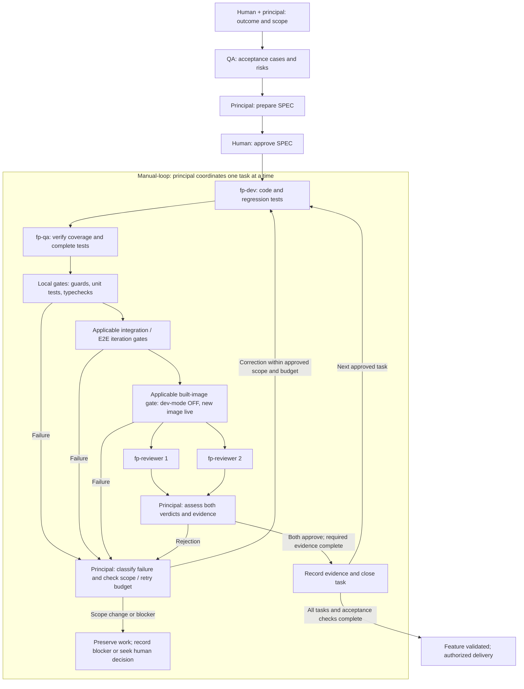

# FP delivery proposal snapshot — 2026-09-05

Class: RECORD
Summary: Complete superseded FP delivery proposal preserved before documentation consolidation.
Status: historical

Frozen source: DOCS/v_next/manual-loop-fp-delivery.md before the 2026-09-06
consolidation. The source was untracked; this snapshot preserves its full content.
Relative links need no changes because both locations are one level below DOCS.
Follow the [current procedure](../guides/manual-loop.md) for new work. Original
metadata below describes the superseded source, not this historical record.

---

# Feature delivery with manual-loop and FP agents

Class: future
Summary: Historical proposal for the FP delivery lifecycle; superseded by the current integration guide.
Status: superseded; repository role instructions are integrated, while live tool configuration and model execution remain separately verified.
Date: 2026-09-05

## Purpose and authority

Use one delivery process for a feature: the principal assistant coordinates the
repository's manual-loop procedure and delegates bounded work to FP specialists.
This document is retained as the future-design record that preceded the
integration. It does not replace the repository contract or claim that a named
provider/model has executed a live run. See the current
[FP delivery integration guide](../guides/manual-loop-fp-delivery.md) for the
implemented repository workflow and evidence rules.

[AGENTS.md](../../AGENTS.md) remains normative. The
[manual-loop engine](../../.claude/commands/manual-loop.md) defines execution,
retry limits, blocking, evidence, and commit conditions. An approved SPEC defines
the work and its actual gate commands. The global `fp-architecture` skill supplies
design guidance within that contract; it cannot authorize new libraries, broader
scope, or exceptions forbidden by AGENTS.md.

## Roles

| Participant | Responsibility |
| --- | --- |
| Human | Defines the intended outcome with the principal, approves the SPEC, and decides scope expansions and reserved delivery actions. |
| Principal assistant | The assistant in the main conversation. Prepares the SPEC, delegates tasks, coordinates gates and reviews, and records evidence. Does not implement code or count as an independent reviewer. |
| `fp-dev` | Implements one bounded task and its behavioral/regression tests. Reports changes, failures, and actual verification results. |
| `fp-qa` | Proposes acceptance cases before implementation; later checks coverage, adds missing tests within scope, and executes the required validation. |
| Two `fp-reviewer` instances | Independently review the same final code, tests, scope, and evidence. Neither sees the other's verdict before completing. Neither modifies the patch. |

There is no separate `fp-test` role in this proposal: `fp-qa` covers testing and QA.
The developer remains responsible for delivering code with tests. QA checks whether
those tests cover the agreed behavior, including failures, boundaries, integration,
and regressions. Code and tests stay within the same manual-loop task.

The principal is the single coordinator. Manual-loop is a procedure, not another
agent. A separate architecture specialist may advise when a design decision needs
it; mandatory architect delegation is not part of this proposed minimal flow.

## Feature lifecycle

1. The human and principal agree on the feature outcome and boundaries.
2. QA proposes acceptance cases and risks before implementation. The principal
   integrates these into a SPEC using the [templates](../../manual-loops-templates/README.md).
3. The human approves the SPEC before its first implementation run.
4. The principal executes one task at a time through implementation, QA, applicable
   gates, and independent dual review.
5. The principal records evidence and closes each task only when its required
   checks and reviews cover the unchanged final state. Commit conditions remain
   those of AGENTS.md and the engine, subject to human authorization.
6. The feature is complete only when all required tasks and feature-level
   acceptance checks are satisfied. Deployment follows its explicitly authorized
   scope; task completion alone does not authorize deployment.

The diagram shows verification layers, not a universal command list. The SPEC
declares applicability, exact commands, prerequisites, and ordering. Any change to
reviewed code or task artifacts invalidates applicable gates and both reviews.
QA edits therefore happen before final gates and review. A correction returns
through validation; previous approvals cannot certify changed content.

## Tests and gates

A test checks behavior. A gate requires specified checks to succeed before work
can advance. Gates are commands and evidence requirements, not separate agents.
The principal assigns execution, typically to QA or the implementer, and requires
actual commands, exit statuses, output, and identification of the tested state.

| Layer | What it demonstrates | Workflow-disable example |
| --- | --- | --- |
| Local guards and typechecks | Repository constraints and the typing covered by the chosen configuration. | Check changed code and ensure the SPEC identifies whether test files are also typechecked. |
| Unit tests | Decisions behave correctly with controlled input data. | Select only exact execution IDs owned by the target definition; cover name collisions and renames. |
| Integration tests | The service interacts correctly with real dependencies. | Query the configured database and terminate the intended executions in Temporal. |
| E2E tests | The complete path works through its public entry point. | Disable through the API and verify execution termination and observable state. |
| Built-image validation | Required behavior works in the artifact intended for delivery. | Run the required scenario with dev-mode OFF and the newly built image active. |

Integration/E2E describe what is tested. Development mode and built-image mode
describe which executable version is tested. A required E2E scenario can run during
development and again against the built image. Frozen-install and build evidence
remain required for affected builds under AGENTS.md.

Not every change requires every cluster suite. The SPEC must identify applicable
checks without silently waiving existing requirements. Missing infrastructure or
an unmet prerequisite is recorded as pending evidence or debt, not as a passing
gate or completed feature. Reviewers assess code and evidence together.

## Example: integration test for workflow disable

For a feature that changes execution ownership or termination:

1. Create isolated test definitions and running executions in a test tenant.
2. Include overlapping definition names, and rename a definition after starting
   one of its executions.
3. Disable the target definition through the boundary under test: the service for
   an integration test, or the API for an E2E test.
4. Wait with a bounded timeout for Temporal to terminate only the target's
   executions. Verify other definitions and tenant isolation remain unaffected.
5. Check observable state required by the acceptance contract, accounting for
   asynchronous projection with bounded waits rather than fixed sleeps.
6. Clean up only resources created by the test; retain useful failure diagnostics
   without exposing secrets or payloads.

When the change affects dual-engine persistence, test both Postgres and Mongo.
Local boundary doubles can check query construction, but do not establish live
database or Temporal integration. Unit tests for pure decisions need no I/O mocks.

## Rejections, retries, and completion

- Technical corrections within approved scope return to the responsible writer.
  Rerun applicable gates and both reviews on the resulting state.
- Scope expansions return to the human before edits. Missing prerequisites,
  exhausted budgets, and repeated failures preserve work and receive a blocker
  record. The current engine owns the exact retry limits.
- Two reviewers must approve independently. The principal is responsible for
  assembling the evidence, not substituting its own approval for either review.
- Record actual agent/run identity and model provenance. A model name written
  in a configuration file is not proof of the model used during execution.
- Report fallbacks, retries, skipped checks, and unavailable persistence. Engram
  may preserve decisions when available; the SPEC retains the task's evidence and
  status without claiming a memory save that did not happen.

## Superseded configuration notes

These notes describe the design state on 2026-09-05 and are retained for
traceability. They are superseded by the current guide and repository role files:

- Adapt FP role instructions to the repository's scope, evidence, dual-review,
  gate-rerun, and closure rules. The standalone `fp-loop` must not run a second
  competing retry/closure process inside manual-loop.
- Define how the principal persists SPECs and evidence. The existing OpenCode
  `fp-orchestrator` has writes disabled; assigning its role requires resolving
  that responsibility rather than assuming it can write records.
- Resolve role overlap for tests and make architecture delegation conditional
  where appropriate. Preserve existing frameworks and libraries.
- Configure explicit model selection at agent launch: a capable principal and
  reviewers, with an economical developer and QA where suitable. Reviewers must
  remain no weaker than the implementer. Specific model choices remain undecided.
- Verify the integration in the chosen execution tool. OpenCode `own` exposes the
  FP definitions; their existence does not automatically configure Codex agents.

The current guide does not claim live provider execution without observed run
provenance. This historical proposal does not certify an agent run.
