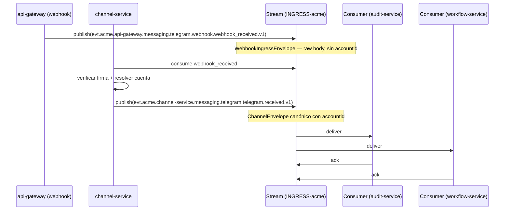
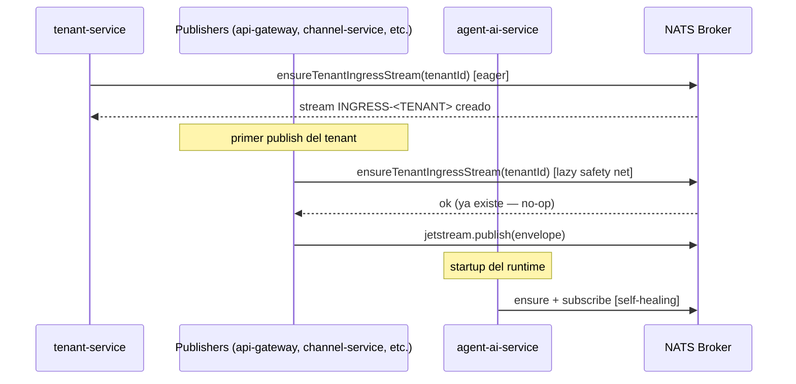

# 01 — Service Bus: NATS JetStream

**Estado:** Referencia del sistema implementado
**Audiencia:** Infra
**Fecha:** 2026-06-11 (actualizado desde borrador 2026-03-21)

> **Nota:** Este documento describe el sistema **implementado**. La referencia operacional
> canónica es [`DOCS/03-NATS-JETSTREAM.md`](../../../DOCS/03-NATS-JETSTREAM.md).
> El contrato fuente del envelope está en
> [`packages/shared/src/interfaces.ts`](../../../packages/shared/src/interfaces.ts).

---

## 1. Resumen

El bus de eventos de la plataforma está basado en NATS JetStream. Este documento cubre la topología de streams, la estrategia de aislamiento por tenant, la configuración del servidor, el inventario de streams, y el ciclo de vida del provisioning.

---

## 2. Por qué NATS JetStream

NATS es un sistema de mensajería open source (Apache 2.0) mantenido por Synadia. JetStream es la capa de persistencia de NATS que agrega durabilidad, replay y desacople de consumers.

Razones de la elección:

- **Durabilidad:** los mensajes se persisten en disco con replicación configurable.
- **Replay:** los consumers pueden releer mensajes desde cualquier punto en el tiempo.
- **Tolerancia a caídas:** si un consumer cae, retoma donde se quedó al reconectarse.
- **Desacople de consumers:** los producers no necesitan saber quién consume. Nuevos consumers pueden subscribirse sin impactar al producer.
- **Deduplicación nativa:** JetStream deduplica por `Nats-Msg-Id` dentro de una ventana configurable (default del servidor: 2 minutos).
- **Object Store integrado:** NATS Object Store permite almacenar blobs grandes sin infra adicional (ver doc 04).
- **Ecosistema:** clientes oficiales para Go, Node/Bun, Python, Rust, Java, .NET, y más.
- **Open source completo:** no hay enterprise edition ni features bloqueadas.

### 2.1 Por qué no Core NATS

Core NATS es at-most-once y sin persistencia. Si un consumer no está conectado al momento del publish, pierde el mensaje. Para eventos de ingress donde la pérdida no es aceptable, JetStream es el mínimo necesario.

Core NATS se usa solo para señales livianas fire-and-forget: actualmente `platform.tenant.deleted` para evicción de caches y pools de DB.

---

## 3. Topología del cluster

### 3.1 Aislamiento por entorno

El despliegue de desarrollo usa un único nodo NATS sin separación de accounts por entorno. El entorno no vive en el NATS subject — vive en la separación de clusters/namespaces de Kubernetes.

```
┌─────────────────────────────────────────────────┐
│                  NATS Cluster                    │
│                                                  │
│  ┌──────────┐  ┌──────────┐  ┌──────────┐      │
│  │  Node 1  │  │  Node 2  │  │  Node 3  │      │
│  │ (leader)  │  │(follower)│  │(follower)│      │
│  └──────────┘  └──────────┘  └──────────┘      │
│                                                  │
│  ┌────────────────────────────────────────┐     │
│  │  Streams por tenant                    │     │
│  │  INGRESS-ACME, DLQ-ACME, PAYLOAD-ACME │     │
│  │  INGRESS-GLOBEX, DLQ-GLOBEX, ...       │     │
│  └────────────────────────────────────────┘     │
│                                                  │
│  ┌────────────────────────────────────────┐     │
│  │  Streams de plataforma                 │     │
│  │  DLQ (global), GATEWAY_AUDIT           │     │
│  └────────────────────────────────────────┘     │
└─────────────────────────────────────────────────┘
```

### 3.2 Cluster mínimo recomendado

| Entorno | Nodos | Justificación |
|---------|-------|---------------|
| prod | 3 | Quorum para replicación. Tolera la caída de 1 nodo |
| staging | 1-3 | 1 nodo suficiente. 3 si se quiere simular prod |
| dev | 1 | Sin replicación. Desarrollo local o CI |

### 3.3 Despliegue en Kubernetes

NATS se despliega como StatefulSet en Kubernetes usando el Helm chart oficial (`nats/nats`). Cada nodo tiene un PersistentVolumeClaim para el storage de JetStream.

```
┌─────────────── Kubernetes Namespace: nats ───────────────┐
│                                                           │
│  StatefulSet: nats                                        │
│  ┌──────────┐  ┌──────────┐  ┌──────────┐               │
│  │  nats-0   │  │  nats-1   │  │  nats-2   │              │
│  │  PVC: 50Gi│  │  PVC: 50Gi│  │  PVC: 50Gi│              │
│  └──────────┘  └──────────┘  └──────────┘               │
│                                                           │
│  Service: nats (headless)                                 │
│  Service: nats-lb (load balancer para clientes)           │
└───────────────────────────────────────────────────────────┘
```

---

## 4. Streams por tenant

### 4.1 Estrategia

Cada tenant tiene un conjunto de streams dedicados. Esto provee aislamiento de storage — un tenant con alto volumen no impacta a los demás.

**Stream de ingress:**
```
Nombre:          INGRESS-<TENANT_ID_EN_MAYÚSCULAS>
Subjects:        evt.<tenant>.>
Storage:         file
Retention:       limits
Discard policy:  old (descarta el más viejo cuando se llena)
```

La función `getTenantStreamName(tenantId)` en `packages/shared/src/tenant-stream.constants.ts` produce el nombre con el ID en mayúsculas. La función `getTenantSubjectPattern(tenantId)` produce `evt.<tenantId>.>`.

### 4.2 Limits por defecto (implementados)

Los valores reales en código provienen de `packages/shared/src/channel.constants.ts`:

| Limit | Valor | Fuente |
|-------|-------|--------|
| `max_age` | 7 días | `CHANNEL_STREAM_MAX_AGE_NS` |
| `max_bytes` | 256 MB | `CHANNEL_STREAM_MAX_BYTES` |
| `max_msg_size` | Sin límite explícito en provisioning | — |
| `duplicate_window` | No se configura explícitamente; se usa el default del servidor (2 minutos) | NATS server default |
| `num_replicas` | No se configura explícitamente; default del servidor (1) | NATS server default |

### 4.3 Tiers de tenant (pendiente)

> **Estado: pendiente — no implementado en provisioning**
>
> `TENANT_TIER_LIMITS` está definido en `packages/shared/src/tenant-stream.constants.ts` con valores para `free`, `pro` y `enterprise`, pero el provisioning actual usa los defaults de `CHANNEL_STREAM_MAX_AGE_NS` / `CHANNEL_STREAM_MAX_BYTES` para todos los tenants. Los tiers no están conectados al flujo de creación de streams. Ver `DOCS/03-NATS-JETSTREAM.md §Tiered Limits Status`.

```
Diseño objetivo (pendiente):
┌────────────┬───────────┬──────────┬────────────┐
│ Tier       │ max_bytes │ max_age  │ num_replicas│
├────────────┼───────────┼──────────┼────────────┤
│ free       │ 1 GB      │ 7 días   │ 1          │
│ pro        │ 5 GB      │ 14 días  │ 1          │
│ enterprise │ 20 GB     │ 30 días  │ 3          │
└────────────┴───────────┴──────────┴────────────┘
```

### 4.4 Diagrama de flujo



---

## 5. Inventario completo de streams

| Stream / Bucket | Tipo | Subjects | Propósito | Fuente |
|---|---|---|---|---|
| `INGRESS-<TENANT>` | JetStream stream | `evt.<tenant>.>` | Bus canónico de eventos por tenant | `packages/database/src/nats-provider.ts` |
| `DLQ-<tenant>` | JetStream stream | `dlq.<tenant>.>` | Dead-letter por tenant; max_age 30 días, max_bytes 512 MB | `packages/database/src/nats-dlq.ts` |
| `DLQ` | JetStream stream (global) | `dlq.webhook` | Legacy global DLQ del webhook-service; narroweado a `dlq.webhook` para no solapar con `dlq.<tenant>.>` | `packages/shared/src/constants.ts` |
| `PAYLOAD-<tenant>` | JetStream Object Store | Claves `<event-id>-payload` | Claim-check para payloads grandes; TTL 7 días, max_bytes 512 MB | `packages/shared/src/channel.constants.ts` |
| `GATEWAY_AUDIT` | JetStream stream | `audit.gateway.>` | Auditoría de requests del gateway | `packages/shared/src/constants.ts` |
| `platform.tenant.deleted` | Core NATS subject | `platform.tenant.deleted` | Señal fire-and-forget de baja de tenant | — |

### 5.1 DLQ por tenant: headers de contexto

Cuando un mensaje agota sus redeliveries (`MAX_DELIVER = 5`) y se termina en el DLQ, el handler publica la carga original **sin modificar** como cuerpo, y agrega los siguientes headers NATS para diagnóstico:

| Header | Descripción |
|--------|-------------|
| `X-Dlq-Reason` | Razón de la terminación (campo `reason` de `PermanentError`) |
| `X-Dlq-Stage` | Etapa del pipeline donde falló |
| `X-Dlq-Original-Subject` | Subject original del mensaje |
| `X-Dlq-Stream` | Nombre del stream DLQ destino |
| `X-Dlq-Deliveries` | Cantidad de intentos de entrega |
| `X-Dlq-Original-Msg-Id` | `Nats-Msg-Id` original (si estaba presente) |

Implementación: `packages/database/src/multi-tenant-consumer-manager.ts`, método `buildTenantDlqHandler`.

---

## 6. Configuración del servidor

### 6.1 Parámetros clave

```
# nats-server.conf (relevantes para esta arquitectura)

max_payload: 1048576          # 1 MB (default, no modificar)

jetstream {
  store_dir: /data/jetstream
  max_mem: 1GB
  max_file: 100GB
}
```

### 6.2 Por qué max_payload se mantiene en 1 MB

Con el patrón Claim Check implementado (ver doc 04), los payloads grandes nunca viajan por el bus. No es necesario subir el `max_payload`. Mantenerlo en el default:

- Evita consumo excesivo de memoria en el broker durante routing.
- Mantiene la replicación rápida entre nodos.
- Protege a consumers lentos de mensajes pendientes pesados.
- Simplifica la configuración del cluster.

---

## 7. Ciclo de vida y provisioning

### 7.1 Provisioning de tenant — tres capas

El provisioning es idempotente en las tres capas. Todas usan la misma función `ensureTenantIngressStream` de `packages/database/src/nats-provider.ts`.

1. **Primaria (eager, durante creación del tenant):** `tenant-service` invoca `ensureTenantIngressStream(jsm, tenantId)` como fase dedicada `nats.ensure-ingress-stream`, antes de aplicar el Knative Service de `agent-ai-service`. Esto cierra la condición de carrera donde el runtime intentaría adjuntar consumers a un stream inexistente y crashearía.

2. **Safety net (lazy, antes del primer publish):** los producers (`api-gateway`, `channel-service`, `registry-service`, `agent-admin-service`, `ai-agent-gateway`) llaman a `ensureTenantIngressStream` antes de publicar en `evt.<tenant>.>`. Esto cubre tenants anteriores al path primario o cuyo stream fue eliminado externamente.

3. **Self-healing (lazy, en startup del runtime):** `agent-ai-service` invoca la misma función al conectarse. Si el broker rechaza temporalmente la subscripción JetStream, el bridge cae en una subscripción Core NATS de fallback hasta que el stream esté disponible.



### 7.2 Desactivación de tenant

> **Estado: pendiente — no implementado**
>
> El flujo de desactivación descrito a continuación es el diseño objetivo.

Cuando se desactiva un tenant:
1. El stream se pausa (se deja de aceptar publishes, pero los datos persisten).
2. El bucket de Object Store se marca como read-only.
3. Después del período de retención, los datos expiran automáticamente por TTL.
4. No se borran datos inmediatamente — esto permite reactivación dentro del período de retención.

### 7.3 Escalado de tier

> **Estado: pendiente — no implementado**
>
> Actualizar los límites de un stream sin downtime es soportado por la API de JetStream. La conexión entre el tier del tenant y el provisioning de streams está pendiente de implementación.

---

## 8. Semánticas de publish

NATS JetStream es el camino primario. El publish es síncrono con ack wait. Si el broker rechaza la escritura, el producer lo reporta como error.

```
// pseudocódigo
await ensureTenantIngressStream(jsm, tenantId)  // lazy safety net
const ack = await js.publish(subject, encode(envelope), {
  headers,          // Nats-Msg-Id: idempotencykey, traceparent
  timeout: ...,
})
```

> **Diseño objetivo (pendiente) — DLQ local en caso de fallo total:**
>
> Si todos los reintentos al broker fallan, el evento debería escribirse a un DLQ local en disco. Este path de fallback no está implementado actualmente.
