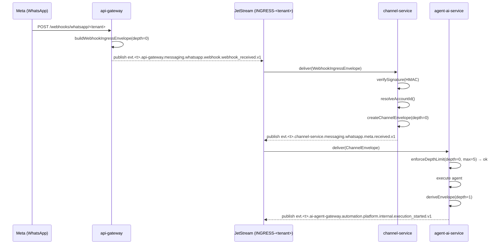

# 03 — Ingress: Webhook Bridge y Agentes AI

**Estado:** Referencia operativa — describe el sistema implementado
**Audiencia:** Dev
**Última revisión:** 2026-06-11

> Este documento describe el sistema tal como está construido (as-built).
> Referencia operativa de NATS/JetStream: `DOCS/03-NATS-JETSTREAM.md`.
> Fuente de verdad del contrato de envelope: `packages/shared/src/interfaces.ts`.

---

## 1. Resumen

El pipeline de ingress de mensajería es un **puente de dos etapas** entre el proveedor externo (Meta, Telegram, etc.) y el bus de eventos interno (JetStream). Ninguna de las dos etapas tiene acceso al negocio del tenant hasta que el mensaje ha sido autenticado por firma HMAC.

```
Proveedor externo
      │
      ▼
[api-gateway]  POST /webhooks/:channel/:tenantId
      │  publica WebhookIngressEnvelope → INGRESS-<tenant>
      ▼
[channel-service]  consumer durable: channel-webhook-ingress
      │  verifica firma HMAC, parsea mensajes, resuelve accountid
      │  publica ChannelEnvelope → INGRESS-<tenant>
      ▼
Consumers downstream (agent-ai-service, workflows, etc.)
```

---

## 2. Etapa 1: api-gateway

### 2.1 Endpoint

```
POST /webhooks/:channel/:tenantId
GET  /webhooks/:channel/:tenantId   ← verificación de hub.challenge (Meta)
```

Ambos endpoints son públicos (`@Public()`, `@SkipTenant()`). El tenant se resuelve solo desde el path param; no hay JWT ni guard de tenant.

Archivo: `services/api-gateway/src/modules/channels/webhooks.controller.ts`

Respuesta exitosa: HTTP 200 con body `{ "status": "accepted" }`.

### 2.2 WebhookIngressEnvelope

`WebhookIngressPublisherService` construye y publica un `WebhookIngressEnvelope` (definido en `packages/shared/src/webhook.interfaces.ts`):

| Campo | Valor |
|-------|-------|
| `producer` | `"api-gateway"` |
| `kind` | `"webhook_received"` |
| `provider` | `"webhook"` |
| `transport.method` | `"webhook"` |
| `transport.protocol` | `"https"` |
| `transport.depth` | `0` |
| `data.raw_body_b64` | Body crudo codificado en base64 |
| `data.headers` | Subset filtrado por `WEBHOOK_FORWARDED_HEADERS_SET` |
| `accountid` | **Ausente** — no se conoce en esta etapa |

**El id del envelope es un UUID v4** (`crypto.randomUUID()`).

El campo `accountid` no se incluye deliberadamente: en este punto el request no ha pasado verificación de firma, y el account del proveedor (WhatsApp Business ID, bot de Telegram, etc.) aún no fue resuelto. Incluir un placeholder corrompería las agregaciones de billing por account. Ver comentario en `webhook-ingress-publisher.service.ts:85`.

Tipo: `WebhookIngressEnvelope = Omit<EventEnvelope, "accountid"> & { ... }`.

### 2.3 Subject de publicación

```
evt.<tenantId>.api-gateway.messaging.<channel>.webhook.webhook_received.v1
```

Función: `buildWebhookIngressSubject(tenantId, channel)` en `packages/shared/src/channel.utils.ts`.

NATS headers: `x-yoizen-tenant`, `Nats-Msg-Id` (idempotency key = sha256 del payload), `X-Correlation-Id`, W3C trace context.

### 2.4 Backpressure y timeout

`WebhookIngressPublisherService` implementa dos mecanismos de protección introducidos tras el post-mortem de 2026-05-22:

- **Cap de inflight**: contador por pod. Si `inFlight >= cap` se lanza `WebhookPublishUnavailableError` (→ HTTP 503) antes de construir el envelope.
- **Timeout de publish**: `publishWithTimeout` compite `js.publish` contra un timer configurable. Un ack que tarda más del timeout se convierte en `WebhookPublishUnavailableError` (→ HTTP 503) en lugar de un 500 opaco.

Ambos valores son configurables vía `gatewayConfig.webhook`.

---

## 3. Etapa 2: channel-service

### 3.1 Consumer durable

`WebhookIngressConsumerService` crea un consumer durable sobre cada stream `INGRESS-<tenant>` usando `MultiTenantConsumerManager`:

| Parámetro | Valor |
|-----------|-------|
| Durable name | `channel-webhook-ingress` |
| Filter subject | `evt.*.api-gateway.messaging.*.webhook.webhook_received.v1` |
| Concurrencia | 32 handlers concurrentes (configurable vía `WEBHOOK_INGRESS_HANDLER_CONCURRENCY`) |

En pods API (no worker) el manager corre en modo `ensureOnly`: crea el durable sin procesar mensajes, para que KEDA pueda leer `jetstream_consumer_num_pending` aunque no haya workers activos.

Archivo: `services/channel-service/src/modules/webhooks/webhook-ingress-consumer.service.ts`

### 3.2 Procesamiento en WebhookIngressService

`webhook-ingress.service.ts` ejecuta la lógica de negocio:

1. Valida el canal (debe tener un `IChannelProvider` registrado en `ChannelRouter`).
2. Consulta las cuentas activas del tenant/canal en MongoDB.
3. Verifica la firma HMAC del proveedor contra cada cuenta activa.
4. Resuelve el `accountid` concreto (desambiguación por `phone_number_id` en WhatsApp o `ig_user_id` en Instagram cuando hay múltiples cuentas que verifican).
5. Parsea el body del webhook usando el provider correspondiente → `InboundMessage[]`.
6. Llama a `IngressService.processInbound` vía `setImmediate` (no bloqueante).

**Manejo de firma para Telegram:** si el header `X-Telegram-Bot-Api-Secret-Token` está ausente o vacío, se rechaza inmediatamente con `signature_mismatch` (no hay fallback al primer account).

### 3.3 Publicación del ChannelEnvelope

`IngressService` (vía `createChannelEnvelope` en `src/domain/envelope.factory.ts`) construye el envelope canónico:

| Campo | Valor |
|-------|-------|
| `producer` | `"channel-service"` |
| `domain` | `"messaging"` |
| `provider` | Nombre del proveedor (`"meta"`, `"telegram"`, etc.) |
| `kind` | `"received"` |
| `transport.method` | `"webhook"` |
| `transport.protocol` | `"https"` |
| `accountid` | ID real de la cuenta del proveedor |

Subject canónico:
```
evt.<tenant>.channel-service.messaging.<channel>.<provider>.received.v1
```

El **id del envelope es un nuevo UUID v4** independiente del id del `WebhookIngressEnvelope`.

### 3.4 Envelopes de egress (sombra)

`createChannelSentEnvelope` (envelope.factory.ts:132) construye envelopes de sombra para eventos de egreso (`sent`, `delivered`, `send`). Diferencia con el ingress:

```
transport.method   = "stream"
transport.protocol = "internal"
```

### 3.5 Proveedores implementados

| Proveedor | Canal(es) | Ruta |
|-----------|-----------|------|
| Meta | whatsapp, instagram | `services/channel-service/src/providers/meta/` |
| Telegram | telegram | `services/channel-service/src/providers/telegram/` |

TikTok, Twitter/X y otros canales mencionados en el diseño original: **no implementados**.

---

## 4. Mecanismo anti-loop (depth)

### 4.1 Campo `transport.depth`

El campo `depth` vive dentro de `EventTransport` (`packages/shared/src/interfaces.ts`). Cuenta la profundidad causal:

- Todo evento raíz (webhook externo) tiene `depth: 0`.
- Cuando se deriva un envelope nuevo desde uno existente (`deriveEnvelope`), `depth = incoming.depth + 1`.
- Si `newDepth > MAX_DEPTH` para la categoría del producer, `deriveEnvelope` lanza `DepthExceededError`.

### 4.2 MAX_DEPTH por categoría

Definido en `packages/shared/src/envelope.utils.ts`:

```typescript
export const MAX_DEPTH_BY_CATEGORY = {
  root:             0,
  internal_service: 5,
  internal_agent:   5,
  platform_agent:   3,
  thirdparty_agent: 2,
};
```

La categoría por defecto cuando no se especifica es `internal_service` (MAX_DEPTH = 5).

### 4.3 Implementación en agent-ai-service

`DepthTrackerService` (`services/agent-ai-service/src/modules/depth-tracker/depth-tracker.service.ts`) tiene su propio `DEFAULT_MAX_DEPTH = 5` y rechaza cuando `currentDepth >= maxDepth` (mayor o igual, no mayor estricto). Lanza `DepthExceededError extends PermanentError`, que el consumer runner enruta al DLQ.

**Diferencias con el diseño del doc original:**

- El dispatch per-categoría (distinto MAX_DEPTH según si el agente es interno, de plataforma o de tercero) **no está implementado** en `DepthTrackerService`. El servicio usa únicamente el valor flat `DEFAULT_MAX_DEPTH = 5`.
- El comportamiento `depth_exceeded → DLQ + métrica` funciona vía el mecanismo de `PermanentError` del consumer runner (el DLQ per-tenant existe), pero no existe una métrica `depth_exceeded` dedicada.

> **Estado: pendiente — no implementado**
>
> El dispatch de MAX_DEPTH por categoría de agente (interno: 5, plataforma: 3, tercero: 2) y la métrica `depth_exceeded` dedicada no están implementados en `DepthTrackerService`. La lógica basada en `ProducerCategory` existe en `envelope.utils.ts` para uso de `deriveEnvelope`, pero el agente AI no la utiliza aún.

### 4.4 Diagrama del flujo implementado



---

## 5. Eventos de ciclo de vida de agentes (as-built)

El único ciclo de vida de ejecución de agentes publicado actualmente en el bus es el de `ai-agent-gateway`. Los subjects son constantes en `packages/shared/src/constants.ts`:

| Evento | Subject template |
|--------|-----------------|
| `execution_started` | `evt.{tenant}.ai-agent-gateway.automation.platform.internal.execution_started.v1` |
| `execution_completed` | `evt.{tenant}.ai-agent-gateway.automation.platform.internal.execution_completed.v1` |
| `execution_failed` | `evt.{tenant}.ai-agent-gateway.automation.platform.internal.execution_failed.v1` |

`agent-ai-service` consume subjects específicos de `agent-admin-service` y `ai-agent-gateway` a través de `MessageRouterService`.

> **Diseño objetivo (pendiente)**
>
> La taxonomía de eventos de agente `agent_outbound` / `agent_action` / `agent_observation` descrita en el diseño original no está implementada. Los subjects de `coexistance` usados en los ejemplos de envelopes tampoco existen — el producer real es `channel-service` o `ai-agent-gateway`.

---

## 6. Pipelines de ingress para agentes (diseño objetivo)

> **Estado: pendiente — no implementado**
>
> Los pipelines descritos en esta sección corresponden al diseño objetivo. Ninguno de los endpoints ni los servicios mencionados están construidos.

### 6.1 Agente interno

```
authenticateServiceToken
  |> validateAgentOutput
  |> enforceDepthLimit
  |> checkPayloadSize / storeIfClaimCheck
  |> buildEnvelope
  |> publish
```

### 6.2 Agente de tercero

```
authenticateApiKey
  |> validateTenantAuthorization
  |> validateAgentOutput (strict: max 1 MB)
  |> enforceDepthLimit
  |> enforceRateLimit
  |> checkPayloadSize / storeIfClaimCheck
  |> buildEnvelope
  |> publish
```

Endpoint propuesto: `POST /api/agents/publish` en el api-gateway. No existe.

### 6.3 Agente de plataforma (push)

```
verifyPlatformSignature
  |> validatePlatformPayload
  |> enforceDepthLimit
  |> checkPayloadSize / storeIfClaimCheck
  |> buildEnvelope
  |> publish
```

### 6.4 Agente de plataforma (pull)

```
callPlatformApi
  |> validatePlatformResponse
  |> enforceDepthLimit
  |> checkPayloadSize / storeIfClaimCheck
  |> buildEnvelope
  |> publish
```

### 6.5 MCP publish tool y A2A

No implementados. Ver roadmap en §6.3 del documento original (preservado abajo como referencia).

---

## 7. Categorías de agentes y transport (diseño objetivo)

> **Estado: pendiente — no implementado**
>
> Los campos `agent_category`, `confidence`, `tool_chain`, `agent_vendor`, `platform_provider`, `platform_model`, `platform_request_id`, `api_key_id`, `origin_ip` y similares que aparecen en los ejemplos de esta sección son campos de diseño objetivo. **No forman parte de `EventTransport`** tal como está definido en el código.

El `EventTransport` implementado (`packages/shared/src/interfaces.ts`) tiene únicamente:

```typescript
interface EventTransport {
  method: "webhook" | "poll" | "stream" | "queue_bridge" | "agent";
  protocol: "https" | "wss" | "amqp" | "internal";
  agent_id?: string;
  depth?: number;
}
```

### 7.1 Categorías (referencia de diseño)

| Categoría | Trust | Provider en subject | MAX_DEPTH objetivo |
|-----------|-------|--------------------|--------------------|
| Agente interno | Alto | `internal` | 5 |
| Agente de tercero | Bajo | `thirdparty` | 2 |
| Agente de plataforma | Medio | nombre del proveedor | 3 |

### 7.2 Roadmap de adopción (original)

| Milestone | Alcance |
|-----------|---------|
| M1 | Solo providers externos (WhatsApp, etc.). Sin agentes ✅ implementado |
| M2 | Agentes internos publican al bus via MCP server |
| M3 | Agentes de plataforma via integraciones directas |
| M4 | Agentes de terceros via API gateway + marketplace |
| M5 | Evaluar A2A como protocolo de coordinación multi-agente |

---

## 8. Matriz comparativa (as-built vs diseño)

| Aspecto | Provider externo (as-built) | Agente interno (pendiente) | Agente tercero (pendiente) | Agente plataforma (pendiente) |
|---------|------------------------------|---------------------------|---------------------------|-------------------------------|
| Trust | Alto (firma HMAC verificada) | Alto (nuestra infra) | Bajo (código ajeno) | Medio (SaaS conocido) |
| Autenticación | HMAC webhook en channel-service | Token de servicio | API key + tenant auth | OAuth2 / firma callback |
| Endpoint | `POST /webhooks/:channel/:tenantId` | `POST /api/agents/publish` | `POST /api/agents/publish` | webhook callback o poll |
| Implementado | ✅ | ❌ | ❌ | ❌ |
| MAX_DEPTH | 0 (raíz, depth=0) | 5 (objetivo) | 2 (objetivo) | 3 (objetivo) |
| Agente AI que usa depth | — | `DepthTrackerService` (flat 5) | — | — |

---

## 9. Ejemplos de envelopes (as-built)

### 9.1 WebhookIngressEnvelope (api-gateway)

```json
{
  "specversion": "1.0",
  "id": "a3c8f1d2-4b5e-7f9a-b2c3-d4e5f6a7b8c9",
  "source": "//api-gateway/webhooks",
  "type": "io.yoizen.messaging.webhook.received.v1",
  "resource": "tenant/acme/channel/whatsapp/provider/webhook",
  "time": "2026-06-11T12:00:00.000Z",
  "traceid": "4bf92f3577b34da6a3ce929d0e0e4736",
  "causation_id": null,
  "correlation_id": "a3c8f1d2-4b5e-7f9a-b2c3-d4e5f6a7b8c9",
  "tenant": "acme",
  "producer": "api-gateway",
  "domain": "messaging",
  "channel": "whatsapp",
  "provider": "webhook",
  "kind": "webhook_received",
  "idempotencykey": "sha256:...",
  "transport": {
    "method": "webhook",
    "protocol": "https",
    "depth": 0
  },
  "data": {
    "received_at": "2026-06-11T12:00:00.000Z",
    "payload_inline": true,
    "payload_ref": null,
    "payload_bytes": 512,
    "payload_checksum": "sha256:...",
    "payload": { "entry": [ "..." ] },
    "raw_body_b64": "eyJlbnRyeSI6...",
    "headers": {
      "x-hub-signature-256": "sha256=abc...",
      "content-type": "application/json"
    }
  }
}
```

**Nota:** `accountid` está ausente — es un `Omit<EventEnvelope, "accountid">`.

### 9.2 ChannelEnvelope canónico (channel-service)

```json
{
  "specversion": "1.0",
  "id": "b7d9e2f4-1a3c-5e7f-9b1d-2c3e4f5a6b7c",
  "source": "//channel-service/accounts/69bea8cd868e860918359cc7",
  "type": "io.yoizen.messaging.whatsapp.meta.received.v1",
  "resource": "tenant/acme/account/69bea8cd868e860918359cc7/channel/whatsapp/provider/meta",
  "time": "2026-06-11T12:00:01.000Z",
  "traceid": "4bf92f3577b34da6a3ce929d0e0e4736",
  "causation_id": null,
  "correlation_id": "b7d9e2f4-1a3c-5e7f-9b1d-2c3e4f5a6b7c",
  "tenant": "acme",
  "producer": "channel-service",
  "domain": "messaging",
  "channel": "whatsapp",
  "provider": "meta",
  "accountid": "69bea8cd868e860918359cc7",
  "idempotencykey": "sha256:...",
  "transport": {
    "method": "webhook",
    "protocol": "https",
    "depth": 0
  },
  "data": {
    "received_at": "2026-06-11T12:00:01.000Z",
    "payload_inline": true,
    "payload_ref": null,
    "payload_bytes": 380,
    "payload_checksum": "sha256:...",
    "payload": {
      "messageId": "wamid.HBgL...",
      "from": "5491199998888",
      "timestamp": "1749643200",
      "type": "text",
      "text": { "body": "Hola" },
      "accountId": "69bea8cd868e860918359cc7"
    }
  }
}
```
