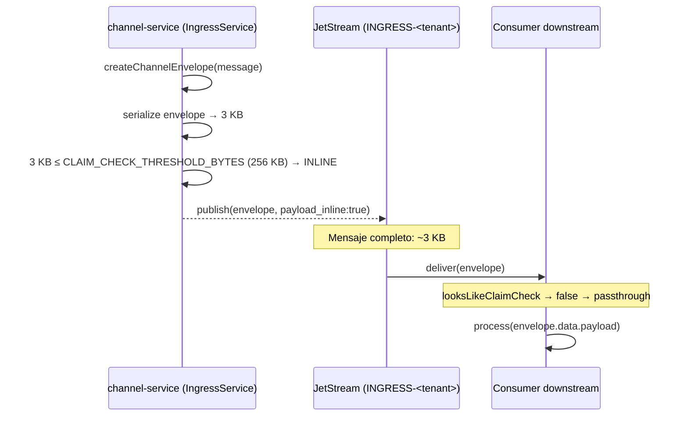
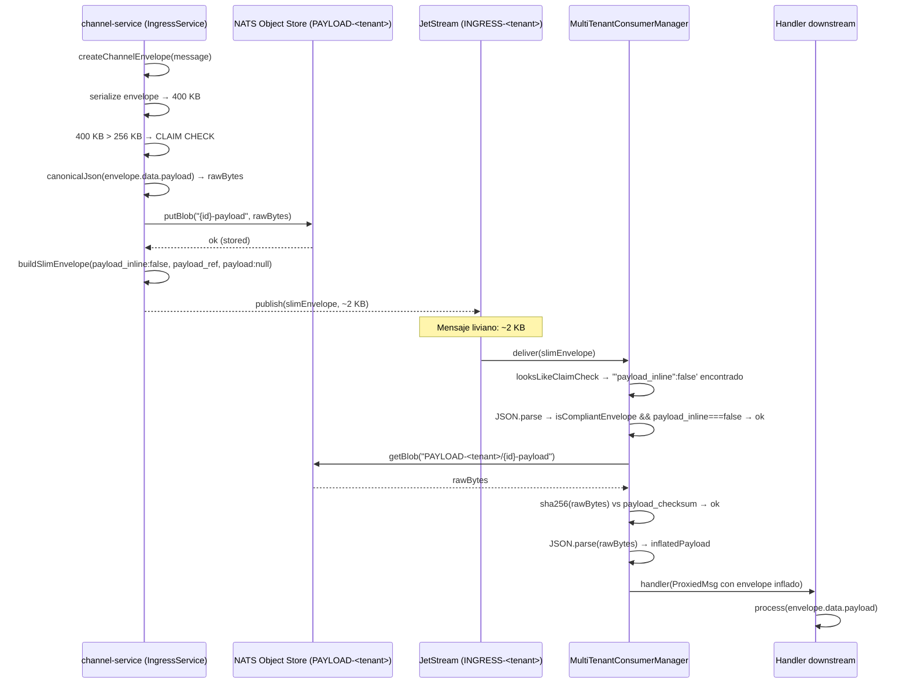
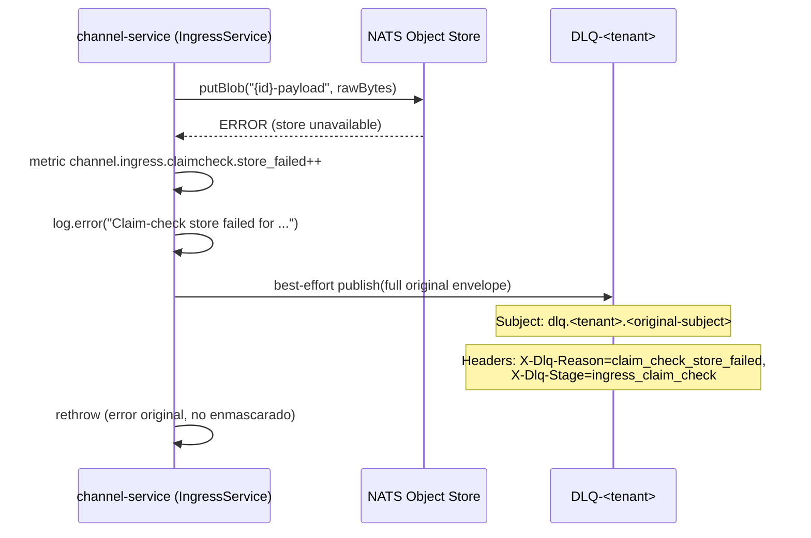
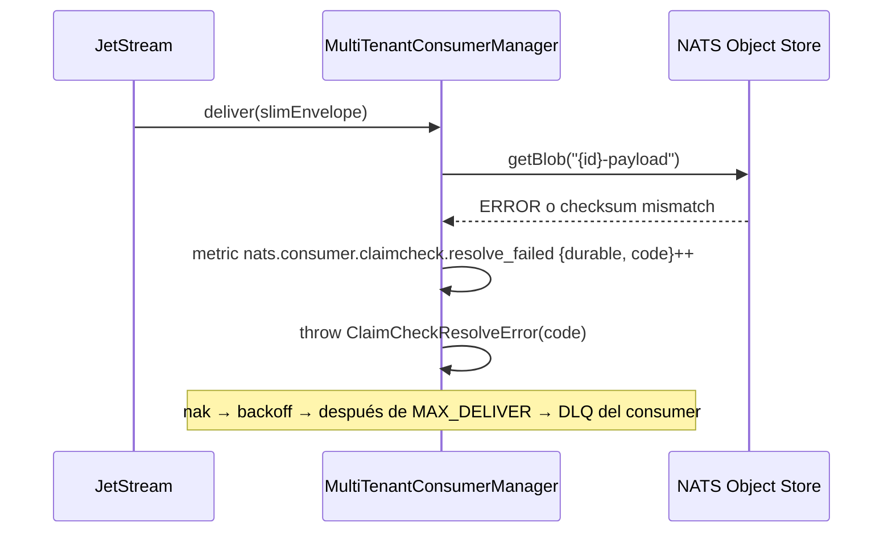

# 04 — Claim Check: Payloads Grandes

**Estado:** Referencia operativa — describe el sistema implementado
**Audiencia:** Dev + Infra
**Última revisión:** 2026-06-11

> Este documento describe el sistema tal como está construido (as-built).
> Referencia operativa de NATS/JetStream: `DOCS/03-NATS-JETSTREAM.md`.
> Fuente de verdad del contrato de envelope: `packages/shared/src/interfaces.ts`.

---

## 1. Resumen

NATS está diseñado para mensajes pequeños (sweet spot sub-100 KB, max 1 MB default). Para envelopes serializados que superen el umbral configurado, usamos el patrón Claim Check: almacenar solo el payload en NATS Object Store y enviar el envelope con una referencia liviana por el bus.

El patron está **completamente implementado**: el producer en `channel-service` y el consumer middleware en `MultiTenantConsumerManager` funcionan end-to-end con verificación de checksum.

---

## 2. Patrón Claim Check

### 2.1 Concepto

Analogía del guardarropa: dejás el abrigo, recibís un ticket, y entrás al salón solo con el ticket. Quien necesite el abrigo presenta el ticket y lo retira.

### 2.2 Arquitectura

```
┌──────────────┐     ┌──────────────────┐     ┌──────────────┐
│   Producer    │     │   NATS JetStream  │     │   Consumer    │
│ (IngressSvc)  │     │   (bus liviano)   │     │  (downstream) │
└──────┬───────┘     └────────┬─────────┘     └──────┬───────┘
       │                      │                       │
       │  ┌──────────────────────────────────┐       │
       └──┤   NATS Object Store              ├───────┘
          │   PAYLOAD-<tenant>               │
          └──────────────────────────────────┘
```

---

## 3. Diagramas de secuencia

### 3.1 Flujo inline (envelope serializado bajo el umbral)

Caso más común. El payload viaja completo dentro del mensaje.



### 3.2 Flujo claim check (envelope serializado sobre el umbral)



### 3.3 Fallo en escritura al Object Store



### 3.4 Fallo en lectura por el consumer



---

## 4. NATS Object Store

### 4.1 Qué es

Feature nativa de JetStream que almacena blobs grandes. Tiene versionado, TTL, y acceso por key. Es parte de NATS — sin infraestructura adicional.

### 4.2 Configuración — un bucket por tenant

Configurado por `IngressService.getClaimCheckBucket` (`services/channel-service/src/modules/ingress/ingress.service.ts`):

| Parámetro | Valor | Fuente |
|-----------|-------|--------|
| Bucket name | `PAYLOAD-<tenantId>` | `buildClaimCheckBucket(tenant)` |
| Storage | `file` | Durable across server restarts |
| TTL | 7 días (en nanosegundos) | `CLAIM_CHECK_BUCKET_TTL_NS` — alineado a `CHANNEL_STREAM_MAX_AGE_NS` |
| Max bytes | 512 MB | `CLAIM_CHECK_BUCKET_MAX_BYTES` |

Constantes en: `packages/shared/src/channel.constants.ts`

**Nota operativa:** `views.os()` no reconfigura buckets ya existentes — si el bucket se creó con opciones distintas (e.g., en desarrollo), hay que recrearlo con `nats object rm PAYLOAD-<tenant>` para que apliquen los nuevos parámetros.

### 4.3 Convención de keys

```
{envelopeId}-payload
```

Ejemplo: `b7d9e2f4-1a3c-5e7f-9b1d-2c3e4f5a6b7c-payload`

Key derivada del campo `id` del envelope — correlación directa entre mensaje del bus y payload en Object Store.

### 4.4 Ciclo de vida

No hay garbage collection manual. Los objetos expiran por TTL (7 días), alineado con el `max_age` del stream de ingress del tenant.

### 4.5 Sizing por tier

> **Estado: pendiente — no implementado**
>
> La tabla de sizing por tier (starter/growth/enterprise) existe en el diseño pero los parámetros por tier no están conectados al código de configuración de bucket. Actualmente aplica la configuración global para todos los tenants.

---

## 5. Umbral de activación

### 5.1 Trigger: tamaño del envelope serializado

El umbral se mide sobre la **serialización completa del envelope** (no solo el payload). Esto protege el límite real de NATS (`max_payload = 1 MB`).

```typescript
// services/channel-service/src/modules/ingress/ingress.service.ts
const payloadBytes = UTF8_TEXT_ENCODER.encode(JSON.stringify(envelope));
if (payloadBytes.byteLength > CLAIM_CHECK_THRESHOLD_BYTES) { /* claim check */ }
```

En cambio, el campo `data.payload_bytes` del slim envelope reporta el **byte length canónico del payload** (`canonicalByteLength(payload)`), no del envelope completo. Son dos medidas distintas con propósitos distintos.

### 5.2 Valor configurado

| Nivel | Config | Valor actual |
|-------|--------|-------------|
| Global | `CLAIM_CHECK_THRESHOLD_BYTES` | `262144` (256 KB) — `packages/shared/src/channel.constants.ts` |

### 5.3 Configurabilidad extendida

> **Estado: pendiente — no implementado**
>
> Los niveles de override por tenant (`tenant.{id}.claim_check_threshold`) y por categoría de agente (`agent.{category}.claim_check_threshold`) del diseño original no existen en el código. Solo el umbral global está implementado.

---

## 6. Invariante de integridad (checksum)

El producer almacena exactamente `utf8(canonicalJson(data.payload))` en Object Store y el consumer verifica sha256 sobre esos mismos bytes raw (sin re-canonicalizar). Esta es la invariante central del patrón:

```
Producer:
  rawBytes   = UTF8_TEXT_ENCODER.encode(canonicalJson(envelope.data.payload))
  stored     = os.putBlob(key, rawBytes)
  checksum   = computePayloadChecksum(payload)  // sha256(canonicalJson(payload))
  slim.data.payload_checksum = checksum

Consumer (resolveClaimCheckEnvelope en packages/database/src/claim-check.ts):
  rawBytes  = os.getBlob(key)
  actual    = "sha256:" + sha256(rawBytes)       // hash sobre bytes raw
  assert actual === envelope.data.payload_checksum
  payload   = JSON.parse(rawBytes.toString("utf8"))
```

**Por qué no re-canonicalizar en el consumer:** los bytes almacenados son el resultado de `canonicalJson`, cuyo sha256 fue calculado antes del store. Re-canonicalizar haría un round-trip `parse → stringify` que potencialmente altera los bytes (e.g., si el resultado de `JSON.parse` no preserva exactamente el orden de keys) y rompe la verificación.

---

## 7. Consumer middleware (as-built)

### 7.1 Integración central en MultiTenantConsumerManager

El claim-check no es responsabilidad de cada consumer individualmente. `MultiTenantConsumerManager.wrapHandler` (`packages/database/src/multi-tenant-consumer-manager.ts`) envuelve transparentemente cada handler registrado:

**Flujo del middleware:**

1. **Pre-check rápido:** `looksLikeClaimCheck(msg.data)` busca el literal `'"payload_inline":false'` a nivel de bytes. Si no está → passthrough al handler sin parsear.
2. **Parse y guard:** `JSON.parse` + `isCompliantEnvelope` + `payload_inline === false`. Si alguno falla → passthrough.
3. **Resolución:** `resolveClaimCheckEnvelope(envelope, getStore)` → fetch blob → verificación sha256 → `JSON.parse`.
4. **Proxy:** el handler recibe un `JsMsg` proxeado que retorna el JSON inflado en `msg.data`. Las funciones `ack/nak/term` se delegan al mensaje original (binding explícito para preservar el `this` interno de NATS).
5. **Error:** `ClaimCheckResolveError` → nak → backoff exponencial → después de `MAX_DELIVER` → DLQ del consumer.

### 7.2 Códigos de error

```typescript
type ClaimCheckErrorCode =
  | "ref_missing"       // payload_inline:false pero no hay payload_ref
  | "ref_malformed"     // URI no tiene formato nats://objstore/<bucket>/<key>
  | "blob_not_found"    // Object Store no tiene la key
  | "checksum_mismatch" // sha256 no coincide
```

Fuente: `packages/database/src/claim-check.ts`

### 7.3 Métricas del consumer

| Métrica | Labels | Qué mide |
|---------|--------|----------|
| `nats.consumer.claimcheck.resolved` | `{durable}` | Envelopes resueltos exitosamente |
| `nats.consumer.claimcheck.resolve_failed` | `{durable, code}` | Fallos de resolución, con código de error |

Implementadas en `packages/observability/src/nats-consumer-metrics.ts` y registradas por `createNatsConsumerMetrics`.

---

## 8. Métricas del producer

Definidas en `services/channel-service/src/modules/ingress/ingress.metrics.ts`:

| Métrica | Labels | Qué mide |
|---------|--------|----------|
| `channel.ingress.claim_check_count` | `{channel, tenant}` | Mensajes que activaron claim check |
| `channel.ingress.claimcheck.stored` | `{tenant}` | Payloads almacenados exitosamente |
| `channel.ingress.claimcheck.store_failed` | `{tenant}` | Fallos al almacenar en Object Store |

---

## 9. ClaimCheckService en agent-ai-service

`agent-ai-service` tiene su propio `ClaimCheckService` (`services/agent-ai-service/src/modules/claim-check/claim-check.service.ts`) con métodos `checkPayloadSize`, `storePayload`, y `resolvePayload`. El módulo está registrado en `AppModule` pero actualmente **no está conectado a ningún handler de mensajes**. Es código existente sin uso activo.

> **Estado: existente pero sin uso**
>
> `ClaimCheckService` en `agent-ai-service` no está integrado en el pipeline de consumo. El claim-check para los consumers de ese servicio lo maneja el middleware central de `MultiTenantConsumerManager`, no este servicio local.

---

## 10. Consideraciones de implementación

### 10.1 Orden de operaciones (invariante)

Siempre guardar en Object Store **antes** de publicar al bus:

```
CORRECTO:   store(rawBytes) → publish(slimEnvelope)
INCORRECTO: publish(slimEnvelope) → store(rawBytes)
```

Si se publica primero y el store falla, queda una referencia rota en el bus.

### 10.2 Atomicidad

La operación es de dos pasos (store + publish). Si el publish falla después del store, queda un objeto huérfano en Object Store. Es aceptable: el TTL limpia los huérfanos automáticamente. La alternativa (transacción distribuida) agrega complejidad desproporcionada al beneficio.

### 10.3 Idempotencia del store

Si el mismo evento se reintenta (por ejemplo, por fallo en el publish), el `putBlob` con la misma key sobrescribe el valor anterior. Es idempotente por diseño de NATS Object Store.

### 10.4 Consumers que no necesitan el payload

Algunos consumers solo necesitan la metadata del envelope (e.g., servicio de métricas que contabiliza tamaño). Pueden usar `data.payload_bytes` para estadísticas sin necesidad de resolver la referencia. El middleware de `MultiTenantConsumerManager` resuelve de todas formas — si este overhead es indeseable para un consumer específico, puede optar fuera pasando un handler directo que opere sobre el slim envelope.

### 10.5 Migración de store

El contrato `payload_ref` soporta distintos esquemas de URI:

- `nats://objstore/PAYLOAD-acme/{id}-payload` → NATS Object Store (implementado)
- `s3://bucket-name/tenant/{id}-payload` → S3/MinIO (diseño futuro)
- `mongodb://collection/{id}` → MongoDB (diseño futuro)

Migrar de store es cambiar el producer y la implementación de `resolveClaimCheckEnvelope`, sin modificar el envelope ni los consumers.

---

## 11. Alternativas evaluadas

| Store | Ventaja | Desventaja | Veredicto |
|-------|---------|------------|-----------|
| **NATS Object Store** | Zero infra adicional, retención alineada, acceso nativo | Query solo por key | **Elegido e implementado** |
| **MongoDB (GridFS)** | Ya en el stack | Retención desacoplada, sincronización de TTLs manual | Candidato si se necesitan queries complejos |
| **S3 / MinIO** | Durabilidad enterprise, lifecycle policies | Infra adicional, latencia de red | Candidato para escala grande |
| **Redis** | Rápido para lecturas | In-memory, caro para blobs, durabilidad limitada | Descartado |
