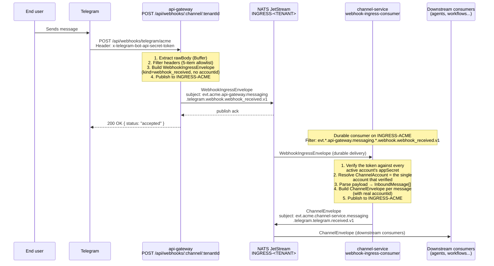
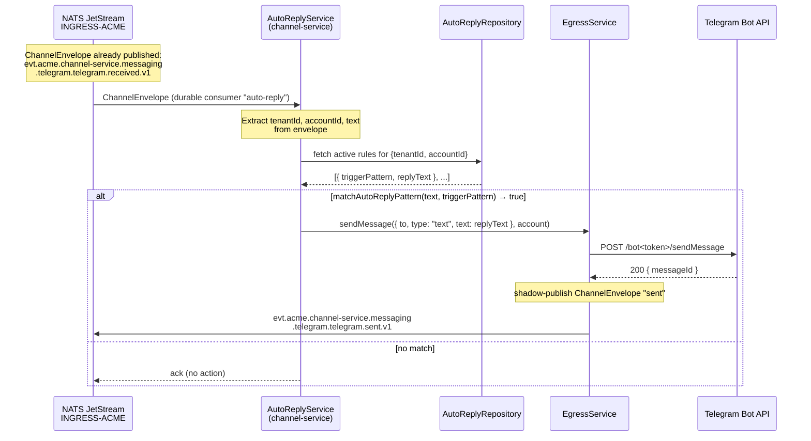
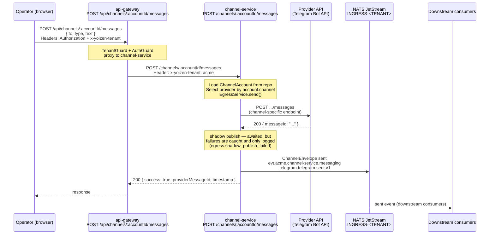
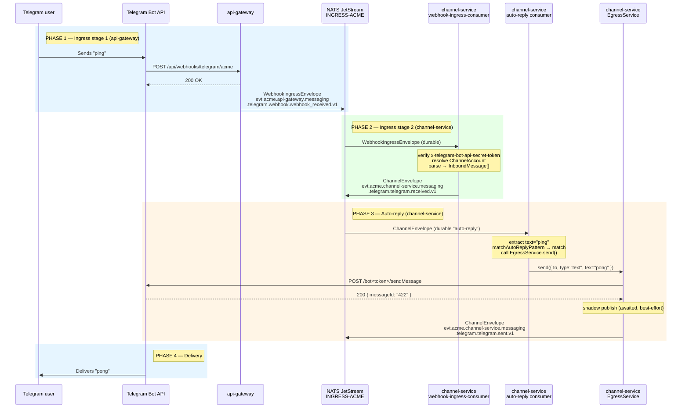

# Channel Service

Class: descriptive
Summary: The full channel-service provider directory and the ingress/egress pipeline: signature verification, account resolution, canonical event publication and outbound sends.

> **Status:** implemented
> **See also:** [../messaging/ingress.md](../messaging/ingress.md) — two-stage bridge contract · [../messaging/envelope.md](../messaging/envelope.md) — envelope spec

## Overview

`channel-service` is the single service responsible for all channel I/O. It handles:

- **Ingress**: receiving and verifying webhooks from Telegram and the generic HTTP channel, then publishing canonical `ChannelEnvelope` events to NATS JetStream.
- **Auto-reply**: consuming canonical events and executing configured auto-reply rules.
- **Egress**: sending outbound messages via the correct provider and shadow-publishing `sent` events.

A `ChannelAccount` carries two discriminator fields — `channel` (`"telegram" | "http" | "e2e-tests"`) and `provider` (`"telegram" | "http" | "e2e-tests"`), both declared in `packages/shared/src/channel.interfaces.ts` — that are embedded in every NATS subject token. The NATS bus, the envelope schema, and all downstream consumers are channel-agnostic.

## Implemented channels

| Channel | Provider | Direction | Status |
|---------|----------|-----------|--------|
| Telegram | telegram | inbound + outbound | Implemented |
| HTTP | http | **inbound only** — `HttpProvider.sendMessage` always returns `{ success: false, error: "outbound not supported for http channel" }` | Implemented |
| e2e-tests | e2e-tests | **outbound only** — a SINK: `E2eTestsProvider.sendMessage` always returns `{ success: true }` and discards the message; `parseWebhook` returns `[]` and `verifySignature` always denies | Implemented |

The `http` channel is a generic JSON-in webhook: it accepts `{ from, text?, messageId?, timestamp?, type?, raw? }`, derives a deterministic `messageId` (sha1 of the top-level-sorted body, 16 hex chars) when the caller omits one, and authenticates with a shared token in `x-http-channel-token` compared via `timingSafeEqual`.

The `e2e-tests` channel is the mirror image of `http`, and exists for one
reason: to make the egress path testable. `EgressService` publishes `sent.v1`
only inside its `if (result.success)` branch, so before this channel no
provider could reach that branch under test — `http` fails by design and
Telegram needs live third-party credentials, which is why
`tracking.tracked_events` held zero `sent` rows. Its provider accepts the
message, returns success and discards it; everything downstream of the
provider is the same code Telegram runs, so the suite exercises
the real egress path rather than a stand-in. It proves publication, **not**
third-party delivery. Its only consumer is
`scripts/e2e/http-workflow.sh`'s `channelSend` stage.

## Provider directory

```
services/channel-service/src/providers/
├── channel-router.ts                  ← ChannelRouter: constructor-injected providers into Map<Channel, IChannelProvider>
├── telegram/
│   ├── telegram.module.ts
│   └── telegram.provider.ts           ← signatureHeader, verifySignature, parseWebhook, sendMessage
├── http/
│   ├── http.module.ts
│   └── http.provider.ts               ← inbound-only generic JSON webhook
└── e2e-tests/
    ├── e2e-tests.module.ts
    └── e2e-tests.provider.ts          ← outbound-only sink for the automated suite
```

There is no per-family sub-registry: every provider is injected straight into
the `ChannelRouter` constructor and registered under its own `channel` token.

## NATS subject format

```
evt.<tenant>.channel-service.messaging.<channel>.<provider>.<kind>.v1
```

Examples:

```
evt.acme.channel-service.messaging.telegram.telegram.received.v1
evt.acme.channel-service.messaging.http.http.received.v1
evt.acme.channel-service.messaging.e2e-tests.e2e-tests.sent.v1
```

Generator function: `buildChannelSubject(tenant, channel, provider, kind)` in `packages/shared/src/channel.utils.ts`.

## Account lookup in webhooks

`channel-service` resolves the tenant's `ChannelAccount` in `WebhookIngressService.resolveAccount`. The primary mechanism is **signature/token verification against every active account** for the tenant: each candidate account's secret is tried, and the account whose secret verifies the webhook wins. If the URL carries an instance segment (`/api/webhooks/:channel/:tenantId/:instance`), the candidate set is first narrowed to the account whose `externalId` matches.

Every inbound channel identifies its account by a per-account secret in the header, so
verification is the whole mechanism — there is no payload hint to fall back on:

| Channel | Identifying header | Why it is enough |
|---------|--------------------|------------------|
| **Telegram** | `x-telegram-bot-api-secret-token` | secret token is unique per account |
| **HTTP** | `x-http-channel-token` | shared token is unique per account |

A missing or empty header is an immediate `signature_mismatch`; so is a webhook that more
than one account verifies (ambiguous) or that none verifies. Nothing is ever guessed, and
there is no first-active-account fallback. Signature/token comparison uses `timingSafeEqual`
in all cases.

---

## Receiving messages

### Two-stage ingress bridge

Webhook delivery uses a two-stage bridge to separate HTTP acknowledgement from verification and parsing. See [../messaging/ingress.md](../messaging/ingress.md) for the full contract; the summary below covers the actors and subjects.

#### Actors

| Actor | Service / Component |
|-------|---------------------|
| **End user** | Person sending a message |
| **Telegram (or the HTTP caller)** | Delivers webhooks |
| **api-gateway** | `POST /api/webhooks/:channel/:tenantId` — receives webhook, publishes `WebhookIngressEnvelope` |
| **channel-service** | Durable consumer — verifies signature, parses, publishes `ChannelEnvelope` |
| **NATS JetStream** | Stream `INGRESS-<TENANT>` |
| **Downstream consumers** | agent-ai-service, workflow-service, etc. |

#### Sequence diagram



#### NATS subjects involved

| Stage | Subject | Producer |
|-------|---------|----------|
| Stage 1 — raw ingress | `evt.acme.api-gateway.messaging.telegram.webhook.webhook_received.v1` | api-gateway |
| Stage 2 — canonical | `evt.acme.channel-service.messaging.telegram.telegram.received.v1` | channel-service |

#### WebhookIngressEnvelope (stage 1)

Built by `WebhookIngressPublisherService.publishWebhook`; `type` comes from
`buildWebhookIngressType(channel)`.

```json
{
  "specversion": "1.0",
  "id": "uuid-v4",
  "source": "api-gateway/webhooks",
  "type": "io.yoizen.messaging.telegram.webhook.webhook_received.v1",
  "resource": "tenant/acme/channel/telegram/provider/webhook",
  "time": "2026-08-02T10:00:00.000Z",
  "traceid": "...",
  "causation_id": null,
  "correlation_id": "...",
  "tenant": "acme",
  "producer": "api-gateway",
  "domain": "messaging",
  "channel": "telegram",
  "provider": "webhook",
  "kind": "webhook_received",
  "idempotencykey": "...",
  "transport": { "method": "webhook", "protocol": "https", "depth": 0 },
  "data": {
    "received_at": "2026-08-02T10:00:00.000Z",
    "payload_inline": true,
    "payload_ref": null,
    "payload_bytes": 512,
    "payload_checksum": "...",
    "payload": { "...raw Telegram update...": "..." },
    "raw_body_b64": "...",
    "headers": {
      "x-telegram-bot-api-secret-token": "...",
      "content-type": "application/json"
    }
  }
}
```

`data.instance` is added only for instance-addressed URLs (the account's `externalId`).

**No `accountid`**: at this stage the signature has not been verified and the account is not yet resolved. Setting a placeholder would corrupt per-account billing metrics.

#### ChannelEnvelope (stage 2)

Built by `createChannelEnvelope` (`services/channel-service/src/domain/envelope.factory.ts`).
One message in, one envelope out — a webhook carrying N messages produces N envelopes.

```json
{
  "specversion": "1.0",
  "id": "uuid-v4",
  "source": "channel-service/accounts/69bea8cd868e860918359cc7",
  "type": "io.yoizen.messaging.telegram.telegram.received.v1",
  "resource": "tenant/acme/account/69bea8cd868e860918359cc7/channel/telegram/provider/telegram",
  "time": "2026-08-02T10:00:00.000Z",
  "traceid": "...",
  "causation_id": "<stage-1 envelope id>",
  "correlation_id": "<propagated from stage 1>",
  "tenant": "acme",
  "producer": "channel-service",
  "domain": "messaging",
  "channel": "telegram",
  "provider": "telegram",
  "kind": "received",
  "accountid": "69bea8cd868e860918359cc7",
  "idempotencykey": "...",
  "transport": { "method": "webhook", "protocol": "https", "depth": 1 },
  "data": {
    "received_at": "2026-08-02T10:00:00.000Z",
    "payload_inline": true,
    "payload_ref": null,
    "payload_bytes": 210,
    "payload_checksum": "...",
    "payload": {
      "messageId": "421",
      "from": "874591203",
      "timestamp": "1712345678",
      "type": "text",
      "text": "ping",
      "accountId": "69bea8cd868e860918359cc7"
    },
    "headers": { "content-type": "application/json", "user-agent": "..." }
  }
}
```

**The stage-2 payload is the NORMALIZED `InboundMessage`, not the raw provider body.**
`data.payload` carries `messageId`, `from`, `timestamp`, `type` plus the optional
`text`/`media`/`conversationId`, and `accountId` — the provider's `raw` object is
deliberately excluded from `data.payload` (it feeds `idempotencykey` computation only).
Consumers that need the untouched provider body must read the stage-1
`WebhookIngressEnvelope`.

`source` is the full `channel-service/accounts/<accountId>` — the `accountid` value,
not a truncated prefix.

See [../messaging/envelope.md](../messaging/envelope.md) for the full field reference.

#### Forwarded headers (5-item allowlist)

Only these headers from the original HTTP request are included in the envelope:

| Header | Purpose |
|--------|---------|
| `content-type` | Body type |
| `x-telegram-bot-api-secret-token` | Telegram signature |
| `x-http-channel-token` | HTTP channel shared token |
| `x-request-id` | Request traceability |
| `user-agent` | Provider identification |

Defined in `WEBHOOK_FORWARDED_HEADERS` in `packages/shared/src/channel.constants.ts`.

The two token headers are verification secrets
(`WEBHOOK_SECRET_HEADERS`, same file): they reach `channel-service` so it can
authenticate the webhook, and are stripped after the signature check — stage-2
`message.received` envelopes carry only `content-type`, `x-request-id` and
`user-agent` in `data.headers` (envelope.md §4.1, since 2026-08-01).

#### Operational notes

- The HTTP 200 to the caller is returned **only after** `api-gateway` successfully publishes the stage-1 `WebhookIngressEnvelope` to JetStream. Telegram still requires a fast response, so publish backpressure is surfaced as an HTTP error instead of acknowledging before durability.
- `api-gateway` does **not** verify the signature; it only packages and publishes. Verification happens in the `channel-service` durable consumer.
- If NATS JetStream has backpressure or publish fails, `api-gateway` returns 503 with `Retry-After`. Providers retry the webhook automatically.
- Stage-1 `WebhookIngressEnvelope` payloads are published inline (`payload_inline: true`); the claim-check path is implemented in `channel-service` when it publishes canonical `ChannelEnvelope` events.

#### Relevant files

| File | Role |
|------|------|
| `services/api-gateway/src/modules/channels/webhooks.controller.ts` | HTTP endpoint |
| `services/api-gateway/src/modules/channels/webhook-ingress-publisher.service.ts` | Builds and publishes `WebhookIngressEnvelope` |
| `packages/shared/src/webhook.interfaces.ts` | `WebhookIngressEnvelope` type |
| `packages/shared/src/channel.constants.ts` | `WEBHOOK_FORWARDED_HEADERS`, `WEBHOOK_SECRET_HEADERS`, `WEBHOOK_INGRESS_SUBJECT_FILTER` |
| `packages/shared/src/channel.utils.ts` | `buildWebhookIngressSubject`, `buildChannelSubject` |
| `services/api-gateway/src/modules/channels/webhook-ingress-type.ts` | `buildWebhookIngressType` — the stage-1 `type` |
| `services/channel-service/src/domain/envelope.factory.ts` | `createChannelEnvelope`, `createChannelSentEnvelope` |
| `services/channel-service/src/modules/webhooks/webhook-ingress-consumer.service.ts` | NATS durable consumer |
| `services/channel-service/src/modules/webhooks/webhook-ingress.service.ts` | Signature verification + account resolution |
| `services/channel-service/src/providers/telegram/telegram.provider.ts` | Telegram payload parse |
| `services/channel-service/src/modules/ingress/ingress.service.ts` | Publishes canonical `ChannelEnvelope` |

---

## Auto-reply

`AutoReplyService` consumes the canonical `ChannelEnvelope` (stage 2), evaluates rules configured per tenant+account, and if there is a match calls `EgressService` to send the reply. It operates entirely within `channel-service` — no coupling with `api-gateway`.

### Module structure

```
services/channel-service/src/modules/auto-reply/
├── auto-reply.service.ts              # durable consumer, rule evaluation
├── auto-reply.pattern.ts              # matchAutoReplyPattern(text, pattern)
├── auto-reply.repository.ts           # selects Postgres or Mongo by config
├── auto-reply.repository.interface.ts # IAutoReplyRepository interface
├── auto-reply.postgres.repository.ts
├── auto-reply.mongo.repository.ts
├── auto-reply.controller.ts           # CRUD rules (REST)
├── auto-reply.module.ts
└── auto-reply.dto.ts
```

### Sequence diagram



### Subscribe subject

```
evt.*.channel-service.messaging.*.*.received.v1
```

The consumer only listens for `received` events — it never processes `sent` events. No loop risk.

### Rule cache

Rules are loaded into memory with a 30-second refresh interval:

```
cacheKey = "${tenantId}:${accountId}"
rulesCache: Map<string, AutoReplyRule[]>
```

If no rules exist for the account, the message is acked immediately (fast path).

### `AutoReplyRule` interface

```typescript
interface AutoReplyRule {
  id: string;
  tenantId: string;
  accountId: string;
  channel: Channel;
  triggerPattern: string;  // pattern for matchAutoReplyPattern()
  replyText: string;
  isActive: boolean;
}
```

Defined in `packages/shared/src/channel.interfaces.ts`. `AutoReplyController` is mounted at `channels/auto-reply` on `channel-service` and exposes exactly three routes — `POST` (create), `GET` (list), `DELETE :id`. There is no update route; a rule is replaced by deleting and re-creating it. `api-gateway` proxies all three verbatim under its `api` prefix (`POST/GET /api/channels/auto-reply`, `DELETE /api/channels/auto-reply/:id`).

### Design notes

- **Zero coupling with api-gateway**: `AutoReplyService` only consumes from the bus and calls `EgressService`.
- **Durable consumer**: if the service restarts, NATS redelivers pending messages from the last ack position.
- **`sent.v1` is channel-agnostic**: the same `EgressService` handles Telegram and the `e2e-tests` sink (the `http` channel is inbound-only and always fails the send, so it never reaches the publish).
- **No loop**: the consumer filters on `received.v1`; the `sent.v1` event published by `EgressService` does not match the filter.
- **Circuit breaker**: `EgressService` uses a `DistributedCircuitBreaker` keyed by `computeBreakerKey({ tenantId, kind: "egress", target: "<channel>:<provider>" })` — **per tenant + channel/provider pair, not per account**. When the breaker denies, the send throws `PermanentError("egress.circuit_breaker")`; on the NATS `send-command` consumer path that TERMs the message straight to `DLQ-<tenant>`, and on the direct HTTP path the caller gets the error.

---

## Sending messages

`EgressService` handles all outbound messages, whether triggered by the auto-reply consumer or a direct API call from an operator.

### API endpoint

```
POST /api/channels/:accountId/messages   (api-gateway)
POST /channels/:accountId/messages       (channel-service)
```

**api-gateway** (proxy with JWT auth + tenant resolution, global `api` prefix) → **channel-service** (execution).

### Sequence diagram



### Request body

```json
{
  "to": "5215512345678",
  "type": "text",
  "text": "Hello, thank you for contacting us"
}
```

### Supported `OutboundMessage` types

| `type` | Additional fields |
|--------|-------------------|
| `text` | `text` (string, required) |
| `template` | `templateName`, `templateLanguage`, `templateComponents` |
| `image` | `mediaUrl`, `caption` (optional) |
| `document` | `mediaUrl`, `caption` (optional) |

**Channel restrictions:**
- `TelegramProvider.sendMessage` branches on `image` and `document` only; every other
  `type` — including `template` — falls through to a plain `sendMessage` text call, so
  the template fields are ignored rather than rendered.
- The `http` channel rejects every send (`success: false`); the `e2e-tests` sink accepts
  every send and discards it.

### `sent` event subject

```
evt.<tenant>.channel-service.messaging.<channel>.<provider>.sent.v1
```

Example:

```
evt.acme.channel-service.messaging.telegram.telegram.sent.v1
```

### Shadow publish

`EgressService.send()` `await`s `shadowPublish()` before returning, so the publish is
**not** off the response path — but it is **best-effort**: `shadowPublish` wraps
everything (`ensureTenantIngressStream`, envelope build, `js.publish`) in a
`try/catch` that logs `egress.shadow_publish_failed` at `warn` and swallows the
error. A publish failure therefore never fails the send, and under JetStream
pressure the `sent` event can be lost while the message has already reached the
provider. It only runs when `result.success` is true.

### Relevant files

| File | Role |
|------|------|
| `services/api-gateway/src/modules/channels/channels.controller.ts` | `POST /api/channels/:accountId/messages` (proxy) |
| `services/channel-service/src/modules/egress/egress.controller.ts` | `POST /channels/:accountId/messages` |
| `services/channel-service/src/modules/egress/egress.service.ts` | `send()` — provider selection + shadow publish |
| `services/channel-service/src/providers/telegram/telegram.provider.ts` | `sendMessage` for Telegram |
| `services/channel-service/src/providers/e2e-tests/e2e-tests.provider.ts` | `sendMessage` for the outbound-only test sink |

---

## End-to-end cycle

This section shows the complete path of a message from the user sending "ping" in Telegram to receiving the "pong" reply. It combines the two-stage ingress (phases 1–2) and auto-reply (phase 3).

### Four-phase sequence diagram



### NATS subjects in the cycle

| Phase | Subject | Producer | Kind |
|-------|---------|----------|------|
| 1 — raw ingress | `evt.acme.api-gateway.messaging.telegram.webhook.webhook_received.v1` | api-gateway | webhook_received |
| 2 — canonical | `evt.acme.channel-service.messaging.telegram.telegram.received.v1` | channel-service | received |
| 3 — sent | `evt.acme.channel-service.messaging.telegram.telegram.sent.v1` | channel-service | sent |

### Approximate timeline

```
t=0ms     User sends "ping" in Telegram
t~200ms   Telegram delivers webhook to api-gateway
t~201ms   api-gateway publishes WebhookIngressEnvelope → INGRESS-ACME
t~202ms   JetStream publish ack received; api-gateway responds 200 OK to Telegram
t~205ms   channel-service (webhook-ingress-consumer) receives envelope
t~210ms   Token verification + ChannelAccount resolution
t~215ms   Payload parse → InboundMessage
t~217ms   Publish canonical ChannelEnvelope → INGRESS-ACME
t~220ms   channel-service (auto-reply consumer) receives canonical envelope
t~225ms   matchAutoReplyPattern("ping", ...) → match
t~230ms   EgressService.send() calls the Telegram Bot API
t~500ms   Telegram responds 200 OK with the new message_id
t~502ms   EgressService shadow-publishes ChannelEnvelope "sent"
t~1-3s    Telegram delivers "pong" to the user
```

### Cycle notes

- **Two durable consumers in channel-service**: `webhook-ingress-consumer` handles stages 1→2; `auto-reply` handles stage 2→reply. They are separate NATS consumers with separate ack sequences.
- **No loop**: `auto-reply` filters on `received.v1`. The `sent.v1` event published by `EgressService` does not match the filter.
- **Durable = at-least-once**: if `channel-service` crashes between stage 2 and the auto-reply, NATS redelivers the canonical envelope on reconnect.
- **Circuit breaker**: if the provider returns repeated errors, the `EgressService` breaker (keyed per tenant + `channel:provider`) opens and further sends fast-fail with `PermanentError`, which the `send-command` consumer TERMs into `DLQ-<tenant>` instead of retrying.
- **Claim-check**: stage-1 `WebhookIngressEnvelope` payloads are inline. If a canonical `ChannelEnvelope` published by `channel-service` exceeds `CLAIM_CHECK_THRESHOLD_BYTES`, `IngressService` stores the payload in Object Store `PAYLOAD-ACME` (`buildClaimCheckBucket`) and publishes a slim envelope; `MultiTenantConsumerManager.wrapHandler` resolves that reference before handler delivery. See [../messaging/claim-check.md](../messaging/claim-check.md).

---

## Adding a new channel

1. Create the provider class implementing `IChannelProvider` at
   `providers/<channel>/<channel>.provider.ts`, with its own Nest module.
2. Register it: add the provider to the `ChannelRouter` constructor, which maps it
   under its own `channel` token.
3. Declare `signatureHeader` and `verifySignature` — the header is the account's
   only identifier, so an inbound channel without one cannot be resolved.
4. Implement `parseWebhook(rawBody) → InboundMessage[]`.
5. Implement `sendMessage(account, message) → Promise<SendMessageResult>` — or return a
   failure result if the channel is inbound-only, as `HttpProvider` does. A
   channel with no inbound surface does the converse: return `[]` from
   `parseWebhook` and deny in `verifySignature`, as `E2eTestsProvider` does.
6. Add the tokens to the `Channel` and (if new) `ChannelProvider` unions in
   `packages/shared/src/channel.interfaces.ts`, and to the two `CHECK` lists of
   `CHANNEL_ACCOUNTS_SCHEMA_SQL` plus `CreateAccountDto`'s `@IsIn` — the union
   comment names all four places.
7. Verification must single out exactly one account: no payload-hint tie-break
   exists any more, and an ambiguous webhook is rejected.
8. NATS subjects, streams, and consumers are generated automatically — no bus changes required.
