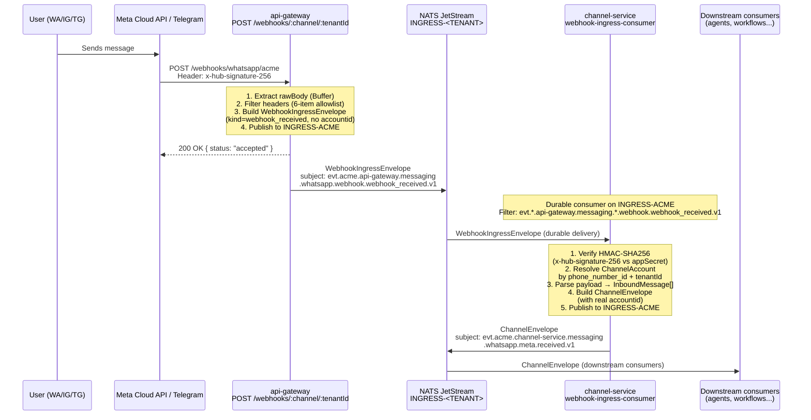
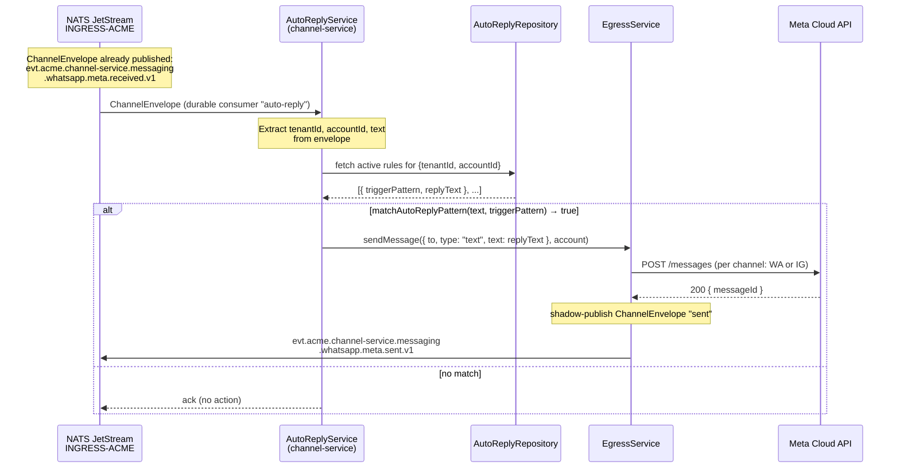
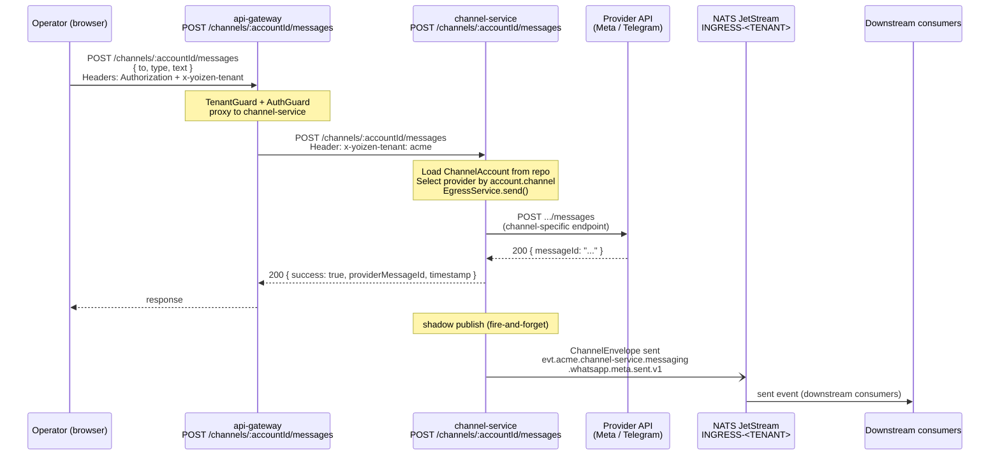

# Channel Service

> **Status:** implemented
> **See also:** [../messaging/ingress.md](../messaging/ingress.md) — two-stage bridge contract · [../messaging/envelope.md](../messaging/envelope.md) — envelope spec

## Overview

`channel-service` is the single service responsible for all channel I/O. It handles:

- **Ingress**: receiving and verifying webhooks from Meta (WhatsApp, Instagram) and Telegram, then publishing canonical `ChannelEnvelope` events to NATS JetStream.
- **Auto-reply**: consuming canonical events and executing configured auto-reply rules.
- **Egress**: sending outbound messages via the correct provider and shadow-publishing `sent` events.

A `ChannelAccount` carries two discriminator fields — `channel` (`"whatsapp" | "instagram" | "telegram"`) and `provider` (`"meta" | "telegram"`) — that are embedded in every NATS subject token. The NATS bus, the envelope schema, and all downstream consumers are channel-agnostic.

## Implemented channels

| Channel | Provider | Status |
|---------|----------|--------|
| WhatsApp | meta | Implemented |
| Instagram | meta | Implemented |
| Telegram | telegram | Implemented |

## Provider directory

```
services/channel-service/src/providers/
├── channel-router.ts                  ← IChannelProvider registry
├── meta/
│   ├── meta-base.ts                   ← verifyWebhookSignature (shared HMAC-SHA256)
│   ├── meta-channel-provider.base.ts  ← base: signatureHeader, verifySignature, buildSendPayload
│   ├── meta-token.ts                  ← Meta OAuth token exchange / refresh
│   ├── provider-registry.ts
│   ├── whatsapp/
│   │   └── whatsapp.provider.ts       ← parseWebhook, sendMessage
│   └── instagram/
│       └── instagram.provider.ts      ← parseWebhook, sendMessage
└── telegram/
    └── telegram.provider.ts           ← signatureHeader, verifySignature, parseWebhook, sendMessage
```

## NATS subject format

```
evt.<tenant>.channel-service.messaging.<channel>.<provider>.<kind>.v1
```

Examples:

```
evt.acme.channel-service.messaging.whatsapp.meta.received.v1
evt.acme.channel-service.messaging.instagram.meta.received.v1
evt.acme.channel-service.messaging.telegram.telegram.received.v1
```

Generator function: `buildChannelSubject(tenant, channel, provider, kind)` in `packages/shared/src/channel.utils.ts`.

## Account lookup in webhooks

`channel-service` identifies the tenant's `ChannelAccount` from the raw webhook body. The lookup strategy differs per channel:

| Channel | Lookup field | Extracted from |
|---------|-------------|----------------|
| **WhatsApp** | `phone_number_id` | `entry[].changes[].value.metadata.phone_number_id` |
| **Instagram** | `ig_user_id` | `entry[].messaging[].recipient.id` |
| **Telegram** | secret-token comparison | `x-telegram-bot-api-secret-token` header matched against all active accounts for the tenant |

Signature/token verification uses `timingSafeEqual` in all cases.

---

## Receiving messages

### Two-stage ingress bridge

Webhook delivery uses a two-stage bridge to separate HTTP acknowledgement from verification and parsing. See [../messaging/ingress.md](../messaging/ingress.md) for the full contract; the summary below covers the actors and subjects.

#### Actors

| Actor | Service / Component |
|-------|---------------------|
| **WA/IG/TG User** | Person sending a message |
| **Meta Cloud API / Telegram** | Delivers webhooks |
| **api-gateway** | `POST /webhooks/:channel/:tenantId` — receives webhook, publishes `WebhookIngressEnvelope` |
| **channel-service** | Durable consumer — verifies signature, parses, publishes `ChannelEnvelope` |
| **NATS JetStream** | Stream `INGRESS-<TENANT>` |
| **Downstream consumers** | agent-ai-service, workflow-service, etc. |

#### Sequence diagram



#### NATS subjects involved

| Stage | Subject | Producer |
|-------|---------|----------|
| Stage 1 — raw ingress | `evt.acme.api-gateway.messaging.whatsapp.webhook.webhook_received.v1` | api-gateway |
| Stage 2 — canonical | `evt.acme.channel-service.messaging.whatsapp.meta.received.v1` | channel-service |

#### WebhookIngressEnvelope (stage 1)

```json
{
  "specversion": "1.0",
  "id": "uuid-v4",
  "source": "//api-gateway/webhooks",
  "type": "io.yoizen.messaging.webhook.received.v1",
  "tenant": "acme",
  "producer": "api-gateway",
  "domain": "messaging",
  "channel": "whatsapp",
  "provider": "webhook",
  "kind": "webhook_received",
  "data": {
    "payload_inline": true,
    "payload": { "...raw Meta body..." },
    "raw_body_b64": "...",
    "headers": {
      "x-hub-signature-256": "sha256=...",
      "content-type": "application/json"
    }
  }
}
```

**No `accountid`**: at this stage the signature has not been verified and the account is not yet resolved. Setting a placeholder would corrupt per-account billing metrics.

#### ChannelEnvelope (stage 2)

```json
{
  "specversion": "1.0",
  "id": "uuid-v4",
  "source": "//channel-service/accounts/69bea8cd",
  "type": "io.yoizen.messaging.whatsapp.meta.received.v1",
  "tenant": "acme",
  "producer": "channel-service",
  "domain": "messaging",
  "channel": "whatsapp",
  "provider": "meta",
  "kind": "received",
  "accountid": "69bea8cd868e860918359cc7",
  "data": {
    "payload_inline": true,
    "payload": { "...raw Meta body, untouched..." }
  }
}
```

See [../messaging/envelope.md](../messaging/envelope.md) for the full field reference.

#### Forwarded headers (6-item allowlist)

Only these headers from the original HTTP request are included in the envelope:

| Header | Purpose |
|--------|---------|
| `content-type` | Body type |
| `x-hub-signature-256` | Meta HMAC-SHA256 signature |
| `x-hub-signature` | Meta legacy signature |
| `x-telegram-bot-api-secret-token` | Telegram signature |
| `x-request-id` | Request traceability |
| `user-agent` | Provider identification |

Defined in `WEBHOOK_FORWARDED_HEADERS` in `packages/shared/src/channel.constants.ts`.

#### Operational notes

- The HTTP 200 to Meta is sent **immediately** upon receiving the request — before NATS publish. Meta requires a fast response or it retries.
- `api-gateway` does **not** verify the HMAC signature; it only packages and publishes. Verification happens in the `channel-service` durable consumer.
- If NATS JetStream has backpressure, `api-gateway` returns 503 with `Retry-After`. Meta retries the webhook automatically.
- Payloads > 256 KB are stored in Object Store `PAYLOAD-<TENANT>` (claim-check) and the envelope carries a `payload_ref` reference.

#### Relevant files

| File | Role |
|------|------|
| `services/api-gateway/src/modules/channels/webhooks.controller.ts` | HTTP endpoint |
| `services/api-gateway/src/modules/channels/webhook-ingress-publisher.service.ts` | Builds and publishes `WebhookIngressEnvelope` |
| `packages/shared/src/webhook.interfaces.ts` | `WebhookIngressEnvelope` type |
| `packages/shared/src/channel.constants.ts` | `WEBHOOK_FORWARDED_HEADERS`, `buildWebhookIngressSubject` |
| `services/channel-service/src/modules/webhooks/webhook-ingress-consumer.service.ts` | NATS durable consumer |
| `services/channel-service/src/modules/webhooks/webhook-ingress.service.ts` | HMAC verification + account resolution |
| `services/channel-service/src/providers/meta/whatsapp/whatsapp.provider.ts` | WhatsApp payload parse |
| `services/channel-service/src/modules/ingress/ingress.service.ts` | Publishes canonical `ChannelEnvelope` |

---

## Auto-reply

`AutoReplyService` consumes the canonical `ChannelEnvelope` (stage 2), evaluates rules configured per tenant+account, and if there is a match calls `EgressService` to send the reply. It operates entirely within `channel-service` — no coupling with `api-gateway`.

### Module structure

```
services/channel-service/src/modules/auto-reply/
├── auto-reply.service.ts              # durable consumer, rule evaluation
├── auto-reply.pattern.ts              # matchAutoReplyPattern(text, pattern)
├── auto-reply.repository.ts           # selects Postgres or Mongo by config
├── auto-reply.repository.interface.ts # IAutoReplyRepository interface
├── auto-reply.postgres.repository.ts
├── auto-reply.mongo.repository.ts
├── auto-reply.controller.ts           # CRUD rules (REST)
├── auto-reply.module.ts
└── auto-reply.dto.ts
```

### Sequence diagram



### Subscribe subject

```
evt.*.channel-service.messaging.*.*.received.v1
```

The consumer only listens for `received` events — it never processes `sent` events. No loop risk.

### Rule cache

Rules are loaded into memory with a 30-second refresh interval:

```
cacheKey = "${tenantId}:${accountId}"
rulesCache: Map<string, AutoReplyRule[]>
```

If no rules exist for the account, the message is acked immediately (fast path).

### `AutoReplyRule` interface

```typescript
interface AutoReplyRule {
  id: string;
  tenantId: string;
  accountId: string;
  channel: Channel;
  triggerPattern: string;  // pattern for matchAutoReplyPattern()
  replyText: string;
  isActive: boolean;
}
```

Defined in `packages/shared/src/channel.interfaces.ts`. Rules are managed via `POST /auto-reply/rules`.

### Design notes

- **Zero coupling with api-gateway**: `AutoReplyService` only consumes from the bus and calls `EgressService`.
- **Durable consumer**: if the service restarts, NATS redelivers pending messages from the last ack position.
- **`sent.v1` is channel-agnostic**: the same `EgressService` handles WhatsApp, Instagram, and Telegram.
- **No loop**: the consumer filters on `received.v1`; the `sent.v1` event published by `EgressService` does not match the filter.
- **Circuit breaker**: `EgressService` uses a `DistributedCircuitBreaker` per account — if the provider API fails repeatedly, the breaker opens and messages go to the DLQ instead of retrying indefinitely.

---

## Sending messages

`EgressService` handles all outbound messages, whether triggered by the auto-reply consumer or a direct API call from an operator.

### API endpoint

```
POST /channels/:accountId/messages
```

**api-gateway** (proxy with JWT auth + tenant resolution) → **channel-service** (execution).

### Sequence diagram



### Request body

```json
{
  "to": "5215512345678",
  "type": "text",
  "text": "Hello, thank you for contacting us"
}
```

### Supported `OutboundMessage` types

| `type` | Additional fields |
|--------|-------------------|
| `text` | `text` (string, required) |
| `template` | `templateName`, `templateLanguage`, `templateComponents` |
| `image` | `mediaUrl`, `caption` (optional) |
| `document` | `mediaUrl`, `caption` (optional) |

**Channel restrictions:**
- Instagram does **not** support `template`.
- WhatsApp has a 24-hour window restriction for free-form `text` messages.

### `sent` event subject

```
evt.<tenant>.channel-service.messaging.<channel>.<provider>.sent.v1
```

Example:

```
evt.acme.channel-service.messaging.whatsapp.meta.sent.v1
```

### Shadow publish

The NATS publish is fire-and-forget — **it does not block the response to the operator**. If JetStream is under pressure, the event may be lost. The message has already been delivered to the provider and persisted.

### Relevant files

| File | Role |
|------|------|
| `services/api-gateway/src/modules/channels/channels.controller.ts` | `POST /channels/:accountId/messages` (proxy) |
| `services/channel-service/src/modules/egress/egress.controller.ts` | `POST /channels/:accountId/messages` |
| `services/channel-service/src/modules/egress/egress.service.ts` | `send()` — provider selection + shadow publish |
| `services/channel-service/src/providers/meta/whatsapp/whatsapp.provider.ts` | `sendMessage` for WhatsApp |
| `services/channel-service/src/providers/meta/instagram/instagram.provider.ts` | `sendMessage` for Instagram |
| `services/channel-service/src/providers/telegram/telegram.provider.ts` | `sendMessage` for Telegram |

---

## End-to-end cycle

This section shows the complete path of a message from the user sending "ping" in WhatsApp to receiving the "pong" reply. It combines the two-stage ingress (phases 1–2) and auto-reply (phase 3).

### Four-phase sequence diagram


### NATS subjects in the cycle

| Phase | Subject | Producer | Kind |
|-------|---------|----------|------|
| 1 — raw ingress | `evt.acme.api-gateway.messaging.whatsapp.webhook.webhook_received.v1` | api-gateway | webhook_received |
| 2 — canonical | `evt.acme.channel-service.messaging.whatsapp.meta.received.v1` | channel-service | received |
| 3 — sent | `evt.acme.channel-service.messaging.whatsapp.meta.sent.v1` | channel-service | sent |

### Approximate timeline

```
t=0ms     User sends "ping" in WhatsApp
t~200ms   Meta delivers webhook to api-gateway
t~201ms   api-gateway responds 200 OK to Meta
t~202ms   api-gateway publishes WebhookIngressEnvelope → INGRESS-ACME
t~205ms   channel-service (webhook-ingress-consumer) receives envelope
t~210ms   HMAC verification + ChannelAccount resolution
t~215ms   Payload parse → InboundMessage
t~217ms   Publish canonical ChannelEnvelope → INGRESS-ACME
t~220ms   channel-service (auto-reply consumer) receives canonical envelope
t~225ms   matchAutoReplyPattern("ping", ...) → match
t~230ms   EgressService.send() calls Meta Cloud API
t~500ms   Meta responds 200 OK with wamid
t~502ms   EgressService shadow-publishes ChannelEnvelope "sent"
t~1-3s    Meta delivers "pong" to user in WhatsApp
```

### Cycle notes

- **Two durable consumers in channel-service**: `webhook-ingress-consumer` handles stages 1→2; `auto-reply` handles stage 2→reply. They are separate NATS consumers with separate ack sequences.
- **No loop**: `auto-reply` filters on `received.v1`. The `sent.v1` event published by `EgressService` does not match the filter.
- **Durable = at-least-once**: if `channel-service` crashes between stage 2 and the auto-reply, NATS redelivers the canonical envelope on reconnect.
- **Circuit breaker**: if Meta returns repeated errors, the `EgressService` circuit breaker opens and messages go to the DLQ instead of retrying.
- **Claim-check**: if the Meta payload exceeds 256 KB, the `WebhookIngressEnvelope` carries a reference to Object Store `PAYLOAD-ACME`. The consumer middleware in `packages/database/src/claim-check.ts` resolves the payload transparently before delivering the message to the handler.

---

## Adding a new channel

1. Create `services/channel-service/src/providers/<provider>/<channel>/<channel>.provider.ts` implementing `IChannelProvider`.
2. Register it in `channel-router.ts`.
3. Define `signatureHeader` and the `verifySignature` logic.
4. Implement `parseWebhook(rawBody) → InboundMessage[]`.
5. Implement `sendMessage(account, message) → Promise<SendMessageResult>`.
6. Add the `channel` token to the `Channel` type in `packages/shared/src/channel.interfaces.ts`.
7. NATS subjects, streams, and consumers are generated automatically — no bus changes required.
