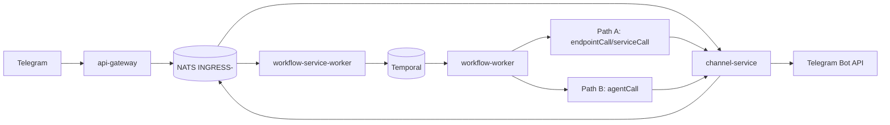
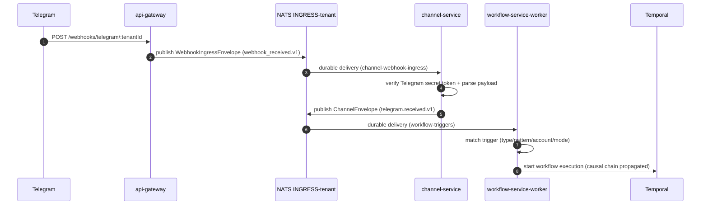
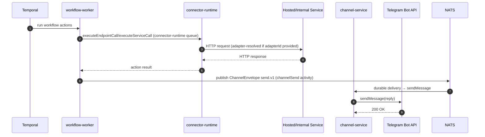
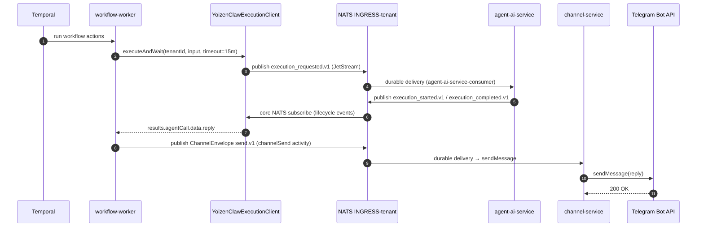

# Telegram Ingest Flow

This document explains the workflow-based path for an inbound Telegram message.

It is split into two execution paths after the workflow starts:

1. **Path A**: call a simple hosted/internal service (`endpointCall` or `serviceCall`)
2. **Path B**: call an AI agent (`agentCall`) on agent-ai-service

This document intentionally omits the channel-service auto-reply shortcut.

## Two-Stage Webhook Bridge

Telegram webhooks enter through a two-stage bridge before the workflow engine sees them:

1. **api-gateway** receives the raw HTTP POST, wraps it in a `WebhookIngressEnvelope`, publishes it inline to `INGRESS-<tenant>` (`evt.<tenant>.api-gateway.messaging.telegram.webhook.webhook_received.v1`), and returns HTTP 200 only after the JetStream publish succeeds. No signature verification happens here.
2. **channel-service** (`WebhookIngressConsumerService`, durable `channel-webhook-ingress`) consumes that event, verifies the Telegram secret token against each active account, parses the payload into normalized `InboundMessage` objects, and calls `IngressService.processInbound()`, which emits the canonical `ChannelEnvelope` (`evt.<tenant>.channel-service.messaging.telegram.telegram.received.v1`) to `INGRESS-<tenant>`.

Only after stage 2 does `TriggerConsumerService` in `workflow-service-worker` see the event and match trigger definitions.

## Overview

## Common Inbound Steps (Both Paths)

## Path A - Simple Hosted Service Call

Use this path when a workflow action needs an HTTP call (`endpointCall`/`serviceCall`) before replying on Telegram.

## Path B - Agent Call

Use this path when the workflow action is `agentCall`. The activity runs on the `workflow-orchestrator` queue (same as the workflow itself) with a 15-minute timeout and 30-second heartbeats.

Note: `YoizenClawExecutionClient` uses `ai-agent-gateway` as the envelope producer token (`evt.<tenant>.ai-agent-gateway.automation.platform.internal.*`). There is no HTTP hop to ai-agent-gateway; the client publishes directly to JetStream and subscribes to lifecycle events on core NATS.

## Key Subjects in This Flow

| Step | Subject Pattern | Stream |
|---|---|---|
| Webhook ingress published by gateway | `evt.<tenant>.api-gateway.messaging.telegram.webhook.webhook_received.v1` | `INGRESS-<tenant>` |
| Normalized inbound message published by channel-service | `evt.<tenant>.channel-service.messaging.telegram.telegram.received.v1` | `INGRESS-<tenant>` |
| Outbound send command published by workflow | `evt.<tenant>.channel-service.messaging.telegram.telegram.send.v1` | `INGRESS-<tenant>` |
| Agent execution request | `evt.<tenant>.ai-agent-gateway.automation.platform.internal.execution_requested.v1` | `INGRESS-<tenant>` |

## Notes

- After the message is on NATS, this trigger-based path does not go through `workflow-service-api`; `workflow-service-worker` starts Temporal directly.
- Trigger matching supports `exclusive` mode (only the first exclusive definition fires) and `shared` mode (all matching definitions fire in parallel Temporal starts).
- Causal chain (`causation_id`, `correlation_id`, `transport.depth`) is extracted from the incoming `ChannelEnvelope` and propagated through the workflow context so downstream `channelSend` envelopes comply with DOCS/messaging/envelope.md §6.
- Stage-1 webhook payloads are inline. Claim-check applies when `channel-service` publishes an oversized canonical `ChannelEnvelope`; `MultiTenantConsumerManager.wrapHandler` inflates those slim envelopes before handlers see them.
