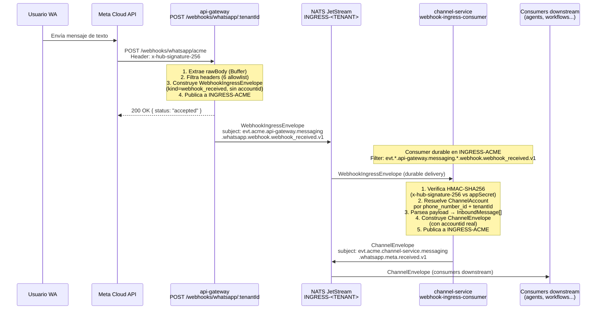

# Flujo 01 — Recibir mensaje de WhatsApp

## Resumen

Un usuario de WhatsApp envía un mensaje a un número de negocio conectado a la plataforma. El mensaje recorre un **puente de dos etapas**: `api-gateway` lo publica sin verificar, y `channel-service` lo verifica, parsea y re-publica como evento canónico que los consumers downstream pueden consumir.

## Actores

| Actor | Servicio / Componente |
|-------|----------------------|
| **Usuario WA** | Persona que envía el mensaje |
| **Meta Cloud API** | Plataforma de WhatsApp Business — entrega webhooks |
| **api-gateway** | `POST /webhooks/whatsapp/:tenantId` — recibe el webhook, publica `WebhookIngressEnvelope` |
| **channel-service** | Consumer durable — verifica HMAC, parsea, publica `ChannelEnvelope` |
| **NATS JetStream** | Bus de eventos — stream `INGRESS-<TENANT>` |
| **Consumers downstream** | agent-ai-service, workflow-service, etc. |

## Diagrama de secuencia



## Subjects NATS involucrados

| Etapa | Subject | Producer |
|-------|---------|---------|
| Stage 1 — ingress raw | `evt.acme.api-gateway.messaging.whatsapp.webhook.webhook_received.v1` | api-gateway |
| Stage 2 — canónico | `evt.acme.channel-service.messaging.whatsapp.meta.received.v1` | channel-service |

## WebhookIngressEnvelope (stage 1)

```json
{
  "specversion": "1.0",
  "id": "uuid-v4",
  "source": "//api-gateway/webhooks",
  "type": "io.yoizen.messaging.webhook.received.v1",
  "tenant": "acme",
  "producer": "api-gateway",
  "domain": "messaging",
  "channel": "whatsapp",
  "provider": "webhook",
  "kind": "webhook_received",
  "data": {
    "payload_inline": true,
    "payload": { "...raw body de Meta..." },
    "raw_body_b64": "...",
    "headers": {
      "x-hub-signature-256": "sha256=...",
      "content-type": "application/json"
    }
  }
}
```

**Sin `accountid`**: en esta etapa la firma todavía no fue verificada y la cuenta no está resuelta. Insertar un placeholder contaminaría las métricas de facturación por cuenta.

## ChannelEnvelope (stage 2)

```json
{
  "specversion": "1.0",
  "id": "uuid-v4",
  "source": "//channel-service/accounts/69bea8cd",
  "type": "io.yoizen.messaging.whatsapp.meta.received.v1",
  "tenant": "acme",
  "producer": "channel-service",
  "domain": "messaging",
  "channel": "whatsapp",
  "provider": "meta",
  "kind": "received",
  "accountid": "69bea8cd868e860918359cc7",
  "data": {
    "payload_inline": true,
    "payload": { "...raw body de Meta, intacto..." }
  }
}
```

## Headers forwarded (allowlist de 6)

Solo estos headers del request original llegan en el envelope:

| Header | Propósito |
|--------|-----------|
| `content-type` | Tipo del body |
| `x-hub-signature-256` | Firma HMAC-SHA256 de Meta |
| `x-hub-signature` | Firma legacy de Meta |
| `x-telegram-bot-api-secret-token` | Firma de Telegram |
| `x-request-id` | Trazabilidad del request |
| `user-agent` | Identificación del provider |

Definidos en `WEBHOOK_FORWARDED_HEADERS` en `packages/shared/src/channel.constants.ts`.

## Notas

- El HTTP 200 a Meta se envía **inmediatamente** al recibir el request — antes de publicar en NATS. Meta requiere respuesta rápida o reintenta.
- `api-gateway` **no** verifica la firma HMAC: solo empaqueta y publica. La verificación la hace `channel-service` en el consumer durable.
- Si NATS JetStream tiene backpressure, `api-gateway` retorna 503 con `Retry-After`. Meta reintentará el webhook automáticamente.
- Payloads > 256 KB se almacenan en el Object Store `PAYLOAD-<TENANT>` (claim-check) y el envelope lleva una referencia `payload_ref`.

## Archivos relevantes

| Archivo | Rol |
|---------|-----|
| `services/api-gateway/src/modules/channels/webhooks.controller.ts` | Endpoint HTTP |
| `services/api-gateway/src/modules/channels/webhook-ingress-publisher.service.ts` | Construcción y publicación del `WebhookIngressEnvelope` |
| `packages/shared/src/webhook.interfaces.ts` | Tipo `WebhookIngressEnvelope` |
| `packages/shared/src/channel.constants.ts` | `WEBHOOK_FORWARDED_HEADERS`, `buildWebhookIngressSubject` |
| `services/channel-service/src/modules/webhooks/webhook-ingress-consumer.service.ts` | Consumer durable NATS |
| `services/channel-service/src/modules/webhooks/webhook-ingress.service.ts` | Verificación HMAC + resolución de cuenta |
| `services/channel-service/src/providers/meta/whatsapp/whatsapp.provider.ts` | Parse del payload WhatsApp |
| `services/channel-service/src/modules/ingress/ingress.service.ts` | Publicación del `ChannelEnvelope` canónico |
