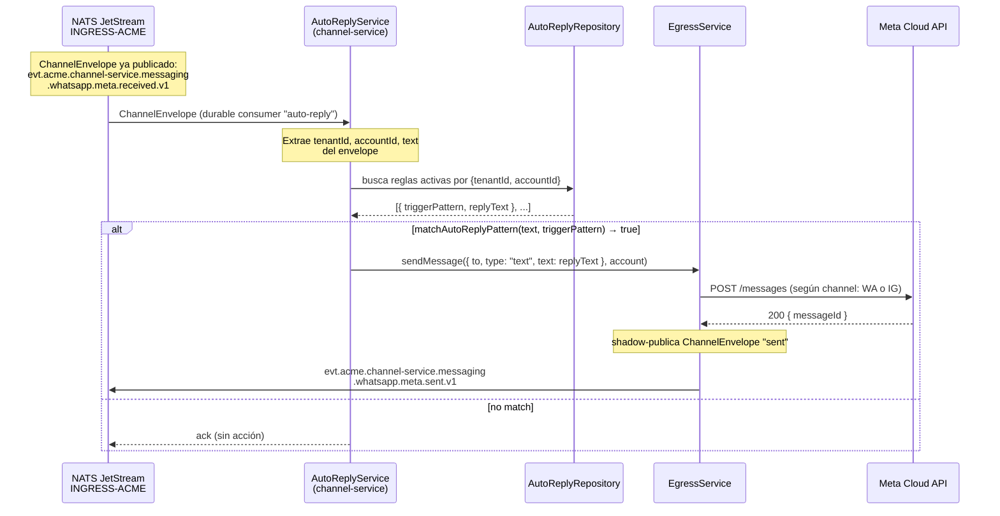

# Flujo 02 — Auto-reply "Pong" (respuesta automática)

## Resumen

Patrón de respuesta automática: `AutoReplyService` en `channel-service` consume el `ChannelEnvelope` canónico (stage 2), evalúa reglas configuradas por tenant+cuenta, y si hay match ejecuta el envío vía `EgressService`. No toca `api-gateway` — opera completamente dentro de `channel-service`.

## Actores

| Actor | Servicio / Componente |
|-------|----------------------|
| **NATS JetStream** | Stream `INGRESS-<TENANT>` — entrega el envelope al auto-reply consumer |
| **AutoReplyService** | Consumer durable `auto-reply` — evalúa reglas, dispara `EgressService` |
| **AutoReplyRepository** | Carga reglas desde Postgres/Mongo del tenant |
| **EgressService** | Envía el mensaje vía provider (Meta/Telegram) + shadow-publica el evento `sent` |
| **Meta Cloud API** | Recibe el "pong" y lo entrega al usuario de WhatsApp |
| **Downstream consumers** | Reciben el `ChannelEnvelope` `sent` vía `INGRESS-<TENANT>` |

## Diagrama de secuencia



## Estructura del servicio

```
services/channel-service/src/modules/auto-reply/
├── auto-reply.service.ts       # consumer durable, evaluación de reglas
├── auto-reply.pattern.ts       # matchAutoReplyPattern(text, pattern)
├── auto-reply.repository.ts    # selección Postgres/Mongo por config
├── auto-reply.postgres.repository.ts
├── auto-reply.mongo.repository.ts
├── auto-reply.controller.ts    # CRUD de reglas (REST)
└── auto-reply.dto.ts
```

## Subject NATS (subscribe)

```
evt.*.channel-service.messaging.*.*.received.v1
```

El consumer solo escucha eventos `received` — no procesa eventos `sent`. No hay riesgo de loop.

## Cache de reglas

Las reglas se cargan en memoria con refresh cada 30 segundos:

```
cacheKey = "${tenantId}:${accountId}"
rulesCache: Map<string, AutoReplyRule[]>
```

Si no hay reglas para la cuenta, el mensaje se hace ack sin procesar (fast path).

## Regla de auto-reply (`AutoReplyRule`)

```typescript
interface AutoReplyRule {
  id: string;
  tenantId: string;
  accountId: string;
  channel: Channel;
  triggerPattern: string;  // pattern para matchAutoReplyPattern()
  replyText: string;
  isActive: boolean;
}
```

Las reglas se configuran vía API: `POST /auto-reply/rules`.

## Notas de diseño

- **Zero coupling con api-gateway**: `AutoReplyService` solo consume del bus y usa `EgressService`.
- **Consumer durable**: si el servicio reinicia, NATS reentrega los mensajes pendientes desde donde quedó.
- **`sent.v1` es channel-agnostic**: el mismo `EgressService` funciona para WhatsApp, Instagram y Telegram.
- **Sin loop**: el consumer filtra `received.v1`; el evento `sent.v1` que publica `EgressService` no coincide con el filtro del consumer de auto-reply.
- **Circuit breaker**: `EgressService` usa un `DistributedCircuitBreaker` por cuenta — si la API del provider falla repetidamente, se abre el breaker y los mensajes van al DLQ en vez de reintentar indefinidamente.

## Archivos relevantes

| Archivo | Rol |
|---------|-----|
| `services/channel-service/src/modules/auto-reply/auto-reply.service.ts` | Consumer durable + lógica de evaluación |
| `services/channel-service/src/modules/auto-reply/auto-reply.pattern.ts` | `matchAutoReplyPattern` |
| `services/channel-service/src/modules/egress/egress.service.ts` | Envío al provider + shadow publish |
| `packages/shared/src/channel.interfaces.ts` | `AutoReplyRule` |
