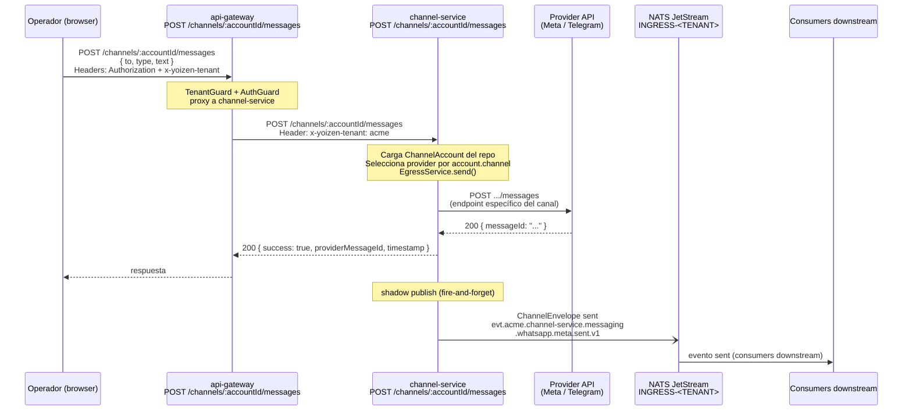

# Flujo 03 — Enviar mensaje desde el dashboard

## Resumen

El operador envía un mensaje desde el dashboard. El request va a `api-gateway`, que lo proxy a `channel-service`. `channel-service` llama al provider correcto (WhatsApp/Instagram/Telegram), guarda el resultado, y shadow-publica un evento `sent` al bus NATS.

## Diagrama de secuencia



## Ruta

```
POST /channels/:accountId/messages
```

**api-gateway** (proxy) → **channel-service** (ejecución real).

El endpoint en `api-gateway` requiere JWT autenticado y tenant resuelto.

## Body del request

```json
{
  "to": "5215512345678",
  "type": "text",
  "text": "Hola, gracias por contactarnos"
}
```

Tipos soportados (según `OutboundMessage`):

| `type` | Campos adicionales |
|--------|--------------------|
| `text` | `text` (string, requerido) |
| `template` | `templateName`, `templateLanguage`, `templateComponents` |
| `image` | `mediaUrl`, `caption` (opcional) |
| `document` | `mediaUrl`, `caption` (opcional) |

**Nota:** Instagram no soporta `template`. WhatsApp tiene restricción de 24h para `text` libre.

## Subject NATS del evento sent

```
evt.<tenant>.channel-service.messaging.<channel>.<provider>.sent.v1
```

Ejemplo:
```
evt.acme.channel-service.messaging.whatsapp.meta.sent.v1
```

## Shadow publish

El publish al bus es fire-and-forget — **no bloquea la respuesta al operador**. Si JetStream está bajo presión, el mensaje puede perderse. El mensaje ya fue enviado al provider y guardado.

## Archivos relevantes

| Archivo | Rol |
|---------|-----|
| `services/api-gateway/src/modules/channels/channels.controller.ts` | `POST /channels/:accountId/messages` (proxy) |
| `services/channel-service/src/modules/egress/egress.controller.ts` | `POST /channels/:accountId/messages` |
| `services/channel-service/src/modules/egress/egress.service.ts` | `send()` — provider selection + shadow publish |
| `services/channel-service/src/providers/meta/whatsapp/whatsapp.provider.ts` | `sendMessage` para WhatsApp |
| `services/channel-service/src/providers/meta/instagram/instagram.provider.ts` | `sendMessage` para Instagram |
| `services/channel-service/src/providers/telegram/telegram.provider.ts` | `sendMessage` para Telegram |
