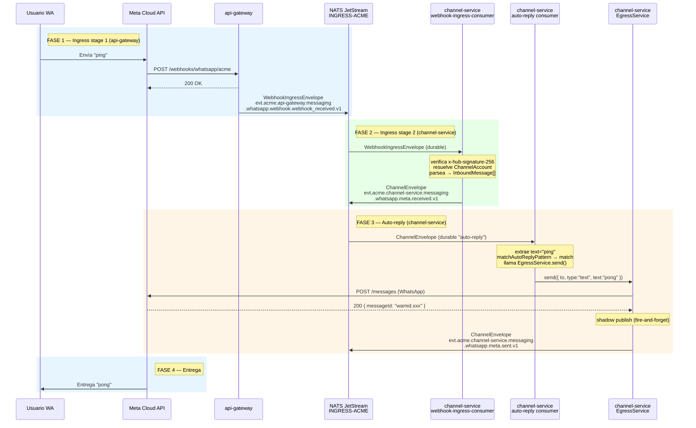

# Flujo 04 — Ciclo completo: ping → pong (end-to-end)

## Resumen

Muestra el recorrido completo de un mensaje "ping" desde que el usuario lo envía en WhatsApp hasta que recibe la respuesta "pong". Combina el flujo 01 (ingress bifásico) y el flujo 02 (auto-reply). Es el integration test conceptual más básico de toda la arquitectura de mensajería.

## Actores

| Actor | Rol |
|-------|-----|
| **Usuario WA** | Envía "ping" desde WhatsApp |
| **Meta Cloud API** | Entrega webhook + recibe respuesta "pong" |
| **api-gateway** | Recibe webhook, publica `WebhookIngressEnvelope` (stage 1) |
| **NATS JetStream** | Stream `INGRESS-ACME` distribuye eventos |
| **channel-service** | Verifica HMAC, parsea, publica `ChannelEnvelope` (stage 2); después auto-reply + egress |
| **Meta Cloud API** | Recibe el "pong" y lo entrega al usuario |

## Diagrama de secuencia



## Subjects NATS involucrados

| Fase | Subject | Producer | Kind |
|------|---------|---------|------|
| 1 — ingress raw | `evt.acme.api-gateway.messaging.whatsapp.webhook.webhook_received.v1` | api-gateway | webhook_received |
| 2 — canónico | `evt.acme.channel-service.messaging.whatsapp.meta.received.v1` | channel-service | received |
| 3 — sent | `evt.acme.channel-service.messaging.whatsapp.meta.sent.v1` | channel-service | sent |

## Timeline aproximado

```
t=0ms     Usuario envía "ping" en WhatsApp
t~200ms   Meta entrega webhook a api-gateway
t~201ms   api-gateway responde 200 OK a Meta
t~202ms   api-gateway publica WebhookIngressEnvelope → INGRESS-ACME
t~205ms   channel-service (webhook-ingress-consumer) recibe el envelope
t~210ms   Verificación HMAC + resolución de ChannelAccount
t~215ms   Parseo del payload → InboundMessage
t~217ms   Publicación del ChannelEnvelope canónico → INGRESS-ACME
t~220ms   channel-service (auto-reply consumer) recibe el envelope canónico
t~225ms   matchAutoReplyPattern("ping", ...) → match
t~230ms   EgressService.send() llama a Meta Cloud API
t~500ms   Meta responde 200 OK con wamid
t~502ms   EgressService shadow-publica ChannelEnvelope "sent"
t~1-3s    Meta entrega "pong" al usuario en WhatsApp
```

## Notas

- **Dos consumers durables en channel-service**: `webhook-ingress-consumer` procesa stage 1 → 2; `auto-reply` procesa stage 2 → respuesta.
- **Sin loop**: `auto-reply` filtra `received.v1`. El evento `sent.v1` que publica `EgressService` no coincide con el filtro del consumer.
- **Durable = at-least-once**: si `channel-service` cae entre el stage 2 y el auto-reply, NATS reentrega el envelope canónico al reconectar.
- **Circuit breaker**: si Meta devuelve errores repetidos, el circuit breaker de `EgressService` se abre y los mensajes van al DLQ en vez de reintentar.
- **Claim-check**: si el payload de Meta supera 256 KB, el `WebhookIngressEnvelope` lleva una referencia al Object Store `PAYLOAD-ACME`. El consumer middleware en `packages/database/src/claim-check.ts` resuelve el payload de forma transparente antes de entregar el mensaje al handler.
