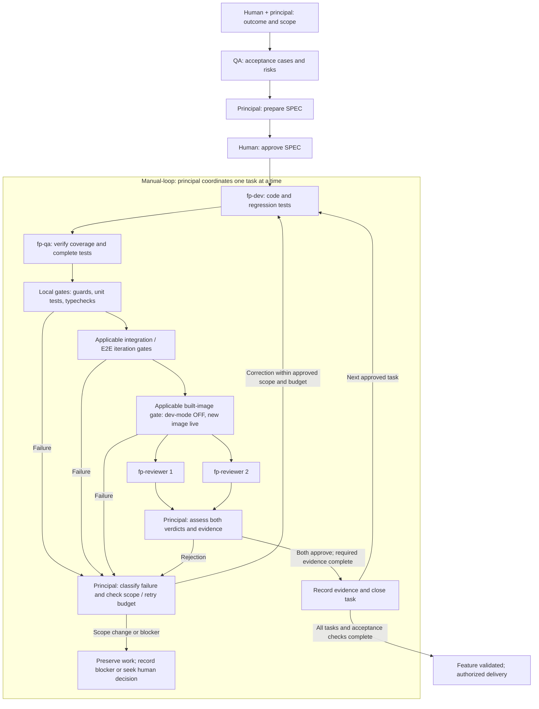

# Manual-loop delivery procedure

Class: prescriptive
Summary: The shared task engine for preparation, delegation, gates, independent review, retries, and authorized closure.

[AGENTS.md](../../AGENTS.md) is normative. This is the single execution procedure
for Codex, Claude Code, and OpenCode, including `oc-own` and `oc-ywai`.
The [role contracts](agent-roles.md) define specialist behavior. Tool adapters
translate invocation syntax and launch roles; they do not maintain another engine.
The principal is the assistant in the main conversation and the only coordinator.
It prepares SPECs and authorized evidence, but never implements or fixes code or
substitutes its own verdict for either independent reviewer.

## Preparation and configuration

The human and principal define the observable outcome, allowed paths, and non-goals.
Before SPEC approval and implementation, `fp-qa` supplies acceptance cases and risks.
The principal incorporates them in a SPEC using the
[authoring templates](../../manual-loops-templates/README.md), then obtains human
approval. `fp-architect` advises only when a material design decision needs it.
Approval and restrictions already supplied by the human remain in force.

Inherit the active tool's global configuration or selected OpenCode profile by
default. Project configuration contains only intentional local tuning. Do not pin
model choices in this shared procedure or silently select a different provider.
Local named-agent definitions may shadow or replace a global definition with the
same name, depending on the tool; do not assume field-by-field inheritance.
Local role files are absent by default, and settings stay empty until intentional
tuning. To tune a native role, supply the complete definition required by that
tool and verify the effective configuration. Do not copy entire global catalogs
or infer provider loading from files being present.
This repository's approved project-local Codex role set is the named exception;
[`codex-manual-loop.md`](codex-manual-loop.md) documents its pins, protection
layers, and required native evidence. A normal feature SPEC cannot authorize a
change to its own Codex runner, role definitions, lock, checker, or guard wiring;
that requires dedicated human-approved configuration scope.
That approved role set includes a human cost-policy exception allowing its runner
to equal the economical coding tier while remaining below implementation/QA.
It does not permit an automatic higher-cost model fallback.
Resolve the actual launch policy before delegation: economical implementation and
QA, capable judgment, and reviewers no weaker than the implementer within the
selected tool's policy. Record requested and observed model and agent/run identity
separately; configured names do not prove execution or cost.

Resolve routine build, test, and E2E execution separately to the configured
mechanical executor, with an explicit cost ceiling below both the implementation/
QA tier and the economical coding tier. Verify actual callability and the cost
basis that applies to the selected tool; public API pricing alone does not prove
its billing. If no eligible executor is available,
report a prerequisite blocker before launching commands. Do not silently use a
more expensive model. Exceeding the ceiling requires a human-approved exception;
principal execution is still subject to the same ceiling.

Use global named roles when available, supplying the complete repository role and
task packet. If a named role is unavailable, explicitly delegate its role packet
using the active model policy and record the fallback. Do not infer that an
inherited model is economical: report its resolved identity and the cost/role
choice before dispatch; changes to the user's model policy require authorization. This does not require a
personal filesystem path. Missing capabilities or unverifiable provenance remain
blockers; never silently skip QA or independent review. A global `fp-loop` routes
here when working in this repository; it cannot start a competing retry/closure
loop or bypass SPEC approval.

## Inputs

- A SPEC file path (e.g. `manual-loops/workflow-toggle.md`) and optionally a task
  ID (e.g. `T03`) to run only that task. A slash-command adapter parses its own
  arguments and passes these values; another host can receive them in plain text.
- Read full AGENTS.md as the normative repository contract. The SPEC provides:
  - **Gates** section: commands to run verbatim, in order, plus per-task **Accept** blocks.
  - **Constraints** section: passed to the implementer with every task.
  - **Task queue**: tasks in order, each with acceptance criteria.
  - **Progress** checklist: source of truth for what is done.
- If no SPEC path is given, or the file lacks a Gates section or Progress checklist,
  STOP and report — never invent gates.

## Invariants

- ONE task in flight at a time. Establish a baseline of preexisting changes;
  preserve them and distinguish them from task changes. If ownership overlaps
  ambiguously, report the conflict before editing.
- Max 4 implementation attempts per task. The SAME error appearing in 2 consecutive
  attempts blocks the task immediately (do not spend the remaining attempts).
- A task is committed ONLY when authorized, all gates are green, and both reviewers
  returned APPROVED for the unchanged task state.
- Anything else at the end of the attempt budget → preserve work + blocker record.
- AGENTS.md wins over Constraints, this engine, agents, templates, and precedent.
- Changed code or task artifacts invalidate gates and both reviews. Rerun them;
  a prior green run is not evidence for changed content.
- Gates marked "from Txx onward" only run once that task exists in the queue history.

## Per-task cycle

1. **Preflight.** Read AGENTS.md and the task. Inventory staged, unstaged, and
   untracked changes as the baseline, without discarding any. Confirm approval,
   explicit allowed write paths and non-goals, and applicable gates. Missing scope
   or conflicting rules blocks implementation. Respect user restrictions on git,
   commits, and SPEC writes; use supplied baseline/evidence when git is prohibited
   and report any resulting evidence gap instead of claiming completion.

2. **Implement.** Launch `fp-dev` (or a tool-native implementer carrying the same
   [implementation contract](agent-roles.md#implementation-fp-dev)). In either case supply full AGENTS.md, full task text
   including allowed paths/non-goals and Accept, all Constraints, applicable gate
   commands and conditions, baseline ownership, and (on retries) exact failures.
   Forward applicable user authorizations/restrictions to every agent. Repeat any
   required decision or precedent from other SPEC sections in the task packet.
   Obtain `fp-qa` acceptance cases and risks while preparing the SPEC, before
   human approval and before this step.
   Use `fp-architect` only when a design decision needs advice; it is optional and
   never a second coordinator. `fp-dev` owns the implementation and regression tests.

3. **QA and gates.** After implementation, `fp-qa` checks coverage against its
   pre-implementation cases and may complete missing tests within the approved
   paths. QA edits finish before any gate runs. The principal assigns routine
   command execution to the configured mechanical executor and assembles the
   evidence; QA and implementation remain separate substantive roles. Then run
   the SPEC's Gates in order, then the task's own **Accept** commands,
   verbatim. First failure ends the attempt. Two gate classes, per the SPEC's labels:
   - Gates labeled **ITERATION** run on EVERY attempt (fast feedback).
   - Gates labeled **COMMIT GATE** run ONCE per task, only after all iteration
     gates are green — immediately before dual review. A commit-gate failure is
     a failed attempt: fix, re-green iteration gates, re-run the commit gate.
   - Honor any PRECONDITION rules in the SPEC's Gates section before task 1.
   - Give each command one executor owner. On interruption or handoff, transfer
     the existing process/run identity and completion evidence; never issue a
     duplicate command. The principal owns retries, scope, and closure.
   - Persist full sanitized output, exit status, duration, tested-state identity,
     and requested and observed executor model/session/turn for every gate. Keep
     summaries concise and point to the full evidence. Include affected-build
     reproducibility evidence required by AGENTS.md.

4. **Dual review.** Capture staged AND unstaged diffs, a change summary, and full
   untracked new file content; distinguish task changes from the baseline. Launch
   TWO independent `fp-reviewer` agents IN PARALLEL, each with the identical complete
   change packet, full AGENTS.md, task including Accept and allowed paths/non-goals,
   Constraints, applicable gates and their actual output, implementation report,
   and model/run provenance. Do not share one review with the other before verdicts.
   Missing review coverage or independent provenance blocks completion.

5. **Objections.** If either reviewer returns REJECTED, send the objections (verbatim,
   both reviewers merged) back to the task's implementation role as a new attempt; then re-run QA, all
   gates, and both reviews. Each objection round consumes one attempt. Any
   correction invalidates prior evidence and approvals.

6. **Record and authorized commit.** Gates green + 2× APPROVED for unchanged task artifacts, with actual
   evidence and independent model provenance → record commands, statuses, output,
   verdicts, exceptions, and state identity in Progress and check off the task.
   Evidence-only Progress updates do not invalidate implementation review; changes
   to code, task scope, rules, or gate commands do. When authorized, include the
   SPEC in the same commit, and commit with a conventional message
   scoped to the task, e.g. `feat(workflow-service): T03 block disabled executions`.
   No Co-Authored-By.

7. **Block.** Attempt budget exhausted, or same error twice in a row:
   - Preserve all task and preexisting work. No automatic revert, clean, or deletion.
   - Record in authorized Progress/BLOCKED.md, or return to the orchestrator if
     those paths are not allowed. The record OPENS with a "## For humans"
     section — at most 10 lines, plain language, no run IDs and no gate numbers:
     what was attempted, what failed, and what decision is pending. It is
     followed by the implementer's HANDOFF NOTE (plain-language cause,
     `file:line`, candidate fixes). Only then comes the evidence: spec file,
     task id, date, attempt count, the exact failing gate/objection, error
     output (trimmed), and what was tried per attempt.
   - Label execution exceptions that did not cause the failure as non-causal, so
     they are not read at the same level as the actual cause.
   - The handoff note is analysis, not authorization. It allocates no attempt,
     creates no budget, and creates no continuation SPEC. Requesting it does not
     reopen a closed or exhausted loop.
   - Report to the user and STOP the loop — do not continue to the next task.

8. **Next.** After a successful task, reconcile changes with the preserved baseline
   before the next unchecked task (unless a task id was pinned, then stop).

## Reporting

At the end of the run, report: spec file, tasks completed (with commit hashes when committed), task
blocked (if any) with the BLOCKED.md pointer, and which services need a rebuild.
Include exact gate results, independent reviewer/model provenance, deviations,
retries, fallbacks, and skipped checks. If record writes are prohibited, return
the evidence for the orchestrator to persist. Never claim done with missing gates
or reviews, or infer remote merge enforcement from the CI workflow alone.
## Feature lifecycle and integration

The diagram shows verification layers, not a universal command list. The SPEC
declares applicability, exact commands, prerequisites, and ordering. Any change to
reviewed code or task artifacts invalidates applicable gates and both reviews.
QA edits therefore happen before final gates and review. A correction returns
through validation; previous approvals cannot certify changed content.

## Tests and gates

A test checks behavior. A gate requires specified checks to succeed before work
can advance. Routine gate commands are owned by the configured mechanical
executor, separate from implementation and QA. It executes the exact supplied
commands in their declared working directories and order, stops at the first
failure, and reports exit status and error output without diagnosis, remediation,
edits, retries, scope decisions, or closure decisions. Command semantics and
mutation boundaries do not change when execution is delegated.

If delegation is unavailable or an in-flight process cannot be inherited safely,
the principal reports the reason before execution. It may execute only as a
documented fallback that still satisfies the approved cost ceiling; otherwise the
missing eligible executor is a blocker. A handoff transfers the existing process
identity and completion evidence instead of starting the command again.

| Layer | What it demonstrates | Workflow-disable example |
| --- | --- | --- |
| Local guards and typechecks | Repository constraints and the typing covered by the chosen configuration. | Check changed code and ensure the SPEC identifies whether test files are also typechecked. |
| Unit tests | Decisions behave correctly with controlled input data. | Select only exact execution IDs owned by the target definition; cover name collisions and renames. |
| Integration tests | The service interacts correctly with real dependencies. | Query the configured database and terminate the intended executions in Temporal. |
| E2E tests | The complete path works through its public entry point. | Disable through the API and verify execution termination and observable state. |
| Built-image validation | Required behavior works in the artifact intended for delivery. | Run the required scenario with dev-mode OFF and the newly built image active. |

Integration/E2E describe what is tested. Development mode and built-image mode
describe which executable version is tested. A required E2E scenario can run during
development and again against the built image. Frozen-install and build evidence
remain required for affected builds under AGENTS.md.

Not every change requires every cluster suite. The SPEC must identify applicable
checks without silently waiving existing requirements. Missing infrastructure or
an unmet prerequisite is recorded as pending evidence or debt, not as a passing
gate or completed feature. Reviewers assess code and evidence together.

## Example: integration test for workflow disable

For a feature that changes execution ownership or termination:

1. Create isolated test definitions and running executions in a test tenant.
2. Include overlapping definition names, and rename a definition after starting
   one of its executions.
3. Disable the target definition through the boundary under test: the service for
   an integration test, or the API for an E2E test.
4. Wait with a bounded timeout for Temporal to terminate only the target's
   executions. Verify other definitions and tenant isolation remain unaffected.
5. Check observable state required by the acceptance contract, accounting for
   asynchronous projection with bounded waits rather than fixed sleeps.
6. Clean up only resources created by the test; retain useful failure diagnostics
   without exposing secrets or payloads.

When the change affects dual-engine persistence, test both Postgres and Mongo.
Local boundary doubles can check query construction, but do not establish live
database or Temporal integration. Unit tests for pure decisions need no I/O mocks.

## Environment prerequisites and records

Before applicable dev-mode iteration, follow the SPEC's precondition and the
[validator prerequisites and restoration limits](dev-mode.md). Keep the canary
file clean and prevent concurrent edits. Unexpected edits are preserved and
reported with recovery snapshots; file cleanup does not roll back cluster state.
The standard dev-mode precondition is `./scripts/validate-dev-mode.sh --with-e2e`
before the first task. If it fails, record the skipped iteration gate as DEBT in
Progress; the applicable built-image gate still requires dev-mode OFF and the
built image live. An unrelated documentation-only task does not invent cluster
gates: its approved SPEC determines applicability.

Completed loops are evidence, not queues to restart. New requirements or missing
validation receive a follow-up SPEC linked to the predecessor. Keep historical
IDs, decisions, and records intact. Persist decisions and verification in the
SPEC and its declared Engram topic when available; report unavailable memory
rather than claiming a save. The [change register](../archive/INDEX.md) provides
delivery navigation. `.sdd` records and working registers can link the SPEC;
they must not create a competing executable queue or completion state.

The [guard guide](doc-code-guards.md) explains KISS coverage and its limitations.
KISS is not a replacement for task-specific tests or evidence of remote branch
protection. See [AGENTS.md](../../AGENTS.md) for document classes and authority.
